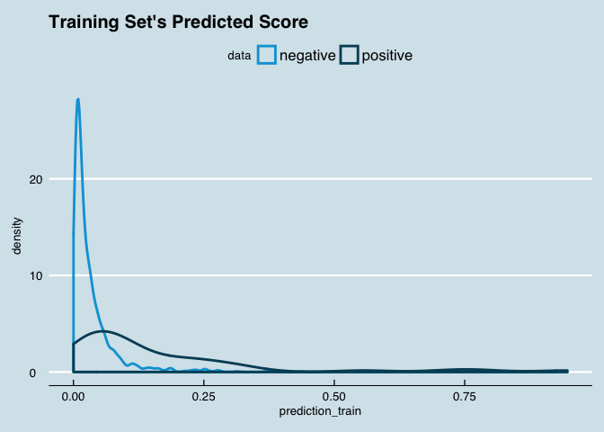
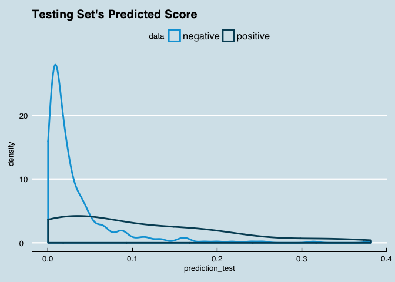

Logistic Regression
================

``` r
# setting the appropriate working directory
setwd("~/Desktop/Personal/personal_code/classification/")

# setting scipen options to kill all use of scientific notation
options(scipen = 999)

# basic packages needed throughout
library(dplyr) # for piping
```

    ## 
    ## Attaching package: 'dplyr'

    ## The following objects are masked from 'package:stats':
    ## 
    ##     filter, lag

    ## The following objects are masked from 'package:base':
    ## 
    ##     intersect, setdiff, setequal, union

``` r
library(ggplot2) # for visualization
```

    ## 
    ## Attaching package: 'ggplot2'

    ## The following object is masked from 'package:dplyr':
    ## 
    ##     vars

``` r
library(ggthemes) # for custom visualization
```

Importing, Exploring, Cleaning, Normalizing / Centering, and Prepping the Data
==============================================================================

Importing the Data
------------------

Data taken from: <https://archive.ics.uci.edu/ml/machine-learning-databases/wine-quality/>

``` r
# we have both red and white wine datasets with the same variables 
base_red <- read.csv("data/winequality-red.csv",sep=";")
base_white <- read.csv("data/winequality-white.csv",sep=";")

# lots of useful information about the dataset
glimpse(base_red) 
```

    ## Observations: 1,599
    ## Variables: 12
    ## $ fixed.acidity        <dbl> 7.4, 7.8, 7.8, 11.2, 7.4, 7.4, 7.9, 7.3, ...
    ## $ volatile.acidity     <dbl> 0.700, 0.880, 0.760, 0.280, 0.700, 0.660,...
    ## $ citric.acid          <dbl> 0.00, 0.00, 0.04, 0.56, 0.00, 0.00, 0.06,...
    ## $ residual.sugar       <dbl> 1.9, 2.6, 2.3, 1.9, 1.9, 1.8, 1.6, 1.2, 2...
    ## $ chlorides            <dbl> 0.076, 0.098, 0.092, 0.075, 0.076, 0.075,...
    ## $ free.sulfur.dioxide  <dbl> 11, 25, 15, 17, 11, 13, 15, 15, 9, 17, 15...
    ## $ total.sulfur.dioxide <dbl> 34, 67, 54, 60, 34, 40, 59, 21, 18, 102, ...
    ## $ density              <dbl> 0.9978, 0.9968, 0.9970, 0.9980, 0.9978, 0...
    ## $ pH                   <dbl> 3.51, 3.20, 3.26, 3.16, 3.51, 3.51, 3.30,...
    ## $ sulphates            <dbl> 0.56, 0.68, 0.65, 0.58, 0.56, 0.56, 0.46,...
    ## $ alcohol              <dbl> 9.4, 9.8, 9.8, 9.8, 9.4, 9.4, 9.4, 10.0, ...
    ## $ quality              <int> 5, 5, 5, 6, 5, 5, 5, 7, 7, 5, 5, 5, 5, 5,...

``` r
glimpse(base_white) 
```

    ## Observations: 4,898
    ## Variables: 12
    ## $ fixed.acidity        <dbl> 7.0, 6.3, 8.1, 7.2, 7.2, 8.1, 6.2, 7.0, 6...
    ## $ volatile.acidity     <dbl> 0.27, 0.30, 0.28, 0.23, 0.23, 0.28, 0.32,...
    ## $ citric.acid          <dbl> 0.36, 0.34, 0.40, 0.32, 0.32, 0.40, 0.16,...
    ## $ residual.sugar       <dbl> 20.70, 1.60, 6.90, 8.50, 8.50, 6.90, 7.00...
    ## $ chlorides            <dbl> 0.045, 0.049, 0.050, 0.058, 0.058, 0.050,...
    ## $ free.sulfur.dioxide  <dbl> 45, 14, 30, 47, 47, 30, 30, 45, 14, 28, 1...
    ## $ total.sulfur.dioxide <dbl> 170, 132, 97, 186, 186, 97, 136, 170, 132...
    ## $ density              <dbl> 1.0010, 0.9940, 0.9951, 0.9956, 0.9956, 0...
    ## $ pH                   <dbl> 3.00, 3.30, 3.26, 3.19, 3.19, 3.26, 3.18,...
    ## $ sulphates            <dbl> 0.45, 0.49, 0.44, 0.40, 0.40, 0.44, 0.47,...
    ## $ alcohol              <dbl> 8.8, 9.5, 10.1, 9.9, 9.9, 10.1, 9.6, 8.8,...
    ## $ quality              <int> 6, 6, 6, 6, 6, 6, 6, 6, 6, 6, 5, 5, 5, 7,...

``` r
# the datasets both have teh same variables, but the red dataset has notably fewer observations
```

``` r
# given that the two datasets all have the same variables, we'll add a color variable to each and then combine

base_red <- base_red %>%
  mutate(color = "red")

base_white <- base_white %>%
  mutate(color = "white")

# combining the two data frames
main_wine_df <- bind_rows(base_red, base_white)

# viewing the newly combined data frame
glimpse(main_wine_df)
```

    ## Observations: 6,497
    ## Variables: 13
    ## $ fixed.acidity        <dbl> 7.4, 7.8, 7.8, 11.2, 7.4, 7.4, 7.9, 7.3, ...
    ## $ volatile.acidity     <dbl> 0.700, 0.880, 0.760, 0.280, 0.700, 0.660,...
    ## $ citric.acid          <dbl> 0.00, 0.00, 0.04, 0.56, 0.00, 0.00, 0.06,...
    ## $ residual.sugar       <dbl> 1.9, 2.6, 2.3, 1.9, 1.9, 1.8, 1.6, 1.2, 2...
    ## $ chlorides            <dbl> 0.076, 0.098, 0.092, 0.075, 0.076, 0.075,...
    ## $ free.sulfur.dioxide  <dbl> 11, 25, 15, 17, 11, 13, 15, 15, 9, 17, 15...
    ## $ total.sulfur.dioxide <dbl> 34, 67, 54, 60, 34, 40, 59, 21, 18, 102, ...
    ## $ density              <dbl> 0.9978, 0.9968, 0.9970, 0.9980, 0.9978, 0...
    ## $ pH                   <dbl> 3.51, 3.20, 3.26, 3.16, 3.51, 3.51, 3.30,...
    ## $ sulphates            <dbl> 0.56, 0.68, 0.65, 0.58, 0.56, 0.56, 0.46,...
    ## $ alcohol              <dbl> 9.4, 9.8, 9.8, 9.8, 9.4, 9.4, 9.4, 10.0, ...
    ## $ quality              <int> 5, 5, 5, 6, 5, 5, 5, 7, 7, 5, 5, 5, 5, 5,...
    ## $ color                <chr> "red", "red", "red", "red", "red", "red",...

``` r
library(janitor) # for data cleaning and tabular exploration
# documentation: https://github.com/sfirke/janitor

# first we'll do some mandatory / precautionary cleaning
# tidying variable names and dropping any useless rows / columns

main_wine_df <- main_wine_df %>%
  janitor::clean_names() %>% #converts to underscore case and cleans
  janitor::remove_empty(which = c("rows","cols")) # drops all rows and columns that are entirely empty
```

``` r
# for the purpose of simplicity, we are going to start by only looking at the red wine
red_main_df <- main_wine_df %>%
  # filtering to just the red wine
  filter(color == "red") %>%
  # dropping the now-useless variable
  select(-color) %>%
  # ensuring quality is a factor; this will be useful later
  # as a rule of thumb, it's good to factor any non-numeric variables
  mutate(quality = factor(quality))

glimpse(red_main_df)
```

    ## Observations: 1,599
    ## Variables: 12
    ## $ fixed_acidity        <dbl> 7.4, 7.8, 7.8, 11.2, 7.4, 7.4, 7.9, 7.3, ...
    ## $ volatile_acidity     <dbl> 0.700, 0.880, 0.760, 0.280, 0.700, 0.660,...
    ## $ citric_acid          <dbl> 0.00, 0.00, 0.04, 0.56, 0.00, 0.00, 0.06,...
    ## $ residual_sugar       <dbl> 1.9, 2.6, 2.3, 1.9, 1.9, 1.8, 1.6, 1.2, 2...
    ## $ chlorides            <dbl> 0.076, 0.098, 0.092, 0.075, 0.076, 0.075,...
    ## $ free_sulfur_dioxide  <dbl> 11, 25, 15, 17, 11, 13, 15, 15, 9, 17, 15...
    ## $ total_sulfur_dioxide <dbl> 34, 67, 54, 60, 34, 40, 59, 21, 18, 102, ...
    ## $ density              <dbl> 0.9978, 0.9968, 0.9970, 0.9980, 0.9978, 0...
    ## $ p_h                  <dbl> 3.51, 3.20, 3.26, 3.16, 3.51, 3.51, 3.30,...
    ## $ sulphates            <dbl> 0.56, 0.68, 0.65, 0.58, 0.56, 0.56, 0.46,...
    ## $ alcohol              <dbl> 9.4, 9.8, 9.8, 9.8, 9.4, 9.4, 9.4, 10.0, ...
    ## $ quality              <fct> 5, 5, 5, 6, 5, 5, 5, 7, 7, 5, 5, 5, 5, 5,...

Exploring the Data
------------------

``` r
# Even though we dropped any rows / cols that are entirely null, we need to check for NA problems
library(DataExplorer) # allows for creation of missings values map
# documentation for DataExplorer: https://towardsdatascience.com/simple-fast-exploratory-data-analysis-in-r-with-dataexplorer-package-e055348d9619
DataExplorer::plot_missing(red_main_df)
```


``` r
# good news is this datset looks perfectly clean of nulls!
# If there were any problems with nulls, we would solve it using complete.cases() or something similar
```

### Continous Variables Exploration

``` r
# high-level univariate variable-exploration
DataExplorer::plot_histogram(data = red_main_df, title = "Continuous Variables Explored (Histograms)")
```


``` r
DataExplorer::plot_density(data = red_main_df, title = "Continuous Variables Explored (Density Plots)")
```


### Categorical Variable Exploration

``` r
# the only categorical variable in our data in this case is what we'll use to create our low quality flag
# if we had many categorical variables, it would make sense to use order_bar = TRUE
# the order would then be in descending order of prevalence, which is helpful at a glance
plot_bar(data = red_main_df, order_bar = FALSE, title = "Categorical Variables Explored")
```


``` r
# and we can use janitor to see the exact cross-tab of our quality variable
janitor::tabyl(red_main_df$quality)
```

    ##  red_main_df$quality   n     percent
    ##                    3  10 0.006253909
    ##                    4  53 0.033145716
    ##                    5 681 0.425891182
    ##                    6 638 0.398999375
    ##                    7 199 0.124452783
    ##                    8  18 0.011257036

``` r
# it looks like wines with a rating < 5 are exceptionally bad, so we'll use that as our benchmark
# all together wines with a rating below 5 represent just over 3% of the population
```

### Outcome Variable Creation

``` r
# given the above analysis, we'll flag anything with a quality rating < 5 as low-quality 
red_final_df <- red_main_df %>%
  # type conversion here can be tricky because to de-factor requires multiple steps
  mutate(low_qual_flag = factor(ifelse(as.numeric(as.character(quality)) < 5,1,0))) %>%
  select(-quality)

glimpse(red_final_df)
```

    ## Observations: 1,599
    ## Variables: 12
    ## $ fixed_acidity        <dbl> 7.4, 7.8, 7.8, 11.2, 7.4, 7.4, 7.9, 7.3, ...
    ## $ volatile_acidity     <dbl> 0.700, 0.880, 0.760, 0.280, 0.700, 0.660,...
    ## $ citric_acid          <dbl> 0.00, 0.00, 0.04, 0.56, 0.00, 0.00, 0.06,...
    ## $ residual_sugar       <dbl> 1.9, 2.6, 2.3, 1.9, 1.9, 1.8, 1.6, 1.2, 2...
    ## $ chlorides            <dbl> 0.076, 0.098, 0.092, 0.075, 0.076, 0.075,...
    ## $ free_sulfur_dioxide  <dbl> 11, 25, 15, 17, 11, 13, 15, 15, 9, 17, 15...
    ## $ total_sulfur_dioxide <dbl> 34, 67, 54, 60, 34, 40, 59, 21, 18, 102, ...
    ## $ density              <dbl> 0.9978, 0.9968, 0.9970, 0.9980, 0.9978, 0...
    ## $ p_h                  <dbl> 3.51, 3.20, 3.26, 3.16, 3.51, 3.51, 3.30,...
    ## $ sulphates            <dbl> 0.56, 0.68, 0.65, 0.58, 0.56, 0.56, 0.46,...
    ## $ alcohol              <dbl> 9.4, 9.8, 9.8, 9.8, 9.4, 9.4, 9.4, 10.0, ...
    ## $ low_qual_flag        <fct> 0, 0, 0, 0, 0, 0, 0, 0, 0, 0, 0, 0, 0, 0,...

``` r
tabyl(red_final_df$low_qual_flag)
```

    ##  red_final_df$low_qual_flag    n    percent
    ##                           0 1536 0.96060038
    ##                           1   63 0.03939962

``` r
# the data now look nice and clean!
```

Centering and Normalizing the Data
----------------------------------

For more information on when to center / normalize data, see below: - <https://stats.stackexchange.com/questions/29781/when-conducting-multiple-regression-when-should-you-center-your-predictor-varia>

``` r
red_final_df[,-12] <- scale(red_final_df[,-12], center = TRUE, scale = TRUE)
glimpse(red_final_df)
```

    ## Observations: 1,599
    ## Variables: 12
    ## $ fixed_acidity        <dbl> -0.5281944, -0.2984541, -0.2984541, 1.654...
    ## $ volatile_acidity     <dbl> 0.9615758, 1.9668271, 1.2966596, -1.38401...
    ## $ citric_acid          <dbl> -1.39103710, -1.39103710, -1.18569949, 1....
    ## $ residual_sugar       <dbl> -0.45307667, 0.04340257, -0.16937425, -0....
    ## $ chlorides            <dbl> -0.24363047, 0.22380518, 0.09632273, -0.2...
    ## $ free_sulfur_dioxide  <dbl> -0.46604672, 0.87236532, -0.08364328, 0.1...
    ## $ total_sulfur_dioxide <dbl> -0.3790141, 0.6241680, 0.2289750, 0.41137...
    ## $ density              <dbl> 0.55809987, 0.02825193, 0.13422152, 0.664...
    ## $ p_h                  <dbl> 1.28823990, -0.71970814, -0.33107304, -0....
    ## $ sulphates            <dbl> -0.57902538, 0.12891007, -0.04807379, -0....
    ## $ alcohol              <dbl> -0.95994580, -0.58459423, -0.58459423, -0...
    ## $ low_qual_flag        <fct> 0, 0, 0, 0, 0, 0, 0, 0, 0, 0, 0, 0, 0, 0,...

Prepping Data for Modeling Process
----------------------------------

``` r
# split the data into training and testing sets
library(caret) # needed to createDataPartitions
```

    ## Loading required package: lattice

    ## Warning in as.POSIXlt.POSIXct(Sys.time()): unknown timezone 'zone/tz/2018c.
    ## 1.0/zoneinfo/America/New_York'

``` r
# Partition data: 80 / 20 split : train / test
# set seed to ensure reproducibility
set.seed(777)

in_train <- caret::createDataPartition(y=red_final_df$low_qual_flag, p=0.80, list=FALSE)

# splits the data into training and testing sets
training <- red_final_df[in_train,]
testing <- red_final_df[-in_train,]

# shows the row count and column count of the training and test sets, to check that all worked as planned
dim(training)
```

    ## [1] 1280   12

``` r
dim(testing)
```

    ## [1] 319  12

Building a Basic Logit
======================

Estimating the Model
--------------------

``` r
# simple logistic regression
logit_fit <- glm(low_qual_flag ~ .,
                 data = training,
                 family = binomial)

summary(logit_fit)
```

    ## 
    ## Call:
    ## glm(formula = low_qual_flag ~ ., family = binomial, data = training)
    ## 
    ## Deviance Residuals: 
    ##     Min       1Q   Median       3Q      Max  
    ## -1.7012  -0.2826  -0.1831  -0.1213   3.2069  
    ## 
    ## Coefficients:
    ##                      Estimate Std. Error z value             Pr(>|z|)    
    ## (Intercept)           -3.9151     0.2277 -17.198 < 0.0000000000000002 ***
    ## fixed_acidity          0.1915     0.5235   0.366               0.7145    
    ## volatile_acidity       0.8911     0.1607   5.544         0.0000000296 ***
    ## citric_acid            0.1595     0.2695   0.592               0.5540    
    ## residual_sugar         0.3059     0.1946   1.572               0.1160    
    ## chlorides              0.2870     0.1562   1.838               0.0660 .  
    ## free_sulfur_dioxide   -0.3722     0.2785  -1.337               0.1813    
    ## total_sulfur_dioxide  -0.2903     0.2827  -1.027               0.3045    
    ## density               -0.2784     0.4286  -0.649               0.5161    
    ## p_h                    0.5509     0.2916   1.889               0.0588 .  
    ## sulphates             -0.1199     0.2277  -0.526               0.5985    
    ## alcohol               -0.4794     0.3018  -1.588               0.1122    
    ## ---
    ## Signif. codes:  0 '***' 0.001 '**' 0.01 '*' 0.05 '.' 0.1 ' ' 1
    ## 
    ## (Dispersion parameter for binomial family taken to be 1)
    ## 
    ##     Null deviance: 428.66  on 1279  degrees of freedom
    ## Residual deviance: 344.39  on 1268  degrees of freedom
    ## AIC: 368.39
    ## 
    ## Number of Fisher Scoring iterations: 7

First Look at Model Predictions
-------------------------------

``` r
# run predictions on training set
prediction_train <- predict(logit_fit, newdata = training, type = "response" )
predictions_train_full <- data.frame(prediction = prediction_train, low_qual_flag = training$low_qual_flag)

# run predictions on testing set
prediction_test <- predict(logit_fit, newdata = testing, type = "response" )
predictions_test_full <- data.frame(prediction = prediction_test, low_qual_flag = testing$low_qual_flag)

# distribution of the prediction score grouped by known outcome (for training set only)
ggplot(predictions_train_full, aes(prediction_train, color = as.factor(training$low_qual_flag) ) ) + 
geom_density( size = 1 ) +
ggtitle( "Training Set's Predicted Score" ) + 
scale_color_economist( name = "data", labels = c( "negative", "positive" ) ) + 
theme_economist()
```



``` r
# distribution of the prediction score grouped by known outcome (for testing set only)
ggplot(predictions_test_full, aes(prediction_test, color = as.factor(testing$low_qual_flag) ) ) + 
geom_density( size = 1 ) +
ggtitle( "Testing Set's Predicted Score" ) + 
scale_color_economist( name = "data", labels = c( "negative", "positive" ) ) + 
theme_economist()
```



Determining What Classification Cutoff is Appropriate
-----------------------------------------------------

``` r
source("useful_classification_functions.R") 
```

    ## Loading required package: gplots

    ## 
    ## Attaching package: 'gplots'

    ## The following object is masked from 'package:stats':
    ## 
    ##     lowess

    ## 
    ## Attaching package: 'gridExtra'

    ## The following object is masked from 'package:dplyr':
    ## 
    ##     combine

    ## 
    ## Attaching package: 'data.table'

    ## The following objects are masked from 'package:dplyr':
    ## 
    ##     between, first, last

``` r
# some custom functions are sourced in, to reduce document's length
# more info on these custom functions here: http://ethen8181.github.io/machine-learning/unbalanced/unbalanced.html

# using function AccuracyCutoffInfo to test for optimal cutoff visually
accuracy_info <- AccuracyCutoffInfo(train = predictions_train_full, 
                                    test = predictions_test_full, 
                                    predict = "prediction", 
                                    actual = "low_qual_flag",
                                    cut_val_start = 0.01,
                                    cut_val_end = 0.9,
                                    by_step_size = 0.001)

# from the plot below we can begin to eyeball what the optimal cutoff might be 
accuracy_info$plot
```


``` r
# Moving on To Using ROC Curves to pintpoint optimal cutoffs
# user-defined costs for false negative and false positive to pinpoint where total cost is minimized

cost_fp <- 10
cost_fn <- 100
# here the assumption I've made that a false positive is 1/10th as costly as a false negative

roc_info <- ROCInfo(data = predictions_test_full, 
                    predict = "prediction", 
                    actual = "low_qual_flag", 
                    cost.fp = cost_fp, 
                    cost.fn = cost_fn )
```

``` r
# plot the roc / cutoff-selection plots
grid.draw(roc_info$plot)
```


``` r
# looks like the optimal cutoff is at 0.11 
```

Examining Model Performance for the Basic Logit
-----------------------------------------------

``` r
# visualize a particular cutoff's effectiveness at classification
cm_info <- ConfusionMatrixInfo(data = predictions_test_full, 
                               predict = "prediction", 
                               actual = "low_qual_flag", 
                               cutoff = .11) # (determined by roc_info$plot)

# prints the visualization of the confusion matrix (use print(cm_info$data) to see the raw data)
cm_info$plot
```


``` r
# lastly, we'll use the cutoff we have arrived at from the work above to test the model's predictions
# think of this section as the cross-tab version of the confusion matrix plot shown above

# getting model probabilities for our testing holdout set
logit_fit_probs <- predict(logit_fit,
                           newdata = testing,
                           type = "response")

# turning these probabilities into classifications using the cutoff determined above 
logit_fit_predictions <- factor(ifelse(logit_fit_probs > 0.11, 1, 0),levels=c('0','1'))

# builiding a confusion matrix 
caret::confusionMatrix(logit_fit_predictions,testing$low_qual_flag, positive='1')
```

    ## Confusion Matrix and Statistics
    ## 
    ##           Reference
    ## Prediction   0   1
    ##          0 288   7
    ##          1  19   5
    ##                                           
    ##                Accuracy : 0.9185          
    ##                  95% CI : (0.8829, 0.9461)
    ##     No Information Rate : 0.9624          
    ##     P-Value [Acc > NIR] : 0.99991         
    ##                                           
    ##                   Kappa : 0.2396          
    ##  Mcnemar's Test P-Value : 0.03098         
    ##                                           
    ##             Sensitivity : 0.41667         
    ##             Specificity : 0.93811         
    ##          Pos Pred Value : 0.20833         
    ##          Neg Pred Value : 0.97627         
    ##              Prevalence : 0.03762         
    ##          Detection Rate : 0.01567         
    ##    Detection Prevalence : 0.07524         
    ##       Balanced Accuracy : 0.67739         
    ##                                           
    ##        'Positive' Class : 1               
    ## 

Penalized Logistic Regression (Lasso)
=====================================

-   Now using an Objective Function that penalizes low-ROI variables. This is similar to ridge regression except variables with coefficients non-consequential enough will be zero'ed out of the model.

<http://www.sthda.com/english/articles/36-classification-methods-essentials/149-penalized-logistic-regression-essentials-in-r-ridge-lasso-and-elastic-net/>

Tuning the Hyperparamter for the Lasso Model (Optmizing Lamda)
--------------------------------------------------------------

``` r
library(glmnet)
```

    ## Loading required package: Matrix

    ## Loading required package: foreach

    ## Loaded glmnet 2.0-13

``` r
# for all varieties of smote, see https://cran.r-project.org/web/packages/smotefamily/smotefamily.pdf
library(smotefamily)
library(dbscan) #needed for dbsmote

smote2_train <- smotefamily::DBSMOTE(training[,-c(12)], as.numeric(as.character(training$low_qual_flag)))
```

    ## [1] 3
    ## [1] 2
    ## [1] 2
    ## [1] 2
    ## [1] 2
    ## [1] 3
    ## [1] 2
    ## [1] 2
    ## [1] 2
    ## [1] 4
    ## [1] 2
    ## [1] 3
    ## [1] 3
    ## [1] 2
    ## [1] 2
    ## [1] 3
    ## [1] 2
    ## [1] 2
    ## [1] 3
    ## [1] 2
    ## [1] 2
    ## [1] 3
    ## [1] 2
    ## [1] 2
    ## [1] 3
    ## [1] 2
    ## [1] 2
    ## [1] 2
    ## [1] 2
    ## [1] 3
    ## [1] 2
    ## [1] 2
    ## [1] 2
    ## [1] 2
    ## [1] 2
    ## [1] 2
    ## [1] 2
    ## [1] 2
    ## [1] 2
    ## [1] "DBSMOTE is Done"

``` r
janitor::tabyl(smote2_train$data$class)
```

    ##  smote2_train$data$class    n  percent
    ##                        0 1229 0.509747
    ##                        1 1182 0.490253

``` r
# Dummy code categorical predictor variables
x <- model.matrix(class~.^2, smote2_train$data)
# calling out what the outcome variable should be explicitly for this method
y <- smote2_train$data$class

# Find the best lambda using cross-validation
# Note: cross-validation is for tuning of hyperparameters; not generally needed if model type requires no hyperparameters

set.seed(777) # set seed for reproduciblity
# alpha = 1 just means lasso ; alpha = 0 is ridge
cv.lasso <- cv.glmnet(x^2, y, alpha = 1, family = "binomial")
```

    ## Warning: from glmnet Fortran code (error code -90); Convergence for 90th
    ## lambda value not reached after maxit=100000 iterations; solutions for
    ## larger lambdas returned

    ## Warning: from glmnet Fortran code (error code -77); Convergence for 77th
    ## lambda value not reached after maxit=100000 iterations; solutions for
    ## larger lambdas returned

    ## Warning: from glmnet Fortran code (error code -70); Convergence for 70th
    ## lambda value not reached after maxit=100000 iterations; solutions for
    ## larger lambdas returned

    ## Warning: from glmnet Fortran code (error code -69); Convergence for 69th
    ## lambda value not reached after maxit=100000 iterations; solutions for
    ## larger lambdas returned

    ## Warning: from glmnet Fortran code (error code -69); Convergence for 69th
    ## lambda value not reached after maxit=100000 iterations; solutions for
    ## larger lambdas returned

    ## Warning: from glmnet Fortran code (error code -66); Convergence for 66th
    ## lambda value not reached after maxit=100000 iterations; solutions for
    ## larger lambdas returned

``` r
# plots the various possible lambdas 
plot(cv.lasso)
```


``` r
# Two common choices for lambda: lambda min and lambda lse (both are shown with dotted lines, in turn)
# Up to the modeler to decide which to choose in this case; simplicity / error-minimization tradeoff
```

Examining the Resultant Coefficients
------------------------------------

The main purpose of using the lasso here is to look for any interaction effects that might be powerful predictors, and/or to trim variables that are of visibly no importance. Because of how quickly variable count scales when you consider all possible interactions, it seems pertinent to focus in particular on the coefficient list where we use lambda.lse (and thus have zero'ed out more coefficients)

``` r
# lambda min is the value that minimizes the prediction error
cv.lasso$lambda.min
```

    ## [1] 0.002685661

``` r
# showing coefficients using lambda min (if . then variable has been zero'ed out)
coef(cv.lasso, cv.lasso$lambda.min)
```

    ## 68 x 1 sparse Matrix of class "dgCMatrix"
    ##                                                     1
    ## (Intercept)                              -0.175075186
    ## (Intercept)                               .          
    ## fixed_acidity                            -0.092669516
    ## volatile_acidity                          0.347998638
    ## citric_acid                               0.893358145
    ## residual_sugar                           -0.008259115
    ## chlorides                                -0.096642325
    ## free_sulfur_dioxide                      -0.386654476
    ## total_sulfur_dioxide                     -0.116177303
    ## density                                  -0.702104842
    ## p_h                                      -0.781805455
    ## sulphates                                 0.037149679
    ## alcohol                                   .          
    ## fixed_acidity:volatile_acidity           -0.010988854
    ## fixed_acidity:citric_acid                -0.191136364
    ## fixed_acidity:residual_sugar              0.013851591
    ## fixed_acidity:chlorides                   .          
    ## fixed_acidity:free_sulfur_dioxide         .          
    ## fixed_acidity:total_sulfur_dioxide        .          
    ## fixed_acidity:density                     .          
    ## fixed_acidity:p_h                         0.131511027
    ## fixed_acidity:sulphates                  -0.124192079
    ## fixed_acidity:alcohol                     .          
    ## volatile_acidity:citric_acid              0.165702137
    ## volatile_acidity:residual_sugar           .          
    ## volatile_acidity:chlorides                .          
    ## volatile_acidity:free_sulfur_dioxide      .          
    ## volatile_acidity:total_sulfur_dioxide     .          
    ## volatile_acidity:density                  .          
    ## volatile_acidity:p_h                     -0.015062301
    ## volatile_acidity:sulphates                .          
    ## volatile_acidity:alcohol                 -0.247164107
    ## citric_acid:residual_sugar               -0.023063129
    ## citric_acid:chlorides                     .          
    ## citric_acid:free_sulfur_dioxide           .          
    ## citric_acid:total_sulfur_dioxide          0.070670193
    ## citric_acid:density                       .          
    ## citric_acid:p_h                           .          
    ## citric_acid:sulphates                     0.022936606
    ## citric_acid:alcohol                      -0.197174001
    ## residual_sugar:chlorides                  .          
    ## residual_sugar:free_sulfur_dioxide        .          
    ## residual_sugar:total_sulfur_dioxide       .          
    ## residual_sugar:density                    .          
    ## residual_sugar:p_h                        0.036699541
    ## residual_sugar:sulphates                  .          
    ## residual_sugar:alcohol                    .          
    ## chlorides:free_sulfur_dioxide             .          
    ## chlorides:total_sulfur_dioxide           -0.113982062
    ## chlorides:density                         .          
    ## chlorides:p_h                             .          
    ## chlorides:sulphates                       .          
    ## chlorides:alcohol                         .          
    ## free_sulfur_dioxide:total_sulfur_dioxide  .          
    ## free_sulfur_dioxide:density               .          
    ## free_sulfur_dioxide:p_h                   0.078055105
    ## free_sulfur_dioxide:sulphates             .          
    ## free_sulfur_dioxide:alcohol              -0.053897482
    ## total_sulfur_dioxide:density              .          
    ## total_sulfur_dioxide:p_h                  .          
    ## total_sulfur_dioxide:sulphates            .          
    ## total_sulfur_dioxide:alcohol             -0.196984665
    ## density:p_h                               .          
    ## density:sulphates                         .          
    ## density:alcohol                           .          
    ## p_h:sulphates                             .          
    ## p_h:alcohol                               0.054428988
    ## sulphates:alcohol                         0.018544055

``` r
# lambda lse gives the simplest model but also lies within one SE of the optimal value of lambda
cv.lasso$lambda.1se
```

    ## [1] 0.007473011

``` r
# showing coefficients using lambda min (if . then variable has been zero'ed out)
coef(cv.lasso, cv.lasso$lambda.1se)
```

    ## 68 x 1 sparse Matrix of class "dgCMatrix"
    ##                                                    1
    ## (Intercept)                              -0.23200307
    ## (Intercept)                               .         
    ## fixed_acidity                            -0.10441167
    ## volatile_acidity                          0.27584939
    ## citric_acid                               0.74541149
    ## residual_sugar                            .         
    ## chlorides                                -0.05166003
    ## free_sulfur_dioxide                      -0.19773534
    ## total_sulfur_dioxide                     -0.14908317
    ## density                                  -0.67819552
    ## p_h                                      -0.46561126
    ## sulphates                                 .         
    ## alcohol                                   .         
    ## fixed_acidity:volatile_acidity            .         
    ## fixed_acidity:citric_acid                -0.11552325
    ## fixed_acidity:residual_sugar              .         
    ## fixed_acidity:chlorides                   .         
    ## fixed_acidity:free_sulfur_dioxide         .         
    ## fixed_acidity:total_sulfur_dioxide        .         
    ## fixed_acidity:density                     .         
    ## fixed_acidity:p_h                         .         
    ## fixed_acidity:sulphates                  -0.01064575
    ## fixed_acidity:alcohol                     .         
    ## volatile_acidity:citric_acid              0.15675089
    ## volatile_acidity:residual_sugar           .         
    ## volatile_acidity:chlorides               -0.01204146
    ## volatile_acidity:free_sulfur_dioxide      .         
    ## volatile_acidity:total_sulfur_dioxide     .         
    ## volatile_acidity:density                  .         
    ## volatile_acidity:p_h                      .         
    ## volatile_acidity:sulphates                .         
    ## volatile_acidity:alcohol                 -0.19238440
    ## citric_acid:residual_sugar               -0.01144969
    ## citric_acid:chlorides                     .         
    ## citric_acid:free_sulfur_dioxide           .         
    ## citric_acid:total_sulfur_dioxide          .         
    ## citric_acid:density                       .         
    ## citric_acid:p_h                           .         
    ## citric_acid:sulphates                     0.01092184
    ## citric_acid:alcohol                      -0.10342270
    ## residual_sugar:chlorides                  .         
    ## residual_sugar:free_sulfur_dioxide        .         
    ## residual_sugar:total_sulfur_dioxide       .         
    ## residual_sugar:density                    .         
    ## residual_sugar:p_h                        .         
    ## residual_sugar:sulphates                  .         
    ## residual_sugar:alcohol                    .         
    ## chlorides:free_sulfur_dioxide             .         
    ## chlorides:total_sulfur_dioxide           -0.03503599
    ## chlorides:density                         .         
    ## chlorides:p_h                             .         
    ## chlorides:sulphates                       .         
    ## chlorides:alcohol                         .         
    ## free_sulfur_dioxide:total_sulfur_dioxide  .         
    ## free_sulfur_dioxide:density               .         
    ## free_sulfur_dioxide:p_h                   .         
    ## free_sulfur_dioxide:sulphates             .         
    ## free_sulfur_dioxide:alcohol              -0.11303709
    ## total_sulfur_dioxide:density              .         
    ## total_sulfur_dioxide:p_h                  .         
    ## total_sulfur_dioxide:sulphates            .         
    ## total_sulfur_dioxide:alcohol              .         
    ## density:p_h                               .         
    ## density:sulphates                         .         
    ## density:alcohol                           .         
    ## p_h:sulphates                             .         
    ## p_h:alcohol                               .         
    ## sulphates:alcohol                         .

``` r
# storing the coeficients for later use
lambda_coefs <- broom::tidy(coef(cv.lasso, cv.lasso$lambda.1se))
```

Re-Estimating Refined Logit Based on Lasso Results
--------------------------------------------------

``` r
# working on a method to transform a column into a list separated by +'s to be used in the model
coef_list <- lambda_coefs %>%
  arrange(desc(abs(value))) %>%
  select(row)

# rebuilt logit based on info gained from lasso; woudl like to be able to simply plug in the coef list, from above
v2_logit_fit <- glm(low_qual_flag ~ citric_acid + density + p_h + volatile_acidity + fixed_acidity + volatile_acidity:alcohol + free_sulfur_dioxide + total_sulfur_dioxide + free_sulfur_dioxide:alcohol + volatile_acidity:citric_acid + citric_acid:alcohol + fixed_acidity:citric_acid + chlorides + alcohol + chlorides:total_sulfur_dioxide + volatile_acidity:chlorides + citric_acid:residual_sugar + citric_acid:sulphates,
                 data = training,
                 family = binomial)

summary(v2_logit_fit)
```

    ## 
    ## Call:
    ## glm(formula = low_qual_flag ~ citric_acid + density + p_h + volatile_acidity + 
    ##     fixed_acidity + volatile_acidity:alcohol + free_sulfur_dioxide + 
    ##     total_sulfur_dioxide + free_sulfur_dioxide:alcohol + volatile_acidity:citric_acid + 
    ##     citric_acid:alcohol + fixed_acidity:citric_acid + chlorides + 
    ##     alcohol + chlorides:total_sulfur_dioxide + volatile_acidity:chlorides + 
    ##     citric_acid:residual_sugar + citric_acid:sulphates, family = binomial, 
    ##     data = training)
    ## 
    ## Deviance Residuals: 
    ##     Min       1Q   Median       3Q      Max  
    ## -1.7843  -0.2731  -0.1735  -0.1098   3.2392  
    ## 
    ## Coefficients:
    ##                                 Estimate Std. Error z value
    ## (Intercept)                    -4.266571   0.307918 -13.856
    ## citric_acid                     0.032898   0.317213   0.104
    ## density                         0.006764   0.370119   0.018
    ## p_h                             0.511906   0.299267   1.711
    ## volatile_acidity                0.845572   0.190059   4.449
    ## fixed_acidity                   0.004095   0.517026   0.008
    ## free_sulfur_dioxide            -0.565910   0.315487  -1.794
    ## total_sulfur_dioxide           -0.188424   0.298143  -0.632
    ## chlorides                      -0.206465   0.264630  -0.780
    ## alcohol                        -0.613222   0.339245  -1.808
    ## volatile_acidity:alcohol       -0.226813   0.201551  -1.125
    ## alcohol:free_sulfur_dioxide    -0.277174   0.266344  -1.041
    ## citric_acid:volatile_acidity   -0.036845   0.184877  -0.199
    ## citric_acid:alcohol            -0.394505   0.240666  -1.639
    ## citric_acid:fixed_acidity       0.095652   0.212376   0.450
    ## total_sulfur_dioxide:chlorides -0.306372   0.253547  -1.208
    ## volatile_acidity:chlorides      0.017454   0.156145   0.112
    ## citric_acid:residual_sugar     -0.259255   0.232851  -1.113
    ## citric_acid:sulphates           0.364743   0.155161   2.351
    ##                                            Pr(>|z|)    
    ## (Intercept)                    < 0.0000000000000002 ***
    ## citric_acid                                  0.9174    
    ## density                                      0.9854    
    ## p_h                                          0.0872 .  
    ## volatile_acidity                         0.00000863 ***
    ## fixed_acidity                                0.9937    
    ## free_sulfur_dioxide                          0.0729 .  
    ## total_sulfur_dioxide                         0.5274    
    ## chlorides                                    0.4353    
    ## alcohol                                      0.0707 .  
    ## volatile_acidity:alcohol                     0.2604    
    ## alcohol:free_sulfur_dioxide                  0.2980    
    ## citric_acid:volatile_acidity                 0.8420    
    ## citric_acid:alcohol                          0.1012    
    ## citric_acid:fixed_acidity                    0.6524    
    ## total_sulfur_dioxide:chlorides               0.2269    
    ## volatile_acidity:chlorides                   0.9110    
    ## citric_acid:residual_sugar                   0.2655    
    ## citric_acid:sulphates                        0.0187 *  
    ## ---
    ## Signif. codes:  0 '***' 0.001 '**' 0.01 '*' 0.05 '.' 0.1 ' ' 1
    ## 
    ## (Dispersion parameter for binomial family taken to be 1)
    ## 
    ##     Null deviance: 428.66  on 1279  degrees of freedom
    ## Residual deviance: 332.39  on 1261  degrees of freedom
    ## AIC: 370.39
    ## 
    ## Number of Fisher Scoring iterations: 8

``` r
# running predictions on the new post-lasso model

# run predictions on testing set
prediction_test <- predict(v2_logit_fit, newdata = testing, type = "response" )
predictions_test_full <- data.frame(prediction = prediction_test, low_qual_flag = testing$low_qual_flag)

cost_fp <- 10
cost_fn <- 100
# here the assumption I've made that a false positive is 1/10th as costly as a false negative

roc_info <- ROCInfo(data = predictions_test_full, 
                    predict = "prediction", 
                    actual = "low_qual_flag", 
                    cost.fp = cost_fp, 
                    cost.fn = cost_fn )
```

``` r
# plot the roc / cutoff-selection plots
grid.draw(roc_info$plot)
```


``` r
# looks like the optimal cutoff is at 0.23 
```

``` r
# getting model probabilities for our testing holdout set
logit_fit_probs <- predict(v2_logit_fit,
                           newdata = testing,
                           type = "response")

# turning these probabilities into classifications using the cutoff determined above 
logit_fit_predictions <- factor(ifelse(logit_fit_probs > 0.23, 1, 0),levels=c('0','1'))

# builiding a confusion matrix 
caret::confusionMatrix(logit_fit_predictions,testing$low_qual_flag, positive='1')
```

    ## Confusion Matrix and Statistics
    ## 
    ##           Reference
    ## Prediction   0   1
    ##          0 301  10
    ##          1   6   2
    ##                                           
    ##                Accuracy : 0.9498          
    ##                  95% CI : (0.9198, 0.9711)
    ##     No Information Rate : 0.9624          
    ##     P-Value [Acc > NIR] : 0.9029          
    ##                                           
    ##                   Kappa : 0.1752          
    ##  Mcnemar's Test P-Value : 0.4533          
    ##                                           
    ##             Sensitivity : 0.16667         
    ##             Specificity : 0.98046         
    ##          Pos Pred Value : 0.25000         
    ##          Neg Pred Value : 0.96785         
    ##              Prevalence : 0.03762         
    ##          Detection Rate : 0.00627         
    ##    Detection Prevalence : 0.02508         
    ##       Balanced Accuracy : 0.57356         
    ##                                           
    ##        'Positive' Class : 1               
    ## 

Conclusion: it doesn't look like any of the interactions suggested by the dbsmote-training-set-estimated lasso logit added much value when re-integrated into the original logit. Perhaps other sampling methods could be tried.
