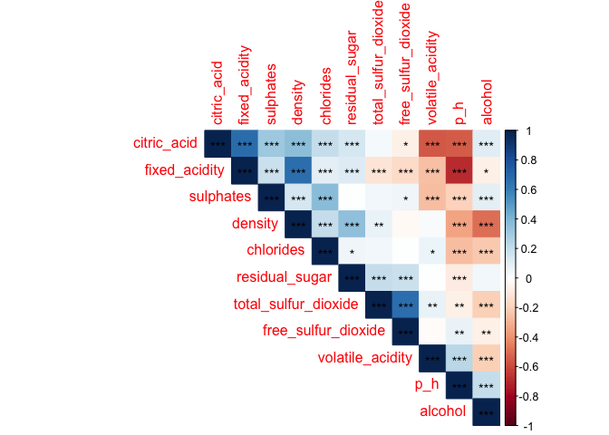
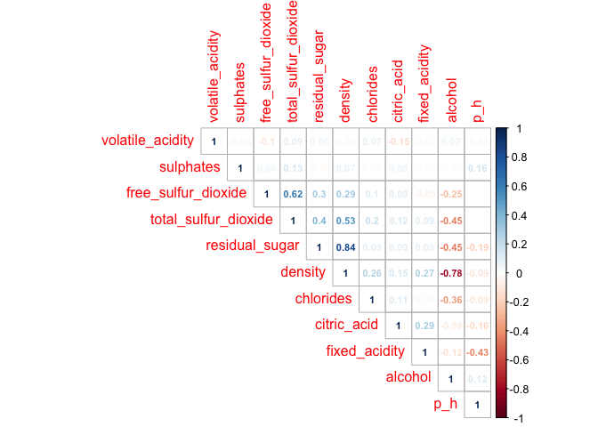
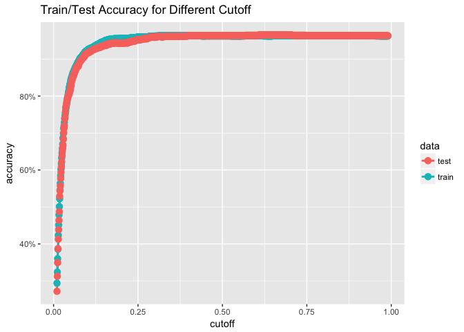
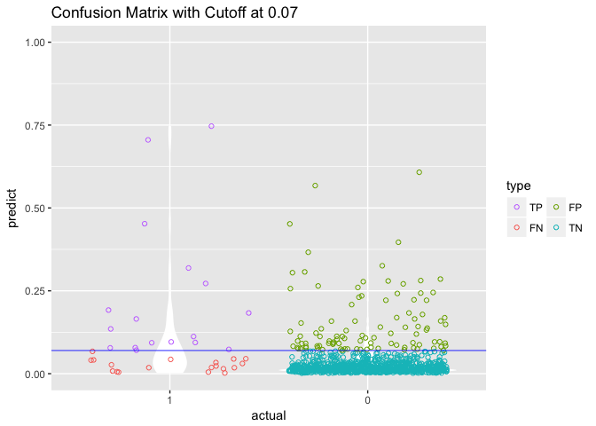
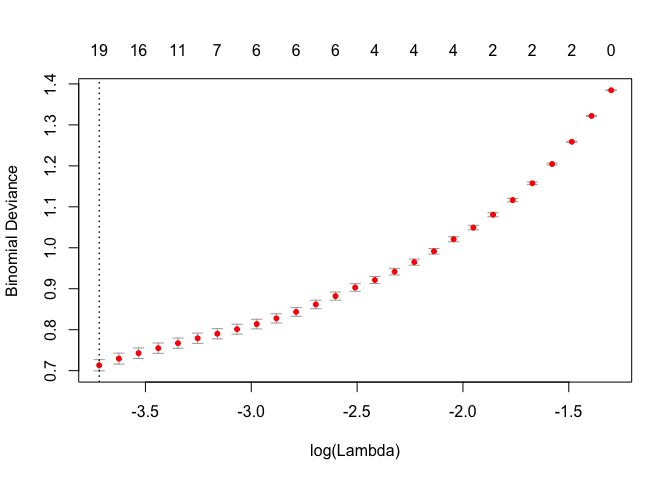
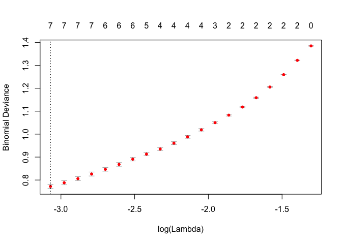
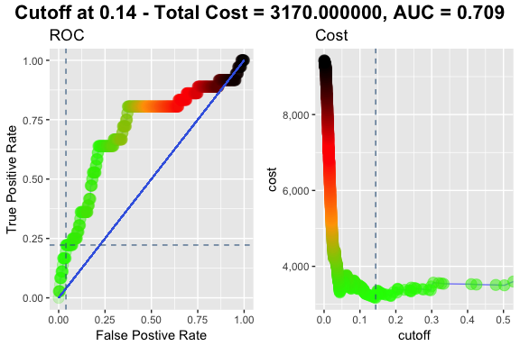

Logistic Regression
================

``` r
# setting the appropriate working directory
setwd("~/Desktop/Personal/personal_code/classification/")

# setting scipen options to kill all use of scientific notation
options(scipen = 999)

# basic packages needed throughout
library(dplyr) # for piping
```

    ## 
    ## Attaching package: 'dplyr'

    ## The following objects are masked from 'package:stats':
    ## 
    ##     filter, lag

    ## The following objects are masked from 'package:base':
    ## 
    ##     intersect, setdiff, setequal, union

``` r
library(ggplot2) # for visualization
```

    ## 
    ## Attaching package: 'ggplot2'

    ## The following object is masked from 'package:dplyr':
    ## 
    ##     vars

``` r
library(ggthemes) # for custom visualization
```

Importing, Exploring, Cleaning, Normalizing / Centering, and Prepping the Data
==============================================================================

Importing the Data
------------------

-   Data taken from: <https://archive.ics.uci.edu/ml/machine-learning-databases/wine-quality/>
-   Explanation of the meaning / origin of the data can be found in this academic paper here: <http://www3.dsi.uminho.pt/pcortez/wine5.pdf>

``` r
# we have both red and white wine datasets with the same variables 
base_red <- read.csv("data/winequality-red.csv",sep=";")
base_white <- read.csv("data/winequality-white.csv",sep=";")

# lots of useful information about the dataset
glimpse(base_red) 
```

    ## Observations: 1,599
    ## Variables: 12
    ## $ fixed.acidity        <dbl> 7.4, 7.8, 7.8, 11.2, 7.4, 7.4, 7.9, 7.3, ...
    ## $ volatile.acidity     <dbl> 0.700, 0.880, 0.760, 0.280, 0.700, 0.660,...
    ## $ citric.acid          <dbl> 0.00, 0.00, 0.04, 0.56, 0.00, 0.00, 0.06,...
    ## $ residual.sugar       <dbl> 1.9, 2.6, 2.3, 1.9, 1.9, 1.8, 1.6, 1.2, 2...
    ## $ chlorides            <dbl> 0.076, 0.098, 0.092, 0.075, 0.076, 0.075,...
    ## $ free.sulfur.dioxide  <dbl> 11, 25, 15, 17, 11, 13, 15, 15, 9, 17, 15...
    ## $ total.sulfur.dioxide <dbl> 34, 67, 54, 60, 34, 40, 59, 21, 18, 102, ...
    ## $ density              <dbl> 0.9978, 0.9968, 0.9970, 0.9980, 0.9978, 0...
    ## $ pH                   <dbl> 3.51, 3.20, 3.26, 3.16, 3.51, 3.51, 3.30,...
    ## $ sulphates            <dbl> 0.56, 0.68, 0.65, 0.58, 0.56, 0.56, 0.46,...
    ## $ alcohol              <dbl> 9.4, 9.8, 9.8, 9.8, 9.4, 9.4, 9.4, 10.0, ...
    ## $ quality              <int> 5, 5, 5, 6, 5, 5, 5, 7, 7, 5, 5, 5, 5, 5,...

``` r
glimpse(base_white) 
```

    ## Observations: 4,898
    ## Variables: 12
    ## $ fixed.acidity        <dbl> 7.0, 6.3, 8.1, 7.2, 7.2, 8.1, 6.2, 7.0, 6...
    ## $ volatile.acidity     <dbl> 0.27, 0.30, 0.28, 0.23, 0.23, 0.28, 0.32,...
    ## $ citric.acid          <dbl> 0.36, 0.34, 0.40, 0.32, 0.32, 0.40, 0.16,...
    ## $ residual.sugar       <dbl> 20.70, 1.60, 6.90, 8.50, 8.50, 6.90, 7.00...
    ## $ chlorides            <dbl> 0.045, 0.049, 0.050, 0.058, 0.058, 0.050,...
    ## $ free.sulfur.dioxide  <dbl> 45, 14, 30, 47, 47, 30, 30, 45, 14, 28, 1...
    ## $ total.sulfur.dioxide <dbl> 170, 132, 97, 186, 186, 97, 136, 170, 132...
    ## $ density              <dbl> 1.0010, 0.9940, 0.9951, 0.9956, 0.9956, 0...
    ## $ pH                   <dbl> 3.00, 3.30, 3.26, 3.19, 3.19, 3.26, 3.18,...
    ## $ sulphates            <dbl> 0.45, 0.49, 0.44, 0.40, 0.40, 0.44, 0.47,...
    ## $ alcohol              <dbl> 8.8, 9.5, 10.1, 9.9, 9.9, 10.1, 9.6, 8.8,...
    ## $ quality              <int> 6, 6, 6, 6, 6, 6, 6, 6, 6, 6, 5, 5, 5, 7,...

``` r
# the datasets both have the same variables, but the red dataset has notably fewer observations
```

``` r
# given that the two datasets all have the same variables, we'll add a color variable to each and then combine

base_red <- base_red %>%
  mutate(color = "red")

base_white <- base_white %>%
  mutate(color = "white")

# combining the two data frames
main_wine_df <- bind_rows(base_red, base_white)

# viewing the newly combined data frame
glimpse(main_wine_df)
```

    ## Observations: 6,497
    ## Variables: 13
    ## $ fixed.acidity        <dbl> 7.4, 7.8, 7.8, 11.2, 7.4, 7.4, 7.9, 7.3, ...
    ## $ volatile.acidity     <dbl> 0.700, 0.880, 0.760, 0.280, 0.700, 0.660,...
    ## $ citric.acid          <dbl> 0.00, 0.00, 0.04, 0.56, 0.00, 0.00, 0.06,...
    ## $ residual.sugar       <dbl> 1.9, 2.6, 2.3, 1.9, 1.9, 1.8, 1.6, 1.2, 2...
    ## $ chlorides            <dbl> 0.076, 0.098, 0.092, 0.075, 0.076, 0.075,...
    ## $ free.sulfur.dioxide  <dbl> 11, 25, 15, 17, 11, 13, 15, 15, 9, 17, 15...
    ## $ total.sulfur.dioxide <dbl> 34, 67, 54, 60, 34, 40, 59, 21, 18, 102, ...
    ## $ density              <dbl> 0.9978, 0.9968, 0.9970, 0.9980, 0.9978, 0...
    ## $ pH                   <dbl> 3.51, 3.20, 3.26, 3.16, 3.51, 3.51, 3.30,...
    ## $ sulphates            <dbl> 0.56, 0.68, 0.65, 0.58, 0.56, 0.56, 0.46,...
    ## $ alcohol              <dbl> 9.4, 9.8, 9.8, 9.8, 9.4, 9.4, 9.4, 10.0, ...
    ## $ quality              <int> 5, 5, 5, 6, 5, 5, 5, 7, 7, 5, 5, 5, 5, 5,...
    ## $ color                <chr> "red", "red", "red", "red", "red", "red",...

``` r
library(janitor) # for data cleaning and tabular exploration
# documentation: https://github.com/sfirke/janitor

# first we'll do some mandatory / precautionary cleaning
# tidying variable names and dropping any useless rows / columns

main_wine_df <- main_wine_df %>%
  janitor::clean_names() %>% #converts to underscore case and cleans
  janitor::remove_empty(which = c("rows","cols")) # drops all rows and columns that are entirely empty
```

``` r
# for the purpose of simplicity, we are going to start by only looking at the red wine
red_main_df <- main_wine_df %>%
  # filtering to just the red wine
  filter(color == "white") %>%
  # dropping the now-useless variable
  select(-color) %>%
  # ensuring quality is a factor; this will be useful later
  # as a rule of thumb, it's good to factor any non-numeric variables when glm modeling
  mutate(quality = factor(quality))

# examining the newly created dataset
glimpse(red_main_df)
```

    ## Observations: 4,898
    ## Variables: 12
    ## $ fixed_acidity        <dbl> 7.0, 6.3, 8.1, 7.2, 7.2, 8.1, 6.2, 7.0, 6...
    ## $ volatile_acidity     <dbl> 0.27, 0.30, 0.28, 0.23, 0.23, 0.28, 0.32,...
    ## $ citric_acid          <dbl> 0.36, 0.34, 0.40, 0.32, 0.32, 0.40, 0.16,...
    ## $ residual_sugar       <dbl> 20.70, 1.60, 6.90, 8.50, 8.50, 6.90, 7.00...
    ## $ chlorides            <dbl> 0.045, 0.049, 0.050, 0.058, 0.058, 0.050,...
    ## $ free_sulfur_dioxide  <dbl> 45, 14, 30, 47, 47, 30, 30, 45, 14, 28, 1...
    ## $ total_sulfur_dioxide <dbl> 170, 132, 97, 186, 186, 97, 136, 170, 132...
    ## $ density              <dbl> 1.0010, 0.9940, 0.9951, 0.9956, 0.9956, 0...
    ## $ p_h                  <dbl> 3.00, 3.30, 3.26, 3.19, 3.19, 3.26, 3.18,...
    ## $ sulphates            <dbl> 0.45, 0.49, 0.44, 0.40, 0.40, 0.44, 0.47,...
    ## $ alcohol              <dbl> 8.8, 9.5, 10.1, 9.9, 9.9, 10.1, 9.6, 8.8,...
    ## $ quality              <fct> 6, 6, 6, 6, 6, 6, 6, 6, 6, 6, 5, 5, 5, 7,...

Exploring the Data
------------------

``` r
# Even though we dropped any rows / cols that are entirely null, we need to check for NA problems
library(DataExplorer) # allows for creation of missings values map
# documentation for DataExplorer: https://towardsdatascience.com/simple-fast-exploratory-data-analysis-in-r-with-dataexplorer-package-e055348d9619
DataExplorer::plot_missing(red_main_df) # shows % of NAs within each variable
```


``` r
# good news is this dataset looks perfectly clean of nulls!
# If there were any problems with nulls, we would solve it using complete.cases() or something similar
```

### Continous Variables Exploration

``` r
# high-level univariate variable-exploration
# first a histogram of all continuous variables in the dataset
DataExplorer::plot_histogram(data = red_main_df, title = "Continuous Variables Explored (Histograms)")
```


``` r
# then a density chart of all continous variables in the dataset
DataExplorer::plot_density(data = red_main_df, title = "Continuous Variables Explored (Density Plots)")
```


### Categorical Variable Exploration

``` r
# the only categorical variable in our data in this case is what we'll use to create our low quality flag
# if we had many categorical variables, it would make sense to use order_bar = TRUE
# the order would then be in descending order of prevalence, which is helpful at a glance
plot_bar(data = red_main_df, order_bar = FALSE, title = "Categorical Variables Explored")
```


``` r
# and then we can use janitor to see the exact cross-tab of our quality variable
janitor::tabyl(red_main_df$quality)
```

    ##  red_main_df$quality    n     percent
    ##                    3   20 0.004083299
    ##                    4  163 0.033278889
    ##                    5 1457 0.297468354
    ##                    6 2198 0.448754594
    ##                    7  880 0.179665169
    ##                    8  175 0.035728869
    ##                    9    5 0.001020825

``` r
# it looks like wines with a rating < 5 are exceptionally bad, so we'll use that as our benchmark
# all together wines with a rating below 5 represent just under 4% of the population
```

### Outcome Variable Creation

``` r
# given the above analysis, we'll flag anything with a quality rating < 5 as low-quality 
red_final_df <- red_main_df %>%
  # type conversion here can be tricky because to de-factor requires multiple steps
  # we have to de-factor, perform the logical test on the numeric, and then re-factor
  mutate(low_qual_flag = factor(ifelse(as.numeric(as.character(quality)) < 5,1,0))) %>%
  select(-quality)

glimpse(red_final_df) # taking another look at the new dataset
```

    ## Observations: 4,898
    ## Variables: 12
    ## $ fixed_acidity        <dbl> 7.0, 6.3, 8.1, 7.2, 7.2, 8.1, 6.2, 7.0, 6...
    ## $ volatile_acidity     <dbl> 0.27, 0.30, 0.28, 0.23, 0.23, 0.28, 0.32,...
    ## $ citric_acid          <dbl> 0.36, 0.34, 0.40, 0.32, 0.32, 0.40, 0.16,...
    ## $ residual_sugar       <dbl> 20.70, 1.60, 6.90, 8.50, 8.50, 6.90, 7.00...
    ## $ chlorides            <dbl> 0.045, 0.049, 0.050, 0.058, 0.058, 0.050,...
    ## $ free_sulfur_dioxide  <dbl> 45, 14, 30, 47, 47, 30, 30, 45, 14, 28, 1...
    ## $ total_sulfur_dioxide <dbl> 170, 132, 97, 186, 186, 97, 136, 170, 132...
    ## $ density              <dbl> 1.0010, 0.9940, 0.9951, 0.9956, 0.9956, 0...
    ## $ p_h                  <dbl> 3.00, 3.30, 3.26, 3.19, 3.19, 3.26, 3.18,...
    ## $ sulphates            <dbl> 0.45, 0.49, 0.44, 0.40, 0.40, 0.44, 0.47,...
    ## $ alcohol              <dbl> 8.8, 9.5, 10.1, 9.9, 9.9, 10.1, 9.6, 8.8,...
    ## $ low_qual_flag        <fct> 0, 0, 0, 0, 0, 0, 0, 0, 0, 0, 0, 0, 0, 0,...

``` r
tabyl(red_final_df$low_qual_flag)
```

    ##  red_final_df$low_qual_flag    n    percent
    ##                           0 4715 0.96263781
    ##                           1  183 0.03736219

``` r
# the data now look nice and clean!
```

Centering and Normalizing the Data
----------------------------------

For more information on when to center / normalize data, see below: - <https://stats.stackexchange.com/questions/29781/when-conducting-multiple-regression-when-should-you-center-your-predictor-varia> - tl;dr --&gt; center the data when you want your intercept term to represent your expectation when the model is fed the average for each variable in the model, as opposed to the model expectation when all variables == 0; normalize the data when the variable ranges differ markedly

``` r
# we're going to scale and center all variables (except our left-hand side)
red_final_df[,-12] <- scale(red_final_df[,-12], center = TRUE, scale = TRUE)
glimpse(red_final_df)
```

    ## Observations: 4,898
    ## Variables: 12
    ## $ fixed_acidity        <dbl> 0.17207939, -0.65743400, 1.47560044, 0.40...
    ## $ volatile_acidity     <dbl> -0.08176155, 0.21587359, 0.01745016, -0.4...
    ## $ citric_acid          <dbl> 0.21325843, 0.04799622, 0.54378284, -0.11...
    ## $ residual_sugar       <dbl> 2.8210611, -0.9446688, 0.1002720, 0.41572...
    ## $ chlorides            <dbl> -0.03535139, 0.14773200, 0.19350284, 0.55...
    ## $ free_sulfur_dioxide  <dbl> 0.56987339, -1.25289074, -0.31210925, 0.6...
    ## $ total_sulfur_dioxide <dbl> 0.74448902, -0.14966934, -0.97323626, 1.1...
    ## $ density              <dbl> 2.331273996, -0.009153237, 0.358628185, 0...
    ## $ p_h                  <dbl> -1.24679399, 0.73995309, 0.47505348, 0.01...
    ## $ sulphates            <dbl> -0.34914861, 0.00134171, -0.43677119, -0....
    ## $ alcohol              <dbl> -1.39301024, -0.82419153, -0.33663264, -0...
    ## $ low_qual_flag        <fct> 0, 0, 0, 0, 0, 0, 0, 0, 0, 0, 0, 0, 0, 0,...

Checking for Variable Correlations
----------------------------------

For more on all the cool varieties of correlation plots that can be created, see below: - <https://cran.r-project.org/web/packages/corrplot/vignettes/corrplot-intro.html>

``` r
# package needed for all varieties of correlation plots
library(corrplot)
```

    ## corrplot 0.84 loaded

``` r
# building a correlation matrix and ensuring that it only takes in components that are numeric 
# this is necessary because if there are any non-numeric elements in the matrix, this will break 
corr_matrix <- cor(red_final_df[, sapply(red_final_df, is.numeric)])

# getting the matrix of p-values that correspond to the strength of correlation for each pairing
res1 <- cor.mtest(red_final_df[, sapply(red_final_df, is.numeric)], conf.level = .95)

# first we'll build a correlation plot that checks for significance level
# this one will also give us a hint at strength of correlation based on the colors 
corrplot(corr_matrix, p.mat = res1$p, method = "color", type = "upper",
         sig.level = c(.001, .01, .05), pch.cex = .9,
         insig = "label_sig", pch.col = "black", order = "AOE", na.label = "NA")
```



``` r
# and finally we'll build a simpler corrplot to get the strenth of correlation numbers visualized
corrplot(corr_matrix, method = "number", type = "upper", pch.cex = .9,
         order = "AOE", number.cex = .7, na.label = "NA")
```



Takeways from these types of exploratory techniques can help us to create a more informed model. We may, depending on the circumstances, treat variables differently in our model-building process as a result of these types of charts. For example, we might discover a great degree of cross-correlation that allows us to delete duplicative variables, etc. We can notice a few interesting trends from our results above in this case:

-   Citric acid and fixed acidity are verging on highly correlated. So too are fixed acidity and density, and total sulfur dioxide and free sulfur dioxide. These correlations are also significant. While most of these are intuitive, we might do well to remember these cross-correlations when it comes time to do dimensionality reduction with this model (if necessary) as in most cases if variables are highly correlated there may not be a strong marginal lift that justifies keeping both in the final model.
-   There are also a few very obvious relationships, such as the negative correlation between pH and citric acid, but all in all this chart seems to demonstrate that there isn't a massive amount to be concerned about in terms of cross-correlation.

Prepping Data for the Modeling Process
--------------------------------------

``` r
# split the data into training and testing sets
library(caret) # needed to createDataPartitions
```

    ## Loading required package: lattice

    ## Warning in as.POSIXlt.POSIXct(Sys.time()): unknown timezone 'zone/tz/2018c.
    ## 1.0/zoneinfo/America/New_York'

``` r
# Partition data: 80 / 20 split : train / test
# set seed to ensure reproducibility
set.seed(777)

in_train <- caret::createDataPartition(y=red_final_df$low_qual_flag, p=0.80, list=FALSE)

# splits the data into training and testing sets
training <- red_final_df[in_train,]
testing <- red_final_df[-in_train,]

# shows the row count and column count of the training and test sets, to check that all worked as planned
dim(training)
```

    ## [1] 3919   12

``` r
dim(testing)
```

    ## [1] 979  12

Building a Basic Logit
======================

Estimating the Model
--------------------

``` r
# simple logistic regression
# models using all variables in the training dataset (hence ~ .)
logit_fit <- glm(low_qual_flag ~ .,
                 data = training,
                 family = binomial)

summary(logit_fit)
```

    ## 
    ## Call:
    ## glm(formula = low_qual_flag ~ ., family = binomial, data = training)
    ## 
    ## Deviance Residuals: 
    ##     Min       1Q   Median       3Q      Max  
    ## -1.8387  -0.2603  -0.1841  -0.1334   4.0915  
    ## 
    ## Coefficients:
    ##                      Estimate Std. Error z value             Pr(>|z|)    
    ## (Intercept)          -3.86720    0.12352 -31.308 < 0.0000000000000002 ***
    ## fixed_acidity         0.29099    0.10881   2.674              0.00749 ** 
    ## volatile_acidity      0.63663    0.07207   8.834 < 0.0000000000000002 ***
    ## citric_acid          -0.16949    0.09671  -1.753              0.07968 .  
    ## residual_sugar       -1.12102    0.24831  -4.515           0.00000634 ***
    ## chlorides             0.02198    0.07398   0.297              0.76642    
    ## free_sulfur_dioxide  -0.26507    0.13405  -1.977              0.04799 *  
    ## total_sulfur_dioxide -0.10961    0.12136  -0.903              0.36642    
    ## density               0.88345    0.28104   3.144              0.00167 ** 
    ## p_h                   0.05183    0.11864   0.437              0.66220    
    ## sulphates            -0.08620    0.10351  -0.833              0.40501    
    ## alcohol              -0.27069    0.16757  -1.615              0.10624    
    ## ---
    ## Signif. codes:  0 '***' 0.001 '**' 0.01 '*' 0.05 '.' 0.1 ' ' 1
    ## 
    ## (Dispersion parameter for binomial family taken to be 1)
    ## 
    ##     Null deviance: 1253.7  on 3918  degrees of freedom
    ## Residual deviance: 1017.7  on 3907  degrees of freedom
    ## AIC: 1041.7
    ## 
    ## Number of Fisher Scoring iterations: 7

First Look at Model Predictions
-------------------------------

``` r
# first we'll examine what sort of predictions the model would make when fed the training set
# then we'll repeat this with the testing set (which we should care a bit more about)
# then we'll observe the distribution of modelled probabilities to look for interesting trends

# run predictions on training set
prediction_train <- predict(logit_fit, newdata = training, type = "response" )
predictions_train_full <- data.frame(prediction = prediction_train, low_qual_flag = training$low_qual_flag)

# run predictions on testing set
prediction_test <- predict(logit_fit, newdata = testing, type = "response" )
predictions_test_full <- data.frame(prediction = prediction_test, low_qual_flag = testing$low_qual_flag)

# distribution of the prediction score grouped by known outcome (for training set only)
ggplot(predictions_train_full, aes(prediction_train, color = as.factor(training$low_qual_flag) ) ) + 
geom_density( size = 1 ) +
ggtitle( "Training Set's Predicted Score" ) + 
scale_color_economist( name = "data", labels = c( "negative", "positive" ) ) + 
theme_economist()
```


``` r
# distribution of the prediction score grouped by known outcome (for testing set only)
ggplot(predictions_test_full, aes(prediction_test, color = as.factor(testing$low_qual_flag) ) ) + 
geom_density( size = 1 ) +
ggtitle( "Testing Set's Predicted Score" ) + 
scale_color_economist( name = "data", labels = c( "negative", "positive" ) ) + 
theme_economist()
```


Determining What Classification Cutoff is Appropriate
-----------------------------------------------------

``` r
# some custom functions are sourced in, to reduce document's length
# the majority of these functions are from ethen8181's GitHub, with edits / improvements I added
# more info on these custom functions here: http://ethen8181.github.io/machine-learning/unbalanced/unbalanced.html

# sourcing my adopted version of the aforementioned functions directly from my GitHub
library(RCurl) # Provides functions to allow one to compose general HTTP requests, etc. in R
```

    ## Loading required package: bitops

``` r
# grabbing the raw info from my GitHub to turn into a text object
script <- getURL("https://raw.githubusercontent.com/pmaji/r-stats-and-modeling/master/classification/useful_classification_functions.R", ssl.verifypeer = FALSE)
# sourcing that code just like you might source an R Script locally
eval(parse(text = script))
```

    ## Loading required package: gplots

    ## 
    ## Attaching package: 'gplots'

    ## The following object is masked from 'package:stats':
    ## 
    ##     lowess

    ## 
    ## Attaching package: 'gridExtra'

    ## The following object is masked from 'package:dplyr':
    ## 
    ##     combine

    ## 
    ## Attaching package: 'data.table'

    ## The following objects are masked from 'package:dplyr':
    ## 
    ##     between, first, last

``` r
# using newly-sourced function AccuracyCutoffInfo to test for optimal cutoff visually
accuracy_info <- AccuracyCutoffInfo(train = predictions_train_full, 
                                    test = predictions_test_full, 
                                    predict = "prediction", 
                                    actual = "low_qual_flag",
                                    # iterates over every cutoff value from 1% to 99% 
                                    # steps in units of 10 bps
                                    cut_val_start = 0.01,
                                    cut_val_end = 0.99,
                                    by_step_size = 0.001)

# from the plot below we can begin to eyeball what the optimal cutoff might be 
accuracy_info$plot
```



``` r
# Moving on to using ROC Curves to pinpoint optimal cutoffs

# user-defined costs for false negative and false positive to pinpoint where total cost is minimized
cost_fp <- 10 # cost of false positive
cost_fn <- 100# cost of false negative
# here the assumption I've made is that a false positive is 1/10th as costly as a false negative

# creates the base data needed to visualize the ROC curves
roc_info <- ROCInfo(data = predictions_test_full, 
                    predict = "prediction", 
                    actual = "low_qual_flag", 
                    cost.fp = cost_fp, 
                    cost.fn = cost_fn )
```

``` r
# plot the roc / cutoff-selection plots
# color on the chart is cost -- darker is higher cost / greener is lower cost
grid.draw(roc_info$plot)
```


``` r
# looks like the optimal cutoff is at 0.07
```

Examining Model Performance for the Basic Logit
-----------------------------------------------

``` r
# visualize a particular cutoff's effectiveness at classification
cm_info <- ConfusionMatrixInfo(data = predictions_test_full, 
                               predict = "prediction", 
                               actual = "low_qual_flag", 
                               cutoff = .07) # (determined by roc_info$plot above)

# prints the visualization of the confusion matrix (use print(cm_info$data) to see the raw data)
cm_info$plot
```



``` r
# lastly, we'll use the cutoff we have arrived at from the work above to test the model's predictions
# think of this section as the cross-tab version of the confusion matrix plot shown above

# getting model probabilities for our testing set
logit_fit_probs <- predict(logit_fit,
                           newdata = testing,
                           type = "response")

# turning these probabilities into classifications using the cutoff determined above 
logit_fit_predictions <- factor(ifelse(logit_fit_probs > 0.11, 1, 0),levels=c('0','1'))

# builiding a confusion matrix 
caret::confusionMatrix(logit_fit_predictions,testing$low_qual_flag, positive='1')
```

    ## Confusion Matrix and Statistics
    ## 
    ##           Reference
    ## Prediction   0   1
    ##          0 892  26
    ##          1  51  10
    ##                                           
    ##                Accuracy : 0.9213          
    ##                  95% CI : (0.9027, 0.9374)
    ##     No Information Rate : 0.9632          
    ##     P-Value [Acc > NIR] : 1.000000        
    ##                                           
    ##                   Kappa : 0.1677          
    ##  Mcnemar's Test P-Value : 0.006237        
    ##                                           
    ##             Sensitivity : 0.27778         
    ##             Specificity : 0.94592         
    ##          Pos Pred Value : 0.16393         
    ##          Neg Pred Value : 0.97168         
    ##              Prevalence : 0.03677         
    ##          Detection Rate : 0.01021         
    ##    Detection Prevalence : 0.06231         
    ##       Balanced Accuracy : 0.61185         
    ##                                           
    ##        'Positive' Class : 1               
    ## 

Penalized Logistic Regression (Lasso)
=====================================

-   Now using an Objective Function that penalizes low-ROI variables. This is similar to ridge regression except variables with coefficients non-consequential enough will be zero'ed out of the model.
-   Useful source: <http://www.sthda.com/english/articles/36-classification-methods-essentials/149-penalized-logistic-regression-essentials-in-r-ridge-lasso-and-elastic-net/>

Tuning the Hyperparameter for the Lasso Model w/ 2-Way Interactions (Optmizing Lamda)
-------------------------------------------------------------------------------------

``` r
library(glmnet) # package needed for ridge methods 
```

    ## Loading required package: Matrix

    ## Loading required package: foreach

    ## Loaded glmnet 2.0-13

``` r
# we need two packages for an advanced samplign technique called SMOTE
# because of the cross-validation involved in tuning our hyperparameter, we need more balanced data
# SMOTE is one method of achieving this balance (others include: upsampling / downsampling / ROSE)
# for all varieties of SMOTE, see https://cran.r-project.org/web/packages/smotefamily/smotefamily.pdf
library(smotefamily) # main SMOTE variety package
# there are different algos behind the types of SMOTE; we'll rely on one that uses KNN / DBSCAN
library(dbscan) #needed for dbsmote type of SMOTE to function

# first we construct a SMOTE-built training dataset that is more well-balanced than our actual pop. 
smote2_train <- smotefamily::DBSMOTE(training[,-c(12)], as.numeric(as.character(training$low_qual_flag)))
# then we inspect the incidence rate of our left-hand-side variable in the new training set
janitor::tabyl(smote2_train$data$class) 

# Then we build our model matrix (including all two-way interactions possible (hence ^2))
x <- model.matrix(class~.^2, smote2_train$data)
# calling out what the outcome variable should be explicitly for this method
y <- smote2_train$data$class


# Next we move on to find the best lambda using cross-validation
# Cross-validation is for tuning hyperparameters; not normally needed if model requires no hyperparameters
set.seed(777) # set seed for reproduciblity
# alpha = 1 just means lasso ; alpha = 0 is ridge
# this step below can take a long time, as the range of possible lambdas is simulated
cv.lasso <- cv.glmnet(x, y, alpha = 1, family = "binomial")
```

``` r
# plots the various possible lambdas 
plot(cv.lasso)
```



``` r
# Two common choices for lambda: lambda min and lambda lse (both are shown with dotted lines, in turn)
# Up to the modeler to decide which to choose in this case; simplicity / error-minimization tradeoff
```

Examining the Resultant Coefficients
------------------------------------

The main purpose of using the lasso here is to look for any interaction effects that might be powerful predictors, and/or to trim variables that are of visibly no importance. Because of how quickly variable count scales when you consider all possible interactions, it seems pertinent to focus in particular on the coefficient list where we use lambda.lse (and thus have zero'ed out more coefficients)

``` r
# lambda min is the value that minimizes the prediction error
cv.lasso$lambda.min
```

    ## [1] 0.02427122

``` r
# showing coefficients using lambda min (if . then variable has been zero'ed out)
coef(cv.lasso, cv.lasso$lambda.min)
```

    ## 68 x 1 sparse Matrix of class "dgCMatrix"
    ##                                                    1
    ## (Intercept)                              -1.00868703
    ## (Intercept)                               .         
    ## fixed_acidity                             0.16038093
    ## volatile_acidity                          0.71248610
    ## citric_acid                               .         
    ## residual_sugar                           -0.16363150
    ## chlorides                                 .         
    ## free_sulfur_dioxide                      -1.05927820
    ## total_sulfur_dioxide                      .         
    ## density                                   0.39465237
    ## p_h                                       .         
    ## sulphates                                 .         
    ## alcohol                                  -0.21830615
    ## fixed_acidity:volatile_acidity            .         
    ## fixed_acidity:citric_acid                -0.06912063
    ## fixed_acidity:residual_sugar              .         
    ## fixed_acidity:chlorides                   .         
    ## fixed_acidity:free_sulfur_dioxide        -0.05685387
    ## fixed_acidity:total_sulfur_dioxide        .         
    ## fixed_acidity:density                     .         
    ## fixed_acidity:p_h                         0.06883735
    ## fixed_acidity:sulphates                   .         
    ## fixed_acidity:alcohol                     .         
    ## volatile_acidity:citric_acid              .         
    ## volatile_acidity:residual_sugar          -0.10013435
    ## volatile_acidity:chlorides                .         
    ## volatile_acidity:free_sulfur_dioxide     -0.03346143
    ## volatile_acidity:total_sulfur_dioxide    -0.10210991
    ## volatile_acidity:density                  .         
    ## volatile_acidity:p_h                      .         
    ## volatile_acidity:sulphates                .         
    ## volatile_acidity:alcohol                  .         
    ## citric_acid:residual_sugar                .         
    ## citric_acid:chlorides                    -0.03964028
    ## citric_acid:free_sulfur_dioxide           .         
    ## citric_acid:total_sulfur_dioxide          .         
    ## citric_acid:density                       .         
    ## citric_acid:p_h                           .         
    ## citric_acid:sulphates                     .         
    ## citric_acid:alcohol                       .         
    ## residual_sugar:chlorides                  0.03430541
    ## residual_sugar:free_sulfur_dioxide        0.03168152
    ## residual_sugar:total_sulfur_dioxide       .         
    ## residual_sugar:density                    .         
    ## residual_sugar:p_h                        .         
    ## residual_sugar:sulphates                  .         
    ## residual_sugar:alcohol                    .         
    ## chlorides:free_sulfur_dioxide             .         
    ## chlorides:total_sulfur_dioxide            .         
    ## chlorides:density                         .         
    ## chlorides:p_h                             .         
    ## chlorides:sulphates                       .         
    ## chlorides:alcohol                         0.01381740
    ## free_sulfur_dioxide:total_sulfur_dioxide  0.04342281
    ## free_sulfur_dioxide:density               .         
    ## free_sulfur_dioxide:p_h                   .         
    ## free_sulfur_dioxide:sulphates             .         
    ## free_sulfur_dioxide:alcohol               .         
    ## total_sulfur_dioxide:density              .         
    ## total_sulfur_dioxide:p_h                  .         
    ## total_sulfur_dioxide:sulphates            0.08622362
    ## total_sulfur_dioxide:alcohol              .         
    ## density:p_h                               .         
    ## density:sulphates                         .         
    ## density:alcohol                           0.43208851
    ## p_h:sulphates                             .         
    ## p_h:alcohol                               .         
    ## sulphates:alcohol                         .

``` r
# lambda lse gives the simplest model but also lies within one SE of the optimal value of lambda
cv.lasso$lambda.1se
```

    ## [1] 0.02427122

``` r
# showing coefficients using lambda min (if . then variable has been zero'ed out)
coef(cv.lasso, cv.lasso$lambda.1se)
```

    ## 68 x 1 sparse Matrix of class "dgCMatrix"
    ##                                                    1
    ## (Intercept)                              -1.00868703
    ## (Intercept)                               .         
    ## fixed_acidity                             0.16038093
    ## volatile_acidity                          0.71248610
    ## citric_acid                               .         
    ## residual_sugar                           -0.16363150
    ## chlorides                                 .         
    ## free_sulfur_dioxide                      -1.05927820
    ## total_sulfur_dioxide                      .         
    ## density                                   0.39465237
    ## p_h                                       .         
    ## sulphates                                 .         
    ## alcohol                                  -0.21830615
    ## fixed_acidity:volatile_acidity            .         
    ## fixed_acidity:citric_acid                -0.06912063
    ## fixed_acidity:residual_sugar              .         
    ## fixed_acidity:chlorides                   .         
    ## fixed_acidity:free_sulfur_dioxide        -0.05685387
    ## fixed_acidity:total_sulfur_dioxide        .         
    ## fixed_acidity:density                     .         
    ## fixed_acidity:p_h                         0.06883735
    ## fixed_acidity:sulphates                   .         
    ## fixed_acidity:alcohol                     .         
    ## volatile_acidity:citric_acid              .         
    ## volatile_acidity:residual_sugar          -0.10013435
    ## volatile_acidity:chlorides                .         
    ## volatile_acidity:free_sulfur_dioxide     -0.03346143
    ## volatile_acidity:total_sulfur_dioxide    -0.10210991
    ## volatile_acidity:density                  .         
    ## volatile_acidity:p_h                      .         
    ## volatile_acidity:sulphates                .         
    ## volatile_acidity:alcohol                  .         
    ## citric_acid:residual_sugar                .         
    ## citric_acid:chlorides                    -0.03964028
    ## citric_acid:free_sulfur_dioxide           .         
    ## citric_acid:total_sulfur_dioxide          .         
    ## citric_acid:density                       .         
    ## citric_acid:p_h                           .         
    ## citric_acid:sulphates                     .         
    ## citric_acid:alcohol                       .         
    ## residual_sugar:chlorides                  0.03430541
    ## residual_sugar:free_sulfur_dioxide        0.03168152
    ## residual_sugar:total_sulfur_dioxide       .         
    ## residual_sugar:density                    .         
    ## residual_sugar:p_h                        .         
    ## residual_sugar:sulphates                  .         
    ## residual_sugar:alcohol                    .         
    ## chlorides:free_sulfur_dioxide             .         
    ## chlorides:total_sulfur_dioxide            .         
    ## chlorides:density                         .         
    ## chlorides:p_h                             .         
    ## chlorides:sulphates                       .         
    ## chlorides:alcohol                         0.01381740
    ## free_sulfur_dioxide:total_sulfur_dioxide  0.04342281
    ## free_sulfur_dioxide:density               .         
    ## free_sulfur_dioxide:p_h                   .         
    ## free_sulfur_dioxide:sulphates             .         
    ## free_sulfur_dioxide:alcohol               .         
    ## total_sulfur_dioxide:density              .         
    ## total_sulfur_dioxide:p_h                  .         
    ## total_sulfur_dioxide:sulphates            0.08622362
    ## total_sulfur_dioxide:alcohol              .         
    ## density:p_h                               .         
    ## density:sulphates                         .         
    ## density:alcohol                           0.43208851
    ## p_h:sulphates                             .         
    ## p_h:alcohol                               .         
    ## sulphates:alcohol                         .

``` r
# storing the coefficients for later use
lambda_coefs <- broom::tidy(coef(cv.lasso, cv.lasso$lambda.1se))
```

Re-Estimating Refined Logit Based on Lasso Results
--------------------------------------------------

``` r
# working on a method to transform a column into a list separated by +'s to be used in the formula
coef_list <- lambda_coefs %>%
  # arrange the coefficients in descending order of absolute value
  arrange(desc(abs(value))) %>%
  select(row)

# rebuilt logit based on info gained from lasso; would like to be able to simply plug in the coef list, from above
v2_logit_fit <- glm(low_qual_flag ~ citric_acid + density + p_h + volatile_acidity + fixed_acidity + volatile_acidity:alcohol + free_sulfur_dioxide + total_sulfur_dioxide + free_sulfur_dioxide:alcohol + volatile_acidity:citric_acid + citric_acid:alcohol + fixed_acidity:citric_acid + chlorides + alcohol + chlorides:total_sulfur_dioxide + volatile_acidity:chlorides + citric_acid:residual_sugar + citric_acid:sulphates,
                 data = training,
                 family = binomial)

summary(v2_logit_fit)
```

    ## 
    ## Call:
    ## glm(formula = low_qual_flag ~ citric_acid + density + p_h + volatile_acidity + 
    ##     fixed_acidity + volatile_acidity:alcohol + free_sulfur_dioxide + 
    ##     total_sulfur_dioxide + free_sulfur_dioxide:alcohol + volatile_acidity:citric_acid + 
    ##     citric_acid:alcohol + fixed_acidity:citric_acid + chlorides + 
    ##     alcohol + chlorides:total_sulfur_dioxide + volatile_acidity:chlorides + 
    ##     citric_acid:residual_sugar + citric_acid:sulphates, family = binomial, 
    ##     data = training)
    ## 
    ## Deviance Residuals: 
    ##     Min       1Q   Median       3Q      Max  
    ## -1.9962  -0.2646  -0.1905  -0.1342   5.0928  
    ## 
    ## Coefficients:
    ##                                Estimate Std. Error z value
    ## (Intercept)                    -4.04991    0.14976 -27.043
    ## citric_acid                    -0.13978    0.13186  -1.060
    ## density                        -0.49237    0.16428  -2.997
    ## p_h                             0.36092    0.10639   3.392
    ## volatile_acidity                0.60745    0.07810   7.778
    ## fixed_acidity                   0.59265    0.10124   5.854
    ## free_sulfur_dioxide            -0.59996    0.15288  -3.924
    ## total_sulfur_dioxide           -0.04407    0.12059  -0.365
    ## chlorides                       0.01338    0.12065   0.111
    ## alcohol                        -1.02519    0.19615  -5.226
    ## volatile_acidity:alcohol        0.01341    0.08182   0.164
    ## alcohol:free_sulfur_dioxide    -0.38063    0.13510  -2.817
    ## citric_acid:volatile_acidity   -0.01544    0.05451  -0.283
    ## citric_acid:alcohol             0.07409    0.09913   0.747
    ## citric_acid:fixed_acidity       0.10514    0.05945   1.769
    ## total_sulfur_dioxide:chlorides  0.04515    0.08219   0.549
    ## volatile_acidity:chlorides      0.02566    0.06055   0.424
    ## citric_acid:residual_sugar      0.09690    0.07826   1.238
    ## citric_acid:sulphates           0.07439    0.07390   1.007
    ##                                            Pr(>|z|)    
    ## (Intercept)                    < 0.0000000000000002 ***
    ## citric_acid                                0.289118    
    ## density                                    0.002725 ** 
    ## p_h                                        0.000693 ***
    ## volatile_acidity                0.00000000000000737 ***
    ## fixed_acidity                   0.00000000479633961 ***
    ## free_sulfur_dioxide             0.00008695962487035 ***
    ## total_sulfur_dioxide                       0.714776    
    ## chlorides                                  0.911664    
    ## alcohol                         0.00000017280461352 ***
    ## volatile_acidity:alcohol                   0.869769    
    ## alcohol:free_sulfur_dioxide                0.004843 ** 
    ## citric_acid:volatile_acidity               0.776933    
    ## citric_acid:alcohol                        0.454841    
    ## citric_acid:fixed_acidity                  0.076971 .  
    ## total_sulfur_dioxide:chlorides             0.582808    
    ## volatile_acidity:chlorides                 0.671736    
    ## citric_acid:residual_sugar                 0.215682    
    ## citric_acid:sulphates                      0.314130    
    ## ---
    ## Signif. codes:  0 '***' 0.001 '**' 0.01 '*' 0.05 '.' 0.1 ' ' 1
    ## 
    ## (Dispersion parameter for binomial family taken to be 1)
    ## 
    ##     Null deviance: 1253.7  on 3918  degrees of freedom
    ## Residual deviance: 1020.2  on 3900  degrees of freedom
    ## AIC: 1058.2
    ## 
    ## Number of Fisher Scoring iterations: 7

Re-Determining What Classification Cutoff is Appropriate (Round 2)
------------------------------------------------------------------

``` r
# running predictions on the new post-lasso-improvements-integrated model
# same chunks of code used previously below; 1st to find best cutoff, then to test performance

# run predictions on testing set
prediction_test <- predict(v2_logit_fit, newdata = testing, type = "response" )
predictions_test_full <- data.frame(prediction = prediction_test, low_qual_flag = testing$low_qual_flag)

# again defining the costs of false positive vs. costs of false negative (same ratio maintained)
cost_fp <- 10
cost_fn <- 100

# building the data structure needed for the ROC charts
roc_info <- ROCInfo(data = predictions_test_full, 
                    predict = "prediction", 
                    actual = "low_qual_flag", 
                    cost.fp = cost_fp, 
                    cost.fn = cost_fn )
```

``` r
# plot the new roc / cutoff-selection plots
grid.draw(roc_info$plot)
```


``` r
# looks like the optimal cutoff is now at 0.23 
```

Examining Model Performance for the "Refined" Post-Lasso Logit
--------------------------------------------------------------

``` r
# getting model probabilities for our testing set 
logit_fit_probs <- predict(v2_logit_fit,
                           newdata = testing,
                           type = "response")

# turning these probabilities into classifications using the cutoff determined above 
logit_fit_predictions <- factor(ifelse(logit_fit_probs > 0.23, 1, 0),levels=c('0','1'))

# builiding a confusion matrix 
caret::confusionMatrix(logit_fit_predictions,testing$low_qual_flag, positive='1')
```

    ## Confusion Matrix and Statistics
    ## 
    ##           Reference
    ## Prediction   0   1
    ##          0 929  32
    ##          1  14   4
    ##                                           
    ##                Accuracy : 0.953           
    ##                  95% CI : (0.9378, 0.9654)
    ##     No Information Rate : 0.9632          
    ##     P-Value [Acc > NIR] : 0.95851         
    ##                                           
    ##                   Kappa : 0.1267          
    ##  Mcnemar's Test P-Value : 0.01219         
    ##                                           
    ##             Sensitivity : 0.111111        
    ##             Specificity : 0.985154        
    ##          Pos Pred Value : 0.222222        
    ##          Neg Pred Value : 0.966701        
    ##              Prevalence : 0.036772        
    ##          Detection Rate : 0.004086        
    ##    Detection Prevalence : 0.018386        
    ##       Balanced Accuracy : 0.548132        
    ##                                           
    ##        'Positive' Class : 1               
    ## 

Conclusion: it doesn't look like any of the interactions suggested by the dbsmote-training-set-estimated lasso logit added much value when re-integrated into the original logit. Perhaps other sampling methods could be tried, or different methods of variable-selection may prove more insightful.

N-Degree Polynomial Variable Search Via Second Lasso Model
----------------------------------------------------------

``` r
# first we need to find a way to get all variables with their correspoding degree polynomial into the model
# I'm also including here all two:way interaction effects
# in the code below, the integer in quotes determines the max nth degree polynomial to be tested
logit_3_formula <- as.formula(
  paste('low_qual_flag ~', paste('poly(', colnames(training[-12]),',3)', collapse = ' + '), '+ .^2', '- .')
  )

# prints the formula so that we can see what will be used to create the logit
logit_3_formula
```

    ## low_qual_flag ~ poly(fixed_acidity, 3) + poly(volatile_acidity, 
    ##     3) + poly(citric_acid, 3) + poly(residual_sugar, 3) + poly(chlorides, 
    ##     3) + poly(free_sulfur_dioxide, 3) + poly(total_sulfur_dioxide, 
    ##     3) + poly(density, 3) + poly(p_h, 3) + poly(sulphates, 3) + 
    ##     poly(alcohol, 3) + .^2 - .

``` r
# below is what the basic model without any variable-elimination yet conducted
v3_logit_fit <- glm(logit_3_formula,
                 data = training,
                 family = binomial)
```

    ## Warning: glm.fit: fitted probabilities numerically 0 or 1 occurred

``` r
summary(v3_logit_fit)
```

    ## 
    ## Call:
    ## glm(formula = logit_3_formula, family = binomial, data = training)
    ## 
    ## Deviance Residuals: 
    ##     Min       1Q   Median       3Q      Max  
    ## -2.0944  -0.1987  -0.0998  -0.0428   3.5990  
    ## 
    ## Coefficients:
    ##                                             Estimate  Std. Error z value
    ## (Intercept)                                 -7.48591     2.57983  -2.902
    ## poly(fixed_acidity, 3)1                     19.16973    18.75518   1.022
    ## poly(fixed_acidity, 3)2                    -18.13166    16.02067  -1.132
    ## poly(fixed_acidity, 3)3                     18.05408    10.59599   1.704
    ## poly(volatile_acidity, 3)1                  44.68770    10.55645   4.233
    ## poly(volatile_acidity, 3)2                  -4.21387     6.89061  -0.612
    ## poly(volatile_acidity, 3)3                   6.24538     7.03002   0.888
    ## poly(citric_acid, 3)1                        2.77527    10.51712   0.264
    ## poly(citric_acid, 3)2                       16.21686     8.65503   1.874
    ## poly(citric_acid, 3)3                       -6.60538     7.19282  -0.918
    ## poly(residual_sugar, 3)1                   -51.88089    88.79483  -0.584
    ## poly(residual_sugar, 3)2                    -4.56898   224.55701  -0.020
    ## poly(residual_sugar, 3)3                   -18.93931    94.46714  -0.200
    ## poly(chlorides, 3)1                          0.11717    24.17011   0.005
    ## poly(chlorides, 3)2                        -14.06451    12.57107  -1.119
    ## poly(chlorides, 3)3                         15.05307     9.63883   1.562
    ## poly(free_sulfur_dioxide, 3)1              -36.53427    18.05771  -2.023
    ## poly(free_sulfur_dioxide, 3)2               96.21402    59.96385   1.605
    ## poly(free_sulfur_dioxide, 3)3              -16.04561    30.88196  -0.520
    ## poly(total_sulfur_dioxide, 3)1               2.72958    14.81898   0.184
    ## poly(total_sulfur_dioxide, 3)2               9.20191    14.00597   0.657
    ## poly(total_sulfur_dioxide, 3)3               6.72901     8.44044   0.797
    ## poly(density, 3)1                         -316.20032   162.91667  -1.941
    ## poly(density, 3)2                        -1393.98157   605.71830  -2.301
    ## poly(density, 3)3                         -355.08432   154.70282  -2.295
    ## poly(p_h, 3)1                               -9.11268    19.16855  -0.475
    ## poly(p_h, 3)2                              -14.01334    17.89251  -0.783
    ## poly(p_h, 3)3                                1.37887     6.09271   0.226
    ## poly(sulphates, 3)1                        -14.74787    14.46562  -1.020
    ## poly(sulphates, 3)2                        -16.40106    13.15638  -1.247
    ## poly(sulphates, 3)3                         -5.45319     9.34625  -0.583
    ## poly(alcohol, 3)1                          -83.65732    44.27161  -1.890
    ## poly(alcohol, 3)2                         -100.92535    38.19252  -2.643
    ## poly(alcohol, 3)3                          -41.29337    11.51073  -3.587
    ## fixed_acidity:volatile_acidity              -0.22404     0.16993  -1.318
    ## fixed_acidity:citric_acid                    0.16588     0.19562   0.848
    ## fixed_acidity:residual_sugar                -0.25437     0.51771  -0.491
    ## fixed_acidity:chlorides                      0.15233     0.31430   0.485
    ## fixed_acidity:free_sulfur_dioxide            0.22713     0.22286   1.019
    ## fixed_acidity:total_sulfur_dioxide          -0.05175     0.24743  -0.209
    ## fixed_acidity:density                        1.15394     0.74148   1.556
    ## fixed_acidity:p_h                           -0.27691     0.29049  -0.953
    ## fixed_acidity:sulphates                     -0.64924     0.25839  -2.513
    ## fixed_acidity:alcohol                        0.33384     0.42927   0.778
    ## volatile_acidity:citric_acid                -0.04266     0.09774  -0.437
    ## volatile_acidity:residual_sugar             -0.58629     0.32919  -1.781
    ## volatile_acidity:chlorides                   0.04748     0.14324   0.331
    ## volatile_acidity:free_sulfur_dioxide         0.36134     0.13830   2.613
    ## volatile_acidity:total_sulfur_dioxide       -0.24502     0.13145  -1.864
    ## volatile_acidity:density                     0.63791     0.54274   1.175
    ## volatile_acidity:p_h                        -0.29169     0.16587  -1.759
    ## volatile_acidity:sulphates                   0.14351     0.13799   1.040
    ## volatile_acidity:alcohol                     0.38562     0.28150   1.370
    ## citric_acid:residual_sugar                   0.53503     0.43641   1.226
    ## citric_acid:chlorides                       -0.15517     0.15751  -0.985
    ## citric_acid:free_sulfur_dioxide             -0.12751     0.12883  -0.990
    ## citric_acid:total_sulfur_dioxide             0.31751     0.14596   2.175
    ## citric_acid:density                         -1.17350     0.71061  -1.651
    ## citric_acid:p_h                              0.02924     0.18695   0.156
    ## citric_acid:sulphates                        0.20905     0.13410   1.559
    ## citric_acid:alcohol                         -0.41263     0.36194  -1.140
    ## residual_sugar:chlorides                     1.65779     0.74075   2.238
    ## residual_sugar:free_sulfur_dioxide          -0.29386     0.57472  -0.511
    ## residual_sugar:total_sulfur_dioxide          0.81761     0.51876   1.576
    ## residual_sugar:density                       0.28381     2.08837   0.136
    ## residual_sugar:p_h                          -0.38944     0.63152  -0.617
    ## residual_sugar:sulphates                    -1.22455     0.53231  -2.300
    ## residual_sugar:alcohol                       0.97543     1.08912   0.896
    ## chlorides:free_sulfur_dioxide               -0.24418     0.23925  -1.021
    ## chlorides:total_sulfur_dioxide               0.05161     0.23629   0.218
    ## chlorides:density                           -1.94040     1.14154  -1.700
    ## chlorides:p_h                                0.26669     0.27724   0.962
    ## chlorides:sulphates                          0.23536     0.15701   1.499
    ## chlorides:alcohol                           -1.28263     0.61125  -2.098
    ## free_sulfur_dioxide:total_sulfur_dioxide    -0.32951     0.19818  -1.663
    ## free_sulfur_dioxide:density                 -0.13779     0.88056  -0.156
    ## free_sulfur_dioxide:p_h                     -0.12650     0.24944  -0.507
    ## free_sulfur_dioxide:sulphates                0.33023     0.17670   1.869
    ## free_sulfur_dioxide:alcohol                 -0.68703     0.46460  -1.479
    ## total_sulfur_dioxide:density                -0.28133     0.86401  -0.326
    ## total_sulfur_dioxide:p_h                     0.29113     0.24355   1.195
    ## total_sulfur_dioxide:sulphates              -0.06669     0.20220  -0.330
    ## total_sulfur_dioxide:alcohol                -0.40564     0.42847  -0.947
    ## density:p_h                                  0.90254     0.91628   0.985
    ## density:sulphates                            2.04671     0.87092   2.350
    ## density:alcohol                             -1.69142     1.66045  -1.019
    ## p_h:sulphates                               -0.53390     0.23291  -2.292
    ## p_h:alcohol                                  0.28439     0.51696   0.550
    ## sulphates:alcohol                            1.17238     0.45707   2.565
    ##                                          Pr(>|z|)    
    ## (Intercept)                              0.003711 ** 
    ## poly(fixed_acidity, 3)1                  0.306732    
    ## poly(fixed_acidity, 3)2                  0.257732    
    ## poly(fixed_acidity, 3)3                  0.088407 .  
    ## poly(volatile_acidity, 3)1               0.000023 ***
    ## poly(volatile_acidity, 3)2               0.540844    
    ## poly(volatile_acidity, 3)3               0.374332    
    ## poly(citric_acid, 3)1                    0.791871    
    ## poly(citric_acid, 3)2                    0.060973 .  
    ## poly(citric_acid, 3)3                    0.358446    
    ## poly(residual_sugar, 3)1                 0.559033    
    ## poly(residual_sugar, 3)2                 0.983767    
    ## poly(residual_sugar, 3)3                 0.841101    
    ## poly(chlorides, 3)1                      0.996132    
    ## poly(chlorides, 3)2                      0.263226    
    ## poly(chlorides, 3)3                      0.118356    
    ## poly(free_sulfur_dioxide, 3)1            0.043053 *  
    ## poly(free_sulfur_dioxide, 3)2            0.108596    
    ## poly(free_sulfur_dioxide, 3)3            0.603357    
    ## poly(total_sulfur_dioxide, 3)1           0.853860    
    ## poly(total_sulfur_dioxide, 3)2           0.511181    
    ## poly(total_sulfur_dioxide, 3)3           0.425315    
    ## poly(density, 3)1                        0.052274 .  
    ## poly(density, 3)2                        0.021371 *  
    ## poly(density, 3)3                        0.021718 *  
    ## poly(p_h, 3)1                            0.634504    
    ## poly(p_h, 3)2                            0.433512    
    ## poly(p_h, 3)3                            0.820957    
    ## poly(sulphates, 3)1                      0.307960    
    ## poly(sulphates, 3)2                      0.212535    
    ## poly(sulphates, 3)3                      0.559581    
    ## poly(alcohol, 3)1                        0.058806 .  
    ## poly(alcohol, 3)2                        0.008229 ** 
    ## poly(alcohol, 3)3                        0.000334 ***
    ## fixed_acidity:volatile_acidity           0.187350    
    ## fixed_acidity:citric_acid                0.396455    
    ## fixed_acidity:residual_sugar             0.623183    
    ## fixed_acidity:chlorides                  0.627915    
    ## fixed_acidity:free_sulfur_dioxide        0.308120    
    ## fixed_acidity:total_sulfur_dioxide       0.834319    
    ## fixed_acidity:density                    0.119648    
    ## fixed_acidity:p_h                        0.340471    
    ## fixed_acidity:sulphates                  0.011983 *  
    ## fixed_acidity:alcohol                    0.436750    
    ## volatile_acidity:citric_acid             0.662468    
    ## volatile_acidity:residual_sugar          0.074914 .  
    ## volatile_acidity:chlorides               0.740295    
    ## volatile_acidity:free_sulfur_dioxide     0.008982 ** 
    ## volatile_acidity:total_sulfur_dioxide    0.062317 .  
    ## volatile_acidity:density                 0.239857    
    ## volatile_acidity:p_h                     0.078655 .  
    ## volatile_acidity:sulphates               0.298337    
    ## volatile_acidity:alcohol                 0.170725    
    ## citric_acid:residual_sugar               0.220211    
    ## citric_acid:chlorides                    0.324555    
    ## citric_acid:free_sulfur_dioxide          0.322316    
    ## citric_acid:total_sulfur_dioxide         0.029610 *  
    ## citric_acid:density                      0.098657 .  
    ## citric_acid:p_h                          0.875710    
    ## citric_acid:sulphates                    0.119015    
    ## citric_acid:alcohol                      0.254265    
    ## residual_sugar:chlorides                 0.025222 *  
    ## residual_sugar:free_sulfur_dioxide       0.609134    
    ## residual_sugar:total_sulfur_dioxide      0.115008    
    ## residual_sugar:density                   0.891899    
    ## residual_sugar:p_h                       0.537451    
    ## residual_sugar:sulphates                 0.021424 *  
    ## residual_sugar:alcohol                   0.370461    
    ## chlorides:free_sulfur_dioxide            0.307435    
    ## chlorides:total_sulfur_dioxide           0.827113    
    ## chlorides:density                        0.089167 .  
    ## chlorides:p_h                            0.336078    
    ## chlorides:sulphates                      0.133864    
    ## chlorides:alcohol                        0.035872 *  
    ## free_sulfur_dioxide:total_sulfur_dioxide 0.096384 .  
    ## free_sulfur_dioxide:density              0.875654    
    ## free_sulfur_dioxide:p_h                  0.612071    
    ## free_sulfur_dioxide:sulphates            0.061636 .  
    ## free_sulfur_dioxide:alcohol              0.139201    
    ## total_sulfur_dioxide:density             0.744715    
    ## total_sulfur_dioxide:p_h                 0.231952    
    ## total_sulfur_dioxide:sulphates           0.741533    
    ## total_sulfur_dioxide:alcohol             0.343779    
    ## density:p_h                              0.324621    
    ## density:sulphates                        0.018770 *  
    ## density:alcohol                          0.308366    
    ## p_h:sulphates                            0.021889 *  
    ## p_h:alcohol                              0.582234    
    ## sulphates:alcohol                        0.010318 *  
    ## ---
    ## Signif. codes:  0 '***' 0.001 '**' 0.01 '*' 0.05 '.' 0.1 ' ' 1
    ## 
    ## (Dispersion parameter for binomial family taken to be 1)
    ## 
    ##     Null deviance: 1253.66  on 3918  degrees of freedom
    ## Residual deviance:  753.08  on 3830  degrees of freedom
    ## AIC: 931.08
    ## 
    ## Number of Fisher Scoring iterations: 10

Tuning the Hyperparameter for the Lasso Model w/ All n-th Degree Polynomials (Optmizing Lamda)
----------------------------------------------------------------------------------------------

``` r
library(glmnet) # package needed for ridge methods 

# we need two packages for an advanced samplign technique called SMOTE
# because of the cross-validation involved in tuning our hyperparameter, we need more balanced data
# SMOTE is one method of achieving this balance (others include: upsampling / downsampling / ROSE)
# for all varieties of SMOTE, see https://cran.r-project.org/web/packages/smotefamily/smotefamily.pdf
library(smotefamily) # main SMOTE variety package
# there are different algos behind the types of SMOTE; we'll rely on one that uses KNN / DBSCAN
library(dbscan) #needed for dbsmote type of SMOTE to function

# first we construct a SMOTE-built training dataset that is more well-balanced than our actual pop. 
smote2_train <- smotefamily::DBSMOTE(training[,-c(12)], as.numeric(as.character(training$low_qual_flag)))
# then we inspect the incidence rate of our left-hand-side variable in the new training set
janitor::tabyl(smote2_train$data$class) 

# now using the same methodology as above, we recreate the formula with nth degree polynomial terms for the lasso
# formula looks at all interaction effects as well as all degree polynomials from 1:n without repetition
lasso_3_formula <- as.formula(
  paste('class ~', paste('poly(', colnames(smote2_train$data[-12]),',3)', collapse = ' + '), '+ .^2', '- .')
  )

# prints the formula so that we can see what will be used to create the logit
lasso_3_formula

# Then we build our model matrix (including all two-way interactions possible (hence ^2))
x_2 <- model.matrix(lasso_3_formula, smote2_train$data)
# calling out what the outcome variable should be explicitly for this method
y_2 <- smote2_train$data$class

# Next we move on to find the best lambda using cross-validation
# Cross-validation is for tuning hyperparameters; not normally needed if model requires no hyperparameters
set.seed(777) # set seed for reproduciblity
# alpha = 1 just means lasso ; alpha = 0 is ridge
# this step below can take a long time, as the range of possible lambdas is simulated
cv.lasso <- cv.glmnet(x_2, y_2, alpha = 1, family = "binomial")
```

``` r
# plots the various possible lambdas 
plot(cv.lasso)
```



``` r
# Two common choices for lambda: lambda min and lambda lse (both are shown with dotted lines, in turn)
# Up to the modeler to decide which to choose in this case; simplicity / error-minimization tradeoff
```

Examining the Resultant Coefficients
------------------------------------

``` r
# lambda min is the value that minimizes the prediction error
cv.lasso$lambda.min
```

    ## [1] 0.04637678

``` r
# showing coefficients using lambda min (if . then variable has been zero'ed out)
coef(cv.lasso, cv.lasso$lambda.min)
```

    ## 90 x 1 sparse Matrix of class "dgCMatrix"
    ##                                                    1
    ## (Intercept)                               -0.1350894
    ## (Intercept)                                .        
    ## poly(fixed_acidity, 3)1                    8.0817617
    ## poly(fixed_acidity, 3)2                    .        
    ## poly(fixed_acidity, 3)3                    .        
    ## poly(volatile_acidity, 3)1                62.9083390
    ## poly(volatile_acidity, 3)2               -10.6151093
    ## poly(volatile_acidity, 3)3                 .        
    ## poly(citric_acid, 3)1                      .        
    ## poly(citric_acid, 3)2                      .        
    ## poly(citric_acid, 3)3                      .        
    ## poly(residual_sugar, 3)1                   .        
    ## poly(residual_sugar, 3)2                   .        
    ## poly(residual_sugar, 3)3                   .        
    ## poly(chlorides, 3)1                        .        
    ## poly(chlorides, 3)2                        .        
    ## poly(chlorides, 3)3                        .        
    ## poly(free_sulfur_dioxide, 3)1            -71.2063501
    ## poly(free_sulfur_dioxide, 3)2              .        
    ## poly(free_sulfur_dioxide, 3)3              .        
    ## poly(total_sulfur_dioxide, 3)1             .        
    ## poly(total_sulfur_dioxide, 3)2             .        
    ## poly(total_sulfur_dioxide, 3)3             .        
    ## poly(density, 3)1                          .        
    ## poly(density, 3)2                          .        
    ## poly(density, 3)3                          .        
    ## poly(p_h, 3)1                              .        
    ## poly(p_h, 3)2                              .        
    ## poly(p_h, 3)3                              .        
    ## poly(sulphates, 3)1                        .        
    ## poly(sulphates, 3)2                        .        
    ## poly(sulphates, 3)3                        .        
    ## poly(alcohol, 3)1                        -20.6568081
    ## poly(alcohol, 3)2                        -28.7588779
    ## poly(alcohol, 3)3                          .        
    ## fixed_acidity:volatile_acidity             .        
    ## fixed_acidity:citric_acid                  .        
    ## fixed_acidity:residual_sugar               .        
    ## fixed_acidity:chlorides                    .        
    ## fixed_acidity:free_sulfur_dioxide          .        
    ## fixed_acidity:total_sulfur_dioxide         .        
    ## fixed_acidity:density                      .        
    ## fixed_acidity:p_h                          .        
    ## fixed_acidity:sulphates                    .        
    ## fixed_acidity:alcohol                      .        
    ## volatile_acidity:citric_acid               .        
    ## volatile_acidity:residual_sugar            .        
    ## volatile_acidity:chlorides                 .        
    ## volatile_acidity:free_sulfur_dioxide      -0.1352953
    ## volatile_acidity:total_sulfur_dioxide      .        
    ## volatile_acidity:density                   .        
    ## volatile_acidity:p_h                       .        
    ## volatile_acidity:sulphates                 .        
    ## volatile_acidity:alcohol                   .        
    ## citric_acid:residual_sugar                 .        
    ## citric_acid:chlorides                      .        
    ## citric_acid:free_sulfur_dioxide            .        
    ## citric_acid:total_sulfur_dioxide           .        
    ## citric_acid:density                        .        
    ## citric_acid:p_h                            .        
    ## citric_acid:sulphates                      .        
    ## citric_acid:alcohol                        .        
    ## residual_sugar:chlorides                   .        
    ## residual_sugar:free_sulfur_dioxide         .        
    ## residual_sugar:total_sulfur_dioxide        .        
    ## residual_sugar:density                     .        
    ## residual_sugar:p_h                         .        
    ## residual_sugar:sulphates                   .        
    ## residual_sugar:alcohol                     .        
    ## chlorides:free_sulfur_dioxide              .        
    ## chlorides:total_sulfur_dioxide             .        
    ## chlorides:density                          .        
    ## chlorides:p_h                              .        
    ## chlorides:sulphates                        .        
    ## chlorides:alcohol                          .        
    ## free_sulfur_dioxide:total_sulfur_dioxide   .        
    ## free_sulfur_dioxide:density                .        
    ## free_sulfur_dioxide:p_h                    .        
    ## free_sulfur_dioxide:sulphates              .        
    ## free_sulfur_dioxide:alcohol                .        
    ## total_sulfur_dioxide:density               .        
    ## total_sulfur_dioxide:p_h                   .        
    ## total_sulfur_dioxide:sulphates             .        
    ## total_sulfur_dioxide:alcohol               .        
    ## density:p_h                                .        
    ## density:sulphates                          .        
    ## density:alcohol                            .        
    ## p_h:sulphates                              .        
    ## p_h:alcohol                                .        
    ## sulphates:alcohol                          .

``` r
# lambda lse gives the simplest model but also lies within one SE of the optimal value of lambda
cv.lasso$lambda.1se
```

    ## [1] 0.04637678

``` r
# showing coefficients using lambda min (if . then variable has been zero'ed out)
coef(cv.lasso, cv.lasso$lambda.1se)
```

    ## 90 x 1 sparse Matrix of class "dgCMatrix"
    ##                                                    1
    ## (Intercept)                               -0.1350894
    ## (Intercept)                                .        
    ## poly(fixed_acidity, 3)1                    8.0817617
    ## poly(fixed_acidity, 3)2                    .        
    ## poly(fixed_acidity, 3)3                    .        
    ## poly(volatile_acidity, 3)1                62.9083390
    ## poly(volatile_acidity, 3)2               -10.6151093
    ## poly(volatile_acidity, 3)3                 .        
    ## poly(citric_acid, 3)1                      .        
    ## poly(citric_acid, 3)2                      .        
    ## poly(citric_acid, 3)3                      .        
    ## poly(residual_sugar, 3)1                   .        
    ## poly(residual_sugar, 3)2                   .        
    ## poly(residual_sugar, 3)3                   .        
    ## poly(chlorides, 3)1                        .        
    ## poly(chlorides, 3)2                        .        
    ## poly(chlorides, 3)3                        .        
    ## poly(free_sulfur_dioxide, 3)1            -71.2063501
    ## poly(free_sulfur_dioxide, 3)2              .        
    ## poly(free_sulfur_dioxide, 3)3              .        
    ## poly(total_sulfur_dioxide, 3)1             .        
    ## poly(total_sulfur_dioxide, 3)2             .        
    ## poly(total_sulfur_dioxide, 3)3             .        
    ## poly(density, 3)1                          .        
    ## poly(density, 3)2                          .        
    ## poly(density, 3)3                          .        
    ## poly(p_h, 3)1                              .        
    ## poly(p_h, 3)2                              .        
    ## poly(p_h, 3)3                              .        
    ## poly(sulphates, 3)1                        .        
    ## poly(sulphates, 3)2                        .        
    ## poly(sulphates, 3)3                        .        
    ## poly(alcohol, 3)1                        -20.6568081
    ## poly(alcohol, 3)2                        -28.7588779
    ## poly(alcohol, 3)3                          .        
    ## fixed_acidity:volatile_acidity             .        
    ## fixed_acidity:citric_acid                  .        
    ## fixed_acidity:residual_sugar               .        
    ## fixed_acidity:chlorides                    .        
    ## fixed_acidity:free_sulfur_dioxide          .        
    ## fixed_acidity:total_sulfur_dioxide         .        
    ## fixed_acidity:density                      .        
    ## fixed_acidity:p_h                          .        
    ## fixed_acidity:sulphates                    .        
    ## fixed_acidity:alcohol                      .        
    ## volatile_acidity:citric_acid               .        
    ## volatile_acidity:residual_sugar            .        
    ## volatile_acidity:chlorides                 .        
    ## volatile_acidity:free_sulfur_dioxide      -0.1352953
    ## volatile_acidity:total_sulfur_dioxide      .        
    ## volatile_acidity:density                   .        
    ## volatile_acidity:p_h                       .        
    ## volatile_acidity:sulphates                 .        
    ## volatile_acidity:alcohol                   .        
    ## citric_acid:residual_sugar                 .        
    ## citric_acid:chlorides                      .        
    ## citric_acid:free_sulfur_dioxide            .        
    ## citric_acid:total_sulfur_dioxide           .        
    ## citric_acid:density                        .        
    ## citric_acid:p_h                            .        
    ## citric_acid:sulphates                      .        
    ## citric_acid:alcohol                        .        
    ## residual_sugar:chlorides                   .        
    ## residual_sugar:free_sulfur_dioxide         .        
    ## residual_sugar:total_sulfur_dioxide        .        
    ## residual_sugar:density                     .        
    ## residual_sugar:p_h                         .        
    ## residual_sugar:sulphates                   .        
    ## residual_sugar:alcohol                     .        
    ## chlorides:free_sulfur_dioxide              .        
    ## chlorides:total_sulfur_dioxide             .        
    ## chlorides:density                          .        
    ## chlorides:p_h                              .        
    ## chlorides:sulphates                        .        
    ## chlorides:alcohol                          .        
    ## free_sulfur_dioxide:total_sulfur_dioxide   .        
    ## free_sulfur_dioxide:density                .        
    ## free_sulfur_dioxide:p_h                    .        
    ## free_sulfur_dioxide:sulphates              .        
    ## free_sulfur_dioxide:alcohol                .        
    ## total_sulfur_dioxide:density               .        
    ## total_sulfur_dioxide:p_h                   .        
    ## total_sulfur_dioxide:sulphates             .        
    ## total_sulfur_dioxide:alcohol               .        
    ## density:p_h                                .        
    ## density:sulphates                          .        
    ## density:alcohol                            .        
    ## p_h:sulphates                              .        
    ## p_h:alcohol                                .        
    ## sulphates:alcohol                          .

``` r
# storing the coefficients for later use
lambda_coefs <- broom::tidy(coef(cv.lasso, cv.lasso$lambda.1se))
```

``` r
# grabs list of variables determined to be important by the lasso
coef_list_lasso_2 <- lambda_coefs %>%
  # arrange the coefficients in descending order of absolute value
  arrange(desc(abs(value))) %>%
  filter(row!='(Intercept)') %>%
  select(row) 

# prints out the list of the non-zero'ed out variables
coef_list_lasso_2
```

    ##                                    row
    ## 1        poly(free_sulfur_dioxide, 3)1
    ## 2           poly(volatile_acidity, 3)1
    ## 3                    poly(alcohol, 3)2
    ## 4                    poly(alcohol, 3)1
    ## 5           poly(volatile_acidity, 3)2
    ## 6              poly(fixed_acidity, 3)1
    ## 7 volatile_acidity:free_sulfur_dioxide

``` r
# rebuilt logit based on info gained from lasso; would like to be able to simply plug in the coef list, from above
v5_logit_fit <- glm(low_qual_flag ~ free_sulfur_dioxide + poly(volatile_acidity,2) + poly(alcohol,2) + poly(fixed_acidity, 2),
                 data = training,
                 family = binomial)

summary(v5_logit_fit)
```

    ## 
    ## Call:
    ## glm(formula = low_qual_flag ~ free_sulfur_dioxide + poly(volatile_acidity, 
    ##     2) + poly(alcohol, 2) + poly(fixed_acidity, 2), family = binomial, 
    ##     data = training)
    ## 
    ## Deviance Residuals: 
    ##     Min       1Q   Median       3Q      Max  
    ## -1.7185  -0.2698  -0.1917  -0.1395   4.8593  
    ## 
    ## Coefficients:
    ##                            Estimate Std. Error z value
    ## (Intercept)                 -3.8363     0.1258 -30.500
    ## free_sulfur_dioxide         -0.5342     0.1063  -5.024
    ## poly(volatile_acidity, 2)1  47.4095     5.1979   9.121
    ## poly(volatile_acidity, 2)2  -7.4693     3.7667  -1.983
    ## poly(alcohol, 2)1          -38.5113     7.6787  -5.015
    ## poly(alcohol, 2)2          -18.5825     7.3973  -2.512
    ## poly(fixed_acidity, 2)1     15.3303     5.1415   2.982
    ## poly(fixed_acidity, 2)2      5.2095     3.5514   1.467
    ##                                        Pr(>|z|)    
    ## (Intercept)                < 0.0000000000000002 ***
    ## free_sulfur_dioxide                 0.000000507 ***
    ## poly(volatile_acidity, 2)1 < 0.0000000000000002 ***
    ## poly(volatile_acidity, 2)2              0.04737 *  
    ## poly(alcohol, 2)1                   0.000000529 ***
    ## poly(alcohol, 2)2                       0.01200 *  
    ## poly(fixed_acidity, 2)1                 0.00287 ** 
    ## poly(fixed_acidity, 2)2                 0.14240    
    ## ---
    ## Signif. codes:  0 '***' 0.001 '**' 0.01 '*' 0.05 '.' 0.1 ' ' 1
    ## 
    ## (Dispersion parameter for binomial family taken to be 1)
    ## 
    ##     Null deviance: 1253.7  on 3918  degrees of freedom
    ## Residual deviance: 1048.1  on 3911  degrees of freedom
    ## AIC: 1064.1
    ## 
    ## Number of Fisher Scoring iterations: 7

Re-Determining What Classification Cutoff is Appropriate for Poly Lasso (Round 3)
---------------------------------------------------------------------------------

``` r
# running predictions on the new post-lasso-improvements-integrated model
# same chunks of code used previously below; 1st to find best cutoff, then to test performance

# run predictions on testing set
prediction_test <- predict(v5_logit_fit, newdata = testing, type = "response" )
predictions_test_full <- data.frame(prediction = prediction_test, low_qual_flag = testing$low_qual_flag)

# again defining the costs of false positive vs. costs of false negative (same ratio maintained)
cost_fp <- 10
cost_fn <- 100

# building the data structure needed for the ROC charts
roc_info <- ROCInfo(data = predictions_test_full, 
                    predict = "prediction", 
                    actual = "low_qual_flag", 
                    cost.fp = cost_fp, 
                    cost.fn = cost_fn )
```

``` r
# plot the new roc / cutoff-selection plots
grid.draw(roc_info$plot)
```



``` r
# looks like the optimal cutoff is now at 0.14
```

Examining Model Performance for the "Refined" Post-Poly-Lasso Logit
-------------------------------------------------------------------

``` r
# getting model probabilities for our testing set 
logit5_fit_probs <- predict(v5_logit_fit,
                           newdata = testing,
                           type = "response")

# turning these probabilities into classifications using the cutoff determined above 
logit_fit_predictions <- factor(ifelse(logit5_fit_probs > 0.14, 1, 0),levels=c('0','1'))

# builiding a confusion matrix 
caret::confusionMatrix(logit_fit_predictions,testing$low_qual_flag, positive='1')
```

    ## Confusion Matrix and Statistics
    ## 
    ##           Reference
    ## Prediction   0   1
    ##          0 905  28
    ##          1  38   8
    ##                                          
    ##                Accuracy : 0.9326         
    ##                  95% CI : (0.915, 0.9475)
    ##     No Information Rate : 0.9632         
    ##     P-Value [Acc > NIR] : 1.0000         
    ##                                          
    ##                   Kappa : 0.1605         
    ##  Mcnemar's Test P-Value : 0.2679         
    ##                                          
    ##             Sensitivity : 0.222222       
    ##             Specificity : 0.959703       
    ##          Pos Pred Value : 0.173913       
    ##          Neg Pred Value : 0.969989       
    ##              Prevalence : 0.036772       
    ##          Detection Rate : 0.008172       
    ##    Detection Prevalence : 0.046987       
    ##       Balanced Accuracy : 0.590963       
    ##                                          
    ##        'Positive' Class : 1              
    ##
