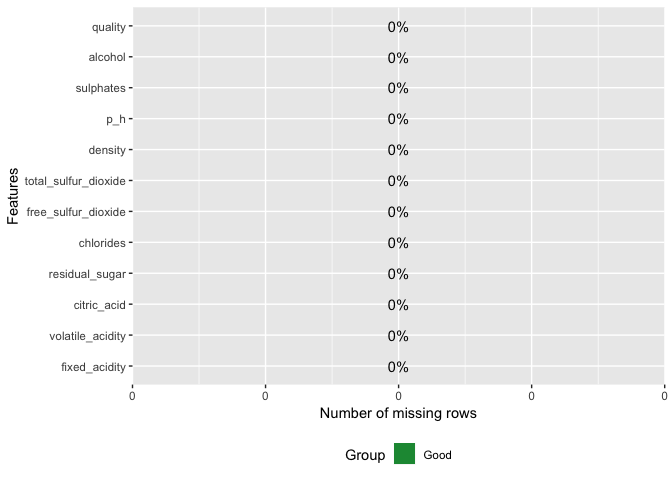
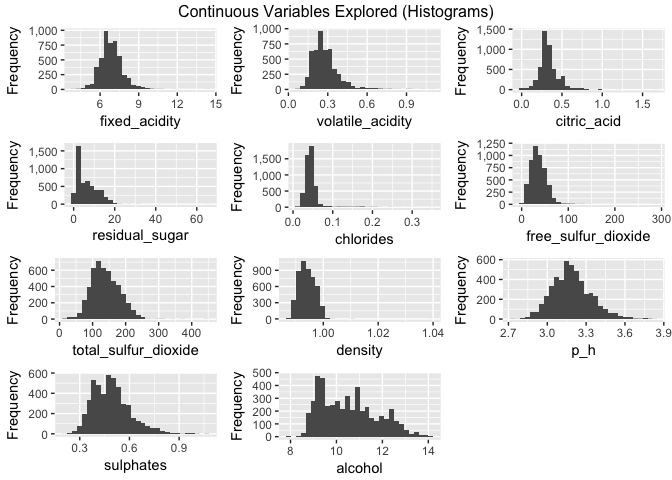
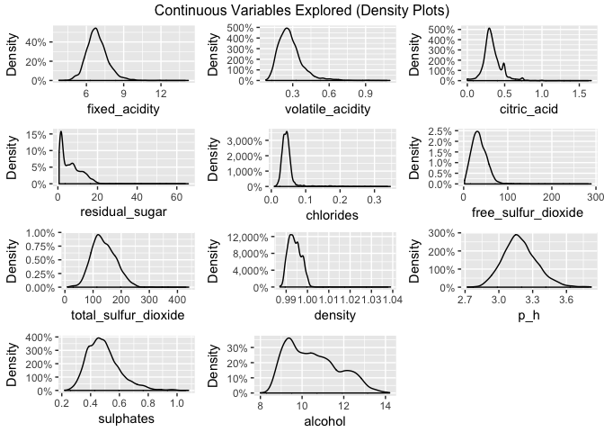
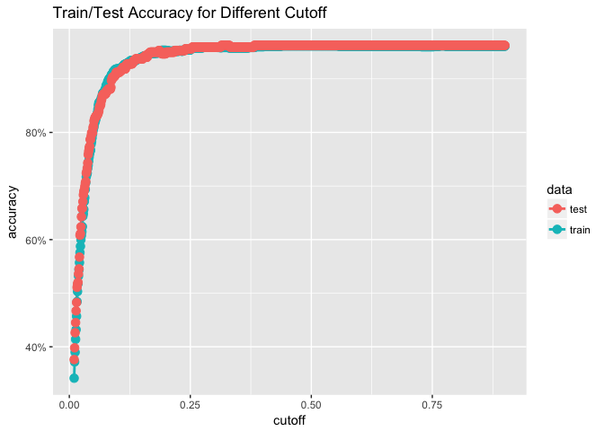
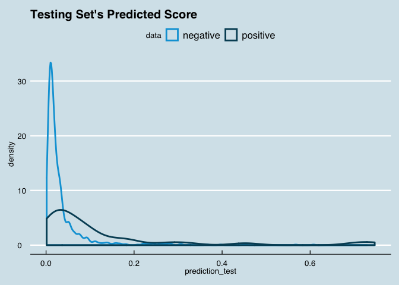
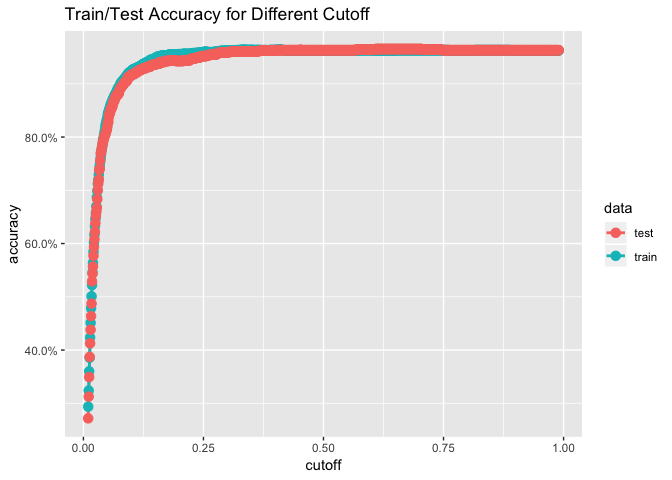
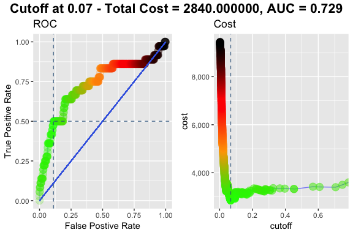
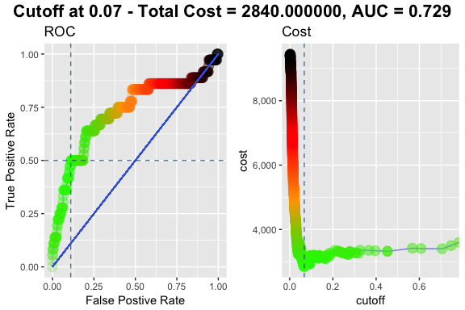
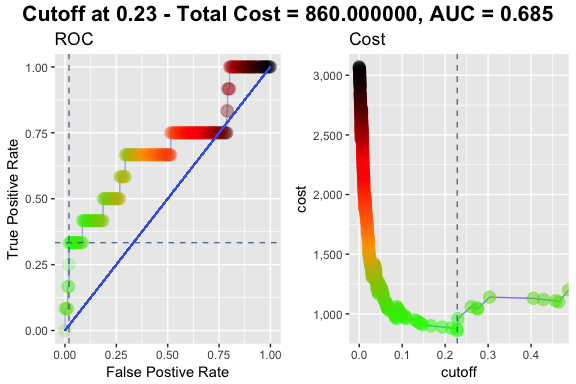
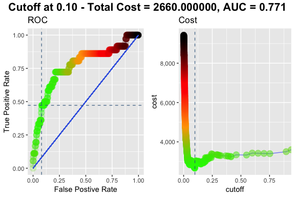

Logistic Regression in R
================
Paul Jeffries
07 February, 2019

-   [Introduction](#introduction)
    -   [Setup](#setup)
-   [Importing, Exploring, Cleaning, Normalizing / Centering, and Prepping the Data](#importing-exploring-cleaning-normalizing-centering-and-prepping-the-data)
    -   [Importing the Data](#importing-the-data)
    -   [Exploring and Cleaning the Data](#exploring-and-cleaning-the-data)
    -   [Centering and Normalizing the Data](#centering-and-normalizing-the-data)
    -   [Checking for Variable Correlations](#checking-for-variable-correlations)
    -   [Prepping Data for the Modeling Process](#prepping-data-for-the-modeling-process)
-   [Building a Basic Logit](#building-a-basic-logit)
    -   [Estimating the Model](#estimating-the-model)
    -   [First Look at Model Predictions for Simple Logit](#first-look-at-model-predictions-for-simple-logit)
    -   [Determining What Classification Cutoff is Appropriate (Simple Logit)](#determining-what-classification-cutoff-is-appropriate-simple-logit)
    -   [Examining Model Performance for the Simple Logit](#examining-model-performance-for-the-simple-logit)
    -   [Documenting Performance of Simple Logit Model](#documenting-performance-of-simple-logit-model)
-   [Penalized Logistic Regression (Lasso)](#penalized-logistic-regression-lasso)
    -   [Notes and Warning on Model Matrix Construction and Dummy Variables](#notes-and-warning-on-model-matrix-construction-and-dummy-variables)
    -   [Alternative Methods of Variable Selection](#alternative-methods-of-variable-selection)
    -   [Tuning the Hyperparameter for the Lasso Model w/ 2-Way Interactions and Polynomial Terms](#tuning-the-hyperparameter-for-the-lasso-model-w-2-way-interactions-and-polynomial-terms)
    -   [Sampling Methodology Explored -- Upsampling](#sampling-methodology-explored----upsampling)
    -   [Building the Model Formula (Upsampled Lasso)](#building-the-model-formula-upsampled-lasso)
    -   [Documenting Performance of Upsample Lasso Model](#documenting-performance-of-upsample-lasso-model)
    -   [Sampling Methodology Explored -- DBSMOTE](#sampling-methodology-explored----dbsmote)
    -   [Building the Model Formula (DBSMOTE Lasso)](#building-the-model-formula-dbsmote-lasso)
    -   [Documenting Performance of DBSMOTE Lasso Model](#documenting-performance-of-dbsmote-lasso-model)
-   [Final Model Selection (Progress Thus Far)](#final-model-selection-progress-thus-far)
    -   [Trimming the Best Model Found Thus Far](#trimming-the-best-model-found-thus-far)
    -   [Checking Model Performance of Trimmed Final Lasso Model](#checking-model-performance-of-trimmed-final-lasso-model)
    -   [Documenting Performance of Trimmed Final Lasso Model](#documenting-performance-of-trimmed-final-lasso-model)
-   [Conclusions](#conclusions)
    -   [Summary of Chosen "Best" Model](#summary-of-chosen-best-model)

Introduction
============

Welcome! The purpose of this document is to demonstrate a variety of techniques that play an integral role in the construction of a logistic regression model--from data cleaning and exploration, all the way to the selection of a final model.

This project began as an extension of my study of the classifcation methods covered in the ISLR. From there, I wanted to find a public dataset that touched a domain that interested me, and that would present an intriguing classification problem. I stumbled onto [this academic paper by Cortez et al.](http://www3.dsi.uminho.pt/pcortez/wine5.pdf) while looking into support vector machines (SVMs), and was instantly intrigued. While their originally paper investigated methods of continous prediction, I sought to reshape the problem as a one of binary classification. More specifically, as someone who generally enjoys wine, I sought to create a model that could classify low-quality wines (so that I know which features are red flags to be avoided when picking out wine).

While the code is extensively commented, with additional explanatory notes along the way, should you have any questions at all, feel free to reach out via the "Issues" tab for this repository. I answer all questions expeditiously.

Setup
-----

``` r
# first a few general set-up items / housekeeping items

# setting the appropriate working directory
knitr::opts_knit$set(root.dir = '/Users/pauljeffries/Desktop/personal/personal_code/data-science-toolkit-master/classification')

# setting scipen options to kill all use of scientific notation
options(scipen = 999)

# basic packages needed throughout
library(dplyr) # for piping
library(ggplot2) # for visualization
library(ggthemes) # for custom visualization
library(broom) # needing for tidying model summary output into a df
```

Importing, Exploring, Cleaning, Normalizing / Centering, and Prepping the Data
==============================================================================

Importing the Data
------------------

-   Data taken from: <https://archive.ics.uci.edu/ml/machine-learning-databases/wine-quality/>
-   Explanation of the meaning / origin of the data can be found in this academic paper here: <http://www3.dsi.uminho.pt/pcortez/wine5.pdf>
-   Additional explanation of the data and corresponding Kaggle page: <https://www.kaggle.com/uciml/red-wine-quality-cortez-et-al-2009>

``` r
# I have both red and white wine datasets with the same variables 
# only nuance of note below is that the csvs are annoyingly semi-colon delimited, so I specifiy the sep. 
base_red <- read.csv("data/winequality-red.csv",sep=";")
base_white <- read.csv("data/winequality-white.csv",sep=";")

# lots of useful information about the datasets
glimpse(base_red) 
```

    ## Observations: 1,599
    ## Variables: 12
    ## $ fixed.acidity        <dbl> 7.4, 7.8, 7.8, 11.2, 7.4, 7.4, 7.9, 7.3, 7.…
    ## $ volatile.acidity     <dbl> 0.700, 0.880, 0.760, 0.280, 0.700, 0.660, 0…
    ## $ citric.acid          <dbl> 0.00, 0.00, 0.04, 0.56, 0.00, 0.00, 0.06, 0…
    ## $ residual.sugar       <dbl> 1.9, 2.6, 2.3, 1.9, 1.9, 1.8, 1.6, 1.2, 2.0…
    ## $ chlorides            <dbl> 0.076, 0.098, 0.092, 0.075, 0.076, 0.075, 0…
    ## $ free.sulfur.dioxide  <dbl> 11, 25, 15, 17, 11, 13, 15, 15, 9, 17, 15, …
    ## $ total.sulfur.dioxide <dbl> 34, 67, 54, 60, 34, 40, 59, 21, 18, 102, 65…
    ## $ density              <dbl> 0.9978, 0.9968, 0.9970, 0.9980, 0.9978, 0.9…
    ## $ pH                   <dbl> 3.51, 3.20, 3.26, 3.16, 3.51, 3.51, 3.30, 3…
    ## $ sulphates            <dbl> 0.56, 0.68, 0.65, 0.58, 0.56, 0.56, 0.46, 0…
    ## $ alcohol              <dbl> 9.4, 9.8, 9.8, 9.8, 9.4, 9.4, 9.4, 10.0, 9.…
    ## $ quality              <int> 5, 5, 5, 6, 5, 5, 5, 7, 7, 5, 5, 5, 5, 5, 5…

``` r
glimpse(base_white) 
```

    ## Observations: 4,898
    ## Variables: 12
    ## $ fixed.acidity        <dbl> 7.0, 6.3, 8.1, 7.2, 7.2, 8.1, 6.2, 7.0, 6.3…
    ## $ volatile.acidity     <dbl> 0.27, 0.30, 0.28, 0.23, 0.23, 0.28, 0.32, 0…
    ## $ citric.acid          <dbl> 0.36, 0.34, 0.40, 0.32, 0.32, 0.40, 0.16, 0…
    ## $ residual.sugar       <dbl> 20.70, 1.60, 6.90, 8.50, 8.50, 6.90, 7.00, …
    ## $ chlorides            <dbl> 0.045, 0.049, 0.050, 0.058, 0.058, 0.050, 0…
    ## $ free.sulfur.dioxide  <dbl> 45, 14, 30, 47, 47, 30, 30, 45, 14, 28, 11,…
    ## $ total.sulfur.dioxide <dbl> 170, 132, 97, 186, 186, 97, 136, 170, 132, …
    ## $ density              <dbl> 1.0010, 0.9940, 0.9951, 0.9956, 0.9956, 0.9…
    ## $ pH                   <dbl> 3.00, 3.30, 3.26, 3.19, 3.19, 3.26, 3.18, 3…
    ## $ sulphates            <dbl> 0.45, 0.49, 0.44, 0.40, 0.40, 0.44, 0.47, 0…
    ## $ alcohol              <dbl> 8.8, 9.5, 10.1, 9.9, 9.9, 10.1, 9.6, 8.8, 9…
    ## $ quality              <int> 6, 6, 6, 6, 6, 6, 6, 6, 6, 6, 5, 5, 5, 7, 5…

Aftering glimpsing at the data, I can see that the datasets both have the same variables, but the red wine dataset has notably fewer observations. As I'll explain shortly, I don't actually need the red wine dataset; however, I'll show how one would go about cleaning and combining both for educational purposes.

``` r
# given that the two datasets all have the same variables, we'll add a color variable to each and then combine

base_red <- base_red %>%
  mutate(color = "red")

base_white <- base_white %>%
  mutate(color = "white")

# combining the two data frames into one master df
main_wine_df <- bind_rows(base_red, base_white)

# viewing the newly combined data frame
glimpse(main_wine_df)
```

    ## Observations: 6,497
    ## Variables: 13
    ## $ fixed.acidity        <dbl> 7.4, 7.8, 7.8, 11.2, 7.4, 7.4, 7.9, 7.3, 7.…
    ## $ volatile.acidity     <dbl> 0.700, 0.880, 0.760, 0.280, 0.700, 0.660, 0…
    ## $ citric.acid          <dbl> 0.00, 0.00, 0.04, 0.56, 0.00, 0.00, 0.06, 0…
    ## $ residual.sugar       <dbl> 1.9, 2.6, 2.3, 1.9, 1.9, 1.8, 1.6, 1.2, 2.0…
    ## $ chlorides            <dbl> 0.076, 0.098, 0.092, 0.075, 0.076, 0.075, 0…
    ## $ free.sulfur.dioxide  <dbl> 11, 25, 15, 17, 11, 13, 15, 15, 9, 17, 15, …
    ## $ total.sulfur.dioxide <dbl> 34, 67, 54, 60, 34, 40, 59, 21, 18, 102, 65…
    ## $ density              <dbl> 0.9978, 0.9968, 0.9970, 0.9980, 0.9978, 0.9…
    ## $ pH                   <dbl> 3.51, 3.20, 3.26, 3.16, 3.51, 3.51, 3.30, 3…
    ## $ sulphates            <dbl> 0.56, 0.68, 0.65, 0.58, 0.56, 0.56, 0.46, 0…
    ## $ alcohol              <dbl> 9.4, 9.8, 9.8, 9.8, 9.4, 9.4, 9.4, 10.0, 9.…
    ## $ quality              <int> 5, 5, 5, 6, 5, 5, 5, 7, 7, 5, 5, 5, 5, 5, 5…
    ## $ color                <chr> "red", "red", "red", "red", "red", "red", "…

``` r
library(janitor) # for data cleaning and tabular exploration
# documentation: https://github.com/sfirke/janitor

# first we'll do some mandatory / precautionary cleaning
# tidying variable names and dropping any useless rows / columns

main_wine_df <- main_wine_df %>%
  # converts to underscore case and cleans up column names
  janitor::clean_names() %>% 
  # drops all rows and columns that are entirely empty
  janitor::remove_empty(which = c("rows","cols")) 
```

In this preliminary analysis, I will build a model only for white wine. The reason for this is entirely arbitrary--I personally love most red wine, and the only wine I have ever absolutely despised was white. As such, for my own intellectual curriosity I wanted to create a model that classifies the lowest quality white wine specifically, with an eye towards better understanding the characteristics of the worst white wine in order to avoid them altogether.

``` r
# I am going to create a dataset of just the white wine
white_main_df <- main_wine_df %>%
  # filtering to just the white wine
  filter(color == "white") %>%
  # dropping the now-useless variable for color
  select(-color) %>%
  # ensuring quality is a factor; this will be useful later
  # as a rule of thumb, it's good to factor any non-numeric variables when glm modeling
  mutate(quality = factor(quality))

# examining the newly created dataset
glimpse(white_main_df)
```

    ## Observations: 4,898
    ## Variables: 12
    ## $ fixed_acidity        <dbl> 7.0, 6.3, 8.1, 7.2, 7.2, 8.1, 6.2, 7.0, 6.3…
    ## $ volatile_acidity     <dbl> 0.27, 0.30, 0.28, 0.23, 0.23, 0.28, 0.32, 0…
    ## $ citric_acid          <dbl> 0.36, 0.34, 0.40, 0.32, 0.32, 0.40, 0.16, 0…
    ## $ residual_sugar       <dbl> 20.70, 1.60, 6.90, 8.50, 8.50, 6.90, 7.00, …
    ## $ chlorides            <dbl> 0.045, 0.049, 0.050, 0.058, 0.058, 0.050, 0…
    ## $ free_sulfur_dioxide  <dbl> 45, 14, 30, 47, 47, 30, 30, 45, 14, 28, 11,…
    ## $ total_sulfur_dioxide <dbl> 170, 132, 97, 186, 186, 97, 136, 170, 132, …
    ## $ density              <dbl> 1.0010, 0.9940, 0.9951, 0.9956, 0.9956, 0.9…
    ## $ p_h                  <dbl> 3.00, 3.30, 3.26, 3.19, 3.19, 3.26, 3.18, 3…
    ## $ sulphates            <dbl> 0.45, 0.49, 0.44, 0.40, 0.40, 0.44, 0.47, 0…
    ## $ alcohol              <dbl> 8.8, 9.5, 10.1, 9.9, 9.9, 10.1, 9.6, 8.8, 9…
    ## $ quality              <fct> 6, 6, 6, 6, 6, 6, 6, 6, 6, 6, 5, 5, 5, 7, 5…

Exploring and Cleaning the Data
-------------------------------

``` r
# Even though we dropped any rows / cols that are entirely null, we need to check for NA problems
library(DataExplorer) # allows for creation of missing values map
# documentation for DataExplorer: https://towardsdatascience.com/simple-fast-exploratory-data-analysis-in-r-with-dataexplorer-package-e055348d9619
DataExplorer::plot_missing(white_main_df) # shows % of NAs within each variable
```


Good news at this point is this dataset looks perfectly clean of nulls! If there were any problems with nulls, I would solve it using complete.cases() or something similar.

### Continous Variables Exploration

Below I'll demonstrate the DataExplorer function for both histogram and density chart plot creation for all continuous variables; they present similar information but both are shown for the sake of demonstration.

``` r
# high-level univariate variable-exploration
# first a histogram of all continuous variables in the dataset
DataExplorer::plot_histogram(data = white_main_df, title = "Continuous Variables Explored (Histograms)")
```



``` r
# then a density chart of all continous variables in the dataset
DataExplorer::plot_density(data = white_main_df, title = "Continuous Variables Explored (Density Plots)")
```



### Categorical Variable Exploration

``` r
# the only categorical variable in our data in this case is what we'll use to create our low quality flag
# if we had many categorical variables, it would make sense to use order_bar = TRUE
# the order would then be in descending order of prevalence, which is helpful at a glance
plot_bar(data = white_main_df, order_bar = FALSE, title = "Categorical Variables Explored")
```



Here we can see that the quality of these wines are rougly normally distirbuted, with the most common quality score being 6, and very few scores coming in &lt;= 4 or &gt;= 8.

``` r
# and then we can use janitor to see the exact cross-tab of our quality variable
# this function below is, in my opinion, and better version of the base table function
janitor::tabyl(white_main_df$quality) %>%
  # tidys them up with some helpful functions from janitor
  janitor::adorn_pct_formatting()
```

    ##  white_main_df$quality    n percent
    ##                      3   20    0.4%
    ##                      4  163    3.3%
    ##                      5 1457   29.7%
    ##                      6 2198   44.9%
    ##                      7  880   18.0%
    ##                      8  175    3.6%
    ##                      9    5    0.1%

It looks like wines with a rating &lt; 5 are exceptionally bad, so we'll use that as our benchmark. All together wines with a rating below 5 represent under 4% of the population--so we'll be dealing with a low incidence binary outcome left-hand side variable in this particular modeling scenario.

### Outcome Variable Creation

``` r
# given the above analysis, we'll flag anything with a quality rating < 5 as low-quality 
white_final_df <- white_main_df %>%
  # type conversion here can be tricky because to de-factor requires multiple steps
  # we have to de-factor, perform the logical test on the numeric, and then re-factor
  mutate(low_qual_flag = factor(ifelse(as.numeric(as.character(quality)) < 5,1,0))) %>%
  # drop quality which is now a useless variable given that we have our binary flag
  # this will also avoid perfect segmentation errors later on in the modeling process
  select(-quality)

glimpse(white_final_df) # taking another look at the new dataset
```

    ## Observations: 4,898
    ## Variables: 12
    ## $ fixed_acidity        <dbl> 7.0, 6.3, 8.1, 7.2, 7.2, 8.1, 6.2, 7.0, 6.3…
    ## $ volatile_acidity     <dbl> 0.27, 0.30, 0.28, 0.23, 0.23, 0.28, 0.32, 0…
    ## $ citric_acid          <dbl> 0.36, 0.34, 0.40, 0.32, 0.32, 0.40, 0.16, 0…
    ## $ residual_sugar       <dbl> 20.70, 1.60, 6.90, 8.50, 8.50, 6.90, 7.00, …
    ## $ chlorides            <dbl> 0.045, 0.049, 0.050, 0.058, 0.058, 0.050, 0…
    ## $ free_sulfur_dioxide  <dbl> 45, 14, 30, 47, 47, 30, 30, 45, 14, 28, 11,…
    ## $ total_sulfur_dioxide <dbl> 170, 132, 97, 186, 186, 97, 136, 170, 132, …
    ## $ density              <dbl> 1.0010, 0.9940, 0.9951, 0.9956, 0.9956, 0.9…
    ## $ p_h                  <dbl> 3.00, 3.30, 3.26, 3.19, 3.19, 3.26, 3.18, 3…
    ## $ sulphates            <dbl> 0.45, 0.49, 0.44, 0.40, 0.40, 0.44, 0.47, 0…
    ## $ alcohol              <dbl> 8.8, 9.5, 10.1, 9.9, 9.9, 10.1, 9.6, 8.8, 9…
    ## $ low_qual_flag        <fct> 0, 0, 0, 0, 0, 0, 0, 0, 0, 0, 0, 0, 0, 0, 0…

``` r
# And now we'll take one final look at the distribution of our outcome variable
tabyl(white_final_df$low_qual_flag) %>%
  # tidys them up with some helpful functions from janitor
  janitor::adorn_pct_formatting()
```

    ##  white_final_df$low_qual_flag    n percent
    ##                             0 4715   96.3%
    ##                             1  183    3.7%

As can be seen above, a low quality white wine is a rare event, only occuring ~3.75% of the time.

Centering and Normalizing the Data
----------------------------------

For more information on when to center / normalize data, see below: - <https://stats.stackexchange.com/questions/29781/when-conducting-multiple-regression-when-should-you-center-your-predictor-varia> - tl;dr --&gt; center the data when you want your intercept term to represent your expectation when the model is fed the average for each variable in the model, as opposed to the model expectation when all variables == 0; normalize the data when the variable ranges differ markedly

``` r
# I'm going to scale and center all variables (except my left-hand side variable)
white_final_df[,-12] <- scale(white_final_df[,-12], center = TRUE, scale = TRUE)
glimpse(white_final_df)
```

    ## Observations: 4,898
    ## Variables: 12
    ## $ fixed_acidity        <dbl> 0.17207939, -0.65743400, 1.47560044, 0.4090…
    ## $ volatile_acidity     <dbl> -0.08176155, 0.21587359, 0.01745016, -0.478…
    ## $ citric_acid          <dbl> 0.21325843, 0.04799622, 0.54378284, -0.1172…
    ## $ residual_sugar       <dbl> 2.8210611, -0.9446688, 0.1002720, 0.4157258…
    ## $ chlorides            <dbl> -0.03535139, 0.14773200, 0.19350284, 0.5596…
    ## $ free_sulfur_dioxide  <dbl> 0.56987339, -1.25289074, -0.31210925, 0.687…
    ## $ total_sulfur_dioxide <dbl> 0.74448902, -0.14966934, -0.97323626, 1.120…
    ## $ density              <dbl> 2.331273996, -0.009153237, 0.358628185, 0.5…
    ## $ p_h                  <dbl> -1.24679399, 0.73995309, 0.47505348, 0.0114…
    ## $ sulphates            <dbl> -0.34914861, 0.00134171, -0.43677119, -0.78…
    ## $ alcohol              <dbl> -1.39301024, -0.82419153, -0.33663264, -0.4…
    ## $ low_qual_flag        <fct> 0, 0, 0, 0, 0, 0, 0, 0, 0, 0, 0, 0, 0, 0, 0…

Checking for Variable Correlations
----------------------------------

For more on all the cool varieties of correlation plots that can be created, see below: - <https://cran.r-project.org/web/packages/corrplot/vignettes/corrplot-intro.html>

``` r
# package needed for all varieties of correlation plots
library(corrplot)
```

``` r
# building a correlation matrix and ensuring that it only takes in variables that are numeric 
# this is necessary because if there are any non-numeric elements in the matrix, this will break 
corr_matrix <- cor(white_final_df[, sapply(white_final_df, is.numeric)])

# getting the matrix of p-values that correspond to the strength of correlation for each pairing
res1 <- cor.mtest(white_final_df[, sapply(white_final_df, is.numeric)], conf.level = .95)

# first I'll build a correlation plot that checks for significance level
# this one will also give me a hint at strength of correlation based on the colors 
corrplot(corr_matrix, p.mat = res1$p, method = "color", type = "upper",
         sig.level = c(.001, .01, .05), pch.cex = .9,
         insig = "label_sig", pch.col = "black", order = "AOE", na.label = "NA")
```



``` r
# and finally I'll build a simpler corrplot to get the strength of correlation numbers visualized
corrplot(corr_matrix, method = "number", type = "upper", pch.cex = .9,
         order = "AOE", number.cex = .7, na.label = "NA")
```


Takeways from these types of exploratory techniques can help us to create a more informed model. We may, depending on the circumstances, treat variables differently in our model-building process as a result of these types of charts. For example, we might discover a great degree of cross-correlation that allows us to delete duplicative variables, etc. We can notice a few interesting trends from our results above in this case:

Residual sugar and density are highly positively correlated, while alcohol and density are highly negatively correlated. These correlations are also significant. While most of these are intuitive, we might do well to remember these cross-correlations when it comes time to do dimensionality reduction with this model (if necessary). All in all, it seems as though there are a few interesting relationships to be explored here, but nothing that appears concerning from the perspective of very high degree of multicolinearity.

Prepping Data for the Modeling Process
--------------------------------------

``` r
# split the data into training and testing sets
library(caret) # needed for createDataPartition function and other model-building staples
```

``` r
# Partition data: 80 / 20 split : train / test (standard)
# set seed to ensure reproducibility
set.seed(777)

# create partition to be used to split data into two sets
in_train <- caret::createDataPartition(y=white_final_df$low_qual_flag, p=0.80, list=FALSE)

# splits the data into training and testing sets
training <- white_final_df[in_train,]
testing <- white_final_df[-in_train,]

# shows the row count and column count of the training and test sets, to check that all worked as planned
dim(training)
```

    ## [1] 3919   12

``` r
dim(testing)
```

    ## [1] 979  12

Building a Basic Logit
======================

Now we'll get to the main attraction--the model-building itself. We'll start with a simple logit that includes all possible variables, and then use a few fancier techniques to look into interactions / polynomial terms, ultimately trimming down to a model that balances predicitve power with interpretability to the extent that suits our needs.

Estimating the Model
--------------------

``` r
# simple logistic regression
# models using all variables in the training dataset (hence ~ .)
simple_logit_fit <- glm(low_qual_flag ~ .,
                 data = training,
                 family = binomial)

summary(simple_logit_fit)
```

    ## 
    ## Call:
    ## glm(formula = low_qual_flag ~ ., family = binomial, data = training)
    ## 
    ## Deviance Residuals: 
    ##     Min       1Q   Median       3Q      Max  
    ## -1.8387  -0.2603  -0.1841  -0.1334   4.0915  
    ## 
    ## Coefficients:
    ##                      Estimate Std. Error z value             Pr(>|z|)    
    ## (Intercept)          -3.86720    0.12352 -31.308 < 0.0000000000000002 ***
    ## fixed_acidity         0.29099    0.10881   2.674              0.00749 ** 
    ## volatile_acidity      0.63663    0.07207   8.834 < 0.0000000000000002 ***
    ## citric_acid          -0.16949    0.09671  -1.753              0.07968 .  
    ## residual_sugar       -1.12102    0.24831  -4.515           0.00000634 ***
    ## chlorides             0.02198    0.07398   0.297              0.76642    
    ## free_sulfur_dioxide  -0.26507    0.13405  -1.977              0.04799 *  
    ## total_sulfur_dioxide -0.10961    0.12136  -0.903              0.36642    
    ## density               0.88345    0.28104   3.144              0.00167 ** 
    ## p_h                   0.05183    0.11864   0.437              0.66220    
    ## sulphates            -0.08620    0.10351  -0.833              0.40501    
    ## alcohol              -0.27069    0.16757  -1.615              0.10624    
    ## ---
    ## Signif. codes:  0 '***' 0.001 '**' 0.01 '*' 0.05 '.' 0.1 ' ' 1
    ## 
    ## (Dispersion parameter for binomial family taken to be 1)
    ## 
    ##     Null deviance: 1253.7  on 3918  degrees of freedom
    ## Residual deviance: 1017.7  on 3907  degrees of freedom
    ## AIC: 1041.7
    ## 
    ## Number of Fisher Scoring iterations: 7

First Look at Model Predictions for Simple Logit
------------------------------------------------

``` r
# first we'll examine what sort of predictions the model would make when fed the training set
# then we'll repeat this with the testing set (which we should care a bit more about)
# then we'll observe the distribution of model-output probabilities to look for interesting trends

# run predictions on training set
prediction_train <- predict(simple_logit_fit, newdata = training, type = "response" )
predictions_train_full <- data.frame(prediction = prediction_train, low_qual_flag = training$low_qual_flag)

# run predictions on testing set
prediction_test <- predict(simple_logit_fit, newdata = testing, type = "response" )
predictions_test_full <- data.frame(prediction = prediction_test, low_qual_flag = testing$low_qual_flag)

# distribution of the prediction score grouped by known outcome (for training set only)
ggplot(predictions_train_full, aes(prediction_train, color = as.factor(training$low_qual_flag) ) ) + 
geom_density( size = 1 ) +
ggtitle( "Training Set's Predicted Score" ) + 
scale_color_economist( name = "data", labels = c( "negative", "positive" ) ) + 
theme_economist()
```


``` r
# distribution of the prediction score grouped by known outcome (for testing set only)
ggplot(predictions_test_full, aes(prediction_test, color = as.factor(testing$low_qual_flag) ) ) + 
geom_density( size = 1 ) +
ggtitle( "Testing Set's Predicted Score" ) + 
scale_color_economist( name = "data", labels = c( "negative", "positive" ) ) + 
theme_economist()
```



Determining What Classification Cutoff is Appropriate (Simple Logit)
--------------------------------------------------------------------

When actually using a logit to make classification predictions, the model does not simply output a 1/0 for each case it is fed; it assigns a probability. As such, we have to determine the threshold (or cutoff) above which probability we will classify a particular case as a 1 vs a 0. In this case more specifically, the cutoff is the model-assigned probabilty above which a particular wine will be classifed as low-quality.

In the coming sections, we'll look into some more helpful functions and techniques that assist in the selection of this cutoff. The norm one might expect is to use 50% as a cutoff, but this is a blunt methodology that suits few models well. One more intelligent rule-of-thumb is to select the population prevalence of the variable of interest and use that as the cutoff (i.e. if 4% of our wines are low quality, 4% should be the cutoff). This works as an effective rule of thumb, but as we'll see, there are more empirically-sound techniques that take into consideration the goals / priorities specific to the modeling problem at hand.

``` r
# some custom functions are sourced in, to reduce this document's length
# the majority of these functions are from ethen8181's GitHub, with edits / improvements I added
# more info on these custom functions here: http://ethen8181.github.io/machine-learning/unbalanced/unbalanced.html

# sourcing my adopted version of the aforementioned functions directly from my GitHub
library(RCurl) # Provides functions to allow one to compose general HTTP requests, etc. in R
```

``` r
# grabbing the raw info from my GitHub to turn into a text object
script <- getURL("https://raw.githubusercontent.com/pmaji/r-stats-and-modeling/master/classification/useful_classification_functions.R", ssl.verifypeer = FALSE)
# sourcing that code just like you might source an R Script locally
eval(parse(text = script))
```

``` r
# using newly-sourced function AccuracyCutoffInfo to test for optimal cutoff visually
accuracy_info <- AccuracyCutoffInfo(train = predictions_train_full, 
                                    test = predictions_test_full, 
                                    predict = "prediction", 
                                    actual = "low_qual_flag",
                                    # iterates over every cutoff value from 1% to 99% 
                                    # steps in units of 10 bps
                                    cut_val_start = 0.01,
                                    cut_val_end = 0.99,
                                    by_step_size = 0.001)

# from the plot below we can begin to eyeball what the optimal cutoff might be 
accuracy_info$plot
```



From the chart above we can begin to see where the optimal cutoff may be. That said, the metric we are using above is overall model accuracy. Next, we'll dive into some methods that make more sense when we are targetting a particular type of accuracy. For example, maybe we care more about catching every possible bad white wine, even at the risk of misclassifying a massive number of good wines. With the functions below, these model optimization tradeoffs become easier to control and visualize. They will vary according to the question at hand.

``` r
# Moving on to using receiver operating characteristic (ROC) Curves to pinpoint optimal cutoffs

# user-defined costs for false negative and false positive to pinpoint where total cost is minimized
cost_fp <- 10 # cost of false positive
cost_fn <- 100 # cost of false negative
# here the assumption I've made is that a false positive is 1/10th as costly as a false negative
# in other words, I prioritize catching the bad wines much more than I care about throwing out good ones

# creates the base data needed to visualize the ROC curves
roc_info <- ROCInfo(data = predictions_test_full, 
                    predict = "prediction", 
                    actual = "low_qual_flag", 
                    cost.fp = cost_fp, 
                    cost.fn = cost_fn )
```

### ROC Curve for Simple Logit

``` r
# plot the roc / cutoff-selection plots
# color on the chart is cost -- darker is higher cost / greener is lower cost
grid.draw(roc_info$plot)
```



It looks like, for the Simple Logit, the optimal cutoff is 0.07.

Examining Model Performance for the Simple Logit
------------------------------------------------

``` r
# visualize a particular cutoff's effectiveness at classification
cm_info <- ConfusionMatrixInfo(data = predictions_test_full, 
                               predict = "prediction", 
                               actual = "low_qual_flag", 
                               cutoff = .07) # (determined by roc_info$plot above)

# prints the visualization of the confusion matrix (use print(cm_info$data) to see the raw data)
cm_info$plot
```


Lastly, we'll use the cutoff we have arrived at from the work above to test the model's predictions; think of this section as the cross-tab version of the confusion matrix plot shown above.

``` r
# getting model probabilities for our testing set
simple_logit_fit_probs <- predict(simple_logit_fit,
                           newdata = testing,
                           type = "response")

# turning these probabilities into classifications using the cutoff determined above 
simple_logit_fit_predictions <- factor(ifelse(simple_logit_fit_probs > 0.07, 1, 0),levels=c('0','1'))

# builiding a confusion matrix 
simple_logit_conmatrix <- caret::confusionMatrix(simple_logit_fit_predictions,testing$low_qual_flag, positive='1')
simple_logit_conmatrix
```

    ## Confusion Matrix and Statistics
    ## 
    ##           Reference
    ## Prediction   0   1
    ##          0 843  19
    ##          1 100  17
    ##                                             
    ##                Accuracy : 0.8784            
    ##                  95% CI : (0.8563, 0.8983)  
    ##     No Information Rate : 0.9632            
    ##     P-Value [Acc > NIR] : 1                 
    ##                                             
    ##                   Kappa : 0.1759            
    ##  Mcnemar's Test P-Value : 0.0000000000002241
    ##                                             
    ##             Sensitivity : 0.47222           
    ##             Specificity : 0.89396           
    ##          Pos Pred Value : 0.14530           
    ##          Neg Pred Value : 0.97796           
    ##              Prevalence : 0.03677           
    ##          Detection Rate : 0.01736           
    ##    Detection Prevalence : 0.11951           
    ##       Balanced Accuracy : 0.68309           
    ##                                             
    ##        'Positive' Class : 1                 
    ## 

Documenting Performance of Simple Logit Model
---------------------------------------------

As we create different models over the course of this project, we'll want to keep track of how they perform, along with other details for comparison. To help with this, we'll store a few key pieces of information for every model we building: its name, chosen classificatoin cutoff, sensitity (the % of true positives the model successfully classifies), specificity (the % of true negatives the model successfully classifies), number of model terms, and total cost. These pieces of information will all be helpful later on when picking which model we want to go with, as we may want to pick the simplest model (i.e. fewest terms), or the the model that is best at classifying true positives, etc. etc.

``` r
# creating a blank table to record a running set of performance metrics for each model we create
running_model_synopsis_table <- data.frame(
  model_name = character(),
  classification_cutoff = numeric(),
  auc = numeric(),
  sensitivity=character(), 
  specificity=character(), 
  number_of_model_terms=numeric(),
  total_cost = numeric(),
  stringsAsFactors=FALSE
  )

simple_logit_synopsis_info <- data.frame(
  model_name = "Simple Logit (All Vars.)",
  classification_cutoff = roc_info$cutoff,
  auc = roc_info$auc,
  sensitivity = percent(roc_info$sensitivity), 
  specificity = percent(roc_info$specificity), 
  number_of_model_terms = (length(colnames(simple_logit_fit$qr$qr))-1),
  total_cost = roc_info$totalcost,
  stringsAsFactors=FALSE
  )

running_model_synopsis_table <- bind_rows(running_model_synopsis_table, simple_logit_synopsis_info)
running_model_synopsis_table
```

    ##                 model_name classification_cutoff     auc sensitivity
    ## 1 Simple Logit (All Vars.)            0.06734321 0.72885       50.0%
    ##   specificity number_of_model_terms total_cost
    ## 1       89.0%                    11       2840

Penalized Logistic Regression (Lasso)
=====================================

Now we'll move on to use a technique that makes use of an Objective Function that penalizes low-ROI variables. This is similar to ridge regression except variables with coefficients non-consequential enough will be zero'ed out of the model. For a broad introduction to penalized logistic regression in R, see [this useful source from STHDA](http://www.sthda.com/english/articles/36-classification-methods-essentials/149-penalized-logistic-regression-essentials-in-r-ridge-lasso-and-elastic-net/).

For a more piecemeal approach to learning about ridge regression methods--and lasso in particular--check out the selected links below:

-   [Stanford slides on ridge regression and lasso](http://statweb.stanford.edu/~tibs/sta305files/Rudyregularization.pdf)
-   [Helpful explanation with difference between ridge and lasso](https://codingstartups.com/practical-machine-learning-ridge-regression-vs-lasso/)
-   [Short and sweet tl;dr of lasso's utility](https://stats.stackexchange.com/questions/17251/what-is-the-lasso-in-regression-analysis)

Notes and Warning on Model Matrix Construction and Dummy Variables
------------------------------------------------------------------

The process by which one [creates a model matrix (as will be shown in the code below)](https://www.rdocumentation.org/packages/stats/versions/3.5.1/topics/model.matrix) when dealing with categorical variables is more complicated than what one needs to do if all features are numeric (as is our case here). The reason for this is that when modeling with categorical features, we must transform them such that they become numeric, otherwise our algorithms won't know how to model the data. The process by which this is taken care of is called [dummy variable creation](https://stats.stackexchange.com/questions/115049/why-do-we-need-to-dummy-code-categorical-variables). If you are unfamiliar with what this means, read up on this prior to proceeding to read the rest of this sub-section.

As part of the dummy variable creation process, it is important to remember that if your categorical variable can take on *n* possible values, you must create *n-1* dummy variables. There are many good explainers for why this is the case--[like this brief one here](http://www.algosome.com/articles/dummy-variable-trap-regression.html)--but I particularly like the [succinct explanation](https://www.quora.com/What-happens-to-the-regression-model-when-you-create-n-dummy-variables-instead-of-n-1-dummy-variables-for-an-n-level-categorical-variable) that using *n* dummy variables (instead of *n-1*) will make it so that "you will not be able to invert the [covariance matrix](https://www.quora.com/What-is-the-inverse-covariance-matrix-What-is-its-statistical-meaning)."

Finally, there are a few **quick tips** that I'd like to share given experiences in both R and Python. First, **[regularization](https://en.wikipedia.org/wiki/Regularization_(mathematics)) is never a robust suitable replacement for careful *n-1* dummy variable creation.** What I mean by this is that the fact that using a method like lasso for regularization will likely result in some variables' coefficients being dampenned to 0 does *not* allow us to include *n* dummy variables (in most cases). Second, it is key to note that **the method of arriving at *n-1* dummies in our model matrix is different in R than it is in Python.** As of the writing of this document, [scikit-learn](https://scikit-learn.org/stable/), for example, requires that we specify in our model matrix construction that we want to drop the 1st categorical value to arrive at *n-1* dummies; however, glmnet does not require a full-rank invertible matrix, and can do one-hot encoding.

**Glmnet is also just finicky in general.** Below are a few tricky details and general comments about the package that it pays to remember so that your code doesn't break, or worse yet, your code runs fine, but in reality it just returns wrong or misleading results.

-   L1 (lasso) -- alpha = 1 in glmnet -- is good at removing variables entirely
-   L2 (ridge) -- alpha = 0 in glmnet -- is good at dampening multicolinearity
-   any alpha slighlty below 1 might remove some variables entirely, but rarely
-   for more info on regularization, check out [Statistical Learning with Sparsity](https://web.stanford.edu/~hastie/StatLearnSparsity/)
-   you **need to center and scale all variables that go into glmnet** because otherwise the penalty will affect some variables more than others (yes this includes your dummy variables)
-   the output you get from glmnet can vary weirdly and sometimes unpredictably, so when you can, use the caret and recipes packages to help clean this up (more on this below)
-   usually values between 0 and 1 on the log 10 scale are good values for lambda (source on this is Max Kuhn, I don't have math to prove it but this is anecdotally true)
-   glmnet cannot handle zero-variance predictors (i.e. a binary flag with all 0s), which sometimes results when doing any sort of resampling or cross-validation. If this seems confusing, and you're worried about getting it all right / hunting for a better way, read the next subsection.

### The Best Way to Build Your Model Matrix and Dummy Variables?

As you can tell from above, building your model matrix, dummy variables, and just in general getting your pre-processing right can be very annoying; luckily, since I wrote all of this code, things have gotten better, in large part thanks to the [recipes package](https://tidymodels.github.io/recipes/). I don't integrate any of the functionalities of recipes in the code below (because I am writing this comment long after having first drafted all of this code), but I do intend on writing a newer vignette in the near future that focuses on linear regression using the recipes package. The main functionalities of the recipes package that fix the previously mentioned problems are called out below:

You should **always do your pre-processing (done via recipes) within each resample**, not the other way around. As one example of WHY this is the case, imagine scaling and centering a large dataset, then resampling from that dataset; the result is samples that are not centered and scaled appropriately, as they were centered on the mean of the full dataset, as opposed to the mean of the sample. The learning here is that the **standard model workflow should include 1st taking your sample, bootstrap, etc., and *then* running that sample through your preprocessing recipe**.

It is probably safest to create dummy variables with the [step\_dummy() step in recipes](https://tidymodels.github.io/recipes/reference/step_dummy.html), which, like model.matrix, by default **drops the first level of the factor to be dummified, rolling that into your intercept**. If, therefore, you wanted to pick what level of the factor to have rolled into the intercept, instead of its simply being the first level of the factor, you would simply re-order the level of your factored variable of interest (which could be done via a step\_mutate within a recipe) prior to dummifying the variables.

As part of your pre-processing recipe, we can easily solve the zero variance predictor problem by making use of the step\_zv() function, which drops any binary predictors that have zero variance. There is also a step\_nzv() function that does the same thing, but for low-variance predictors (i.e. not just 0 variance ones). If you want to collapse low-incidence variables together, like taking a handful of rare binary flags and combining them into a slightly more prevalent category, we use the step\_other() function. **It is best practice to run step\_zv() or your equivalent steps at the end of your pre-processing recipe**.

This thus solves that majority of our thornier questions when it comes to the nuances of pre-processing and model-pipeline-construction in R. If you have further specific questions about regression modeling strategies--like when you might want to cross-validate but not do a test/train split, for example--see [this excellent book on regression modeling strategies](http://biostat.mc.vanderbilt.edu/wiki/Main/RmS) by Frank Harrel. Also, the RStudio team does (as of early 2019) have plans for a package similar to scikit's pipeline object in Python that would do a lot of this for us, so stay tuned for that!

Alternative Methods of Variable Selection
-----------------------------------------

It is worth briefly noting that one often-taught method of variable-selection that I do not cover here is stepwise varaible selection, and this omission is entirely purposeful. While seemingly helpful in principle, it is almost never benefitial to make use of stepwise variable selection as opposed to ridge or other penalized methods. The reason for this is perhaps best made clear by [this research paper here.](https://besjournals.onlinelibrary.wiley.com/doi/full/10.1111/j.1365-2656.2006.01141.x)

Tuning the Hyperparameter for the Lasso Model w/ 2-Way Interactions and Polynomial Terms
----------------------------------------------------------------------------------------

The first step here is optmizing lamda--the hyperparameter of importance in a lasso regression. Given the nature of the cross-validation involved in a the hyperparameter optimization process, we need a dataset where the data aren't as scarce as they are in the main dataset. There are a variety of methods available to deal with this problem, including upsampling, downsampling, and a host of synthetic sampling methodologies that generally into categories abbreviated ROSE and SMOTE. For information on all varieties of synthetic sampling that exist, see the link below.

-   <https://cran.r-project.org/web/packages/smotefamily/smotefamily.pdf>

For the purpose of this project, we will estimate two lasso models: - One trained on data created via simple upsampling. - And one trained on data created via DBSMOTE--a dbscan-backed version of synthetic upsampling.

The reason for these two choices is that upsampling is the simplest method for this type of problem, and DBSMOTE is the fanciest synthetic data creation methodology that makes sense for this type of problem--so we're testing the two extremes of possible solutions to the data paucity problem.

Finally, it may be worth stating explicitly that my purpose of using the lasso method is to get an idea for what variables might be useful, and what variables might not be useful. As such, it makes sense to throw many variables at the lasso model to take full advantage of its capacity to weed out the noise. For this exercise, I will consider all of the following in each lasso model:

-   All single variable terms
-   All nth-degree polynomial terms (where n is bounded by 3; it seldom makes sense to go higher)
-   All unique two-direction interaction effects

After training the models using both aforementioned sampling methodologies, we will hopefully be able to glean some information in the end about what polynomial terms, interaction effects, or single variables appear most statistically powerful and thus worthy of consideration in the final model.

Sampling Methodology Explored -- Upsampling
-------------------------------------------

### Building the Upsampled Dataset

``` r
# creating new training dataset with upsampled low quality cases
upsample_training <- caret::upSample(training, (training$low_qual_flag))

# one downside of the upSample function is it creates a new left-hand side variable (class)
# as such, we have to do some minor clenaing
upsample_training <- upsample_training %>%
  select(-low_qual_flag) %>%
  dplyr::rename(`low_qual_flag` = `Class`)

# then we inspect the incidence rate of our left-hand-side variable in the new training set
# the result should now be a 50 / 50 split 
janitor::tabyl(upsample_training$low_qual_flag) %>%
  # tidys results up with some helpful functions from janitor
  janitor::adorn_pct_formatting() 
```

    ##  upsample_training$low_qual_flag    n percent
    ##                                0 3772   50.0%
    ##                                1 3772   50.0%

Building the Model Formula (Upsampled Lasso)
--------------------------------------------

The function outlined below is very helpful for formula creation for reasons that will become more obvious later on when we start trying to craft formulae based on outputs / datasets. GLM formulas are a tricky object type, but doing this kind of things saves us a lot of time and manual work typing out all model terms.

``` r
# first we get all variables with their corresponding degree polynomial into the model
# I'm also including here all two-way interaction effects
# in the code below, the integer in quotes determines the max nth degree polynomial to be tested
upsample_lasso_formula <- as.formula(
  paste('low_qual_flag ~', paste('poly(', colnames(upsample_training[-12]),',3)', collapse = ' + '), '+ .^2', '- .')
  )

# prints the formula so that we can see what will be used to create the logit
upsample_lasso_formula
```

    ## low_qual_flag ~ poly(fixed_acidity, 3) + poly(volatile_acidity, 
    ##     3) + poly(citric_acid, 3) + poly(residual_sugar, 3) + poly(chlorides, 
    ##     3) + poly(free_sulfur_dioxide, 3) + poly(total_sulfur_dioxide, 
    ##     3) + poly(density, 3) + poly(p_h, 3) + poly(sulphates, 3) + 
    ##     poly(alcohol, 3) + .^2 - .

### Building the Upsampled Model Matrix

``` r
# Then we build our model matrix (including all two-way interactions possible and polynomials up to 3rd degree)
x <- model.matrix(upsample_lasso_formula, upsample_training)
# calling out what the outcome variable should be explicitly used for this method
# this method of building an x and a y is simply popular style for working with model.matrix 
y <- upsample_training$low_qual_flag
```

### Tuning Lambda for Upsampled Logit

``` r
# we're turning results off here because sometimes the output gets out of hand 
library(glmnet) # package needed for ridge methods 
# Next we move on to find the best lambda using cross-validation
# Cross-validation is for tuning hyperparameters; not normally needed if model requires no hyperparameters
set.seed(777) # set seed for reproduciblity
# alpha = 1 just means lasso ; alpha = 0 is ridge
# this step below can take a long time, as the range of possible lambdas is simulated
cv.lasso <- cv.glmnet(x, y, alpha = 1, family = "binomial")
```

### Plotting Lambdas for Upsampled Logit

The ultimate goal with this hyperparameter-tuning exercise is to pick a lambda to ultimately be used in our lasso. Two common choices for lambda: lambda min and lambda lse (both are shown with dotted lines below, in turn). It's up to the modeler to decide which to choose in this case; simplicity / error-minimization tradeoff. We'll cover the details of how to make the call on this choice below.

``` r
# plots the various possible lambdas 
plot(cv.lasso)
```


The two common choices are shown visually with dotted lines, in turn: - Lambda Min (the value that minimizes the prediction error) - Lambda LSE (gives the simplest model but also lies within one SE of the optimal value of lambda)

### Examining the Resultant Coefficients (Upsampled Lasso)

The number of non-zero'ed out variables that you will get as the result of tuning your lambda for your particular lasso model can vary greatly from model-to-model, depending on a host of variables including your training dataset. Given that this is the first time the coefficient list has showed up in this document, we'll include both the lambda min coefficient list and the lamda lse coefficient list below, but thereafter will only use the one deemed most appropriate. This choice is left up the modeler and is balancing act between exhaustiveness and simplicity, in most cases.

### First the Coefficients for the Lambda Min Upsampled Lasso

``` r
# setting max-print from here on out because otherwise the model output gets crazy-long
options(max.print=25) # max print length set to 25

# lambda min is the value that minimizes the prediction error
# cv.lasso$lambda.min  # uncomment and call this if you wanted the raw lambda 

# showing coefficients using lambda min (if . then variable has been zero'ed out)
coef(cv.lasso, cv.lasso$lambda.min)
```

    ## 90 x 1 sparse Matrix of class "dgCMatrix"
    ##                                      1
    ## (Intercept)                  -2.831773
    ## (Intercept)                   .       
    ## poly(fixed_acidity, 3)1       6.021184
    ## poly(fixed_acidity, 3)2     -29.271714
    ## poly(fixed_acidity, 3)3      21.559470
    ## poly(volatile_acidity, 3)1   88.824860
    ## poly(volatile_acidity, 3)2    1.413877
    ## poly(volatile_acidity, 3)3   35.055051
    ## poly(citric_acid, 3)1        -7.116525
    ## poly(citric_acid, 3)2        35.277121
    ## poly(citric_acid, 3)3       -20.954007
    ## poly(residual_sugar, 3)1    -70.261442
    ## poly(residual_sugar, 3)2   -206.167165
    ## 
    ##  ..............................
    ##  ........suppressing rows in show(); maybe adjust 'options(max.print= *, width = *)'
    ##  ..............................
    ## 
    ##                                         1
    ## free_sulfur_dioxide:sulphates   0.4027229
    ## free_sulfur_dioxide:alcohol    -1.3255542
    ## total_sulfur_dioxide:density    0.2672052
    ## total_sulfur_dioxide:p_h        0.3500560
    ## total_sulfur_dioxide:sulphates  0.4461444
    ## total_sulfur_dioxide:alcohol   -0.4059122
    ## density:p_h                     0.5968800
    ## density:sulphates               1.6718871
    ## density:alcohol                -2.9007490
    ## p_h:sulphates                  -0.4598622
    ## p_h:alcohol                     0.1431797
    ## sulphates:alcohol               0.9436664

### Second the Coefficients for the Lambda LSE Upsampled Lasso

``` r
#cv.lasso$lambda.1se # uncomment and call this if you wanted the raw lambda 
# showing coefficients using lambda min (if . then variable has been zero'ed out)
coef(cv.lasso, cv.lasso$lambda.1se)
```

    ## 90 x 1 sparse Matrix of class "dgCMatrix"
    ##                                      1
    ## (Intercept)                 -0.5010227
    ## (Intercept)                  .        
    ## poly(fixed_acidity, 3)1     21.8233033
    ## poly(fixed_acidity, 3)2     -4.2289369
    ## poly(fixed_acidity, 3)3      5.9609609
    ## poly(volatile_acidity, 3)1  78.9314389
    ## poly(volatile_acidity, 3)2   .        
    ## poly(volatile_acidity, 3)3  27.3990600
    ## poly(citric_acid, 3)1       -5.6796910
    ## poly(citric_acid, 3)2       32.1831538
    ## poly(citric_acid, 3)3      -18.6586829
    ## poly(residual_sugar, 3)1   -40.7154675
    ## poly(residual_sugar, 3)2     .        
    ## 
    ##  ..............................
    ##  ........suppressing rows in show(); maybe adjust 'options(max.print= *, width = *)'
    ##  ..............................
    ## 
    ##                                           1
    ## free_sulfur_dioxide:sulphates   0.147836996
    ## free_sulfur_dioxide:alcohol    -0.829249037
    ## total_sulfur_dioxide:density    .          
    ## total_sulfur_dioxide:p_h        0.358809496
    ## total_sulfur_dioxide:sulphates  0.484912148
    ## total_sulfur_dioxide:alcohol   -0.476430412
    ## density:p_h                     .          
    ## density:sulphates               0.005845614
    ## density:alcohol                 .          
    ## p_h:sulphates                  -0.097822274
    ## p_h:alcohol                    -0.352265344
    ## sulphates:alcohol               0.030309660

``` r
# storing the coefficients for later use as we'll go with lambda lse as we want the simpler option
# this is based on a judgement call and my desire in this case for simplicity over predictive potential
upsample_lambda_coefs <- broom::tidy(coef(cv.lasso, cv.lasso$lambda.1se))
```

    ## Warning: 'tidy.dgCMatrix' is deprecated.
    ## See help("Deprecated")

    ## Warning: 'tidy.dgTMatrix' is deprecated.
    ## See help("Deprecated")

### Building the Upsampled Lasso Logit Formula Based on Coefficient List

``` r
# first we trim from the coefficient list to only the coefficients that weren't 0'ed out
upsample_coef_list <- upsample_lambda_coefs %>%
  # arrange the coefficients in descending order of absolute value
  arrange(desc(abs(value))) %>% 
  select(row) %>%
  # dropping the intercept which isn't needed in formula as it's added automatically
  filter(row != '(Intercept)') %>%
  as.data.frame()

# then we take this jumbled list and need to perform a few annoying operations to get it into a clean formula
# adding unique at the end because once we drop the polynomial number at the end, we'll have some dupes
clean_upsample_coef_list <- gsub(").*", ")", upsample_coef_list$row) %>% unique()

# the gsub above resolts in a clean character vector, but now we need to make it into a formula
result_upsample_lasso_formula <- as.formula(
  paste('low_qual_flag ~', paste(clean_upsample_coef_list, collapse = ' + '))
  )

# the final resulting formula is below
result_upsample_lasso_formula
```

    ## low_qual_flag ~ poly(free_sulfur_dioxide, 3) + poly(volatile_acidity, 
    ##     3) + poly(alcohol, 3) + poly(density, 3) + poly(residual_sugar, 
    ##     3) + poly(chlorides, 3) + poly(citric_acid, 3) + poly(total_sulfur_dioxide, 
    ##     3) + poly(fixed_acidity, 3) + poly(p_h, 3) + poly(sulphates, 
    ##     3) + residual_sugar:chlorides + free_sulfur_dioxide:alcohol + 
    ##     free_sulfur_dioxide:density + residual_sugar:density + total_sulfur_dioxide:sulphates + 
    ##     total_sulfur_dioxide:alcohol + fixed_acidity:density + residual_sugar:total_sulfur_dioxide + 
    ##     total_sulfur_dioxide:p_h + p_h:alcohol + fixed_acidity:chlorides + 
    ##     chlorides:total_sulfur_dioxide + residual_sugar:sulphates + 
    ##     citric_acid:total_sulfur_dioxide + citric_acid:density + 
    ##     fixed_acidity:free_sulfur_dioxide + volatile_acidity:residual_sugar + 
    ##     volatile_acidity:free_sulfur_dioxide + free_sulfur_dioxide:sulphates + 
    ##     fixed_acidity:alcohol + fixed_acidity:sulphates + volatile_acidity:chlorides + 
    ##     fixed_acidity:volatile_acidity + citric_acid:chlorides + 
    ##     chlorides:sulphates + volatile_acidity:sulphates + residual_sugar:free_sulfur_dioxide + 
    ##     p_h:sulphates + chlorides:alcohol + free_sulfur_dioxide:p_h + 
    ##     volatile_acidity:p_h + volatile_acidity:total_sulfur_dioxide + 
    ##     citric_acid:free_sulfur_dioxide + fixed_acidity:p_h + chlorides:p_h + 
    ##     residual_sugar:alcohol + sulphates:alcohol + citric_acid:alcohol + 
    ##     citric_acid:sulphates + fixed_acidity:citric_acid + density:sulphates + 
    ##     residual_sugar:p_h + citric_acid:p_h + fixed_acidity:residual_sugar

### Rebuilding Logit Based on Outcome of Upsample Lasso Selection Methodology

``` r
# rebuilt logit based on info gained from lasso; thanks to formula we can simply plug in the coef list from above
result_upsample_lasso_fit <- glm(result_upsample_lasso_formula,
                 data = training,
                 family = binomial)
```

``` r
summary(result_upsample_lasso_fit)
```

    ## 
    ## Call:
    ## glm(formula = result_upsample_lasso_formula, family = binomial, 
    ##     data = training)
    ## 
    ## Deviance Residuals: 
    ##     Min       1Q   Median       3Q      Max  
    ## -1.8863  -0.2014  -0.1028  -0.0481   3.4157  
    ## 
    ## Coefficients:
    ##                                          Estimate  Std. Error z value
    ## (Intercept)                              -5.62241     1.09469  -5.136
    ## poly(free_sulfur_dioxide, 3)1           -52.52776    13.99505  -3.753
    ## poly(free_sulfur_dioxide, 3)2            44.73057    50.69957   0.882
    ## poly(free_sulfur_dioxide, 3)3           -28.15069    29.06551  -0.969
    ## poly(volatile_acidity, 3)1               42.01384     9.28662   4.524
    ##                                          Pr(>|z|)    
    ## (Intercept)                           0.000000281 ***
    ## poly(free_sulfur_dioxide, 3)1            0.000175 ***
    ## poly(free_sulfur_dioxide, 3)2            0.377632    
    ## poly(free_sulfur_dioxide, 3)3            0.332782    
    ## poly(volatile_acidity, 3)1            0.000006065 ***
    ##  [ reached getOption("max.print") -- omitted 73 rows ]
    ## ---
    ## Signif. codes:  0 '***' 0.001 '**' 0.01 '*' 0.05 '.' 0.1 ' ' 1
    ## 
    ## (Dispersion parameter for binomial family taken to be 1)
    ## 
    ##     Null deviance: 1253.66  on 3918  degrees of freedom
    ## Residual deviance:  764.46  on 3841  degrees of freedom
    ## AIC: 920.46
    ## 
    ## Number of Fisher Scoring iterations: 10

### Re-Determining What Classification Cutoff is Appropriate (Upsample Lasso)

``` r
# running predictions on the new post-lasso-improvements-integrated model
# same chunks of code used previously below; 1st to find best cutoff, then to test performance

# run predictions on testing set
prediction_test <- predict(result_upsample_lasso_fit, newdata = testing, type = "response" )
predictions_test_full <- data.frame(prediction = prediction_test, low_qual_flag = testing$low_qual_flag)

# again defining the costs of false positive vs. costs of false negative (same ratio maintained)
cost_fp <- 10
cost_fn <- 100

# building the data structure needed for the ROC charts
roc_info <- ROCInfo(data = predictions_test_full, 
                    predict = "prediction", 
                    actual = "low_qual_flag", 
                    cost.fp = cost_fp, 
                    cost.fn = cost_fn )
```

### ROC Curve for Logit Resuliting from Upsample Lasso

``` r
# plot the new roc / cutoff-selection plots
grid.draw(roc_info$plot)
```



Looks like the optimal cutoff for this particular model is 0.14.

### Examining Model Performance (Upsample Lasso)

``` r
# getting model probabilities for our testing set 
result_upsample_lasso_fit_probs <- predict(result_upsample_lasso_fit,
                           newdata = testing,
                           type = "response")

# turning these probabilities into classifications using the cutoff determined above 
result_upsample_logit_fit_predictions <- factor(ifelse(result_upsample_lasso_fit_probs > 0.14, 1, 0),levels=c('0','1'))

# builiding a confusion matrix 
result_upsample_conmatrix <- caret::confusionMatrix(result_upsample_logit_fit_predictions,testing$low_qual_flag, positive='1')
result_upsample_conmatrix
```

    ## Confusion Matrix and Statistics
    ## 
    ##           Reference
    ## Prediction   0   1
    ##          0 885  23
    ##          1  58  13
    ##                                           
    ##                Accuracy : 0.9173          
    ##                  95% CI : (0.8982, 0.9338)
    ##     No Information Rate : 0.9632          
    ##     P-Value [Acc > NIR] : 1.0000000       
    ##                                           
    ##                   Kappa : 0.2042          
    ##  Mcnemar's Test P-Value : 0.0001582       
    ##                                           
    ##             Sensitivity : 0.36111         
    ##             Specificity : 0.93849         
    ##          Pos Pred Value : 0.18310         
    ##          Neg Pred Value : 0.97467         
    ##  [ reached getOption("max.print") -- omitted 7 rows ]

Documenting Performance of Upsample Lasso Model
-----------------------------------------------

``` r
upsample_lasso_synopsis_info <- data.frame(
  model_name = "Upsample Lasso",
  classification_cutoff = roc_info$cutoff,
  auc = roc_info$auc,
  sensitivity = percent(roc_info$sensitivity), 
  specificity = percent(roc_info$specificity), 
  number_of_model_terms = (length(colnames(result_upsample_lasso_fit$qr$qr))-1),
  total_cost = roc_info$totalcost,
  stringsAsFactors=FALSE
  )

# adding the model at hand's metrics to our running table for continous comparison
running_model_synopsis_table <- bind_rows(running_model_synopsis_table, upsample_lasso_synopsis_info)
running_model_synopsis_table
```

    ##                 model_name classification_cutoff      auc sensitivity
    ## 1 Simple Logit (All Vars.)            0.06734321 0.728850       50.0%
    ## 2           Upsample Lasso            0.13501546 0.762254       41.7%
    ##   specificity number_of_model_terms total_cost
    ## 1       89.0%                    11       2840
    ## 2       93.7%                    77       2690

Sampling Methodology Explored -- DBSMOTE
----------------------------------------

Having explored he upsampling method of selective sampling to increase model performance in this particular case of low-incidence binary classification, we'll move on to a more complicated method-the DBSCAN based SMOTE method of sampling known as DBSMOTE. For more information, see the link above given at the introduction of the lasso section.

### Building the DBSMOTE Dataset

``` r
# likewise hiding the output here because of the annoying output of the DBSMOTE function
library(smotefamily) # main SMOTE variety package
library(dbscan) #needed for dbsmote type of SMOTE to function

# first we construct a SMOTE-built training dataset that is more well-balanced than our actual pop. 
dbsmote_training <- smotefamily::DBSMOTE(training[,-c(12)], as.numeric(as.character(training$low_qual_flag)))
# then we inspect the incidence rate of our left-hand-side variable in the new training set
```

``` r
# as with the upsampled dataset we created, the smote dataset requires some cleaning
dbsmote_training <- dbsmote_training$data %>%
  as.data.frame() %>%
  dplyr::mutate(low_qual_flag = factor(class)) %>%
  dplyr::select(-class)
  
# then we inspect the incidence rate of our left-hand-side variable in the new training set
# the result should now be close to a 50 / 50 split 
janitor::tabyl(dbsmote_training$low_qual_flag) %>%
  # tidys them up with some helpful functions from janitor
  janitor::adorn_pct_formatting()
```

    ##  dbsmote_training$low_qual_flag    n percent
    ##                               0 3772   50.3%
    ##                               1 3731   49.7%

Building the Model Formula (DBSMOTE Lasso)
------------------------------------------

``` r
# first we get all variables with their corresponding degree polynomial into the model
# I'm also including here all two-way interaction effects, as before
# in the code below, the integer in quotes determines the max nth degree polynomial to be tested
dbsmote_lasso_formula <- as.formula(
  paste('low_qual_flag ~', paste('poly(', colnames(dbsmote_training[-12]),',3)', collapse = ' + '), '+ .^2', '- .')
  )

# prints the formula so that we can see what will be used to create the logit
dbsmote_lasso_formula
```

    ## low_qual_flag ~ poly(fixed_acidity, 3) + poly(volatile_acidity, 
    ##     3) + poly(citric_acid, 3) + poly(residual_sugar, 3) + poly(chlorides, 
    ##     3) + poly(free_sulfur_dioxide, 3) + poly(total_sulfur_dioxide, 
    ##     3) + poly(density, 3) + poly(p_h, 3) + poly(sulphates, 3) + 
    ##     poly(alcohol, 3) + .^2 - .

### Building the DBSMOTE Model Matrix

``` r
# Then we build our model matrix (including all two-way interactions possible and polynomials up to 3rd degree)
x <- model.matrix(dbsmote_lasso_formula, dbsmote_training)
# calling out what the outcome variable should be explicitly for this method, as shown previously
y <- dbsmote_training$low_qual_flag
```

### Tuning Lambda for DBSMOTE Lasso

``` r
# Next we move on to find the best lambda using cross-validation
# Cross-validation is for tuning hyperparameters; not normally needed if model requires no hyperparameters
set.seed(777) # set seed for reproduciblity
# alpha = 1 just means lasso ; alpha = 0 is ridge
# this step below can take a long time, as the range of possible lambdas is simulated
cv.lasso <- cv.glmnet(x, y, alpha = 1, family = "binomial")
```

### Plotting Lambdas for DBSMOTE Logit

``` r
# plots the various possible lambdas 
plot(cv.lasso)
```


### First the Coefficients for the Lambda min DBSMOTE Lasso

``` r
# lambda min is the value that minimizes the prediction error
# cv.lasso$lambda.min  # uncomment and call this if you wanted the raw lambda 

# showing coefficients using lambda min (if . then variable has been zero'ed out)
coef(cv.lasso, cv.lasso$lambda.min)
```

    ## 90 x 1 sparse Matrix of class "dgCMatrix"
    ##                                     1
    ## (Intercept)                -0.1270009
    ## (Intercept)                 .        
    ## poly(fixed_acidity, 3)1     9.0147463
    ## poly(fixed_acidity, 3)2     .        
    ## poly(fixed_acidity, 3)3     .        
    ## poly(volatile_acidity, 3)1 65.5845383
    ## poly(volatile_acidity, 3)2 -8.6083086
    ## poly(volatile_acidity, 3)3  .        
    ## poly(citric_acid, 3)1       .        
    ## poly(citric_acid, 3)2       .        
    ## poly(citric_acid, 3)3       .        
    ## poly(residual_sugar, 3)1    .        
    ## poly(residual_sugar, 3)2    .        
    ## 
    ##  ..............................
    ##  ........suppressing rows in show(); maybe adjust 'options(max.print= *, width = *)'
    ##  ..............................
    ## 
    ##                                1
    ## free_sulfur_dioxide:sulphates  .
    ## free_sulfur_dioxide:alcohol    .
    ## total_sulfur_dioxide:density   .
    ## total_sulfur_dioxide:p_h       .
    ## total_sulfur_dioxide:sulphates .
    ## total_sulfur_dioxide:alcohol   .
    ## density:p_h                    .
    ## density:sulphates              .
    ## density:alcohol                .
    ## p_h:sulphates                  .
    ## p_h:alcohol                    .
    ## sulphates:alcohol              .

### Second the Coefficients for the Lambda lse DBSMOTE Lasso

``` r
#cv.lasso$lambda.1se # uncomment and call this if you wanted the raw lambda 
# showing coefficients using lambda min (if . then variable has been zero'ed out)
coef(cv.lasso, cv.lasso$lambda.1se)
```

    ## 90 x 1 sparse Matrix of class "dgCMatrix"
    ##                                     1
    ## (Intercept)                -0.1270009
    ## (Intercept)                 .        
    ## poly(fixed_acidity, 3)1     9.0147463
    ## poly(fixed_acidity, 3)2     .        
    ## poly(fixed_acidity, 3)3     .        
    ## poly(volatile_acidity, 3)1 65.5845383
    ## poly(volatile_acidity, 3)2 -8.6083086
    ## poly(volatile_acidity, 3)3  .        
    ## poly(citric_acid, 3)1       .        
    ## poly(citric_acid, 3)2       .        
    ## poly(citric_acid, 3)3       .        
    ## poly(residual_sugar, 3)1    .        
    ## poly(residual_sugar, 3)2    .        
    ## 
    ##  ..............................
    ##  ........suppressing rows in show(); maybe adjust 'options(max.print= *, width = *)'
    ##  ..............................
    ## 
    ##                                1
    ## free_sulfur_dioxide:sulphates  .
    ## free_sulfur_dioxide:alcohol    .
    ## total_sulfur_dioxide:density   .
    ## total_sulfur_dioxide:p_h       .
    ## total_sulfur_dioxide:sulphates .
    ## total_sulfur_dioxide:alcohol   .
    ## density:p_h                    .
    ## density:sulphates              .
    ## density:alcohol                .
    ## p_h:sulphates                  .
    ## p_h:alcohol                    .
    ## sulphates:alcohol              .

``` r
# storing the coefficients for later use
dbsmote_lambda_coefs <- broom::tidy(coef(cv.lasso, cv.lasso$lambda.1se))
```

    ## Warning: 'tidy.dgCMatrix' is deprecated.
    ## See help("Deprecated")

    ## Warning: 'tidy.dgTMatrix' is deprecated.
    ## See help("Deprecated")

### Building the DBSMOTE Lasso Logit Formula Based on Coefficient List

Again here we're using the set of coefficients using lambda lse given our prioritization of model simplicity.

``` r
# first we trim from the coefficient list only the coefficients that weren't 0'ed out
dbsmote_coef_list <- dbsmote_lambda_coefs %>%
  # arrange the coefficients in descending order of absolute value
  arrange(desc(abs(value))) %>% 
  select(row) %>%
  # dropping the intercept which isn't needed in formula
  filter(row != '(Intercept)') %>%
  as.data.frame()

# then we take this jumbled list and need to perform a few annoying operations to get it into a clean formula
clean_dbsmote_coef_list <- gsub(").*", ")", dbsmote_coef_list$row) %>% unique()

# the gsub above resolts in a clean character vector, but now we need to make it into a formula
result_dbsmote_lasso_formula <- as.formula(
  paste('low_qual_flag ~', paste(clean_dbsmote_coef_list, collapse = ' + '))
  )

# the final resulting formula is below
result_dbsmote_lasso_formula
```

    ## low_qual_flag ~ poly(free_sulfur_dioxide, 3) + poly(volatile_acidity, 
    ##     3) + poly(alcohol, 3) + poly(fixed_acidity, 3) + volatile_acidity:free_sulfur_dioxide

### Rebuilding Logit Based on Outcome of DBSMOTE Lasso Selection Methodology

``` r
# rebuilt logit based on info gained from lasso
result_dbsmote_lasso_fit <- glm(result_dbsmote_lasso_formula,
                 data = training,
                 family = binomial)

summary(result_dbsmote_lasso_fit)
```

    ## 
    ## Call:
    ## glm(formula = result_dbsmote_lasso_formula, family = binomial, 
    ##     data = training)
    ## 
    ## Deviance Residuals: 
    ##     Min       1Q   Median       3Q      Max  
    ## -1.6301  -0.2262  -0.1463  -0.1018   3.2511  
    ## 
    ## Coefficients:
    ##                                       Estimate Std. Error z value
    ## (Intercept)                           -4.25001    0.15650 -27.157
    ## poly(free_sulfur_dioxide, 3)1        -36.54253    5.51620  -6.625
    ## poly(free_sulfur_dioxide, 3)2         35.51420    7.68712   4.620
    ## poly(free_sulfur_dioxide, 3)3        -28.34068    5.25000  -5.398
    ## poly(volatile_acidity, 3)1            47.16167    6.54439   7.206
    ##                                                  Pr(>|z|)    
    ## (Intercept)                          < 0.0000000000000002 ***
    ## poly(free_sulfur_dioxide, 3)1           0.000000000034822 ***
    ## poly(free_sulfur_dioxide, 3)2           0.000003838046955 ***
    ## poly(free_sulfur_dioxide, 3)3           0.000000067301604 ***
    ## poly(volatile_acidity, 3)1              0.000000000000574 ***
    ##  [ reached getOption("max.print") -- omitted 9 rows ]
    ## ---
    ## Signif. codes:  0 '***' 0.001 '**' 0.01 '*' 0.05 '.' 0.1 ' ' 1
    ## 
    ## (Dispersion parameter for binomial family taken to be 1)
    ## 
    ##     Null deviance: 1253.66  on 3918  degrees of freedom
    ## Residual deviance:  911.82  on 3905  degrees of freedom
    ## AIC: 939.82
    ## 
    ## Number of Fisher Scoring iterations: 8

### Re-Determining What Classification Cutoff is Appropriate (DBSMOTE Lasso)

``` r
# running predictions on the new post-lasso-improvements-integrated model
# same chunks of code used previously below; 1st to find best cutoff, then to test performance

# run predictions on testing set
prediction_test <- predict(result_dbsmote_lasso_fit, newdata = testing, type = "response" )
predictions_test_full <- data.frame(prediction = prediction_test, low_qual_flag = testing$low_qual_flag)

# again defining the costs of false positive vs. costs of false negative (same ratio maintained)
cost_fp <- 10
cost_fn <- 100

# building the data structure needed for the ROC charts
roc_info <- ROCInfo(data = predictions_test_full, 
                    predict = "prediction", 
                    actual = "low_qual_flag", 
                    cost.fp = cost_fp, 
                    cost.fn = cost_fn )
```

### ROC Curve for Logit Resuliting from DBSMOTE Lasso

``` r
# plot the new roc / cutoff-selection plots
grid.draw(roc_info$plot)
```



Looks like the optimal cutoff for this particular model is 0.07.

### Examining Model Performance (DBSMOTE Lasso)

``` r
# getting model probabilities for our testing set 
result_dbsmote_lasso_fit_probs <- predict(result_dbsmote_lasso_fit,
                           newdata = testing,
                           type = "response")

# turning these probabilities into classifications using the cutoff determined above 
result_dbsmote_lasso_fit_predictions <- factor(ifelse(result_dbsmote_lasso_fit_probs > 0.07, 1, 0),levels=c('0','1'))

# builiding a confusion matrix 
result_dbsmote_conmatrix <- caret::confusionMatrix(result_dbsmote_lasso_fit_predictions,testing$low_qual_flag, positive='1')
result_dbsmote_conmatrix
```

    ## Confusion Matrix and Statistics
    ## 
    ##           Reference
    ## Prediction   0   1
    ##          0 834  17
    ##          1 109  19
    ##                                                
    ##                Accuracy : 0.8713               
    ##                  95% CI : (0.8487, 0.8916)     
    ##     No Information Rate : 0.9632               
    ##     P-Value [Acc > NIR] : 1                    
    ##                                                
    ##                   Kappa : 0.1849               
    ##  Mcnemar's Test P-Value : 0.0000000000000005192
    ##                                                
    ##             Sensitivity : 0.52778              
    ##             Specificity : 0.88441              
    ##          Pos Pred Value : 0.14844              
    ##          Neg Pred Value : 0.98002              
    ##  [ reached getOption("max.print") -- omitted 7 rows ]

Documenting Performance of DBSMOTE Lasso Model
----------------------------------------------

``` r
dbsmote_lasso_synopsis_info <- data.frame(
  model_name = "DBSMOTE Lasso",
  classification_cutoff = roc_info$cutoff,
  auc = roc_info$auc,
  sensitivity = percent(roc_info$sensitivity), 
  specificity = percent(roc_info$specificity), 
  number_of_model_terms = (length(colnames(result_dbsmote_lasso_fit$qr$qr))-1),
  total_cost = roc_info$totalcost,
  stringsAsFactors=FALSE
  )

# adding the model at hand's metrics to our running table for continous comparison
running_model_synopsis_table <- bind_rows(running_model_synopsis_table, dbsmote_lasso_synopsis_info)
running_model_synopsis_table
```

    ##                 model_name classification_cutoff       auc sensitivity
    ## 1 Simple Logit (All Vars.)            0.06734321 0.7288500       50.0%
    ## 2           Upsample Lasso            0.13501546 0.7622540       41.7%
    ## 3            DBSMOTE Lasso            0.07360934 0.7791033       52.8%
    ##   specificity number_of_model_terms total_cost
    ## 1       89.0%                    11       2840
    ## 2       93.7%                    77       2690
    ## 3       89.1%                    13       2730

Final Model Selection (Progress Thus Far)
=========================================

Having created various models over the course of this analysis, we can take stock of where we are and compare what we have thusfar. From the running\_model\_synopsis\_table, shown above, we see that the DBSMOTE Lasso has the best sensitivity of all models. That said, our end goal should not just be to have a relatively predicitve model, but one that has some practical utility in the real world. As such, we'll look over the DBSMOTE Lasso and try to simplify it a bit to end with something that is both easily explainable and practical.

Trimming the Best Model Found Thus Far
--------------------------------------

We want to take the best model we have found thus far and trim its terms down to only those that are statistically significant, such that the final model is both simpler and more robust.

### Functionalized Model-Trimming Based on P-Values

``` r
# turns model summary for dbsmote lasso model into df
tidy_dbsmote_lasso <- broom::tidy(result_dbsmote_lasso_fit)

final_coef_list <- tidy_dbsmote_lasso %>%
  # arrange the terms in ascending order of p-value
  arrange(abs(p.value)) %>% 
  # dropping the intercept which isn't needed in formula
  # keeping only variables that are statistically significant at a 95% CI
  filter(
    term != '(Intercept)',
    p.value < 0.05
         ) %>%
  as.data.frame()

# then we take this jumbled list and need to perform a few annoying operations to get it into a clean formula
clean_final_coef_list <- gsub(").*", ")", final_coef_list$term) %>% unique()

# turns stat. significant list of final coefficients into a callable formula
result_final_lasso_formula <- as.formula(
  paste('low_qual_flag ~', paste(clean_final_coef_list, collapse = ' + '))
  )

# the final resulting formula is below
result_final_lasso_formula
```

    ## low_qual_flag ~ poly(volatile_acidity, 3) + poly(free_sulfur_dioxide, 
    ##     3) + poly(alcohol, 3) + poly(fixed_acidity, 3)

``` r
result_final_lasso_fit <- glm(result_final_lasso_formula,
                 data = training,
                 family = binomial)

summary(result_final_lasso_fit)
```

    ## 
    ## Call:
    ## glm(formula = result_final_lasso_formula, family = binomial, 
    ##     data = training)
    ## 
    ## Deviance Residuals: 
    ##     Min       1Q   Median       3Q      Max  
    ## -1.7167  -0.2250  -0.1496  -0.1064   3.2219  
    ## 
    ## Coefficients:
    ##                               Estimate Std. Error z value
    ## (Intercept)                    -4.2217     0.1517 -27.827
    ## poly(volatile_acidity, 3)1     44.0988     5.9118   7.459
    ## poly(volatile_acidity, 3)2     -3.7673     5.0396  -0.748
    ## poly(volatile_acidity, 3)3     -2.0285     3.7993  -0.534
    ## poly(free_sulfur_dioxide, 3)1 -34.5905     5.1653  -6.697
    ##                                           Pr(>|z|)    
    ## (Intercept)                   < 0.0000000000000002 ***
    ## poly(volatile_acidity, 3)1      0.0000000000000869 ***
    ## poly(volatile_acidity, 3)2                  0.4547    
    ## poly(volatile_acidity, 3)3                  0.5934    
    ## poly(free_sulfur_dioxide, 3)1   0.0000000000213212 ***
    ##  [ reached getOption("max.print") -- omitted 8 rows ]
    ## ---
    ## Signif. codes:  0 '***' 0.001 '**' 0.01 '*' 0.05 '.' 0.1 ' ' 1
    ## 
    ## (Dispersion parameter for binomial family taken to be 1)
    ## 
    ##     Null deviance: 1253.66  on 3918  degrees of freedom
    ## Residual deviance:  913.01  on 3906  degrees of freedom
    ## AIC: 939.01
    ## 
    ## Number of Fisher Scoring iterations: 8

### Manual Model-Trimming for Final Model

From the above, we can see that after trimming a bit based on p-value, we still have a few variables that, given the new structure, come out as not significant. We'll trim these out of the model and, if needed, keep iterating until all variables are statistically significant.

``` r
trimmed_final_lasso_fit <- glm(low_qual_flag ~ 
                                 volatile_acidity + poly(free_sulfur_dioxide,3) + alcohol + fixed_acidity,
                 data = training,
                 family = binomial)

summary(trimmed_final_lasso_fit)
```

    ## 
    ## Call:
    ## glm(formula = low_qual_flag ~ volatile_acidity + poly(free_sulfur_dioxide, 
    ##     3) + alcohol + fixed_acidity, family = binomial, data = training)
    ## 
    ## Deviance Residuals: 
    ##     Min       1Q   Median       3Q      Max  
    ## -2.1678  -0.2277  -0.1551  -0.1092   3.2505  
    ## 
    ## Coefficients:
    ##                                Estimate Std. Error z value
    ## (Intercept)                    -4.14305    0.14173 -29.232
    ## volatile_acidity                0.64038    0.06548   9.780
    ## poly(free_sulfur_dioxide, 3)1 -36.64890    5.06915  -7.230
    ## poly(free_sulfur_dioxide, 3)2  35.12316    6.66624   5.269
    ## poly(free_sulfur_dioxide, 3)3 -28.29695    4.80672  -5.887
    ##                                           Pr(>|z|)    
    ## (Intercept)                   < 0.0000000000000002 ***
    ## volatile_acidity              < 0.0000000000000002 ***
    ## poly(free_sulfur_dioxide, 3)1    0.000000000000484 ***
    ## poly(free_sulfur_dioxide, 3)2    0.000000137309263 ***
    ## poly(free_sulfur_dioxide, 3)3    0.000000003933710 ***
    ##  [ reached getOption("max.print") -- omitted 2 rows ]
    ## ---
    ## Signif. codes:  0 '***' 0.001 '**' 0.01 '*' 0.05 '.' 0.1 ' ' 1
    ## 
    ## (Dispersion parameter for binomial family taken to be 1)
    ## 
    ##     Null deviance: 1253.66  on 3918  degrees of freedom
    ## Residual deviance:  924.05  on 3912  degrees of freedom
    ## AIC: 938.05
    ## 
    ## Number of Fisher Scoring iterations: 7

Checking Model Performance of Trimmed Final Lasso Model
-------------------------------------------------------

``` r
# run predictions on testing set
prediction_test <- predict(trimmed_final_lasso_fit, newdata = testing, type = "response" )
predictions_test_full <- data.frame(prediction = prediction_test, low_qual_flag = testing$low_qual_flag)

# user-defined costs for false negative and false positive to pinpoint where total cost is minimized
cost_fp <- 10 # cost of false positive
cost_fn <- 100 # cost of false negative
# here the assumption I've made is that a false positive is 1/10th as costly as a false negative

# creates the base data needed to visualize the ROC curves
roc_info <- ROCInfo(data = predictions_test_full, 
                    predict = "prediction", 
                    actual = "low_qual_flag", 
                    cost.fp = cost_fp, 
                    cost.fn = cost_fn )
```

### ROC Curve for Trimmed Final Lasso

``` r
# plot the roc / cutoff-selection plots
# color on the chart is cost -- darker is higher cost / greener is lower cost
grid.draw(roc_info$plot)
```



Looks like the recommended cutoff is at 0.10.

``` r
# getting model probabilities for our testing set 
result_final_lasso_fit_probs <- predict(result_final_lasso_fit,
                           newdata = testing,
                           type = "response")

# turning these probabilities into classifications using the cutoff determined above 
result_final_lasso_fit_predictions <- factor(ifelse(result_final_lasso_fit_probs > 0.10, 1, 0),levels=c('0','1'))

# builiding a confusion matrix 
final_final_conmatrix <- caret::confusionMatrix(result_final_lasso_fit_predictions,testing$low_qual_flag, positive='1')
final_final_conmatrix
```

    ## Confusion Matrix and Statistics
    ## 
    ##           Reference
    ## Prediction   0   1
    ##          0 869  22
    ##          1  74  14
    ##                                           
    ##                Accuracy : 0.9019          
    ##                  95% CI : (0.8816, 0.9198)
    ##     No Information Rate : 0.9632          
    ##     P-Value [Acc > NIR] : 1               
    ##                                           
    ##                   Kappa : 0.1832          
    ##  Mcnemar's Test P-Value : 0.0000001938    
    ##                                           
    ##             Sensitivity : 0.38889         
    ##             Specificity : 0.92153         
    ##          Pos Pred Value : 0.15909         
    ##          Neg Pred Value : 0.97531         
    ##  [ reached getOption("max.print") -- omitted 7 rows ]

Documenting Performance of Trimmed Final Lasso Model
----------------------------------------------------

``` r
trimmed_final_lasso_synopsis_info <- data.frame(
  model_name = "Trimmed Final Lasso",
  classification_cutoff = roc_info$cutoff,
  auc = roc_info$auc,
  sensitivity = percent(roc_info$sensitivity), 
  specificity = percent(roc_info$specificity), 
  number_of_model_terms = (length(colnames(trimmed_final_lasso_fit$qr$qr))-1),
  total_cost = roc_info$totalcost,
  stringsAsFactors=FALSE
  )

# adding the model at hand's metrics to our running table for continous comparison
running_model_synopsis_table <- bind_rows(running_model_synopsis_table, trimmed_final_lasso_synopsis_info)
running_model_synopsis_table
```

    ##                 model_name classification_cutoff       auc sensitivity
    ## 1 Simple Logit (All Vars.)            0.06734321 0.7288500       50.0%
    ## 2           Upsample Lasso            0.13501546 0.7622540       41.7%
    ## 3            DBSMOTE Lasso            0.07360934 0.7791033       52.8%
    ##   specificity number_of_model_terms total_cost
    ## 1       89.0%                    11       2840
    ## 2       93.7%                    77       2690
    ## 3       89.1%                    13       2730
    ##  [ reached getOption("max.print") -- omitted 1 row ]

Conclusions
===========

While this is a continual work-in-progress, much has been accomplished thus far. We started with a basic model using all variables in the dataset, and then, using more advanced methods like DBSMOTE sampling and Lasso regression, arrived at a model with relatively high sensitivity and specificity given our pre-selected cost preferences. Finally, we reduced the dimensionality and complexity of that most predictive model, rendering it more easy to explain and apply in practice. It appears as though, when it comes to classifiying bad white wines--the lower the levels of free sulfur dioxide, the higher the odds are that the wine in question is poor quality.

Yet to come:

Variable importance commentary. (this was more so written to show you some tools to use when modeling, not necessarily to arrive at a "good" model for wine quality prediction, so I'll come back to and refine this if possible when I have time. For now, enjoy and make use of these tools, and happy model-building!)

Summary of Chosen "Best" Model
------------------------------

``` r
summary(trimmed_final_lasso_fit)
```

    ## 
    ## Call:
    ## glm(formula = low_qual_flag ~ volatile_acidity + poly(free_sulfur_dioxide, 
    ##     3) + alcohol + fixed_acidity, family = binomial, data = training)
    ## 
    ## Deviance Residuals: 
    ##     Min       1Q   Median       3Q      Max  
    ## -2.1678  -0.2277  -0.1551  -0.1092   3.2505  
    ## 
    ## Coefficients:
    ##                                Estimate Std. Error z value
    ## (Intercept)                    -4.14305    0.14173 -29.232
    ## volatile_acidity                0.64038    0.06548   9.780
    ## poly(free_sulfur_dioxide, 3)1 -36.64890    5.06915  -7.230
    ## poly(free_sulfur_dioxide, 3)2  35.12316    6.66624   5.269
    ## poly(free_sulfur_dioxide, 3)3 -28.29695    4.80672  -5.887
    ##                                           Pr(>|z|)    
    ## (Intercept)                   < 0.0000000000000002 ***
    ## volatile_acidity              < 0.0000000000000002 ***
    ## poly(free_sulfur_dioxide, 3)1    0.000000000000484 ***
    ## poly(free_sulfur_dioxide, 3)2    0.000000137309263 ***
    ## poly(free_sulfur_dioxide, 3)3    0.000000003933710 ***
    ##  [ reached getOption("max.print") -- omitted 2 rows ]
    ## ---
    ## Signif. codes:  0 '***' 0.001 '**' 0.01 '*' 0.05 '.' 0.1 ' ' 1
    ## 
    ## (Dispersion parameter for binomial family taken to be 1)
    ## 
    ##     Null deviance: 1253.66  on 3918  degrees of freedom
    ## Residual deviance:  924.05  on 3912  degrees of freedom
    ## AIC: 938.05
    ## 
    ## Number of Fisher Scoring iterations: 7
