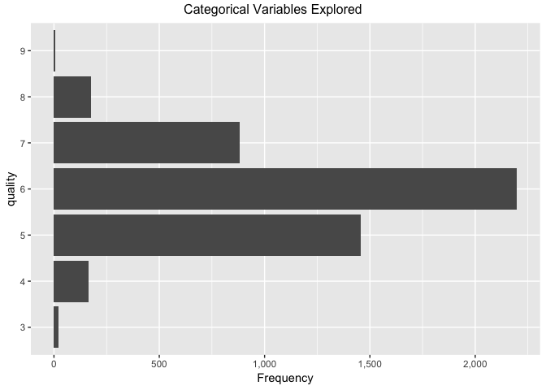

Logistic Regression
================

``` r
# first a few general set-up items / housekeeping items

# setting the appropriate working directory
setwd("~/Desktop/Personal/personal_code/classification/")

# setting scipen options to kill all use of scientific notation
options(scipen = 999)

# basic packages needed throughout
library(dplyr) # for piping
library(ggplot2) # for visualization
library(ggthemes) # for custom visualization
```

Importing, Exploring, Cleaning, Normalizing / Centering, and Prepping the Data
==============================================================================

Importing the Data
------------------

-   Data taken from: <https://archive.ics.uci.edu/ml/machine-learning-databases/wine-quality/>
-   Explanation of the meaning / origin of the data can be found in this academic paper here: <http://www3.dsi.uminho.pt/pcortez/wine5.pdf>
-   Additional explanation of the data and corresponding Kaggle page: <https://www.kaggle.com/uciml/red-wine-quality-cortez-et-al-2009>

``` r
# we have both red and white wine datasets with the same variables 
base_red <- read.csv("data/winequality-red.csv",sep=";")
base_white <- read.csv("data/winequality-white.csv",sep=";")

# lots of useful information about the dataset
glimpse(base_red) 
```

    ## Observations: 1,599
    ## Variables: 12
    ## $ fixed.acidity        <dbl> 7.4, 7.8, 7.8, 11.2, 7.4, 7.4, 7.9, 7.3, ...
    ## $ volatile.acidity     <dbl> 0.700, 0.880, 0.760, 0.280, 0.700, 0.660,...
    ## $ citric.acid          <dbl> 0.00, 0.00, 0.04, 0.56, 0.00, 0.00, 0.06,...
    ## $ residual.sugar       <dbl> 1.9, 2.6, 2.3, 1.9, 1.9, 1.8, 1.6, 1.2, 2...
    ## $ chlorides            <dbl> 0.076, 0.098, 0.092, 0.075, 0.076, 0.075,...
    ## $ free.sulfur.dioxide  <dbl> 11, 25, 15, 17, 11, 13, 15, 15, 9, 17, 15...
    ## $ total.sulfur.dioxide <dbl> 34, 67, 54, 60, 34, 40, 59, 21, 18, 102, ...
    ## $ density              <dbl> 0.9978, 0.9968, 0.9970, 0.9980, 0.9978, 0...
    ## $ pH                   <dbl> 3.51, 3.20, 3.26, 3.16, 3.51, 3.51, 3.30,...
    ## $ sulphates            <dbl> 0.56, 0.68, 0.65, 0.58, 0.56, 0.56, 0.46,...
    ## $ alcohol              <dbl> 9.4, 9.8, 9.8, 9.8, 9.4, 9.4, 9.4, 10.0, ...
    ## $ quality              <int> 5, 5, 5, 6, 5, 5, 5, 7, 7, 5, 5, 5, 5, 5,...

``` r
glimpse(base_white) 
```

    ## Observations: 4,898
    ## Variables: 12
    ## $ fixed.acidity        <dbl> 7.0, 6.3, 8.1, 7.2, 7.2, 8.1, 6.2, 7.0, 6...
    ## $ volatile.acidity     <dbl> 0.27, 0.30, 0.28, 0.23, 0.23, 0.28, 0.32,...
    ## $ citric.acid          <dbl> 0.36, 0.34, 0.40, 0.32, 0.32, 0.40, 0.16,...
    ## $ residual.sugar       <dbl> 20.70, 1.60, 6.90, 8.50, 8.50, 6.90, 7.00...
    ## $ chlorides            <dbl> 0.045, 0.049, 0.050, 0.058, 0.058, 0.050,...
    ## $ free.sulfur.dioxide  <dbl> 45, 14, 30, 47, 47, 30, 30, 45, 14, 28, 1...
    ## $ total.sulfur.dioxide <dbl> 170, 132, 97, 186, 186, 97, 136, 170, 132...
    ## $ density              <dbl> 1.0010, 0.9940, 0.9951, 0.9956, 0.9956, 0...
    ## $ pH                   <dbl> 3.00, 3.30, 3.26, 3.19, 3.19, 3.26, 3.18,...
    ## $ sulphates            <dbl> 0.45, 0.49, 0.44, 0.40, 0.40, 0.44, 0.47,...
    ## $ alcohol              <dbl> 8.8, 9.5, 10.1, 9.9, 9.9, 10.1, 9.6, 8.8,...
    ## $ quality              <int> 6, 6, 6, 6, 6, 6, 6, 6, 6, 6, 5, 5, 5, 7,...

``` r
# the datasets both have the same variables, but the red dataset has notably fewer observations
```

``` r
# given that the two datasets all have the same variables, we'll add a color variable to each and then combine

base_red <- base_red %>%
  mutate(color = "red")

base_white <- base_white %>%
  mutate(color = "white")

# combining the two data frames
main_wine_df <- bind_rows(base_red, base_white)

# viewing the newly combined data frame
glimpse(main_wine_df)
```

    ## Observations: 6,497
    ## Variables: 13
    ## $ fixed.acidity        <dbl> 7.4, 7.8, 7.8, 11.2, 7.4, 7.4, 7.9, 7.3, ...
    ## $ volatile.acidity     <dbl> 0.700, 0.880, 0.760, 0.280, 0.700, 0.660,...
    ## $ citric.acid          <dbl> 0.00, 0.00, 0.04, 0.56, 0.00, 0.00, 0.06,...
    ## $ residual.sugar       <dbl> 1.9, 2.6, 2.3, 1.9, 1.9, 1.8, 1.6, 1.2, 2...
    ## $ chlorides            <dbl> 0.076, 0.098, 0.092, 0.075, 0.076, 0.075,...
    ## $ free.sulfur.dioxide  <dbl> 11, 25, 15, 17, 11, 13, 15, 15, 9, 17, 15...
    ## $ total.sulfur.dioxide <dbl> 34, 67, 54, 60, 34, 40, 59, 21, 18, 102, ...
    ## $ density              <dbl> 0.9978, 0.9968, 0.9970, 0.9980, 0.9978, 0...
    ## $ pH                   <dbl> 3.51, 3.20, 3.26, 3.16, 3.51, 3.51, 3.30,...
    ## $ sulphates            <dbl> 0.56, 0.68, 0.65, 0.58, 0.56, 0.56, 0.46,...
    ## $ alcohol              <dbl> 9.4, 9.8, 9.8, 9.8, 9.4, 9.4, 9.4, 10.0, ...
    ## $ quality              <int> 5, 5, 5, 6, 5, 5, 5, 7, 7, 5, 5, 5, 5, 5,...
    ## $ color                <chr> "red", "red", "red", "red", "red", "red",...

``` r
library(janitor) # for data cleaning and tabular exploration
# documentation: https://github.com/sfirke/janitor

# first we'll do some mandatory / precautionary cleaning
# tidying variable names and dropping any useless rows / columns

main_wine_df <- main_wine_df %>%
  janitor::clean_names() %>% # converts to underscore case and cleans
  janitor::remove_empty(which = c("rows","cols")) # drops all rows and columns that are entirely empty
```

In this preliminary analysis, I will build a model only for white wine. The reason for this is entirely arbitrary--I personally love most red wine, and the only wine I have ever absolutely despised was white. As such, for my own intellectual curriosity I wanted to create a model that predicts the classification of the lowest quality white wine specifically, with an eye towards better understanding the characteristics of the worst white wine in order to avoid them altogether.

``` r
# for the purpose of simplicity, we are going to start by only looking at the white wine
white_main_df <- main_wine_df %>%
  # filtering to just the white wine
  filter(color == "white") %>%
  # dropping the now-useless variable
  select(-color) %>%
  # ensuring quality is a factor; this will be useful later
  # as a rule of thumb, it's good to factor any non-numeric variables when glm modeling
  mutate(quality = factor(quality))

# examining the newly created dataset
glimpse(white_main_df)
```

    ## Observations: 4,898
    ## Variables: 12
    ## $ fixed_acidity        <dbl> 7.0, 6.3, 8.1, 7.2, 7.2, 8.1, 6.2, 7.0, 6...
    ## $ volatile_acidity     <dbl> 0.27, 0.30, 0.28, 0.23, 0.23, 0.28, 0.32,...
    ## $ citric_acid          <dbl> 0.36, 0.34, 0.40, 0.32, 0.32, 0.40, 0.16,...
    ## $ residual_sugar       <dbl> 20.70, 1.60, 6.90, 8.50, 8.50, 6.90, 7.00...
    ## $ chlorides            <dbl> 0.045, 0.049, 0.050, 0.058, 0.058, 0.050,...
    ## $ free_sulfur_dioxide  <dbl> 45, 14, 30, 47, 47, 30, 30, 45, 14, 28, 1...
    ## $ total_sulfur_dioxide <dbl> 170, 132, 97, 186, 186, 97, 136, 170, 132...
    ## $ density              <dbl> 1.0010, 0.9940, 0.9951, 0.9956, 0.9956, 0...
    ## $ p_h                  <dbl> 3.00, 3.30, 3.26, 3.19, 3.19, 3.26, 3.18,...
    ## $ sulphates            <dbl> 0.45, 0.49, 0.44, 0.40, 0.40, 0.44, 0.47,...
    ## $ alcohol              <dbl> 8.8, 9.5, 10.1, 9.9, 9.9, 10.1, 9.6, 8.8,...
    ## $ quality              <fct> 6, 6, 6, 6, 6, 6, 6, 6, 6, 6, 5, 5, 5, 7,...

Exploring the Data
------------------

``` r
# Even though we dropped any rows / cols that are entirely null, we need to check for NA problems
library(DataExplorer) # allows for creation of missings values map
# documentation for DataExplorer: https://towardsdatascience.com/simple-fast-exploratory-data-analysis-in-r-with-dataexplorer-package-e055348d9619
DataExplorer::plot_missing(white_main_df) # shows % of NAs within each variable
```


Good news at this point is this dataset looks perfectly clean of nulls! If there were any problems with nulls, we would solve it using complete.cases() or something similar.

### Continous Variables Exploration

``` r
# high-level univariate variable-exploration
# first a histogram of all continuous variables in the dataset
DataExplorer::plot_histogram(data = white_main_df, title = "Continuous Variables Explored (Histograms)")
```


``` r
# then a density chart of all continous variables in the dataset
DataExplorer::plot_density(data = white_main_df, title = "Continuous Variables Explored (Density Plots)")
```


### Categorical Variable Exploration

``` r
# the only categorical variable in our data in this case is what we'll use to create our low quality flag
# if we had many categorical variables, it would make sense to use order_bar = TRUE
# the order would then be in descending order of prevalence, which is helpful at a glance
plot_bar(data = white_main_df, order_bar = FALSE, title = "Categorical Variables Explored")
```



``` r
# and then we can use janitor to see the exact cross-tab of our quality variable
janitor::tabyl(white_main_df$quality)
```

    ##  white_main_df$quality    n     percent
    ##                      3   20 0.004083299
    ##                      4  163 0.033278889
    ##                      5 1457 0.297468354
    ##                      6 2198 0.448754594
    ##                      7  880 0.179665169
    ##                      8  175 0.035728869
    ##                      9    5 0.001020825

``` r
# it looks like wines with a rating < 5 are exceptionally bad, so we'll use that as our benchmark
# all together wines with a rating below 5 represent just under 4% of the population
```

It looks like wines with a rating &lt; 5 are exceptionally bad, so we'll use that as our benchmark. All together wines with a rating below 5 represent under 4% of the population--so we'll be dealing with a low incidence binary outcome left-hand side variable in this particular modeling scenario.

### Outcome Variable Creation

``` r
# given the above analysis, we'll flag anything with a quality rating < 5 as low-quality 
white_final_df <- white_main_df %>%
  # type conversion here can be tricky because to de-factor requires multiple steps
  # we have to de-factor, perform the logical test on the numeric, and then re-factor
  mutate(low_qual_flag = factor(ifelse(as.numeric(as.character(quality)) < 5,1,0))) %>%
  select(-quality)

glimpse(white_final_df) # taking another look at the new dataset
```

    ## Observations: 4,898
    ## Variables: 12
    ## $ fixed_acidity        <dbl> 7.0, 6.3, 8.1, 7.2, 7.2, 8.1, 6.2, 7.0, 6...
    ## $ volatile_acidity     <dbl> 0.27, 0.30, 0.28, 0.23, 0.23, 0.28, 0.32,...
    ## $ citric_acid          <dbl> 0.36, 0.34, 0.40, 0.32, 0.32, 0.40, 0.16,...
    ## $ residual_sugar       <dbl> 20.70, 1.60, 6.90, 8.50, 8.50, 6.90, 7.00...
    ## $ chlorides            <dbl> 0.045, 0.049, 0.050, 0.058, 0.058, 0.050,...
    ## $ free_sulfur_dioxide  <dbl> 45, 14, 30, 47, 47, 30, 30, 45, 14, 28, 1...
    ## $ total_sulfur_dioxide <dbl> 170, 132, 97, 186, 186, 97, 136, 170, 132...
    ## $ density              <dbl> 1.0010, 0.9940, 0.9951, 0.9956, 0.9956, 0...
    ## $ p_h                  <dbl> 3.00, 3.30, 3.26, 3.19, 3.19, 3.26, 3.18,...
    ## $ sulphates            <dbl> 0.45, 0.49, 0.44, 0.40, 0.40, 0.44, 0.47,...
    ## $ alcohol              <dbl> 8.8, 9.5, 10.1, 9.9, 9.9, 10.1, 9.6, 8.8,...
    ## $ low_qual_flag        <fct> 0, 0, 0, 0, 0, 0, 0, 0, 0, 0, 0, 0, 0, 0,...

``` r
# And now we'll take one final look at the distribution of our outcome variable
# as can be seen, a low quality white wine is a rare event; ~3.75% of the time
tabyl(white_final_df$low_qual_flag)
```

    ##  white_final_df$low_qual_flag    n    percent
    ##                             0 4715 0.96263781
    ##                             1  183 0.03736219

Centering and Normalizing the Data
----------------------------------

For more information on when to center / normalize data, see below: - <https://stats.stackexchange.com/questions/29781/when-conducting-multiple-regression-when-should-you-center-your-predictor-varia> - tl;dr --&gt; center the data when you want your intercept term to represent your expectation when the model is fed the average for each variable in the model, as opposed to the model expectation when all variables == 0; normalize the data when the variable ranges differ markedly

``` r
# we're going to scale and center all variables (except our left-hand side)
white_final_df[,-12] <- scale(white_final_df[,-12], center = TRUE, scale = TRUE)
glimpse(white_final_df)
```

    ## Observations: 4,898
    ## Variables: 12
    ## $ fixed_acidity        <dbl> 0.17207939, -0.65743400, 1.47560044, 0.40...
    ## $ volatile_acidity     <dbl> -0.08176155, 0.21587359, 0.01745016, -0.4...
    ## $ citric_acid          <dbl> 0.21325843, 0.04799622, 0.54378284, -0.11...
    ## $ residual_sugar       <dbl> 2.8210611, -0.9446688, 0.1002720, 0.41572...
    ## $ chlorides            <dbl> -0.03535139, 0.14773200, 0.19350284, 0.55...
    ## $ free_sulfur_dioxide  <dbl> 0.56987339, -1.25289074, -0.31210925, 0.6...
    ## $ total_sulfur_dioxide <dbl> 0.74448902, -0.14966934, -0.97323626, 1.1...
    ## $ density              <dbl> 2.331273996, -0.009153237, 0.358628185, 0...
    ## $ p_h                  <dbl> -1.24679399, 0.73995309, 0.47505348, 0.01...
    ## $ sulphates            <dbl> -0.34914861, 0.00134171, -0.43677119, -0....
    ## $ alcohol              <dbl> -1.39301024, -0.82419153, -0.33663264, -0...
    ## $ low_qual_flag        <fct> 0, 0, 0, 0, 0, 0, 0, 0, 0, 0, 0, 0, 0, 0,...

Checking for Variable Correlations
----------------------------------

For more on all the cool varieties of correlation plots that can be created, see below: - <https://cran.r-project.org/web/packages/corrplot/vignettes/corrplot-intro.html>

``` r
# package needed for all varieties of correlation plots
library(corrplot)
```

    ## corrplot 0.84 loaded

``` r
# building a correlation matrix and ensuring that it only takes in components that are numeric 
# this is necessary because if there are any non-numeric elements in the matrix, this will break 
corr_matrix <- cor(white_final_df[, sapply(white_final_df, is.numeric)])

# getting the matrix of p-values that correspond to the strength of correlation for each pairing
res1 <- cor.mtest(white_final_df[, sapply(white_final_df, is.numeric)], conf.level = .95)

# first we'll build a correlation plot that checks for significance level
# this one will also give us a hint at strength of correlation based on the colors 
corrplot(corr_matrix, p.mat = res1$p, method = "color", type = "upper",
         sig.level = c(.001, .01, .05), pch.cex = .9,
         insig = "label_sig", pch.col = "black", order = "AOE", na.label = "NA")
```


``` r
# and finally we'll build a simpler corrplot to get the strenth of correlation numbers visualized
corrplot(corr_matrix, method = "number", type = "upper", pch.cex = .9,
         order = "AOE", number.cex = .7, na.label = "NA")
```


Takeways from these types of exploratory techniques can help us to create a more informed model. We may, depending on the circumstances, treat variables differently in our model-building process as a result of these types of charts. For example, we might discover a great degree of cross-correlation that allows us to delete duplicative variables, etc. We can notice a few interesting trends from our results above in this case:

-   Residual sugar and denisty are highly positively correlated, while alcohol and density are highly negatively correlated. These correlations are also significant. While most of these are intuitive, we might do well to remember these cross-correlations when it comes time to do dimensionality reduction with this model (if necessary). All in all, it seems as though there are a few interesting relationships to be explored here, but nothing that appears concerning from the perspective of very high degree of multicolinearity.

Prepping Data for the Modeling Process
--------------------------------------

``` r
# split the data into training and testing sets
library(caret) # needed to createDataPartitions
```

    ## Loading required package: lattice

    ## Warning in as.POSIXlt.POSIXct(Sys.time()): unknown timezone 'zone/tz/2018c.
    ## 1.0/zoneinfo/America/New_York'

``` r
# Partition data: 80 / 20 split : train / test
# set seed to ensure reproducibility
set.seed(777)

in_train <- caret::createDataPartition(y=white_final_df$low_qual_flag, p=0.80, list=FALSE)

# splits the data into training and testing sets
training <- white_final_df[in_train,]
testing <- white_final_df[-in_train,]

# shows the row count and column count of the training and test sets, to check that all worked as planned
dim(training)
```

    ## [1] 3919   12

``` r
dim(testing)
```

    ## [1] 979  12

Building a Basic Logit
======================

Estimating the Model
--------------------

``` r
# simple logistic regression
# models using all variables in the training dataset (hence ~ .)
simple_logit_fit <- glm(low_qual_flag ~ .,
                 data = training,
                 family = binomial)

summary(simple_logit_fit)
```

    ## 
    ## Call:
    ## glm(formula = low_qual_flag ~ ., family = binomial, data = training)
    ## 
    ## Deviance Residuals: 
    ##     Min       1Q   Median       3Q      Max  
    ## -1.8387  -0.2603  -0.1841  -0.1334   4.0915  
    ## 
    ## Coefficients:
    ##                      Estimate Std. Error z value             Pr(>|z|)    
    ## (Intercept)          -3.86720    0.12352 -31.308 < 0.0000000000000002 ***
    ## fixed_acidity         0.29099    0.10881   2.674              0.00749 ** 
    ## volatile_acidity      0.63663    0.07207   8.834 < 0.0000000000000002 ***
    ## citric_acid          -0.16949    0.09671  -1.753              0.07968 .  
    ## residual_sugar       -1.12102    0.24831  -4.515           0.00000634 ***
    ## chlorides             0.02198    0.07398   0.297              0.76642    
    ## free_sulfur_dioxide  -0.26507    0.13405  -1.977              0.04799 *  
    ## total_sulfur_dioxide -0.10961    0.12136  -0.903              0.36642    
    ## density               0.88345    0.28104   3.144              0.00167 ** 
    ## p_h                   0.05183    0.11864   0.437              0.66220    
    ## sulphates            -0.08620    0.10351  -0.833              0.40501    
    ## alcohol              -0.27069    0.16757  -1.615              0.10624    
    ## ---
    ## Signif. codes:  0 '***' 0.001 '**' 0.01 '*' 0.05 '.' 0.1 ' ' 1
    ## 
    ## (Dispersion parameter for binomial family taken to be 1)
    ## 
    ##     Null deviance: 1253.7  on 3918  degrees of freedom
    ## Residual deviance: 1017.7  on 3907  degrees of freedom
    ## AIC: 1041.7
    ## 
    ## Number of Fisher Scoring iterations: 7

First Look at Model Predictions
-------------------------------

``` r
# first we'll examine what sort of predictions the model would make when fed the training set
# then we'll repeat this with the testing set (which we should care a bit more about)
# then we'll observe the distribution of modelled probabilities to look for interesting trends

# run predictions on training set
prediction_train <- predict(simple_logit_fit, newdata = training, type = "response" )
predictions_train_full <- data.frame(prediction = prediction_train, low_qual_flag = training$low_qual_flag)

# run predictions on testing set
prediction_test <- predict(simple_logit_fit, newdata = testing, type = "response" )
predictions_test_full <- data.frame(prediction = prediction_test, low_qual_flag = testing$low_qual_flag)

# distribution of the prediction score grouped by known outcome (for training set only)
ggplot(predictions_train_full, aes(prediction_train, color = as.factor(training$low_qual_flag) ) ) + 
geom_density( size = 1 ) +
ggtitle( "Training Set's Predicted Score" ) + 
scale_color_economist( name = "data", labels = c( "negative", "positive" ) ) + 
theme_economist()
```


``` r
# distribution of the prediction score grouped by known outcome (for testing set only)
ggplot(predictions_test_full, aes(prediction_test, color = as.factor(testing$low_qual_flag) ) ) + 
geom_density( size = 1 ) +
ggtitle( "Testing Set's Predicted Score" ) + 
scale_color_economist( name = "data", labels = c( "negative", "positive" ) ) + 
theme_economist()
```


Determining What Classification Cutoff is Appropriate (Simple Logit)
--------------------------------------------------------------------

``` r
# some custom functions are sourced in, to reduce document's length
# the majority of these functions are from ethen8181's GitHub, with edits / improvements I added
# more info on these custom functions here: http://ethen8181.github.io/machine-learning/unbalanced/unbalanced.html

# sourcing my adopted version of the aforementioned functions directly from my GitHub
library(RCurl) # Provides functions to allow one to compose general HTTP requests, etc. in R
```

    ## Loading required package: bitops

``` r
# grabbing the raw info from my GitHub to turn into a text object
script <- getURL("https://raw.githubusercontent.com/pmaji/r-stats-and-modeling/master/classification/useful_classification_functions.R", ssl.verifypeer = FALSE)
# sourcing that code just like you might source an R Script locally
eval(parse(text = script))
```

    ## Loading required package: gplots

    ## 
    ## Attaching package: 'gplots'

    ## The following object is masked from 'package:stats':
    ## 
    ##     lowess

    ## 
    ## Attaching package: 'gridExtra'

    ## The following object is masked from 'package:dplyr':
    ## 
    ##     combine

    ## 
    ## Attaching package: 'data.table'

    ## The following objects are masked from 'package:dplyr':
    ## 
    ##     between, first, last

``` r
# using newly-sourced function AccuracyCutoffInfo to test for optimal cutoff visually
accuracy_info <- AccuracyCutoffInfo(train = predictions_train_full, 
                                    test = predictions_test_full, 
                                    predict = "prediction", 
                                    actual = "low_qual_flag",
                                    # iterates over every cutoff value from 1% to 99% 
                                    # steps in units of 10 bps
                                    cut_val_start = 0.01,
                                    cut_val_end = 0.99,
                                    by_step_size = 0.001)

# from the plot below we can begin to eyeball what the optimal cutoff might be 
accuracy_info$plot
```


``` r
# Moving on to using ROC Curves to pinpoint optimal cutoffs

# user-defined costs for false negative and false positive to pinpoint where total cost is minimized
cost_fp <- 10 # cost of false positive
cost_fn <- 100 # cost of false negative
# here the assumption I've made is that a false positive is 1/10th as costly as a false negative

# creates the base data needed to visualize the ROC curves
roc_info <- ROCInfo(data = predictions_test_full, 
                    predict = "prediction", 
                    actual = "low_qual_flag", 
                    cost.fp = cost_fp, 
                    cost.fn = cost_fn )
```

### ROC Curve for Simple Logit

``` r
# plot the roc / cutoff-selection plots
# color on the chart is cost -- darker is higher cost / greener is lower cost
grid.draw(roc_info$plot)
```


It looks like, for the Simple Logit, the optimal cutoff is 0.07.

Examining Model Performance for the Simple Logit
------------------------------------------------

``` r
# visualize a particular cutoff's effectiveness at classification
cm_info <- ConfusionMatrixInfo(data = predictions_test_full, 
                               predict = "prediction", 
                               actual = "low_qual_flag", 
                               cutoff = .07) # (determined by roc_info$plot above)

# prints the visualization of the confusion matrix (use print(cm_info$data) to see the raw data)
cm_info$plot
```


``` r
# lastly, we'll use the cutoff we have arrived at from the work above to test the model's predictions
# think of this section as the cross-tab version of the confusion matrix plot shown above

# getting model probabilities for our testing set
simple_logit_fit_probs <- predict(simple_logit_fit,
                           newdata = testing,
                           type = "response")

# turning these probabilities into classifications using the cutoff determined above 
simple_logit_fit_predictions <- factor(ifelse(simple_logit_fit_probs > 0.07, 1, 0),levels=c('0','1'))

# builiding a confusion matrix 
simple_logit_conmatrix <- caret::confusionMatrix(simple_logit_fit_predictions,testing$low_qual_flag, positive='1')
simple_logit_conmatrix
```

    ## Confusion Matrix and Statistics
    ## 
    ##           Reference
    ## Prediction   0   1
    ##          0 843  19
    ##          1 100  17
    ##                                             
    ##                Accuracy : 0.8784            
    ##                  95% CI : (0.8563, 0.8983)  
    ##     No Information Rate : 0.9632            
    ##     P-Value [Acc > NIR] : 1                 
    ##                                             
    ##                   Kappa : 0.1759            
    ##  Mcnemar's Test P-Value : 0.0000000000002241
    ##                                             
    ##             Sensitivity : 0.47222           
    ##             Specificity : 0.89396           
    ##          Pos Pred Value : 0.14530           
    ##          Neg Pred Value : 0.97796           
    ##              Prevalence : 0.03677           
    ##          Detection Rate : 0.01736           
    ##    Detection Prevalence : 0.11951           
    ##       Balanced Accuracy : 0.68309           
    ##                                             
    ##        'Positive' Class : 1                 
    ## 

Documenting Performance of Simple Logit Model
---------------------------------------------

``` r
# creating a blank table to record a running set of performance metrics for each model we create
running_model_synopsis_table <- data.frame(
  model_name = character(),
  classification_cutoff = numeric(),
  sensitivity=character(), 
  specificity=character(), 
  number_of_model_terms=numeric(),
  total_cost = numeric(),
  stringsAsFactors=FALSE
  )

simple_logit_synopsis_info <- data.frame(
  model_name = "Simple Logit (All Vars.)",
  classification_cutoff = roc_info$cutoff,
  sensitivity = percent(roc_info$sensitivity), 
  specificity = percent(roc_info$specificity), 
  number_of_model_terms = (length(colnames(simple_logit_fit$qr$qr))-1),
  total_cost = roc_info$totalcost,
  stringsAsFactors=FALSE
  )

running_model_synopsis_table <- bind_rows(running_model_synopsis_table, simple_logit_synopsis_info)
running_model_synopsis_table
```

    ##                 model_name classification_cutoff sensitivity specificity
    ## 1 Simple Logit (All Vars.)            0.06734321         50%         89%
    ##   number_of_model_terms total_cost
    ## 1                    11       2840

Penalized Logistic Regression (Lasso)
=====================================

-   Now using an Objective Function that penalizes low-ROI variables. This is similar to ridge regression except variables with coefficients non-consequential enough will be zero'ed out of the model.
-   Useful source: <http://www.sthda.com/english/articles/36-classification-methods-essentials/149-penalized-logistic-regression-essentials-in-r-ridge-lasso-and-elastic-net/>

Tuning the Hyperparameter for the Lasso Model w/ 2-Way Interactions and Polynomial Terms
----------------------------------------------------------------------------------------

The first step here is optmizing lamda--the hyperparameter of importance in a lasso regression. Given the nature of the cross-validation involved in a the hyperparameter optimization process, we need a dataset where the data aren't as scarce as they are in the main dataset. There are a variety of methods available to deal with this problem, including upsampling, downsampling, and a host of synthetic sampling methodologies that generally into categories abbreviated ROSE and SMOTE. For information on all varieties of synthetic sampling that exist, see the link below.

-   <https://cran.r-project.org/web/packages/smotefamily/smotefamily.pdf>

For the purpose of this project, we will estimate two lasso models: - One trained on data created via simple upsampling. - And one trained on data created via DBSMOTE--a dbscan-backed version of synthetic upsampling.

The reason for these two choices is that upsampling is the simplest method for this type of problem, and DBSMOTE is the fanciest synthetic data creation methodology that makes sense for this type of problem--so we're testing the two extremes of possible solutions to the data paucity problem.

Finally, it may be worth stating explicitly that my purpose of using the lasso method is to get an idea for what variables might be useful, and what variables might not be useful. As such, it makes sense to throw many variables at the lasso model to take full advantage of its capacity to weed out the noise. For this exercise, I will consider all of the following in each lasso model:

-   All single variable terms
-   All nth-degree polynomial terms (where n is bounded by 3 for simplicity's sake)
-   All unique two-direction interaction effects

After training the models using both aforementioned sampling methodologies, we will hopefully be able to glean some information in the end about what polynomial terms, interaction effects, or single variables appear most statistically powerful and thus worthy of consideration in the final model.

Sampling Methodology Explored -- Upsampling
-------------------------------------------

### Building the Upsampled Dataset

``` r
# creating new training dataset with upsampled low quality cases
upsample_training <- caret::upSample(training, (training$low_qual_flag))

# one downside of the upSample function is it creates a new left-hand side variable (class)
# as such, we have to do some minor clenaing

upsample_training <- upsample_training %>%
  select(-low_qual_flag) %>%
  rename(`low_qual_flag` = `Class`)

# then we inspect the incidence rate of our left-hand-side variable in the new training set
# the result should now be a 50 / 50 split 
janitor::tabyl(upsample_training$low_qual_flag) 
```

    ##  upsample_training$low_qual_flag    n percent
    ##                                0 3772     0.5
    ##                                1 3772     0.5

Building the Model Formula (Upsampled Lasso)
--------------------------------------------

``` r
# first we get all variables with their corresponding degree polynomial into the model
# I'm also including here all two:way interaction effects
# in the code below, the integer in quotes determines the max nth degree polynomial to be tested
upsample_lasso_formula <- as.formula(
  paste('low_qual_flag ~', paste('poly(', colnames(upsample_training[-12]),',3)', collapse = ' + '), '+ .^2', '- .')
  )

# prints the formula so that we can see what will be used to create the logit
upsample_lasso_formula
```

    ## low_qual_flag ~ poly(fixed_acidity, 3) + poly(volatile_acidity, 
    ##     3) + poly(citric_acid, 3) + poly(residual_sugar, 3) + poly(chlorides, 
    ##     3) + poly(free_sulfur_dioxide, 3) + poly(total_sulfur_dioxide, 
    ##     3) + poly(density, 3) + poly(p_h, 3) + poly(sulphates, 3) + 
    ##     poly(alcohol, 3) + .^2 - .

### Building the Upsampled Model Matrix

``` r
# Then we build our model matrix (including all two-way interactions possible and polynomials up to 3rd degree)
x <- model.matrix(upsample_lasso_formula, upsample_training)
# calling out what the outcome variable should be explicitly for this method
y <- upsample_training$low_qual_flag
```

### Tuning Lambda for Upsampled Logit

``` r
library(glmnet) # package needed for ridge methods 
```

    ## Loading required package: Matrix

    ## Loading required package: foreach

    ## Loaded glmnet 2.0-13

``` r
# Next we move on to find the best lambda using cross-validation
# Cross-validation is for tuning hyperparameters; not normally needed if model requires no hyperparameters
set.seed(777) # set seed for reproduciblity
# alpha = 1 just means lasso ; alpha = 0 is ridge
# this step below can take a long time, as the range of possible lambdas is simulated
cv.lasso <- cv.glmnet(x, y, alpha = 1, family = "binomial")
```

### Plotting Lambdas for Upsampled Logit

``` r
# plots the various possible lambdas 
plot(cv.lasso)
```


``` r
# Two common choices for lambda: lambda min and lambda lse (both are shown with dotted lines, in turn)
# Up to the modeler to decide which to choose in this case; simplicity / error-minimization tradeoff
```

The two common choices are shown visually with dotted lines, in turn: - Lambda Min (the value that minimizes the prediction error) - Lambda LSE (gives the simplest model but also lies within one SE of the optimal value of lambda)

### Examining the Resultant Coefficients (Upsampled Lasso)

The number of non-zero'ed out variables that you will get as the result of tuning your lambda for your particular lasso model can vary greatly from model-to-model, depending on a host of variables including your training dataset. Given that this is the first time the coefficient list has showed up in this document, we'll include both the lambda min coefficient list and the lamda lse coefficient list below, but thereafter will only use the one deemed most appropriate. This choice is left up the modeler and is balancing act between exhaustiveness and simplicity, in most cases.

### First the Coefficients for the Lambda Min Upsampled Lasso

``` r
# lambda min is the value that minimizes the prediction error
# cv.lasso$lambda.min  # uncomment and call this if you wanted the raw lambda 

# showing coefficients using lambda min (if . then variable has been zero'ed out)
coef(cv.lasso, cv.lasso$lambda.min)
```

    ## 90 x 1 sparse Matrix of class "dgCMatrix"
    ##                                                      1
    ## (Intercept)                                -2.83177310
    ## (Intercept)                                 .         
    ## poly(fixed_acidity, 3)1                     6.02118423
    ## poly(fixed_acidity, 3)2                   -29.27171371
    ## poly(fixed_acidity, 3)3                    21.55947007
    ## poly(volatile_acidity, 3)1                 88.82486043
    ## poly(volatile_acidity, 3)2                  1.41387709
    ## poly(volatile_acidity, 3)3                 35.05505138
    ## poly(citric_acid, 3)1                      -7.11652503
    ## poly(citric_acid, 3)2                      35.27712093
    ## poly(citric_acid, 3)3                     -20.95400655
    ## poly(residual_sugar, 3)1                  -70.26144187
    ## poly(residual_sugar, 3)2                 -206.16716492
    ## poly(residual_sugar, 3)3                 -157.16130796
    ## poly(chlorides, 3)1                        -0.67047008
    ## poly(chlorides, 3)2                       -34.27480733
    ## poly(chlorides, 3)3                        31.44806164
    ## poly(free_sulfur_dioxide, 3)1             321.21916013
    ## poly(free_sulfur_dioxide, 3)2             527.90391951
    ## poly(free_sulfur_dioxide, 3)3              17.86084747
    ## poly(total_sulfur_dioxide, 3)1             15.78079806
    ## poly(total_sulfur_dioxide, 3)2             14.69193491
    ## poly(total_sulfur_dioxide, 3)3             33.92100313
    ## poly(density, 3)1                        -128.43558141
    ## poly(density, 3)2                        -656.07918844
    ## poly(density, 3)3                         -74.05983285
    ## poly(p_h, 3)1                             -14.71326444
    ## poly(p_h, 3)2                              -8.70037863
    ## poly(p_h, 3)3                               3.53934932
    ## poly(sulphates, 3)1                        -4.00356447
    ## poly(sulphates, 3)2                       -20.27265393
    ## poly(sulphates, 3)3                       -15.03014536
    ## poly(alcohol, 3)1                        -112.07431499
    ## poly(alcohol, 3)2                        -143.34025616
    ## poly(alcohol, 3)3                         -43.06511762
    ## fixed_acidity:volatile_acidity             -0.39525038
    ## fixed_acidity:citric_acid                   0.09034123
    ## fixed_acidity:residual_sugar               -0.30300941
    ## fixed_acidity:chlorides                    -0.01850595
    ## fixed_acidity:free_sulfur_dioxide           0.35382623
    ## fixed_acidity:total_sulfur_dioxide         -0.08286924
    ## fixed_acidity:density                       1.37333501
    ## fixed_acidity:p_h                          -0.29182846
    ## fixed_acidity:sulphates                    -0.55309989
    ## fixed_acidity:alcohol                       0.49125251
    ## volatile_acidity:citric_acid                0.01527862
    ## volatile_acidity:residual_sugar            -0.65486230
    ## volatile_acidity:chlorides                  0.32584980
    ## volatile_acidity:free_sulfur_dioxide        0.30038666
    ## volatile_acidity:total_sulfur_dioxide      -0.17677748
    ## volatile_acidity:density                    0.76535796
    ## volatile_acidity:p_h                       -0.30736045
    ## volatile_acidity:sulphates                  0.01862029
    ## volatile_acidity:alcohol                    0.41567084
    ## citric_acid:residual_sugar                  0.34655063
    ## citric_acid:chlorides                      -0.10494838
    ## citric_acid:free_sulfur_dioxide            -0.13162154
    ## citric_acid:total_sulfur_dioxide            0.40229947
    ## citric_acid:density                        -0.80283277
    ## citric_acid:p_h                             0.03094915
    ## citric_acid:sulphates                       0.01839792
    ## citric_acid:alcohol                        -0.22166072
    ## residual_sugar:chlorides                    2.73374452
    ## residual_sugar:free_sulfur_dioxide          0.43190243
    ## residual_sugar:total_sulfur_dioxide         0.46212777
    ## residual_sugar:density                      0.11177178
    ## residual_sugar:p_h                         -0.25925877
    ## residual_sugar:sulphates                   -1.35101623
    ## residual_sugar:alcohol                      1.36584200
    ## chlorides:free_sulfur_dioxide              -0.10006622
    ## chlorides:total_sulfur_dioxide             -0.43090479
    ## chlorides:density                          -2.26908187
    ## chlorides:p_h                               0.45308372
    ## chlorides:sulphates                         0.25169851
    ## chlorides:alcohol                          -1.29704813
    ## free_sulfur_dioxide:total_sulfur_dioxide   -0.16045026
    ## free_sulfur_dioxide:density                -1.28873426
    ## free_sulfur_dioxide:p_h                     0.01836243
    ## free_sulfur_dioxide:sulphates               0.40272288
    ## free_sulfur_dioxide:alcohol                -1.32555418
    ## total_sulfur_dioxide:density                0.26720521
    ## total_sulfur_dioxide:p_h                    0.35005597
    ## total_sulfur_dioxide:sulphates              0.44614440
    ## total_sulfur_dioxide:alcohol               -0.40591224
    ## density:p_h                                 0.59688003
    ## density:sulphates                           1.67188708
    ## density:alcohol                            -2.90074903
    ## p_h:sulphates                              -0.45986216
    ## p_h:alcohol                                 0.14317971
    ## sulphates:alcohol                           0.94366645

### Second the Coefficients for the Lambda LSE Upsampled Lasso

``` r
#cv.lasso$lambda.1se # uncomment and call this if you wanted the raw lambda 
# showing coefficients using lambda min (if . then variable has been zero'ed out)
coef(cv.lasso, cv.lasso$lambda.1se)
```

    ## 90 x 1 sparse Matrix of class "dgCMatrix"
    ##                                                       1
    ## (Intercept)                               -0.5010227212
    ## (Intercept)                                .           
    ## poly(fixed_acidity, 3)1                   21.8233032360
    ## poly(fixed_acidity, 3)2                   -4.2289369489
    ## poly(fixed_acidity, 3)3                    5.9609609871
    ## poly(volatile_acidity, 3)1                78.9314389355
    ## poly(volatile_acidity, 3)2                 .           
    ## poly(volatile_acidity, 3)3                27.3990600576
    ## poly(citric_acid, 3)1                     -5.6796910361
    ## poly(citric_acid, 3)2                     32.1831538175
    ## poly(citric_acid, 3)3                    -18.6586829080
    ## poly(residual_sugar, 3)1                 -40.7154673850
    ## poly(residual_sugar, 3)2                   .           
    ## poly(residual_sugar, 3)3                 -37.2324083080
    ## poly(chlorides, 3)1                       -2.4857293850
    ## poly(chlorides, 3)2                      -40.5767159200
    ## poly(chlorides, 3)3                       23.9890468901
    ## poly(free_sulfur_dioxide, 3)1              .           
    ## poly(free_sulfur_dioxide, 3)2            145.0288758978
    ## poly(free_sulfur_dioxide, 3)3            -78.8054838374
    ## poly(total_sulfur_dioxide, 3)1            12.8529425920
    ## poly(total_sulfur_dioxide, 3)2             .           
    ## poly(total_sulfur_dioxide, 3)3            26.0102392683
    ## poly(density, 3)1                         53.9668430905
    ## poly(density, 3)2                        -16.4096080775
    ## poly(density, 3)3                         34.1525481410
    ## poly(p_h, 3)1                            -12.3939783362
    ## poly(p_h, 3)2                              2.3491269893
    ## poly(p_h, 3)3                              5.0252551254
    ## poly(sulphates, 3)1                        .           
    ## poly(sulphates, 3)2                        0.1095921581
    ## poly(sulphates, 3)3                       -9.0631676965
    ## poly(alcohol, 3)1                        -62.5885538668
    ## poly(alcohol, 3)2                        -46.0137326490
    ## poly(alcohol, 3)3                        -37.0887525623
    ## fixed_acidity:volatile_acidity            -0.1337030244
    ## fixed_acidity:citric_acid                 -0.0106268002
    ## fixed_acidity:residual_sugar               0.0005809490
    ## fixed_acidity:chlorides                   -0.3386082246
    ## fixed_acidity:free_sulfur_dioxide          0.2025550402
    ## fixed_acidity:total_sulfur_dioxide         .           
    ## fixed_acidity:density                      0.4721408569
    ## fixed_acidity:p_h                         -0.0600191347
    ## fixed_acidity:sulphates                   -0.1434758164
    ## fixed_acidity:alcohol                     -0.1463581162
    ## volatile_acidity:citric_acid               .           
    ## volatile_acidity:residual_sugar           -0.1965994614
    ## volatile_acidity:chlorides                 0.1415581201
    ## volatile_acidity:free_sulfur_dioxide       0.1919442273
    ## volatile_acidity:total_sulfur_dioxide     -0.0766500138
    ## volatile_acidity:density                   .           
    ## volatile_acidity:p_h                      -0.0847487097
    ## volatile_acidity:sulphates                 0.1209503213
    ## volatile_acidity:alcohol                   .           
    ## citric_acid:residual_sugar                 .           
    ## citric_acid:chlorides                     -0.1300466844
    ## citric_acid:free_sulfur_dioxide           -0.0629401781
    ## citric_acid:total_sulfur_dioxide           0.2931524513
    ## citric_acid:density                       -0.2382557592
    ## citric_acid:p_h                            0.0009975504
    ## citric_acid:sulphates                     -0.0129919345
    ## citric_acid:alcohol                       -0.0134590663
    ## residual_sugar:chlorides                   1.0341958127
    ## residual_sugar:free_sulfur_dioxide         0.1082953368
    ## residual_sugar:total_sulfur_dioxide        0.4688697380
    ## residual_sugar:density                    -0.7011621531
    ## residual_sugar:p_h                        -0.0044055988
    ## residual_sugar:sulphates                  -0.2943189895
    ## residual_sugar:alcohol                    -0.0385689822
    ## chlorides:free_sulfur_dioxide              .           
    ## chlorides:total_sulfur_dioxide            -0.3323923865
    ## chlorides:density                          .           
    ## chlorides:p_h                              0.0594166490
    ## chlorides:sulphates                        0.1227471527
    ## chlorides:alcohol                         -0.0974465409
    ## free_sulfur_dioxide:total_sulfur_dioxide   .           
    ## free_sulfur_dioxide:density               -0.7112704854
    ## free_sulfur_dioxide:p_h                   -0.0864023496
    ## free_sulfur_dioxide:sulphates              0.1478369965
    ## free_sulfur_dioxide:alcohol               -0.8292490381
    ## total_sulfur_dioxide:density               .           
    ## total_sulfur_dioxide:p_h                   0.3588094964
    ## total_sulfur_dioxide:sulphates             0.4849121483
    ## total_sulfur_dioxide:alcohol              -0.4764304127
    ## density:p_h                                .           
    ## density:sulphates                          0.0058456146
    ## density:alcohol                            .           
    ## p_h:sulphates                             -0.0978222744
    ## p_h:alcohol                               -0.3522653442
    ## sulphates:alcohol                          0.0303096602

``` r
# storing the coefficients for later use
upsample_lambda_coefs <- broom::tidy(coef(cv.lasso, cv.lasso$lambda.1se))
```

### Building the Upsampled Lasso Logit Formula Based on Coefficient List

``` r
# first we trim from the coefficient list only the coefficients that weren't 0'ed out
upsample_coef_list <- upsample_lambda_coefs %>%
  # arrange the coefficients in descending order of absolute value
  arrange(desc(abs(value))) %>% 
  select(row) %>%
  # dropping the intercept which isn't needed in formula
  filter(row != '(Intercept)') %>%
  as.data.frame()

# then we take this jumbled list and need to perform a few annoying operations to get it into a clean formula
# adding unique at the end because once we drop the polynomial number at the end, we'll have some dupes
clean_upsample_coef_list <- gsub(").*", ")", upsample_coef_list$row) %>% unique()

# the gsub above resolts in a clean character vector, but now we need to make it into a formula
result_upsample_lasso_formula <- as.formula(
  paste('low_qual_flag ~', paste(clean_upsample_coef_list, collapse = ' + '))
  )

# the final resulting formula is below
result_upsample_lasso_formula
```

    ## low_qual_flag ~ poly(free_sulfur_dioxide, 3) + poly(volatile_acidity, 
    ##     3) + poly(alcohol, 3) + poly(density, 3) + poly(residual_sugar, 
    ##     3) + poly(chlorides, 3) + poly(citric_acid, 3) + poly(total_sulfur_dioxide, 
    ##     3) + poly(fixed_acidity, 3) + poly(p_h, 3) + poly(sulphates, 
    ##     3) + residual_sugar:chlorides + free_sulfur_dioxide:alcohol + 
    ##     free_sulfur_dioxide:density + residual_sugar:density + total_sulfur_dioxide:sulphates + 
    ##     total_sulfur_dioxide:alcohol + fixed_acidity:density + residual_sugar:total_sulfur_dioxide + 
    ##     total_sulfur_dioxide:p_h + p_h:alcohol + fixed_acidity:chlorides + 
    ##     chlorides:total_sulfur_dioxide + residual_sugar:sulphates + 
    ##     citric_acid:total_sulfur_dioxide + citric_acid:density + 
    ##     fixed_acidity:free_sulfur_dioxide + volatile_acidity:residual_sugar + 
    ##     volatile_acidity:free_sulfur_dioxide + free_sulfur_dioxide:sulphates + 
    ##     fixed_acidity:alcohol + fixed_acidity:sulphates + volatile_acidity:chlorides + 
    ##     fixed_acidity:volatile_acidity + citric_acid:chlorides + 
    ##     chlorides:sulphates + volatile_acidity:sulphates + residual_sugar:free_sulfur_dioxide + 
    ##     p_h:sulphates + chlorides:alcohol + free_sulfur_dioxide:p_h + 
    ##     volatile_acidity:p_h + volatile_acidity:total_sulfur_dioxide + 
    ##     citric_acid:free_sulfur_dioxide + fixed_acidity:p_h + chlorides:p_h + 
    ##     residual_sugar:alcohol + sulphates:alcohol + citric_acid:alcohol + 
    ##     citric_acid:sulphates + fixed_acidity:citric_acid + density:sulphates + 
    ##     residual_sugar:p_h + citric_acid:p_h + fixed_acidity:residual_sugar

### Rebuilding Logit Based on Outcome of Upsample Lasso Selection Methodology

``` r
# rebuilt logit based on info gained from lasso; would like to be able to simply plug in the coef list, from above
result_upsample_lasso_fit <- glm(result_upsample_lasso_formula,
                 data = training,
                 family = binomial)
```

    ## Warning: glm.fit: fitted probabilities numerically 0 or 1 occurred

``` r
summary(result_upsample_lasso_fit)
```

    ## 
    ## Call:
    ## glm(formula = result_upsample_lasso_formula, family = binomial, 
    ##     data = training)
    ## 
    ## Deviance Residuals: 
    ##     Min       1Q   Median       3Q      Max  
    ## -1.8863  -0.2014  -0.1028  -0.0481   3.4157  
    ## 
    ## Coefficients:
    ##                                          Estimate  Std. Error z value
    ## (Intercept)                              -5.62241     1.09469  -5.136
    ## poly(free_sulfur_dioxide, 3)1           -52.52776    13.99505  -3.753
    ## poly(free_sulfur_dioxide, 3)2            44.73057    50.69957   0.882
    ## poly(free_sulfur_dioxide, 3)3           -28.15069    29.06551  -0.969
    ## poly(volatile_acidity, 3)1               42.01384     9.28662   4.524
    ## poly(volatile_acidity, 3)2               -2.03086     5.95280  -0.341
    ## poly(volatile_acidity, 3)3                5.99354     6.43180   0.932
    ## poly(alcohol, 3)1                       -33.43820    35.58749  -0.940
    ## poly(alcohol, 3)2                       -50.66217    18.32852  -2.764
    ## poly(alcohol, 3)3                       -36.33258    10.55365  -3.443
    ## poly(density, 3)1                      -174.21507   136.39972  -1.277
    ## poly(density, 3)2                     -1028.22404   527.28480  -1.950
    ## poly(density, 3)3                      -292.90763   145.42659  -2.014
    ## poly(residual_sugar, 3)1                -62.97507    74.14557  -0.849
    ## poly(residual_sugar, 3)2                 15.80427   212.33678   0.074
    ## poly(residual_sugar, 3)3                -24.00465    95.96800  -0.250
    ## poly(chlorides, 3)1                     -14.04087    21.55251  -0.651
    ## poly(chlorides, 3)2                     -20.74296    12.32120  -1.684
    ## poly(chlorides, 3)3                      12.71863     9.10476   1.397
    ## poly(citric_acid, 3)1                    -3.23326     9.32177  -0.347
    ## poly(citric_acid, 3)2                    19.54503     7.97855   2.450
    ## poly(citric_acid, 3)3                    -5.95159     6.46309  -0.921
    ## poly(total_sulfur_dioxide, 3)1            7.81357    12.77187   0.612
    ## poly(total_sulfur_dioxide, 3)2           -5.85678     8.56805  -0.684
    ## poly(total_sulfur_dioxide, 3)3            5.46015     8.01850   0.681
    ## poly(fixed_acidity, 3)1                  14.91272    16.33084   0.913
    ## poly(fixed_acidity, 3)2                  -1.14209    11.96669  -0.095
    ## poly(fixed_acidity, 3)3                   9.91901     8.72326   1.137
    ## poly(p_h, 3)1                           -11.67532    15.96885  -0.731
    ## poly(p_h, 3)2                             0.92162    10.00155   0.092
    ## poly(p_h, 3)3                             1.76042     5.80282   0.303
    ## poly(sulphates, 3)1                     -16.41780    13.66805  -1.201
    ## poly(sulphates, 3)2                      -9.55967    12.26275  -0.780
    ## poly(sulphates, 3)3                      -8.12329     9.31929  -0.872
    ## residual_sugar:chlorides                  0.48559     0.21575   2.251
    ## free_sulfur_dioxide:alcohol              -0.70233     0.41022  -1.712
    ## free_sulfur_dioxide:density              -0.57148     0.72226  -0.791
    ## residual_sugar:density                   -0.52238     1.26033  -0.414
    ## total_sulfur_dioxide:sulphates           -0.02397     0.19418  -0.123
    ## alcohol:total_sulfur_dioxide             -0.31616     0.24047  -1.315
    ## density:fixed_acidity                     0.30534     0.44784   0.682
    ## residual_sugar:total_sulfur_dioxide       0.69721     0.20294   3.436
    ## total_sulfur_dioxide:p_h                  0.34182     0.15462   2.211
    ## alcohol:p_h                              -0.28451     0.25172  -1.130
    ## chlorides:fixed_acidity                  -0.21177     0.18616  -1.138
    ## chlorides:total_sulfur_dioxide           -0.20808     0.18571  -1.121
    ## residual_sugar:sulphates                 -0.84993     0.45693  -1.860
    ## total_sulfur_dioxide:citric_acid          0.32049     0.13617   2.354
    ## density:citric_acid                      -0.47274     0.24012  -1.969
    ## free_sulfur_dioxide:fixed_acidity         0.21541     0.17436   1.235
    ## residual_sugar:volatile_acidity          -0.26942     0.12453  -2.163
    ## free_sulfur_dioxide:volatile_acidity      0.26260     0.12676   2.072
    ## free_sulfur_dioxide:sulphates             0.29001     0.17213   1.685
    ## alcohol:fixed_acidity                    -0.22781     0.27997  -0.814
    ## sulphates:fixed_acidity                  -0.45399     0.21914  -2.072
    ## chlorides:volatile_acidity                0.07002     0.12514   0.560
    ## fixed_acidity:volatile_acidity           -0.08343     0.08228  -1.014
    ## chlorides:citric_acid                    -0.21289     0.14559  -1.462
    ## chlorides:sulphates                       0.16849     0.14998   1.123
    ## sulphates:volatile_acidity                0.21237     0.10894   1.949
    ## residual_sugar:free_sulfur_dioxide       -0.11008     0.49255  -0.223
    ## sulphates:p_h                            -0.39215     0.19480  -2.013
    ## chlorides:alcohol                        -0.42283     0.33752  -1.253
    ## free_sulfur_dioxide:p_h                  -0.12293     0.21308  -0.577
    ## p_h:volatile_acidity                     -0.18697     0.11541  -1.620
    ## total_sulfur_dioxide:volatile_acidity    -0.18062     0.11459  -1.576
    ## free_sulfur_dioxide:citric_acid          -0.10916     0.12502  -0.873
    ## fixed_acidity:p_h                         0.02129     0.16125   0.132
    ## chlorides:p_h                            -0.02275     0.18996  -0.120
    ## residual_sugar:alcohol                    0.01527     0.46097   0.033
    ## alcohol:sulphates                         0.75427     0.36924   2.043
    ## alcohol:citric_acid                      -0.20380     0.20672  -0.986
    ## sulphates:citric_acid                     0.13076     0.12145   1.077
    ## fixed_acidity:citric_acid                -0.01927     0.11939  -0.161
    ## density:sulphates                         1.38586     0.74907   1.850
    ## residual_sugar:p_h                        0.11460     0.24559   0.467
    ## p_h:citric_acid                          -0.10969     0.12468  -0.880
    ## residual_sugar:fixed_acidity              0.25097     0.33970   0.739
    ##                                          Pr(>|z|)    
    ## (Intercept)                           0.000000281 ***
    ## poly(free_sulfur_dioxide, 3)1            0.000175 ***
    ## poly(free_sulfur_dioxide, 3)2            0.377632    
    ## poly(free_sulfur_dioxide, 3)3            0.332782    
    ## poly(volatile_acidity, 3)1            0.000006065 ***
    ## poly(volatile_acidity, 3)2               0.732983    
    ## poly(volatile_acidity, 3)3               0.351408    
    ## poly(alcohol, 3)1                        0.347420    
    ## poly(alcohol, 3)2                        0.005708 ** 
    ## poly(alcohol, 3)3                        0.000576 ***
    ## poly(density, 3)1                        0.201518    
    ## poly(density, 3)2                        0.051172 .  
    ## poly(density, 3)3                        0.043996 *  
    ## poly(residual_sugar, 3)1                 0.395690    
    ## poly(residual_sugar, 3)2                 0.940668    
    ## poly(residual_sugar, 3)3                 0.802485    
    ## poly(chlorides, 3)1                      0.514742    
    ## poly(chlorides, 3)2                      0.092275 .  
    ## poly(chlorides, 3)3                      0.162437    
    ## poly(citric_acid, 3)1                    0.728703    
    ## poly(citric_acid, 3)2                    0.014298 *  
    ## poly(citric_acid, 3)3                    0.357124    
    ## poly(total_sulfur_dioxide, 3)1           0.540684    
    ## poly(total_sulfur_dioxide, 3)2           0.494253    
    ## poly(total_sulfur_dioxide, 3)3           0.495907    
    ## poly(fixed_acidity, 3)1                  0.361157    
    ## poly(fixed_acidity, 3)2                  0.923966    
    ## poly(fixed_acidity, 3)3                  0.255506    
    ## poly(p_h, 3)1                            0.464699    
    ## poly(p_h, 3)2                            0.926580    
    ## poly(p_h, 3)3                            0.761606    
    ## poly(sulphates, 3)1                      0.229681    
    ## poly(sulphates, 3)2                      0.435644    
    ## poly(sulphates, 3)3                      0.383391    
    ## residual_sugar:chlorides                 0.024404 *  
    ## free_sulfur_dioxide:alcohol              0.086887 .  
    ## free_sulfur_dioxide:density              0.428803    
    ## residual_sugar:density                   0.678522    
    ## total_sulfur_dioxide:sulphates           0.901769    
    ## alcohol:total_sulfur_dioxide             0.188581    
    ## density:fixed_acidity                    0.495356    
    ## residual_sugar:total_sulfur_dioxide      0.000591 ***
    ## total_sulfur_dioxide:p_h                 0.027051 *  
    ## alcohol:p_h                              0.258363    
    ## chlorides:fixed_acidity                  0.255277    
    ## chlorides:total_sulfur_dioxide           0.262500    
    ## residual_sugar:sulphates                 0.062873 .  
    ## total_sulfur_dioxide:citric_acid         0.018592 *  
    ## density:citric_acid                      0.048980 *  
    ## free_sulfur_dioxide:fixed_acidity        0.216667    
    ## residual_sugar:volatile_acidity          0.030504 *  
    ## free_sulfur_dioxide:volatile_acidity     0.038309 *  
    ## free_sulfur_dioxide:sulphates            0.092023 .  
    ## alcohol:fixed_acidity                    0.415829    
    ## sulphates:fixed_acidity                  0.038297 *  
    ## chlorides:volatile_acidity               0.575781    
    ## fixed_acidity:volatile_acidity           0.310596    
    ## chlorides:citric_acid                    0.143656    
    ## chlorides:sulphates                      0.261276    
    ## sulphates:volatile_acidity               0.051245 .  
    ## residual_sugar:free_sulfur_dioxide       0.823163    
    ## sulphates:p_h                            0.044105 *  
    ## chlorides:alcohol                        0.210300    
    ## free_sulfur_dioxide:p_h                  0.563988    
    ## p_h:volatile_acidity                     0.105205    
    ## total_sulfur_dioxide:volatile_acidity    0.114996    
    ## free_sulfur_dioxide:citric_acid          0.382576    
    ## fixed_acidity:p_h                        0.894973    
    ## chlorides:p_h                            0.904688    
    ## residual_sugar:alcohol                   0.973579    
    ## alcohol:sulphates                        0.041076 *  
    ## alcohol:citric_acid                      0.324197    
    ## sulphates:citric_acid                    0.281606    
    ## fixed_acidity:citric_acid                0.871758    
    ## density:sulphates                        0.064297 .  
    ## residual_sugar:p_h                       0.640758    
    ## p_h:citric_acid                          0.378969    
    ## residual_sugar:fixed_acidity             0.460029    
    ## ---
    ## Signif. codes:  0 '***' 0.001 '**' 0.01 '*' 0.05 '.' 0.1 ' ' 1
    ## 
    ## (Dispersion parameter for binomial family taken to be 1)
    ## 
    ##     Null deviance: 1253.66  on 3918  degrees of freedom
    ## Residual deviance:  764.46  on 3841  degrees of freedom
    ## AIC: 920.46
    ## 
    ## Number of Fisher Scoring iterations: 10

### Re-Determining What Classification Cutoff is Appropriate (Upsample Lasso)

``` r
# running predictions on the new post-lasso-improvements-integrated model
# same chunks of code used previously below; 1st to find best cutoff, then to test performance

# run predictions on testing set
prediction_test <- predict(result_upsample_lasso_fit, newdata = testing, type = "response" )
predictions_test_full <- data.frame(prediction = prediction_test, low_qual_flag = testing$low_qual_flag)

# again defining the costs of false positive vs. costs of false negative (same ratio maintained)
cost_fp <- 10
cost_fn <- 100

# building the data structure needed for the ROC charts
roc_info <- ROCInfo(data = predictions_test_full, 
                    predict = "prediction", 
                    actual = "low_qual_flag", 
                    cost.fp = cost_fp, 
                    cost.fn = cost_fn )
```

### ROC Curve for Logit Resuliting from Upsample Lasso

``` r
# plot the new roc / cutoff-selection plots
grid.draw(roc_info$plot)
```


Looks like the optimal cutoff for this particular model is 0.13.

### Examining Model Performance (Upsample Lasso)

``` r
# getting model probabilities for our testing set 
result_upsample_lasso_fit_probs <- predict(result_upsample_lasso_fit,
                           newdata = testing,
                           type = "response")

# turning these probabilities into classifications using the cutoff determined above 
result_upsample_logit_fit_predictions <- factor(ifelse(result_upsample_lasso_fit_probs > 0.13, 1, 0),levels=c('0','1'))

# builiding a confusion matrix 
result_upsample_conmatrix <- caret::confusionMatrix(result_upsample_logit_fit_predictions,testing$low_qual_flag, positive='1')
result_upsample_conmatrix
```

    ## Confusion Matrix and Statistics
    ## 
    ##           Reference
    ## Prediction   0   1
    ##          0 884  21
    ##          1  59  15
    ##                                           
    ##                Accuracy : 0.9183          
    ##                  95% CI : (0.8993, 0.9347)
    ##     No Information Rate : 0.9632          
    ##     P-Value [Acc > NIR] : 1               
    ##                                           
    ##                   Kappa : 0.2349          
    ##  Mcnemar's Test P-Value : 0.00003523      
    ##                                           
    ##             Sensitivity : 0.41667         
    ##             Specificity : 0.93743         
    ##          Pos Pred Value : 0.20270         
    ##          Neg Pred Value : 0.97680         
    ##              Prevalence : 0.03677         
    ##          Detection Rate : 0.01532         
    ##    Detection Prevalence : 0.07559         
    ##       Balanced Accuracy : 0.67705         
    ##                                           
    ##        'Positive' Class : 1               
    ## 

Documenting Performance of Upsample Lasso Model
-----------------------------------------------

``` r
upsample_lasso_synopsis_info <- data.frame(
  model_name = "Upsample Lasso",
  classification_cutoff = roc_info$cutoff,
  sensitivity = percent(roc_info$sensitivity), 
  specificity = percent(roc_info$specificity), 
  number_of_model_terms = (length(colnames(result_upsample_lasso_fit$qr$qr))-1),
  total_cost = roc_info$totalcost,
  stringsAsFactors=FALSE
  )

# adding the model at hand's metrics to our running table for continous comparison
running_model_synopsis_table <- bind_rows(running_model_synopsis_table, upsample_lasso_synopsis_info)
running_model_synopsis_table
```

    ##                 model_name classification_cutoff sensitivity specificity
    ## 1 Simple Logit (All Vars.)            0.06734321         50%         89%
    ## 2           Upsample Lasso            0.13501546       41.7%       93.7%
    ##   number_of_model_terms total_cost
    ## 1                    11       2840
    ## 2                    77       2690

Sampling Methodology Explored -- DBSMOTE
----------------------------------------

### Building the DBSMOTE Dataset

``` r
library(smotefamily) # main SMOTE variety package
library(dbscan) #needed for dbsmote type of SMOTE to function

# first we construct a SMOTE-built training dataset that is more well-balanced than our actual pop. 
dbsmote_training <- smotefamily::DBSMOTE(training[,-c(12)], as.numeric(as.character(training$low_qual_flag)))
# then we inspect the incidence rate of our left-hand-side variable in the new training set
```

``` r
# as with the upsampled dataset we created, the smote dataset requires some cleaning
dbsmote_training <- dbsmote_training$data %>%
  as.data.frame() %>%
  mutate(low_qual_flag = factor(class)) %>%
  select(-class)
  
# then we inspect the incidence rate of our left-hand-side variable in the new training set
# the result should now be close to a 50 / 50 split 
janitor::tabyl(dbsmote_training$low_qual_flag) 
```

    ##  dbsmote_training$low_qual_flag    n   percent
    ##                               0 3772 0.5027322
    ##                               1 3731 0.4972678

Building the Model Formula (DBSMOTE Lasso)
------------------------------------------

``` r
# first we get all variables with their corresponding degree polynomial into the model
# I'm also including here all two:way interaction effects
# in the code below, the integer in quotes determines the max nth degree polynomial to be tested
dbsmote_lasso_formula <- as.formula(
  paste('low_qual_flag ~', paste('poly(', colnames(dbsmote_training[-12]),',3)', collapse = ' + '), '+ .^2', '- .')
  )

# prints the formula so that we can see what will be used to create the logit
dbsmote_lasso_formula
```

    ## low_qual_flag ~ poly(fixed_acidity, 3) + poly(volatile_acidity, 
    ##     3) + poly(citric_acid, 3) + poly(residual_sugar, 3) + poly(chlorides, 
    ##     3) + poly(free_sulfur_dioxide, 3) + poly(total_sulfur_dioxide, 
    ##     3) + poly(density, 3) + poly(p_h, 3) + poly(sulphates, 3) + 
    ##     poly(alcohol, 3) + .^2 - .

### Building the DBSMOTE Model Matrix

``` r
# Then we build our model matrix (including all two-way interactions possible and polynomials up to 3rd degree)
x <- model.matrix(dbsmote_lasso_formula, dbsmote_training)
# calling out what the outcome variable should be explicitly for this method
y <- dbsmote_training$low_qual_flag
```

### Tuning Lambda for DBSMOTE Lasso

``` r
# Next we move on to find the best lambda using cross-validation
# Cross-validation is for tuning hyperparameters; not normally needed if model requires no hyperparameters
set.seed(777) # set seed for reproduciblity
# alpha = 1 just means lasso ; alpha = 0 is ridge
# this step below can take a long time, as the range of possible lambdas is simulated
cv.lasso <- cv.glmnet(x, y, alpha = 1, family = "binomial")
```

### Plotting Lambdas for DBSMOTE Logit

``` r
# plots the various possible lambdas 
plot(cv.lasso)
```


``` r
# Two common choices for lambda: lambda min and lambda lse (both are shown with dotted lines, in turn)
# Up to the modeler to decide which to choose in this case; simplicity / error-minimization tradeoff
```

### First the Coefficients for the Lambda Min DBSMOTE Lasso

``` r
# lambda min is the value that minimizes the prediction error
# cv.lasso$lambda.min  # uncomment and call this if you wanted the raw lambda 

# showing coefficients using lambda min (if . then variable has been zero'ed out)
coef(cv.lasso, cv.lasso$lambda.min)
```

    ## 90 x 1 sparse Matrix of class "dgCMatrix"
    ##                                                    1
    ## (Intercept)                               -0.1270009
    ## (Intercept)                                .        
    ## poly(fixed_acidity, 3)1                    9.0147463
    ## poly(fixed_acidity, 3)2                    .        
    ## poly(fixed_acidity, 3)3                    .        
    ## poly(volatile_acidity, 3)1                65.5845383
    ## poly(volatile_acidity, 3)2                -8.6083087
    ## poly(volatile_acidity, 3)3                 .        
    ## poly(citric_acid, 3)1                      .        
    ## poly(citric_acid, 3)2                      .        
    ## poly(citric_acid, 3)3                      .        
    ## poly(residual_sugar, 3)1                   .        
    ## poly(residual_sugar, 3)2                   .        
    ## poly(residual_sugar, 3)3                   .        
    ## poly(chlorides, 3)1                        .        
    ## poly(chlorides, 3)2                        .        
    ## poly(chlorides, 3)3                        .        
    ## poly(free_sulfur_dioxide, 3)1            -73.3384667
    ## poly(free_sulfur_dioxide, 3)2              .        
    ## poly(free_sulfur_dioxide, 3)3              .        
    ## poly(total_sulfur_dioxide, 3)1             .        
    ## poly(total_sulfur_dioxide, 3)2             .        
    ## poly(total_sulfur_dioxide, 3)3             .        
    ## poly(density, 3)1                          .        
    ## poly(density, 3)2                          .        
    ## poly(density, 3)3                          .        
    ## poly(p_h, 3)1                              .        
    ## poly(p_h, 3)2                              .        
    ## poly(p_h, 3)3                              .        
    ## poly(sulphates, 3)1                        .        
    ## poly(sulphates, 3)2                        .        
    ## poly(sulphates, 3)3                        .        
    ## poly(alcohol, 3)1                        -18.8640195
    ## poly(alcohol, 3)2                        -31.2312698
    ## poly(alcohol, 3)3                          .        
    ## fixed_acidity:volatile_acidity             .        
    ## fixed_acidity:citric_acid                  .        
    ## fixed_acidity:residual_sugar               .        
    ## fixed_acidity:chlorides                    .        
    ## fixed_acidity:free_sulfur_dioxide          .        
    ## fixed_acidity:total_sulfur_dioxide         .        
    ## fixed_acidity:density                      .        
    ## fixed_acidity:p_h                          .        
    ## fixed_acidity:sulphates                    .        
    ## fixed_acidity:alcohol                      .        
    ## volatile_acidity:citric_acid               .        
    ## volatile_acidity:residual_sugar            .        
    ## volatile_acidity:chlorides                 .        
    ## volatile_acidity:free_sulfur_dioxide      -0.1101359
    ## volatile_acidity:total_sulfur_dioxide      .        
    ## volatile_acidity:density                   .        
    ## volatile_acidity:p_h                       .        
    ## volatile_acidity:sulphates                 .        
    ## volatile_acidity:alcohol                   .        
    ## citric_acid:residual_sugar                 .        
    ## citric_acid:chlorides                      .        
    ## citric_acid:free_sulfur_dioxide            .        
    ## citric_acid:total_sulfur_dioxide           .        
    ## citric_acid:density                        .        
    ## citric_acid:p_h                            .        
    ## citric_acid:sulphates                      .        
    ## citric_acid:alcohol                        .        
    ## residual_sugar:chlorides                   .        
    ## residual_sugar:free_sulfur_dioxide         .        
    ## residual_sugar:total_sulfur_dioxide        .        
    ## residual_sugar:density                     .        
    ## residual_sugar:p_h                         .        
    ## residual_sugar:sulphates                   .        
    ## residual_sugar:alcohol                     .        
    ## chlorides:free_sulfur_dioxide              .        
    ## chlorides:total_sulfur_dioxide             .        
    ## chlorides:density                          .        
    ## chlorides:p_h                              .        
    ## chlorides:sulphates                        .        
    ## chlorides:alcohol                          .        
    ## free_sulfur_dioxide:total_sulfur_dioxide   .        
    ## free_sulfur_dioxide:density                .        
    ## free_sulfur_dioxide:p_h                    .        
    ## free_sulfur_dioxide:sulphates              .        
    ## free_sulfur_dioxide:alcohol                .        
    ## total_sulfur_dioxide:density               .        
    ## total_sulfur_dioxide:p_h                   .        
    ## total_sulfur_dioxide:sulphates             .        
    ## total_sulfur_dioxide:alcohol               .        
    ## density:p_h                                .        
    ## density:sulphates                          .        
    ## density:alcohol                            .        
    ## p_h:sulphates                              .        
    ## p_h:alcohol                                .        
    ## sulphates:alcohol                          .

### Second the Coefficients for the Lambda LSE DBSMOTE Lasso

``` r
#cv.lasso$lambda.1se # uncomment and call this if you wanted the raw lambda 
# showing coefficients using lambda min (if . then variable has been zero'ed out)
coef(cv.lasso, cv.lasso$lambda.1se)
```

    ## 90 x 1 sparse Matrix of class "dgCMatrix"
    ##                                                    1
    ## (Intercept)                               -0.1270009
    ## (Intercept)                                .        
    ## poly(fixed_acidity, 3)1                    9.0147463
    ## poly(fixed_acidity, 3)2                    .        
    ## poly(fixed_acidity, 3)3                    .        
    ## poly(volatile_acidity, 3)1                65.5845383
    ## poly(volatile_acidity, 3)2                -8.6083087
    ## poly(volatile_acidity, 3)3                 .        
    ## poly(citric_acid, 3)1                      .        
    ## poly(citric_acid, 3)2                      .        
    ## poly(citric_acid, 3)3                      .        
    ## poly(residual_sugar, 3)1                   .        
    ## poly(residual_sugar, 3)2                   .        
    ## poly(residual_sugar, 3)3                   .        
    ## poly(chlorides, 3)1                        .        
    ## poly(chlorides, 3)2                        .        
    ## poly(chlorides, 3)3                        .        
    ## poly(free_sulfur_dioxide, 3)1            -73.3384667
    ## poly(free_sulfur_dioxide, 3)2              .        
    ## poly(free_sulfur_dioxide, 3)3              .        
    ## poly(total_sulfur_dioxide, 3)1             .        
    ## poly(total_sulfur_dioxide, 3)2             .        
    ## poly(total_sulfur_dioxide, 3)3             .        
    ## poly(density, 3)1                          .        
    ## poly(density, 3)2                          .        
    ## poly(density, 3)3                          .        
    ## poly(p_h, 3)1                              .        
    ## poly(p_h, 3)2                              .        
    ## poly(p_h, 3)3                              .        
    ## poly(sulphates, 3)1                        .        
    ## poly(sulphates, 3)2                        .        
    ## poly(sulphates, 3)3                        .        
    ## poly(alcohol, 3)1                        -18.8640195
    ## poly(alcohol, 3)2                        -31.2312698
    ## poly(alcohol, 3)3                          .        
    ## fixed_acidity:volatile_acidity             .        
    ## fixed_acidity:citric_acid                  .        
    ## fixed_acidity:residual_sugar               .        
    ## fixed_acidity:chlorides                    .        
    ## fixed_acidity:free_sulfur_dioxide          .        
    ## fixed_acidity:total_sulfur_dioxide         .        
    ## fixed_acidity:density                      .        
    ## fixed_acidity:p_h                          .        
    ## fixed_acidity:sulphates                    .        
    ## fixed_acidity:alcohol                      .        
    ## volatile_acidity:citric_acid               .        
    ## volatile_acidity:residual_sugar            .        
    ## volatile_acidity:chlorides                 .        
    ## volatile_acidity:free_sulfur_dioxide      -0.1101359
    ## volatile_acidity:total_sulfur_dioxide      .        
    ## volatile_acidity:density                   .        
    ## volatile_acidity:p_h                       .        
    ## volatile_acidity:sulphates                 .        
    ## volatile_acidity:alcohol                   .        
    ## citric_acid:residual_sugar                 .        
    ## citric_acid:chlorides                      .        
    ## citric_acid:free_sulfur_dioxide            .        
    ## citric_acid:total_sulfur_dioxide           .        
    ## citric_acid:density                        .        
    ## citric_acid:p_h                            .        
    ## citric_acid:sulphates                      .        
    ## citric_acid:alcohol                        .        
    ## residual_sugar:chlorides                   .        
    ## residual_sugar:free_sulfur_dioxide         .        
    ## residual_sugar:total_sulfur_dioxide        .        
    ## residual_sugar:density                     .        
    ## residual_sugar:p_h                         .        
    ## residual_sugar:sulphates                   .        
    ## residual_sugar:alcohol                     .        
    ## chlorides:free_sulfur_dioxide              .        
    ## chlorides:total_sulfur_dioxide             .        
    ## chlorides:density                          .        
    ## chlorides:p_h                              .        
    ## chlorides:sulphates                        .        
    ## chlorides:alcohol                          .        
    ## free_sulfur_dioxide:total_sulfur_dioxide   .        
    ## free_sulfur_dioxide:density                .        
    ## free_sulfur_dioxide:p_h                    .        
    ## free_sulfur_dioxide:sulphates              .        
    ## free_sulfur_dioxide:alcohol                .        
    ## total_sulfur_dioxide:density               .        
    ## total_sulfur_dioxide:p_h                   .        
    ## total_sulfur_dioxide:sulphates             .        
    ## total_sulfur_dioxide:alcohol               .        
    ## density:p_h                                .        
    ## density:sulphates                          .        
    ## density:alcohol                            .        
    ## p_h:sulphates                              .        
    ## p_h:alcohol                                .        
    ## sulphates:alcohol                          .

``` r
# storing the coefficients for later use
dbsmote_lambda_coefs <- broom::tidy(coef(cv.lasso, cv.lasso$lambda.1se))
```

### Building the DBSMOTE Lasso Logit Formula Based on Coefficient List

``` r
# first we trim from the coefficient list only the coefficients that weren't 0'ed out
dbsmote_coef_list <- dbsmote_lambda_coefs %>%
  # arrange the coefficients in descending order of absolute value
  arrange(desc(abs(value))) %>% 
  select(row) %>%
  # dropping the intercept which isn't needed in formula
  filter(row != '(Intercept)') %>%
  as.data.frame()

# then we take this jumbled list and need to perform a few annoying operations to get it into a clean formula
clean_dbsmote_coef_list <- gsub(").*", ")", dbsmote_coef_list$row) %>% unique()

# the gsub above resolts in a clean character vector, but now we need to make it into a formula
result_dbsmote_lasso_formula <- as.formula(
  paste('low_qual_flag ~', paste(clean_dbsmote_coef_list, collapse = ' + '))
  )

# the final resulting formula is below
result_dbsmote_lasso_formula
```

    ## low_qual_flag ~ poly(free_sulfur_dioxide, 3) + poly(volatile_acidity, 
    ##     3) + poly(alcohol, 3) + poly(fixed_acidity, 3) + volatile_acidity:free_sulfur_dioxide

### Rebuilding Logit Based on Outcome of DBSMOTE Lasso Selection Methodology

``` r
# rebuilt logit based on info gained from lasso; would like to be able to simply plug in the coef list, from above
result_dbsmote_lasso_fit <- glm(result_dbsmote_lasso_formula,
                 data = training,
                 family = binomial)

summary(result_dbsmote_lasso_fit)
```

    ## 
    ## Call:
    ## glm(formula = result_dbsmote_lasso_formula, family = binomial, 
    ##     data = training)
    ## 
    ## Deviance Residuals: 
    ##     Min       1Q   Median       3Q      Max  
    ## -1.6301  -0.2262  -0.1463  -0.1018   3.2511  
    ## 
    ## Coefficients:
    ##                                       Estimate Std. Error z value
    ## (Intercept)                           -4.25001    0.15650 -27.157
    ## poly(free_sulfur_dioxide, 3)1        -36.54253    5.51620  -6.625
    ## poly(free_sulfur_dioxide, 3)2         35.51420    7.68712   4.620
    ## poly(free_sulfur_dioxide, 3)3        -28.34068    5.25000  -5.398
    ## poly(volatile_acidity, 3)1            47.16167    6.54439   7.206
    ## poly(volatile_acidity, 3)2            -4.03741    5.01328  -0.805
    ## poly(volatile_acidity, 3)3            -2.01393    3.76649  -0.535
    ## poly(alcohol, 3)1                    -48.96189    9.42891  -5.193
    ## poly(alcohol, 3)2                    -19.37744   10.00920  -1.936
    ## poly(alcohol, 3)3                    -14.12714    8.19691  -1.723
    ## poly(fixed_acidity, 3)1               12.75296    5.11284   2.494
    ## poly(fixed_acidity, 3)2                9.59324    4.18934   2.290
    ## poly(fixed_acidity, 3)3               -5.35695    3.65103  -1.467
    ## volatile_acidity:free_sulfur_dioxide   0.07639    0.06902   1.107
    ##                                                  Pr(>|z|)    
    ## (Intercept)                          < 0.0000000000000002 ***
    ## poly(free_sulfur_dioxide, 3)1           0.000000000034822 ***
    ## poly(free_sulfur_dioxide, 3)2           0.000003838046955 ***
    ## poly(free_sulfur_dioxide, 3)3           0.000000067301604 ***
    ## poly(volatile_acidity, 3)1              0.000000000000574 ***
    ## poly(volatile_acidity, 3)2                         0.4206    
    ## poly(volatile_acidity, 3)3                         0.5929    
    ## poly(alcohol, 3)1                       0.000000207221036 ***
    ## poly(alcohol, 3)2                                  0.0529 .  
    ## poly(alcohol, 3)3                                  0.0848 .  
    ## poly(fixed_acidity, 3)1                            0.0126 *  
    ## poly(fixed_acidity, 3)2                            0.0220 *  
    ## poly(fixed_acidity, 3)3                            0.1423    
    ## volatile_acidity:free_sulfur_dioxide               0.2684    
    ## ---
    ## Signif. codes:  0 '***' 0.001 '**' 0.01 '*' 0.05 '.' 0.1 ' ' 1
    ## 
    ## (Dispersion parameter for binomial family taken to be 1)
    ## 
    ##     Null deviance: 1253.66  on 3918  degrees of freedom
    ## Residual deviance:  911.82  on 3905  degrees of freedom
    ## AIC: 939.82
    ## 
    ## Number of Fisher Scoring iterations: 8

### Re-Determining What Classification Cutoff is Appropriate (DBSMOTE Lasso)

``` r
# running predictions on the new post-lasso-improvements-integrated model
# same chunks of code used previously below; 1st to find best cutoff, then to test performance

# run predictions on testing set
prediction_test <- predict(result_dbsmote_lasso_fit, newdata = testing, type = "response" )
predictions_test_full <- data.frame(prediction = prediction_test, low_qual_flag = testing$low_qual_flag)

# again defining the costs of false positive vs. costs of false negative (same ratio maintained)
cost_fp <- 10
cost_fn <- 100

# building the data structure needed for the ROC charts
roc_info <- ROCInfo(data = predictions_test_full, 
                    predict = "prediction", 
                    actual = "low_qual_flag", 
                    cost.fp = cost_fp, 
                    cost.fn = cost_fn )
```

### ROC Curve for Logit Resuliting from DBSMOTE Lasso

``` r
# plot the new roc / cutoff-selection plots
grid.draw(roc_info$plot)
```


Looks like the optimal cutoff for this particular model is 0.07.

### Examining Model Performance (DBSMOTE Lasso)

``` r
# getting model probabilities for our testing set 
result_dbsmote_lasso_fit_probs <- predict(result_dbsmote_lasso_fit,
                           newdata = testing,
                           type = "response")

# turning these probabilities into classifications using the cutoff determined above 
result_dbsmote_lasso_fit_predictions <- factor(ifelse(result_dbsmote_lasso_fit_probs > 0.07, 1, 0),levels=c('0','1'))

# builiding a confusion matrix 
result_dbsmote_conmatrix <- caret::confusionMatrix(result_dbsmote_lasso_fit_predictions,testing$low_qual_flag, positive='1')
result_dbsmote_conmatrix
```

    ## Confusion Matrix and Statistics
    ## 
    ##           Reference
    ## Prediction   0   1
    ##          0 834  17
    ##          1 109  19
    ##                                                
    ##                Accuracy : 0.8713               
    ##                  95% CI : (0.8487, 0.8916)     
    ##     No Information Rate : 0.9632               
    ##     P-Value [Acc > NIR] : 1                    
    ##                                                
    ##                   Kappa : 0.1849               
    ##  Mcnemar's Test P-Value : 0.0000000000000005192
    ##                                                
    ##             Sensitivity : 0.52778              
    ##             Specificity : 0.88441              
    ##          Pos Pred Value : 0.14844              
    ##          Neg Pred Value : 0.98002              
    ##              Prevalence : 0.03677              
    ##          Detection Rate : 0.01941              
    ##    Detection Prevalence : 0.13075              
    ##       Balanced Accuracy : 0.70609              
    ##                                                
    ##        'Positive' Class : 1                    
    ## 

Documenting Performance of DBSMOTE Lasso Model
----------------------------------------------

``` r
dbsmote_lasso_synopsis_info <- data.frame(
  model_name = "DBSMOTE Lasso",
  classification_cutoff = roc_info$cutoff,
  sensitivity = percent(roc_info$sensitivity), 
  specificity = percent(roc_info$specificity), 
  number_of_model_terms = (length(colnames(result_dbsmote_lasso_fit$qr$qr))-1),
  total_cost = roc_info$totalcost,
  stringsAsFactors=FALSE
  )

# adding the model at hand's metrics to our running table for continous comparison
running_model_synopsis_table <- bind_rows(running_model_synopsis_table, dbsmote_lasso_synopsis_info)
running_model_synopsis_table
```

    ##                 model_name classification_cutoff sensitivity specificity
    ## 1 Simple Logit (All Vars.)            0.06734321         50%         89%
    ## 2           Upsample Lasso            0.13501546       41.7%       93.7%
    ## 3            DBSMOTE Lasso            0.07360934       52.8%       89.1%
    ##   number_of_model_terms total_cost
    ## 1                    11       2840
    ## 2                    77       2690
    ## 3                    13       2730

Final Model Selection (Progress Thus Far)
=========================================

Having created various models over the course of this analysis, we can take stock of where we are and compare what we have thusfar. From the running\_model\_synopsis\_table, shown above, we see that the DBSMOTE Lasso has the best sensitivity of all models. That said, our end goal should not just be to have a relatively predicitve model, but one that has some practical utility in the real world. As such, we'll look over the DBSMOTE Lasso and try to simplify it bit to end with something that is both easily explainable and practical.

Trimming the Best Model Found Thus Far
--------------------------------------

We want to take the best model we have found thus far and trim its terms down to only those that are statistically significant, such that the final model is both simpler and more robust.

### Functionalized Model-Trimming Based on P-Values

``` r
library(broom) # needing for tidying model summary output into a df

# turns model summary for dbsmote lasso model into df
tidy_dbsmote_lasso <- broom::tidy(result_dbsmote_lasso_fit)

final_coef_list <- tidy_dbsmote_lasso %>%
  # arrange the terms in ascending order of p-value
  arrange(abs(p.value)) %>% 
  # dropping the intercept which isn't needed in formula
  # keeping only variables that are statistically significant at a 95% CI
  filter(
    term != '(Intercept)',
    p.value < 0.05
         ) %>%
  as.data.frame()

# then we take this jumbled list and need to perform a few annoying operations to get it into a clean formula
clean_final_coef_list <- gsub(").*", ")", final_coef_list$term) %>% unique()

# turns stat. significant list of final coefficients into a callable formula
result_final_lasso_formula <- as.formula(
  paste('low_qual_flag ~', paste(clean_final_coef_list, collapse = ' + '))
  )

# the final resulting formula is below
result_final_lasso_formula
```

    ## low_qual_flag ~ poly(volatile_acidity, 3) + poly(free_sulfur_dioxide, 
    ##     3) + poly(alcohol, 3) + poly(fixed_acidity, 3)

``` r
result_final_lasso_fit <- glm(result_final_lasso_formula,
                 data = training,
                 family = binomial)

summary(result_final_lasso_fit)
```

    ## 
    ## Call:
    ## glm(formula = result_final_lasso_formula, family = binomial, 
    ##     data = training)
    ## 
    ## Deviance Residuals: 
    ##     Min       1Q   Median       3Q      Max  
    ## -1.7167  -0.2250  -0.1496  -0.1064   3.2219  
    ## 
    ## Coefficients:
    ##                               Estimate Std. Error z value
    ## (Intercept)                    -4.2217     0.1517 -27.827
    ## poly(volatile_acidity, 3)1     44.0988     5.9118   7.459
    ## poly(volatile_acidity, 3)2     -3.7673     5.0396  -0.748
    ## poly(volatile_acidity, 3)3     -2.0285     3.7993  -0.534
    ## poly(free_sulfur_dioxide, 3)1 -34.5905     5.1653  -6.697
    ## poly(free_sulfur_dioxide, 3)2  34.0152     6.8174   4.989
    ## poly(free_sulfur_dioxide, 3)3 -27.5939     4.8737  -5.662
    ## poly(alcohol, 3)1             -49.5088     9.3953  -5.270
    ## poly(alcohol, 3)2             -19.8208     9.9402  -1.994
    ## poly(alcohol, 3)3             -14.5725     8.1028  -1.798
    ## poly(fixed_acidity, 3)1        13.1537     5.1115   2.573
    ## poly(fixed_acidity, 3)2         9.6036     4.1770   2.299
    ## poly(fixed_acidity, 3)3        -5.4462     3.6260  -1.502
    ##                                           Pr(>|z|)    
    ## (Intercept)                   < 0.0000000000000002 ***
    ## poly(volatile_acidity, 3)1      0.0000000000000869 ***
    ## poly(volatile_acidity, 3)2                  0.4547    
    ## poly(volatile_acidity, 3)3                  0.5934    
    ## poly(free_sulfur_dioxide, 3)1   0.0000000000213212 ***
    ## poly(free_sulfur_dioxide, 3)2   0.0000006055111156 ***
    ## poly(free_sulfur_dioxide, 3)3   0.0000000149826049 ***
    ## poly(alcohol, 3)1               0.0000001367745702 ***
    ## poly(alcohol, 3)2                           0.0462 *  
    ## poly(alcohol, 3)3                           0.0721 .  
    ## poly(fixed_acidity, 3)1                     0.0101 *  
    ## poly(fixed_acidity, 3)2                     0.0215 *  
    ## poly(fixed_acidity, 3)3                     0.1331    
    ## ---
    ## Signif. codes:  0 '***' 0.001 '**' 0.01 '*' 0.05 '.' 0.1 ' ' 1
    ## 
    ## (Dispersion parameter for binomial family taken to be 1)
    ## 
    ##     Null deviance: 1253.66  on 3918  degrees of freedom
    ## Residual deviance:  913.01  on 3906  degrees of freedom
    ## AIC: 939.01
    ## 
    ## Number of Fisher Scoring iterations: 8

### Manual Model-Trimming for Final Model

``` r
trimmed_final_lasso_fit <- glm(low_qual_flag ~ volatile_acidity + poly(free_sulfur_dioxide,3) + alcohol + fixed_acidity,
                 data = training,
                 family = binomial)

summary(trimmed_final_lasso_fit)
```

    ## 
    ## Call:
    ## glm(formula = low_qual_flag ~ volatile_acidity + poly(free_sulfur_dioxide, 
    ##     3) + alcohol + fixed_acidity, family = binomial, data = training)
    ## 
    ## Deviance Residuals: 
    ##     Min       1Q   Median       3Q      Max  
    ## -2.1678  -0.2277  -0.1551  -0.1092   3.2505  
    ## 
    ## Coefficients:
    ##                                Estimate Std. Error z value
    ## (Intercept)                    -4.14305    0.14173 -29.232
    ## volatile_acidity                0.64038    0.06548   9.780
    ## poly(free_sulfur_dioxide, 3)1 -36.64890    5.06915  -7.230
    ## poly(free_sulfur_dioxide, 3)2  35.12316    6.66624   5.269
    ## poly(free_sulfur_dioxide, 3)3 -28.29695    4.80672  -5.887
    ## alcohol                        -0.64801    0.11135  -5.820
    ## fixed_acidity                   0.29718    0.07657   3.881
    ##                                           Pr(>|z|)    
    ## (Intercept)                   < 0.0000000000000002 ***
    ## volatile_acidity              < 0.0000000000000002 ***
    ## poly(free_sulfur_dioxide, 3)1    0.000000000000484 ***
    ## poly(free_sulfur_dioxide, 3)2    0.000000137309263 ***
    ## poly(free_sulfur_dioxide, 3)3    0.000000003933710 ***
    ## alcohol                          0.000000005896995 ***
    ## fixed_acidity                             0.000104 ***
    ## ---
    ## Signif. codes:  0 '***' 0.001 '**' 0.01 '*' 0.05 '.' 0.1 ' ' 1
    ## 
    ## (Dispersion parameter for binomial family taken to be 1)
    ## 
    ##     Null deviance: 1253.66  on 3918  degrees of freedom
    ## Residual deviance:  924.05  on 3912  degrees of freedom
    ## AIC: 938.05
    ## 
    ## Number of Fisher Scoring iterations: 7

Checking Model Performance of Trimmed Final Lasso Model
-------------------------------------------------------

``` r
# run predictions on testing set
prediction_test <- predict(trimmed_final_lasso_fit, newdata = testing, type = "response" )
predictions_test_full <- data.frame(prediction = prediction_test, low_qual_flag = testing$low_qual_flag)

# user-defined costs for false negative and false positive to pinpoint where total cost is minimized
cost_fp <- 10 # cost of false positive
cost_fn <- 100 # cost of false negative
# here the assumption I've made is that a false positive is 1/10th as costly as a false negative

# creates the base data needed to visualize the ROC curves
roc_info <- ROCInfo(data = predictions_test_full, 
                    predict = "prediction", 
                    actual = "low_qual_flag", 
                    cost.fp = cost_fp, 
                    cost.fn = cost_fn )
```

### ROC Curve for Trimmed Final Lasso

``` r
# plot the roc / cutoff-selection plots
# color on the chart is cost -- darker is higher cost / greener is lower cost
grid.draw(roc_info$plot)
```


Looks like the recommended cutoff is at 0.10.

``` r
# getting model probabilities for our testing set 
result_final_lasso_fit_probs <- predict(result_final_lasso_fit,
                           newdata = testing,
                           type = "response")

# turning these probabilities into classifications using the cutoff determined above 
result_final_lasso_fit_predictions <- factor(ifelse(result_final_lasso_fit_probs > 0.10, 1, 0),levels=c('0','1'))

# builiding a confusion matrix 
final_final_conmatrix <- caret::confusionMatrix(result_final_lasso_fit_predictions,testing$low_qual_flag, positive='1')
final_final_conmatrix
```

    ## Confusion Matrix and Statistics
    ## 
    ##           Reference
    ## Prediction   0   1
    ##          0 869  22
    ##          1  74  14
    ##                                           
    ##                Accuracy : 0.9019          
    ##                  95% CI : (0.8816, 0.9198)
    ##     No Information Rate : 0.9632          
    ##     P-Value [Acc > NIR] : 1               
    ##                                           
    ##                   Kappa : 0.1832          
    ##  Mcnemar's Test P-Value : 0.0000001938    
    ##                                           
    ##             Sensitivity : 0.38889         
    ##             Specificity : 0.92153         
    ##          Pos Pred Value : 0.15909         
    ##          Neg Pred Value : 0.97531         
    ##              Prevalence : 0.03677         
    ##          Detection Rate : 0.01430         
    ##    Detection Prevalence : 0.08989         
    ##       Balanced Accuracy : 0.65521         
    ##                                           
    ##        'Positive' Class : 1               
    ## 

Documenting Performance of Trimmed Final Lasso Model
----------------------------------------------------

``` r
trimmed_final_lasso_synopsis_info <- data.frame(
  model_name = "Trimmed Final Lasso",
  classification_cutoff = roc_info$cutoff,
  sensitivity = percent(roc_info$sensitivity), 
  specificity = percent(roc_info$specificity), 
  number_of_model_terms = (length(colnames(trimmed_final_lasso_fit$qr$qr))-1),
  total_cost = roc_info$totalcost,
  stringsAsFactors=FALSE
  )

# adding the model at hand's metrics to our running table for continous comparison
running_model_synopsis_table <- bind_rows(running_model_synopsis_table, trimmed_final_lasso_synopsis_info)
running_model_synopsis_table
```

    ##                 model_name classification_cutoff sensitivity specificity
    ## 1 Simple Logit (All Vars.)            0.06734321         50%         89%
    ## 2           Upsample Lasso            0.13501546       41.7%       93.7%
    ## 3            DBSMOTE Lasso            0.07360934       52.8%       89.1%
    ## 4      Trimmed Final Lasso            0.09834422       47.2%       91.9%
    ##   number_of_model_terms total_cost
    ## 1                    11       2840
    ## 2                    77       2690
    ## 3                    13       2730
    ## 4                     6       2660

Conclusions
===========

While this is a continual work-in-progress, much has been accomplished thus far. We started with a basic model using all variables in the dataset, and then, using more advanced methods like DBSMOTE sampling and Lasso regression, arrived at a model with relatively high sensitivity and specificity given our pre-selected cost preferences. Finally, we reduced the dimensionality and complexity of that most predictive model, rendering it more easy to explain and apply in practice. It appears as though, when it comes to classifiying bad white wines--the lower the levels of free sulfur dioxide, the higher the odds are that the wine in question is poor quality.

Yet to come: - Variable importance commentary

Summary of Chosen "Best" Model
------------------------------

``` r
summary(trimmed_final_lasso_fit)
```

    ## 
    ## Call:
    ## glm(formula = low_qual_flag ~ volatile_acidity + poly(free_sulfur_dioxide, 
    ##     3) + alcohol + fixed_acidity, family = binomial, data = training)
    ## 
    ## Deviance Residuals: 
    ##     Min       1Q   Median       3Q      Max  
    ## -2.1678  -0.2277  -0.1551  -0.1092   3.2505  
    ## 
    ## Coefficients:
    ##                                Estimate Std. Error z value
    ## (Intercept)                    -4.14305    0.14173 -29.232
    ## volatile_acidity                0.64038    0.06548   9.780
    ## poly(free_sulfur_dioxide, 3)1 -36.64890    5.06915  -7.230
    ## poly(free_sulfur_dioxide, 3)2  35.12316    6.66624   5.269
    ## poly(free_sulfur_dioxide, 3)3 -28.29695    4.80672  -5.887
    ## alcohol                        -0.64801    0.11135  -5.820
    ## fixed_acidity                   0.29718    0.07657   3.881
    ##                                           Pr(>|z|)    
    ## (Intercept)                   < 0.0000000000000002 ***
    ## volatile_acidity              < 0.0000000000000002 ***
    ## poly(free_sulfur_dioxide, 3)1    0.000000000000484 ***
    ## poly(free_sulfur_dioxide, 3)2    0.000000137309263 ***
    ## poly(free_sulfur_dioxide, 3)3    0.000000003933710 ***
    ## alcohol                          0.000000005896995 ***
    ## fixed_acidity                             0.000104 ***
    ## ---
    ## Signif. codes:  0 '***' 0.001 '**' 0.01 '*' 0.05 '.' 0.1 ' ' 1
    ## 
    ## (Dispersion parameter for binomial family taken to be 1)
    ## 
    ##     Null deviance: 1253.66  on 3918  degrees of freedom
    ## Residual deviance:  924.05  on 3912  degrees of freedom
    ## AIC: 938.05
    ## 
    ## Number of Fisher Scoring iterations: 7
