Low Incidence Binary Classification
================

Data taken from: <https://archive.ics.uci.edu/ml/machine-learning-databases/wine-quality/>

Importing, Exploring, and Cleaning the Data
===========================================

Importing the Data
------------------

``` r
setwd("~/Desktop/Personal/personal_code/classification/")

# setting scientific notation options to kill all scipen
options(scipen = 999)

# basic packages
library(dplyr) # for piping
```

    ## 
    ## Attaching package: 'dplyr'

    ## The following objects are masked from 'package:stats':
    ## 
    ##     filter, lag

    ## The following objects are masked from 'package:base':
    ## 
    ##     intersect, setdiff, setequal, union

``` r
library(ggplot2) # for visualization 
```

    ## 
    ## Attaching package: 'ggplot2'

    ## The following object is masked from 'package:dplyr':
    ## 
    ##     vars

Exploring the Data
------------------

A description of the various variables can be found here: <https://archive.ics.uci.edu/ml/datasets/automobile>

``` r
base_red <- read.csv("winequality-red.csv",sep=";")
base_white <- read.csv("winequality-white.csv",sep=";")

# check to see if we have missing values
library(Amelia) # allows for creation of missmap--missings values map
```

    ## Loading required package: Rcpp

    ## Warning in as.POSIXlt.POSIXct(x, tz): unknown timezone 'zone/tz/2018c.1.0/
    ## zoneinfo/America/New_York'

    ## ## 
    ## ## Amelia II: Multiple Imputation
    ## ## (Version 1.7.4, built: 2015-12-05)
    ## ## Copyright (C) 2005-2018 James Honaker, Gary King and Matthew Blackwell
    ## ## Refer to http://gking.harvard.edu/amelia/ for more information
    ## ##

``` r
# luckily it doesn't look like we have an missing values, but we'll use janitor to be sure
Amelia::missmap(base_red, main = "Missing values vs observed")
```

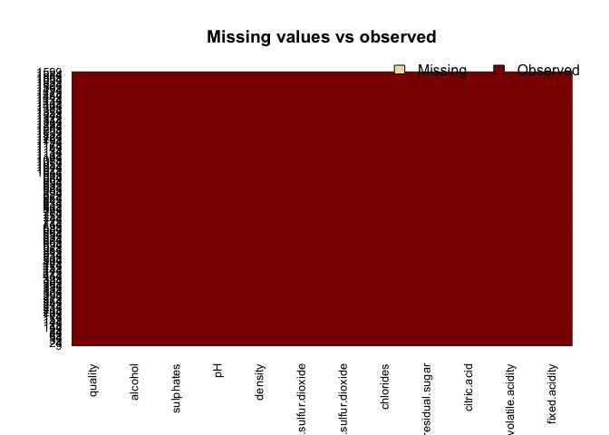

``` r
# lots of useful information about the dataset
glimpse(base_red) 
```

    ## Observations: 1,599
    ## Variables: 12
    ## $ fixed.acidity        <dbl> 7.4, 7.8, 7.8, 11.2, 7.4, 7.4, 7.9, 7.3, ...
    ## $ volatile.acidity     <dbl> 0.700, 0.880, 0.760, 0.280, 0.700, 0.660,...
    ## $ citric.acid          <dbl> 0.00, 0.00, 0.04, 0.56, 0.00, 0.00, 0.06,...
    ## $ residual.sugar       <dbl> 1.9, 2.6, 2.3, 1.9, 1.9, 1.8, 1.6, 1.2, 2...
    ## $ chlorides            <dbl> 0.076, 0.098, 0.092, 0.075, 0.076, 0.075,...
    ## $ free.sulfur.dioxide  <dbl> 11, 25, 15, 17, 11, 13, 15, 15, 9, 17, 15...
    ## $ total.sulfur.dioxide <dbl> 34, 67, 54, 60, 34, 40, 59, 21, 18, 102, ...
    ## $ density              <dbl> 0.9978, 0.9968, 0.9970, 0.9980, 0.9978, 0...
    ## $ pH                   <dbl> 3.51, 3.20, 3.26, 3.16, 3.51, 3.51, 3.30,...
    ## $ sulphates            <dbl> 0.56, 0.68, 0.65, 0.58, 0.56, 0.56, 0.46,...
    ## $ alcohol              <dbl> 9.4, 9.8, 9.8, 9.8, 9.4, 9.4, 9.4, 10.0, ...
    ## $ quality              <int> 5, 5, 5, 6, 5, 5, 5, 7, 7, 5, 5, 5, 5, 5,...

``` r
glimpse(base_white) 
```

    ## Observations: 4,898
    ## Variables: 12
    ## $ fixed.acidity        <dbl> 7.0, 6.3, 8.1, 7.2, 7.2, 8.1, 6.2, 7.0, 6...
    ## $ volatile.acidity     <dbl> 0.27, 0.30, 0.28, 0.23, 0.23, 0.28, 0.32,...
    ## $ citric.acid          <dbl> 0.36, 0.34, 0.40, 0.32, 0.32, 0.40, 0.16,...
    ## $ residual.sugar       <dbl> 20.70, 1.60, 6.90, 8.50, 8.50, 6.90, 7.00...
    ## $ chlorides            <dbl> 0.045, 0.049, 0.050, 0.058, 0.058, 0.050,...
    ## $ free.sulfur.dioxide  <dbl> 45, 14, 30, 47, 47, 30, 30, 45, 14, 28, 1...
    ## $ total.sulfur.dioxide <dbl> 170, 132, 97, 186, 186, 97, 136, 170, 132...
    ## $ density              <dbl> 1.0010, 0.9940, 0.9951, 0.9956, 0.9956, 0...
    ## $ pH                   <dbl> 3.00, 3.30, 3.26, 3.19, 3.19, 3.26, 3.18,...
    ## $ sulphates            <dbl> 0.45, 0.49, 0.44, 0.40, 0.40, 0.44, 0.47,...
    ## $ alcohol              <dbl> 8.8, 9.5, 10.1, 9.9, 9.9, 10.1, 9.6, 8.8,...
    ## $ quality              <int> 6, 6, 6, 6, 6, 6, 6, 6, 6, 6, 5, 5, 5, 7,...

``` r
# prints the first 5 rows
head(base_red) 
```

    ##   fixed.acidity volatile.acidity citric.acid residual.sugar chlorides
    ## 1           7.4             0.70        0.00            1.9     0.076
    ## 2           7.8             0.88        0.00            2.6     0.098
    ## 3           7.8             0.76        0.04            2.3     0.092
    ## 4          11.2             0.28        0.56            1.9     0.075
    ## 5           7.4             0.70        0.00            1.9     0.076
    ## 6           7.4             0.66        0.00            1.8     0.075
    ##   free.sulfur.dioxide total.sulfur.dioxide density   pH sulphates alcohol
    ## 1                  11                   34  0.9978 3.51      0.56     9.4
    ## 2                  25                   67  0.9968 3.20      0.68     9.8
    ## 3                  15                   54  0.9970 3.26      0.65     9.8
    ## 4                  17                   60  0.9980 3.16      0.58     9.8
    ## 5                  11                   34  0.9978 3.51      0.56     9.4
    ## 6                  13                   40  0.9978 3.51      0.56     9.4
    ##   quality
    ## 1       5
    ## 2       5
    ## 3       5
    ## 4       6
    ## 5       5
    ## 6       5

``` r
head(base_white)
```

    ##   fixed.acidity volatile.acidity citric.acid residual.sugar chlorides
    ## 1           7.0             0.27        0.36           20.7     0.045
    ## 2           6.3             0.30        0.34            1.6     0.049
    ## 3           8.1             0.28        0.40            6.9     0.050
    ## 4           7.2             0.23        0.32            8.5     0.058
    ## 5           7.2             0.23        0.32            8.5     0.058
    ## 6           8.1             0.28        0.40            6.9     0.050
    ##   free.sulfur.dioxide total.sulfur.dioxide density   pH sulphates alcohol
    ## 1                  45                  170  1.0010 3.00      0.45     8.8
    ## 2                  14                  132  0.9940 3.30      0.49     9.5
    ## 3                  30                   97  0.9951 3.26      0.44    10.1
    ## 4                  47                  186  0.9956 3.19      0.40     9.9
    ## 5                  47                  186  0.9956 3.19      0.40     9.9
    ## 6                  30                   97  0.9951 3.26      0.44    10.1
    ##   quality
    ## 1       6
    ## 2       6
    ## 3       6
    ## 4       6
    ## 5       6
    ## 6       6

The red and white wines have identical features, but they might have intrinsic differences to them. As such, we will fit one model for red and one for white. The red wine poses the bigger data paucity problem, so let's start there.

``` r
# let's look at the crosstab of our outcome variable of interest
base_red %>% janitor::tabyl(quality)
```

    ##  quality   n     percent
    ##        3  10 0.006253909
    ##        4  53 0.033145716
    ##        5 681 0.425891182
    ##        6 638 0.398999375
    ##        7 199 0.124452783
    ##        8  18 0.011257036

``` r
# take a look at the distribution of our target variable
hist(base_red$quality, breaks=unique(base_red$quality), col="red") 
```

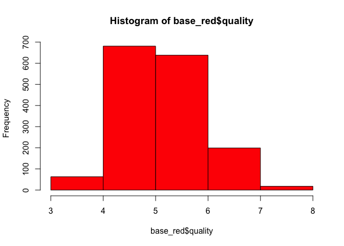

It looks from this like a wine quality rating of 8 is the rarest--what we might deem exceptional. Lets use this as our definition of an "excellent" wine.

Cleaning the Data
-----------------

``` r
library(janitor) #for data cleaning and tabular exploration
# Janitor also has a great tabular function (tabyl) that we'll use later https://github.com/sfirke/janitor

cleaned_red <- base_red %>%
  janitor::clean_names() %>% #converts to underscore case and cleans; already is in this instance %>%
  janitor::remove_empty(which = c("rows","cols")) %>% # drops all rows and columns that are entirely empty
  mutate(
    high_qual_flag = factor(ifelse(quality >= 8,1,0)) # creates flag for binary outcome
    )

head(cleaned_red)
```

    ##   fixed_acidity volatile_acidity citric_acid residual_sugar chlorides
    ## 1           7.4             0.70        0.00            1.9     0.076
    ## 2           7.8             0.88        0.00            2.6     0.098
    ## 3           7.8             0.76        0.04            2.3     0.092
    ## 4          11.2             0.28        0.56            1.9     0.075
    ## 5           7.4             0.70        0.00            1.9     0.076
    ## 6           7.4             0.66        0.00            1.8     0.075
    ##   free_sulfur_dioxide total_sulfur_dioxide density  p_h sulphates alcohol
    ## 1                  11                   34  0.9978 3.51      0.56     9.4
    ## 2                  25                   67  0.9968 3.20      0.68     9.8
    ## 3                  15                   54  0.9970 3.26      0.65     9.8
    ## 4                  17                   60  0.9980 3.16      0.58     9.8
    ## 5                  11                   34  0.9978 3.51      0.56     9.4
    ## 6                  13                   40  0.9978 3.51      0.56     9.4
    ##   quality high_qual_flag
    ## 1       5              0
    ## 2       5              0
    ## 3       5              0
    ## 4       6              0
    ## 5       5              0
    ## 6       5              0

Prepping Data
-------------

``` r
# split the data into training and testing sets
library(caret) # needed to createDataPartitions
```

    ## Loading required package: lattice

``` r
# Partition data: 80% of the data to train the model
set.seed(777)
in_train <- createDataPartition(y=cleaned_red$high_qual_flag, p=0.80, list=FALSE)

# splits the data into training and testing sets
training <- cleaned_red[in_train,]
testing<-cleaned_red[-in_train,]
# shows the row count and column count of the training set
dim(training)
```

    ## [1] 1280   13

Correlation Checks
==================

<https://cran.r-project.org/web/packages/corrplot/vignettes/corrplot-intro.html>

``` r
library(corrplot)
```

    ## corrplot 0.84 loaded

``` r
# should probably trim some size here
pairs(cleaned_red,col=cleaned_red$high_qual_flag)
```

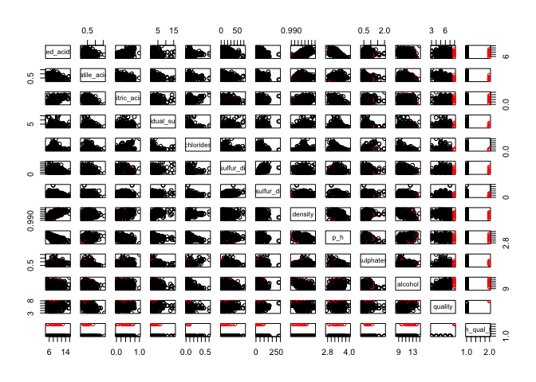

Logistic Regression
===================

<https://www.datacamp.com/community/tutorials/logistic-regression-R>

``` r
# simple logistic regression
logit_fit <- glm(high_qual_flag ~ . -quality, 
                 data = training, 
                 family = binomial)

summary(logit_fit)
```

    ## 
    ## Call:
    ## glm(formula = high_qual_flag ~ . - quality, family = binomial, 
    ##     data = training)
    ## 
    ## Deviance Residuals: 
    ##      Min        1Q    Median        3Q       Max  
    ## -1.16819  -0.11104  -0.05019  -0.02573   2.86543  
    ## 
    ## Coefficients:
    ##                        Estimate Std. Error z value Pr(>|z|)   
    ## (Intercept)           151.48792  371.73731   0.408  0.68363   
    ## fixed_acidity          -0.13366    0.45287  -0.295  0.76789   
    ## volatile_acidity        1.48821    2.51311   0.592  0.55373   
    ## citric_acid             2.21394    2.71250   0.816  0.41439   
    ## residual_sugar          0.04560    0.32314   0.141  0.88777   
    ## chlorides             -35.46187   19.58838  -1.810  0.07024 . 
    ## free_sulfur_dioxide     0.01609    0.04356   0.369  0.71191   
    ## total_sulfur_dioxide   -0.02141    0.01736  -1.233  0.21762   
    ## density              -152.86604  379.89499  -0.402  0.68740   
    ## p_h                    -4.99194    3.43638  -1.453  0.14631   
    ## sulphates               4.76736    1.64868   2.892  0.00383 **
    ## alcohol                 1.07718    0.45431   2.371  0.01774 * 
    ## ---
    ## Signif. codes:  0 '***' 0.001 '**' 0.01 '*' 0.05 '.' 0.1 ' ' 1
    ## 
    ## (Dispersion parameter for binomial family taken to be 1)
    ## 
    ##     Null deviance: 163.22  on 1279  degrees of freedom
    ## Residual deviance: 115.46  on 1268  degrees of freedom
    ## AIC: 139.46
    ## 
    ## Number of Fisher Scoring iterations: 9

``` r
# building a vector of probabilties that a certain wine is high quality 
logit_fit_probs <- predict(logit_fit,
                           newdata = testing,
                           type = "response")

head(logit_fit_probs)
```

    ##           21           22           24           29           30 
    ## 0.0002191739 0.0001463603 0.0002275093 0.0001680044 0.0005842347 
    ##           46 
    ## 0.0035124210

``` r
# building a vector of labels for high quality vs. not high quality 
logit_fit_predictions <- factor(ifelse(logit_fit_probs > 0.5, 1, 0),levels=c('0','1'))
head(logit_fit_predictions)
```

    ## 21 22 24 29 30 46 
    ##  0  0  0  0  0  0 
    ## Levels: 0 1

``` r
caret::confusionMatrix(logit_fit_predictions,testing$high_qual_flag, positive='1')
```

    ## Confusion Matrix and Statistics
    ## 
    ##           Reference
    ## Prediction   0   1
    ##          0 316   3
    ##          1   0   0
    ##                                           
    ##                Accuracy : 0.9906          
    ##                  95% CI : (0.9728, 0.9981)
    ##     No Information Rate : 0.9906          
    ##     P-Value [Acc > NIR] : 0.6472          
    ##                                           
    ##                   Kappa : 0               
    ##  Mcnemar's Test P-Value : 0.2482          
    ##                                           
    ##             Sensitivity : 0.000000        
    ##             Specificity : 1.000000        
    ##          Pos Pred Value :      NaN        
    ##          Neg Pred Value : 0.990596        
    ##              Prevalence : 0.009404        
    ##          Detection Rate : 0.000000        
    ##    Detection Prevalence : 0.000000        
    ##       Balanced Accuracy : 0.500000        
    ##                                           
    ##        'Positive' Class : 1               
    ## 

The problem is that we have a high success right but no successful positive predictions. We should be able to fix that with some fancier sampling methods.

Other Methods for Examining Model Fit and Accuracy
--------------------------------------------------

``` r
# some extra notes and techniques inspired by analytics day
# info from  http://ethen8181.github.io/machine-learning/unbalanced/unbalanced.html
library(InformationValue)
```

    ## 
    ## Attaching package: 'InformationValue'

    ## The following objects are masked from 'package:caret':
    ## 
    ##     confusionMatrix, precision, sensitivity, specificity

``` r
library(pROC)
```

    ## Type 'citation("pROC")' for a citation.

    ## 
    ## Attaching package: 'pROC'

    ## The following objects are masked from 'package:stats':
    ## 
    ##     cov, smooth, var

``` r
library(partykit)
```

    ## Loading required package: grid

``` r
library(ggthemes)
library(pscl) # for pR2 function
```

    ## Classes and Methods for R developed in the
    ## Political Science Computational Laboratory
    ## Department of Political Science
    ## Stanford University
    ## Simon Jackman
    ## hurdle and zeroinfl functions by Achim Zeileis

``` r
pR2(logit_fit) # McFadden Pseudo R Squared
```

    ##          llh      llhNull           G2     McFadden         r2ML 
    ## -57.73066784 -81.61024136  47.75914704   0.29260511   0.03662432 
    ##         r2CU 
    ##   0.30591480

``` r
# prediction testing 
prediction_train <- predict(logit_fit, newdata = training, type = "response" )
predictions_train_full <- data.frame(prediction = prediction_train, high_qual_flag = training$high_qual_flag)

prediction_test <- predict(logit_fit, newdata = testing, type = "response" )
predictions_test_full <- data.frame(prediction = prediction_test, high_qual_flag = testing$high_qual_flag)

# distribution of the prediction score grouped by known outcome
ggplot(predictions_train_full, aes(prediction_train, color = as.factor(training$high_qual_flag) ) ) + 
geom_density( size = 1 ) +
ggtitle( "Training Set's Predicted Score" ) + 
scale_color_economist( name = "data", labels = c( "negative", "positive" ) ) + 
theme_economist()
```

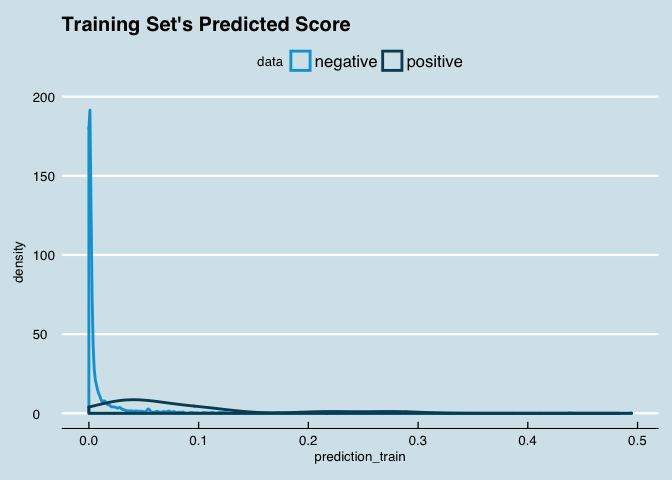

``` r
# distribution of the prediction score grouped by known outcome
ggplot(predictions_test_full, aes(prediction_test, color = as.factor(testing$high_qual_flag) ) ) + 
geom_density( size = 1 ) +
ggtitle( "Testing Set's Predicted Score" ) + 
scale_color_economist( name = "data", labels = c( "negative", "positive" ) ) + 
theme_economist()
```

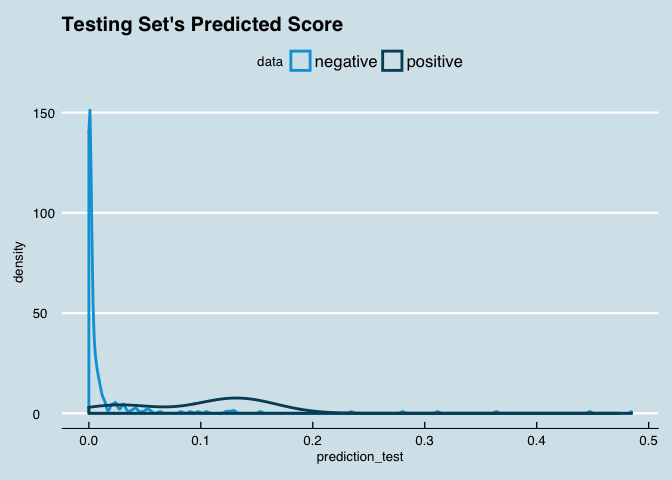

``` r
# code to find the optimal cutoff  
# functions are sourced in, to reduce document's length
source("useful_logit_functions.R")
```

    ## Loading required package: gplots

    ## 
    ## Attaching package: 'gplots'

    ## The following object is masked from 'package:stats':
    ## 
    ##     lowess

    ## 
    ## Attaching package: 'gridExtra'

    ## The following object is masked from 'package:dplyr':
    ## 
    ##     combine

    ## 
    ## Attaching package: 'data.table'

    ## The following objects are masked from 'package:dplyr':
    ## 
    ##     between, first, last

``` r
# prediction testing setup
prediction_train <- predict(logit_fit, newdata = training, type = "response" )
predictions_train_full <- data.frame(prediction = prediction_train, high_qual_flag = training$high_qual_flag)

prediction_test <- predict(logit_fit, newdata = testing, type = "response" )
predictions_test_full <- data.frame(prediction = prediction_test, high_qual_flag = testing$high_qual_flag)

# using function AccuracyCutoffInfo to test for optimal cutoff visually
accuracy_info <- AccuracyCutoffInfo(train = predictions_train_full, 
                                    test = predictions_test_full, 
                                    predict = "prediction", 
                                    actual = "high_qual_flag",
                                    cut_val_start = 0.01,
                                    cut_val_end = 0.9,
                                    by_step_size = 0.001)

accuracy_info$plot
```

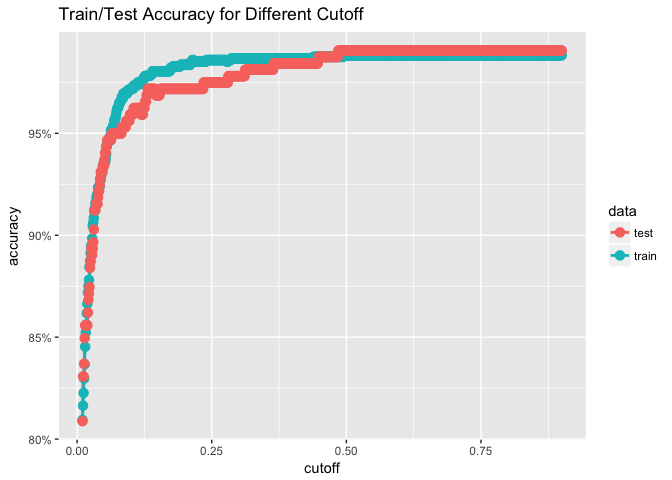

``` r
# Moving on To Using ROC Curves to pintpoint optimal cutoffs

# user-defined different cost for false negative and false positive
# here the assumption is that a false positive is 1/10th as costly as a false negative
cost_fp <- 10
cost_fn <- 100

roc_info <- ROCInfo(data = predictions_test_full, 
                    predict = "prediction", 
                    actual = "high_qual_flag", 
                    cost.fp = cost_fp, 
                    cost.fn = cost_fn )
```

``` r
grid.draw(roc_info$plot)
```

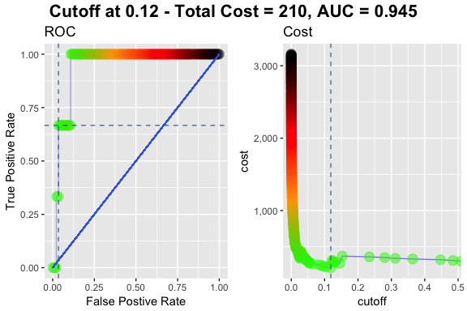

``` r
# visualize a particular cutoff (lowest point of the previous plot)
cm_info <- ConfusionMatrixInfo(data = predictions_test_full, 
                               predict = "prediction", 
                               actual = "high_qual_flag", 
                               cutoff = .12)

# shows what this information looks like
print(cm_info$data)
```

    ##      actual      predict type
    ##   1:      0 0.0002191739   TN
    ##   2:      0 0.0001463603   TN
    ##   3:      0 0.0002275093   TN
    ##   4:      0 0.0001680044   TN
    ##   5:      0 0.0005842347   TN
    ##  ---                         
    ## 315:      0 0.0017289133   TN
    ## 316:      0 0.0634788605   TN
    ## 317:      0 0.0066934610   TN
    ## 318:      0 0.0008828383   TN
    ## 319:      0 0.0012374098   TN

``` r
# prints the chart
cm_info$plot
```

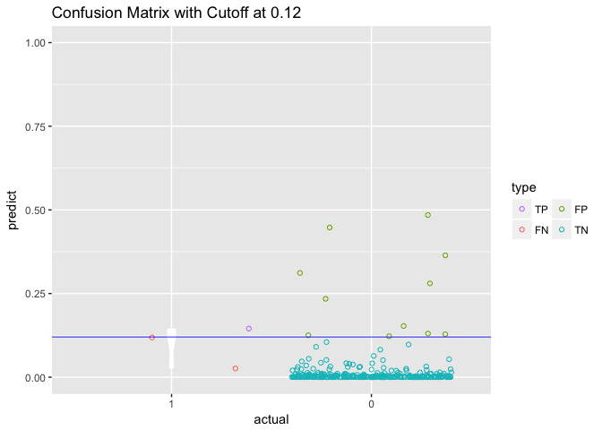

Now moving on to the upsampled model
====================================

``` r
up_train <- caret::upSample(select(training, -high_qual_flag), training$high_qual_flag)
up_train %>% janitor::tabyl(Class)
```

    ##  Class    n percent
    ##      0 1265     0.5
    ##      1 1265     0.5

``` r
# upsampled logistic regression
up_logit_fit <- glm(Class ~ . -quality, 
                 data = up_train, 
                 family = binomial)
```

    ## Warning: glm.fit: fitted probabilities numerically 0 or 1 occurred

``` r
summary(up_logit_fit)
```

    ## 
    ## Call:
    ## glm(formula = Class ~ . - quality, family = binomial, data = up_train)
    ## 
    ## Deviance Residuals: 
    ##     Min       1Q   Median       3Q      Max  
    ## -4.1545  -0.0670   0.0440   0.5348   0.8910  
    ## 
    ## Coefficients:
    ##                         Estimate  Std. Error z value             Pr(>|z|)
    ## (Intercept)           319.617436  113.231674   2.823              0.00476
    ## fixed_acidity           0.091119    0.113350   0.804              0.42147
    ## volatile_acidity        4.418386    0.948858   4.657      0.0000032158255
    ## citric_acid             7.200072    1.108968   6.493      0.0000000000844
    ## residual_sugar         -0.349289    0.120386  -2.901              0.00371
    ## chlorides            -102.438157    9.061559 -11.305 < 0.0000000000000002
    ## free_sulfur_dioxide     0.055903    0.012028   4.648      0.0000033529405
    ## total_sulfur_dioxide   -0.058091    0.006627  -8.766 < 0.0000000000000002
    ## density              -317.526234  115.233567  -2.756              0.00586
    ## p_h                    -9.051516    1.077381  -8.401 < 0.0000000000000002
    ## sulphates               8.661758    0.712028  12.165 < 0.0000000000000002
    ## alcohol                 2.091997    0.177925  11.758 < 0.0000000000000002
    ##                         
    ## (Intercept)          ** 
    ## fixed_acidity           
    ## volatile_acidity     ***
    ## citric_acid          ***
    ## residual_sugar       ** 
    ## chlorides            ***
    ## free_sulfur_dioxide  ***
    ## total_sulfur_dioxide ***
    ## density              ** 
    ## p_h                  ***
    ## sulphates            ***
    ## alcohol              ***
    ## ---
    ## Signif. codes:  0 '***' 0.001 '**' 0.01 '*' 0.05 '.' 0.1 ' ' 1
    ## 
    ## (Dispersion parameter for binomial family taken to be 1)
    ## 
    ##     Null deviance: 3507.3  on 2529  degrees of freedom
    ## Residual deviance: 1302.4  on 2518  degrees of freedom
    ## AIC: 1326.4
    ## 
    ## Number of Fisher Scoring iterations: 8

``` r
# building a vector of probabilties that a certain wine is high quality 
up_logit_fit_probs <- predict(up_logit_fit,
                           newdata = testing,
                           type = "response")

head(up_logit_fit_probs)
```

    ##            21            22            24            29            30 
    ## 0.00021098779 0.00002322363 0.00003055076 0.00003280269 0.00042289757 
    ##            46 
    ## 0.00942055585

``` r
# building a vector of labels for high quality vs. not high quality 
up_logit_fit_predictions <- factor(ifelse(up_logit_fit_probs > 0.5, 1, 0),levels=c('0','1'))
head(up_logit_fit_predictions)
```

    ## 21 22 24 29 30 46 
    ##  0  0  0  0  0  0 
    ## Levels: 0 1

``` r
caret::confusionMatrix(up_logit_fit_predictions,testing$high_qual_flag, positive='1')
```

    ## Confusion Matrix and Statistics
    ## 
    ##           Reference
    ## Prediction   0   1
    ##          0 271   0
    ##          1  45   3
    ##                                           
    ##                Accuracy : 0.8589          
    ##                  95% CI : (0.8158, 0.8952)
    ##     No Information Rate : 0.9906          
    ##     P-Value [Acc > NIR] : 1               
    ##                                           
    ##                   Kappa : 0.1017          
    ##  Mcnemar's Test P-Value : 0.00000000005412
    ##                                           
    ##             Sensitivity : 1.000000        
    ##             Specificity : 0.857595        
    ##          Pos Pred Value : 0.062500        
    ##          Neg Pred Value : 1.000000        
    ##              Prevalence : 0.009404        
    ##          Detection Rate : 0.009404        
    ##    Detection Prevalence : 0.150470        
    ##       Balanced Accuracy : 0.928797        
    ##                                           
    ##        'Positive' Class : 1               
    ## 

``` r
# condensed verison of model performance metrics for up-sampled model

pR2(up_logit_fit) # McFadden Pseudo R Squared
```

    ##           llh       llhNull            G2      McFadden          r2ML 
    ##  -651.1850774 -1753.6623668  2204.9545788     0.6286714     0.5816863 
    ##          r2CU 
    ##     0.7755817

``` r
# prediction testing for up-sampled logit
prediction_train <- predict(up_logit_fit, newdata = up_train, type = "response" )
predictions_train_full <- data.frame(prediction = prediction_train, high_qual_flag = up_train$Class)

prediction_test <- predict(up_logit_fit, newdata = testing, type = "response" )
predictions_test_full <- data.frame(prediction = prediction_test, high_qual_flag = testing$high_qual_flag)

# distribution of the prediction score grouped by known outcome
ggplot(predictions_train_full, aes(prediction_train, color = as.factor(up_train$Class) ) ) + 
geom_density( size = 1 ) +
ggtitle( "Training Set's Predicted Score" ) + 
scale_color_economist( name = "data", labels = c( "negative", "positive" ) ) + 
theme_economist()
```

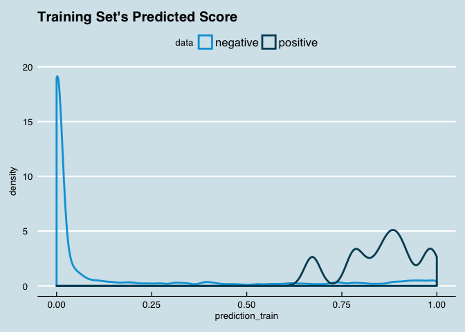

``` r
# distribution of the prediction score grouped by known outcome
ggplot(predictions_test_full, aes(prediction_test, color = as.factor(testing$high_qual_flag) ) ) + 
geom_density( size = 1 ) +
ggtitle( "Testing Set's Predicted Score" ) + 
scale_color_economist( name = "data", labels = c( "negative", "positive" ) ) + 
theme_economist()
```

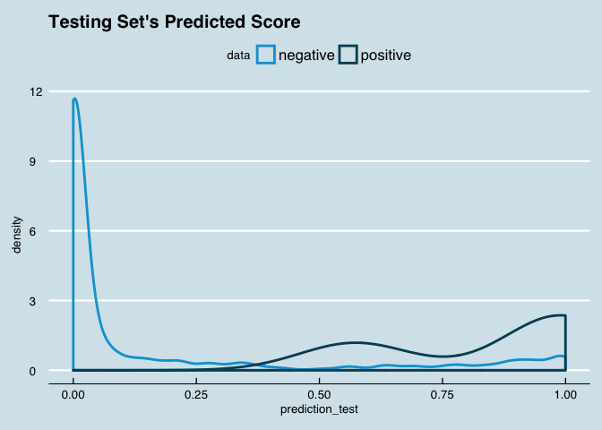

``` r
# code to find the optimal cutoff  
# functions are sourced in, to reduce document's length
source("useful_logit_functions.R")

# using function AccuracyCutoffInfo to test for optimal cutoff visually
accuracy_info <- AccuracyCutoffInfo(train = predictions_train_full, 
                                    test = predictions_test_full, 
                                    predict = "prediction", 
                                    actual = "high_qual_flag",
                                    cut_val_start = 0.01,
                                    cut_val_end = 0.9,
                                    by_step_size = 0.001)

accuracy_info$plot
```

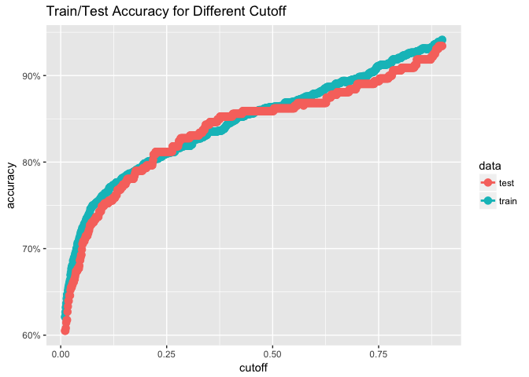

``` r
# Moving on To Using ROC Curves to pintpoint optimal cutoffs

# user-defined different cost for false negative and false positive
# here the assumption is that a false positive is 1/10th as costly as a false negative
cost_fp <- 10
cost_fn <- 100

roc_info <- ROCInfo(data = predictions_test_full, 
                    predict = "prediction", 
                    actual = "high_qual_flag", 
                    cost.fp = cost_fp, 
                    cost.fn = cost_fn )
```

``` r
grid.draw(roc_info$plot)
```

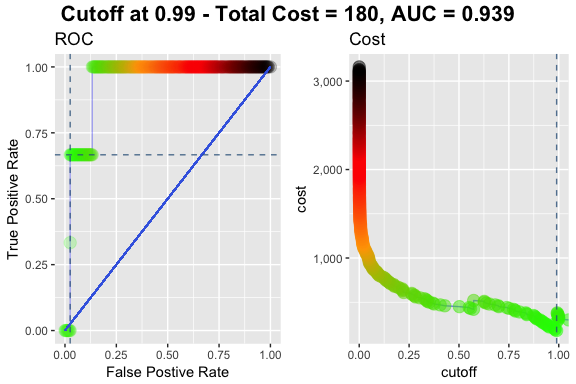

``` r
# visualize a particular cutoff (lowest point of the previous plot)
cm_info <- ConfusionMatrixInfo(data = predictions_test_full, 
                               predict = "prediction", 
                               actual = "high_qual_flag", 
                               cutoff = .99)

# shows what this information looks like
print(cm_info$data)
```

    ##      actual       predict type
    ##   1:      0 0.00021098779   TN
    ##   2:      0 0.00002322363   TN
    ##   3:      0 0.00003055076   TN
    ##   4:      0 0.00003280269   TN
    ##   5:      0 0.00042289757   TN
    ##  ---                          
    ## 315:      0 0.00002917165   TN
    ## 316:      0 0.94968506801   TN
    ## 317:      0 0.11217428898   TN
    ## 318:      0 0.00059851273   TN
    ## 319:      0 0.00203923375   TN

``` r
# prints the chart
cm_info$plot
```

    ## Warning: Removed 3 rows containing missing values (geom_point).

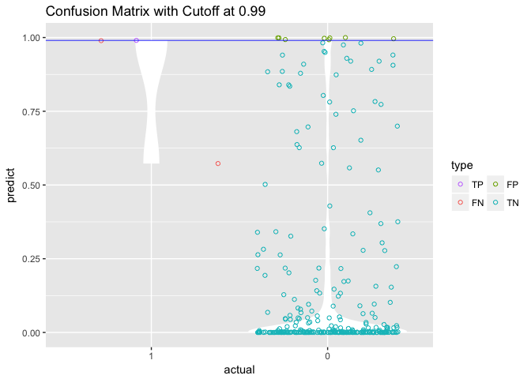

Trying SMOTE
------------

``` r
library(DMwR)

# both upsampling and downsampling via SMOTE
smote_train <- DMwR::SMOTE(high_qual_flag ~ ., data=as.data.frame(training))
janitor::tabyl(smote_train$high_qual_flag)
```

    ##  smote_train$high_qual_flag  n   percent
    ##                           0 60 0.5714286
    ##                           1 45 0.4285714

``` r
# logistic regression built using smote data
smote_logit_fit <- glm(high_qual_flag ~ . -quality, 
                 data = smote_train, 
                 family = binomial)
```

    ## Warning: glm.fit: fitted probabilities numerically 0 or 1 occurred

``` r
summary(smote_logit_fit)
```

    ## 
    ## Call:
    ## glm(formula = high_qual_flag ~ . - quality, family = binomial, 
    ##     data = smote_train)
    ## 
    ## Deviance Residuals: 
    ##     Min       1Q   Median       3Q      Max  
    ## -3.3563  -0.0126  -0.0001   0.1711   1.0430  
    ## 
    ## Coefficients:
    ##                        Estimate Std. Error z value Pr(>|z|)   
    ## (Intercept)           142.23205  898.80796   0.158  0.87426   
    ## fixed_acidity           0.27273    0.95797   0.285  0.77587   
    ## volatile_acidity       24.89468   10.34238   2.407  0.01608 * 
    ## citric_acid            20.43269   12.21933   1.672  0.09449 . 
    ## residual_sugar         -0.01172    1.15235  -0.010  0.99188   
    ## chlorides            -191.33430   80.56404  -2.375  0.01755 * 
    ## free_sulfur_dioxide     0.18115    0.15432   1.174  0.24045   
    ## total_sulfur_dioxide   -0.12159    0.08620  -1.411  0.15834   
    ## density              -163.08522  921.56859  -0.177  0.85954   
    ## p_h                   -15.47885    9.49470  -1.630  0.10305   
    ## sulphates              20.91159    7.76320   2.694  0.00707 **
    ## alcohol                 4.35363    1.80336   2.414  0.01577 * 
    ## ---
    ## Signif. codes:  0 '***' 0.001 '**' 0.01 '*' 0.05 '.' 0.1 ' ' 1
    ## 
    ## (Dispersion parameter for binomial family taken to be 1)
    ## 
    ##     Null deviance: 143.411  on 104  degrees of freedom
    ## Residual deviance:  30.008  on  93  degrees of freedom
    ## AIC: 54.008
    ## 
    ## Number of Fisher Scoring iterations: 9

``` r
# testing the smote fit logit
# building a vector of probabilties that a certain wine is high quality 
smote_logit_fit_probs <- predict(smote_logit_fit,
                           newdata = testing,
                           type = "response")

head(smote_logit_fit_probs)
```

    ##                  21                  22                  24 
    ## 0.00000000232017746 0.00000000056754222 0.00000000008045897 
    ##                  29                  30                  46 
    ## 0.00000000497064529 0.00000016689215600 0.00001759883396297

``` r
# building a vector of labels for high quality vs. not high quality 
smote_logit_fit_predictions <- factor(ifelse(smote_logit_fit_probs > 0.5, 1, 0),levels=c('0','1'))
head(smote_logit_fit_predictions)
```

    ## 21 22 24 29 30 46 
    ##  0  0  0  0  0  0 
    ## Levels: 0 1

``` r
caret::confusionMatrix(smote_logit_fit_predictions,testing$high_qual_flag, positive='1')
```

    ## Confusion Matrix and Statistics
    ## 
    ##           Reference
    ## Prediction   0   1
    ##          0 272   1
    ##          1  44   2
    ##                                           
    ##                Accuracy : 0.8589          
    ##                  95% CI : (0.8158, 0.8952)
    ##     No Information Rate : 0.9906          
    ##     P-Value [Acc > NIR] : 1               
    ##                                           
    ##                   Kappa : 0.0651          
    ##  Mcnemar's Test P-Value : 0.0000000003825 
    ##                                           
    ##             Sensitivity : 0.666667        
    ##             Specificity : 0.860759        
    ##          Pos Pred Value : 0.043478        
    ##          Neg Pred Value : 0.996337        
    ##              Prevalence : 0.009404        
    ##          Detection Rate : 0.006270        
    ##    Detection Prevalence : 0.144201        
    ##       Balanced Accuracy : 0.763713        
    ##                                           
    ##        'Positive' Class : 1               
    ## 

``` r
# now trimming Smote

smote_logit_fit <- glm(high_qual_flag ~ . -quality-residual_sugar-density-fixed_acidity-free_sulfur_dioxide-total_sulfur_dioxide, 
                 data = smote_train, 
                 family = binomial)
```

    ## Warning: glm.fit: fitted probabilities numerically 0 or 1 occurred

``` r
summary(smote_logit_fit)
```

    ## 
    ## Call:
    ## glm(formula = high_qual_flag ~ . - quality - residual_sugar - 
    ##     density - fixed_acidity - free_sulfur_dioxide - total_sulfur_dioxide, 
    ##     family = binomial, data = smote_train)
    ## 
    ## Deviance Residuals: 
    ##     Min       1Q   Median       3Q      Max  
    ## -3.2665  -0.0606  -0.0005   0.1294   1.2115  
    ## 
    ## Coefficients:
    ##                  Estimate Std. Error z value Pr(>|z|)    
    ## (Intercept)        -5.904     17.849  -0.331 0.740823    
    ## volatile_acidity   22.080      9.292   2.376 0.017486 *  
    ## citric_acid        16.467      7.784   2.116 0.034382 *  
    ## chlorides        -181.959     67.680  -2.689 0.007177 ** 
    ## p_h               -16.346      6.375  -2.564 0.010348 *  
    ## sulphates          16.050      5.470   2.934 0.003348 ** 
    ## alcohol             3.948      1.135   3.479 0.000504 ***
    ## ---
    ## Signif. codes:  0 '***' 0.001 '**' 0.01 '*' 0.05 '.' 0.1 ' ' 1
    ## 
    ## (Dispersion parameter for binomial family taken to be 1)
    ## 
    ##     Null deviance: 143.411  on 104  degrees of freedom
    ## Residual deviance:  32.832  on  98  degrees of freedom
    ## AIC: 46.832
    ## 
    ## Number of Fisher Scoring iterations: 8

``` r
# building a vector of probabilties that a certain wine is high quality 
smote_logit_fit_probs <- predict(smote_logit_fit,
                           newdata = testing,
                           type = "response")

head(smote_logit_fit_probs)
```

    ##               21               22               24               29 
    ## 0.00000004340318 0.00000012154149 0.00000038835710 0.00000017299032 
    ##               30               46 
    ## 0.00000114855228 0.00794944616392

``` r
# building a vector of labels for high quality vs. not high quality 
smote_logit_fit_predictions <- factor(ifelse(smote_logit_fit_probs > 0.5, 1, 0),levels=c('0','1'))
head(smote_logit_fit_predictions)
```

    ## 21 22 24 29 30 46 
    ##  0  0  0  0  0  0 
    ## Levels: 0 1

``` r
caret::confusionMatrix(smote_logit_fit_predictions,testing$high_qual_flag, positive='1')
```

    ## Confusion Matrix and Statistics
    ## 
    ##           Reference
    ## Prediction   0   1
    ##          0 261   1
    ##          1  55   2
    ##                                            
    ##                Accuracy : 0.8245           
    ##                  95% CI : (0.7782, 0.8646) 
    ##     No Information Rate : 0.9906           
    ##     P-Value [Acc > NIR] : 1                
    ##                                            
    ##                   Kappa : 0.0497           
    ##  Mcnemar's Test P-Value : 0.000000000001417
    ##                                            
    ##             Sensitivity : 0.666667         
    ##             Specificity : 0.825949         
    ##          Pos Pred Value : 0.035088         
    ##          Neg Pred Value : 0.996183         
    ##              Prevalence : 0.009404         
    ##          Detection Rate : 0.006270         
    ##    Detection Prevalence : 0.178683         
    ##       Balanced Accuracy : 0.746308         
    ##                                            
    ##        'Positive' Class : 1                
    ## 

``` r
# condensed verison of model performance metrics for up-sampled model

pR2(smote_logit_fit) # McFadden Pseudo R Squared
```

    ##         llh     llhNull          G2    McFadden        r2ML        r2CU 
    ## -16.4158515 -71.7053510 110.5789989   0.7710652   0.6511570   0.8742385

``` r
# prediction testing for up-sampled logit
prediction_train <- predict(smote_logit_fit, newdata = smote_train, type = "response" )
predictions_train_full <- data.frame(prediction = prediction_train, high_qual_flag = smote_train$high_qual_flag)

prediction_test <- predict(smote_logit_fit, newdata = testing, type = "response" )
predictions_test_full <- data.frame(prediction = prediction_test, high_qual_flag = testing$high_qual_flag)

# distribution of the prediction score grouped by known outcome
ggplot(predictions_train_full, aes(prediction_train, color = as.factor(smote_train$high_qual_flag) ) ) + 
geom_density( size = 1 ) +
ggtitle( "Training Set's Predicted Score" ) + 
scale_color_economist( name = "data", labels = c( "negative", "positive" ) ) + 
theme_economist()
```

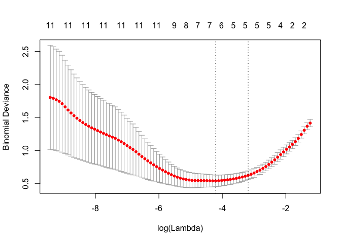

``` r
# distribution of the prediction score grouped by known outcome
ggplot(predictions_test_full, aes(prediction_test, color = as.factor(testing$high_qual_flag) ) ) + 
geom_density( size = 1 ) +
ggtitle( "Testing Set's Predicted Score" ) + 
scale_color_economist( name = "data", labels = c( "negative", "positive" ) ) + 
theme_economist()
```

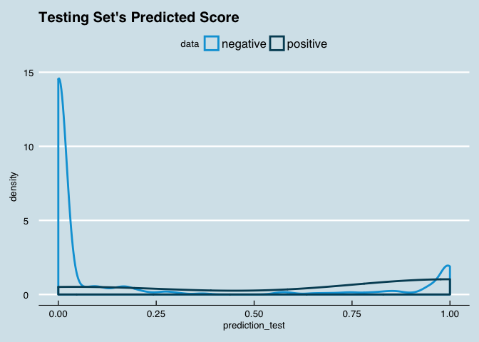

``` r
# code to find the optimal cutoff  
# functions are sourced in, to reduce document's length
source("useful_logit_functions.R")

# using function AccuracyCutoffInfo to test for optimal cutoff visually
accuracy_info <- AccuracyCutoffInfo(train = predictions_train_full, 
                                    test = predictions_test_full, 
                                    predict = "prediction", 
                                    actual = "high_qual_flag",
                                    cut_val_start = 0.01,
                                    cut_val_end = 0.9,
                                    by_step_size = 0.001)

accuracy_info$plot
```

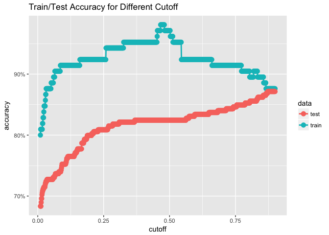

``` r
# Moving on To Using ROC Curves to pintpoint optimal cutoffs

# user-defined different cost for false negative and false positive
# here the assumption is that a false positive is 1/10th as costly as a false negative
cost_fp <- 10
cost_fn <- 100

roc_info <- ROCInfo(data = predictions_test_full, 
                    predict = "prediction", 
                    actual = "high_qual_flag", 
                    cost.fp = cost_fp, 
                    cost.fn = cost_fn )
```

``` r
grid.draw(roc_info$plot)
```

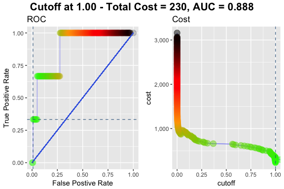

``` r
# visualize a particular cutoff (lowest point of the previous plot)
cm_info <- ConfusionMatrixInfo(data = predictions_test_full, 
                               predict = "prediction", 
                               actual = "high_qual_flag", 
                               cutoff = .99)

# shows what this information looks like
print(cm_info$data)
```

    ##      actual          predict type
    ##   1:      0 0.00000004340318   TN
    ##   2:      0 0.00000012154149   TN
    ##   3:      0 0.00000038835710   TN
    ##   4:      0 0.00000017299032   TN
    ##   5:      0 0.00000114855228   TN
    ##  ---                             
    ## 315:      0 0.00262587091072   TN
    ## 316:      0 0.99193368834756   FP
    ## 317:      0 0.00482775634675   TN
    ## 318:      0 0.00000159222377   TN
    ## 319:      0 0.00004414210426   TN

``` r
# prints the chart
cm_info$plot
```

    ## Warning: Removed 5 rows containing missing values (geom_point).

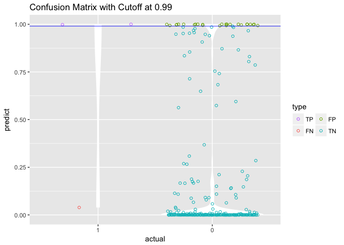

Now trying ROSE
---------------

``` r
library(ROSE)
```

    ## Loaded ROSE 0.0-3

``` r
# using ROSE to generate training set 
rose_train <- ROSE::ROSE(high_qual_flag~., data=training)$data
table(rose_train$high_qual_flag)
```

    ## 
    ##   0   1 
    ## 651 629

``` r
# logistic regression built using ROSE data
rose_logit_fit <- glm(high_qual_flag ~ . -quality, 
                 data = rose_train, 
                 family = binomial)

summary(rose_logit_fit)
```

    ## 
    ## Call:
    ## glm(formula = high_qual_flag ~ . - quality, family = binomial, 
    ##     data = rose_train)
    ## 
    ## Deviance Residuals: 
    ##      Min        1Q    Median        3Q       Max  
    ## -2.97434  -0.53602  -0.04272   0.65981   2.35558  
    ## 
    ## Coefficients:
    ##                         Estimate  Std. Error z value             Pr(>|z|)
    ## (Intercept)           168.144064   38.626019   4.353      0.0000134207820
    ## fixed_acidity           0.166791    0.044604   3.739             0.000184
    ## volatile_acidity       -1.230110    0.484742  -2.538             0.011160
    ## citric_acid             1.765355    0.426633   4.138      0.0000350533775
    ## residual_sugar         -0.065855    0.062451  -1.055             0.291652
    ## chlorides             -23.834074    3.527561  -6.757      0.0000000000141
    ## free_sulfur_dioxide    -0.001213    0.006442  -0.188             0.850610
    ## total_sulfur_dioxide   -0.006365    0.002647  -2.405             0.016191
    ## density              -175.232790   38.758223  -4.521      0.0000061496704
    ## p_h                    -1.742901    0.419925  -4.151      0.0000331747737
    ## sulphates               4.402247    0.486416   9.050 < 0.0000000000000002
    ## alcohol                 0.855341    0.067135  12.741 < 0.0000000000000002
    ##                         
    ## (Intercept)          ***
    ## fixed_acidity        ***
    ## volatile_acidity     *  
    ## citric_acid          ***
    ## residual_sugar          
    ## chlorides            ***
    ## free_sulfur_dioxide     
    ## total_sulfur_dioxide *  
    ## density              ***
    ## p_h                  ***
    ## sulphates            ***
    ## alcohol              ***
    ## ---
    ## Signif. codes:  0 '***' 0.001 '**' 0.01 '*' 0.05 '.' 0.1 ' ' 1
    ## 
    ## (Dispersion parameter for binomial family taken to be 1)
    ## 
    ##     Null deviance: 1774.1  on 1279  degrees of freedom
    ## Residual deviance: 1039.1  on 1268  degrees of freedom
    ## AIC: 1063.1
    ## 
    ## Number of Fisher Scoring iterations: 6

``` r
# testing the rose fit logit
# building a vector of probabilties that a certain wine is high quality 
rose_logit_fit_probs <- predict(rose_logit_fit,
                           newdata = testing,
                           type = "response")

head(rose_logit_fit_probs)
```

    ##         21         22         24         29         30         46 
    ## 0.08527859 0.04739785 0.03692142 0.01559201 0.04481631 0.37386419

``` r
# building a vector of labels for high quality vs. not high quality 
rose_logit_fit_predictions <- factor(ifelse(rose_logit_fit_probs > 0.5, 1, 0),levels=c('0','1'))
head(rose_logit_fit_predictions)
```

    ## 21 22 24 29 30 46 
    ##  0  0  0  0  0  0 
    ## Levels: 0 1

``` r
caret::confusionMatrix(rose_logit_fit_predictions,testing$high_qual_flag, positive='1')
```

    ## Confusion Matrix and Statistics
    ## 
    ##           Reference
    ## Prediction   0   1
    ##          0 260   0
    ##          1  56   3
    ##                                             
    ##                Accuracy : 0.8245            
    ##                  95% CI : (0.7782, 0.8646)  
    ##     No Information Rate : 0.9906            
    ##     P-Value [Acc > NIR] : 1                 
    ##                                             
    ##                   Kappa : 0.0803            
    ##  Mcnemar's Test P-Value : 0.0000000000001987
    ##                                             
    ##             Sensitivity : 1.000000          
    ##             Specificity : 0.822785          
    ##          Pos Pred Value : 0.050847          
    ##          Neg Pred Value : 1.000000          
    ##              Prevalence : 0.009404          
    ##          Detection Rate : 0.009404          
    ##    Detection Prevalence : 0.184953          
    ##       Balanced Accuracy : 0.911392          
    ##                                             
    ##        'Positive' Class : 1                 
    ## 

Penalized Logistic Regression
=============================

<http://www.sthda.com/english/articles/36-classification-methods-essentials/149-penalized-logistic-regression-essentials-in-r-ridge-lasso-and-elastic-net/>

``` r
library(glmnet)
```

    ## Loading required package: Matrix

    ## Loading required package: foreach

    ## Loaded glmnet 2.0-13

    ## 
    ## Attaching package: 'glmnet'

    ## The following object is masked from 'package:pROC':
    ## 
    ##     auc

``` r
# Dumy code categorical predictor variables
x <- model.matrix(high_qual_flag~.-quality, smote_train)
# Convert the outcome (class) to a numerical variable
y <- smote_train$high_qual_flag

# Find the best lambda using cross-validation
set.seed(123) 
cv.lasso <- cv.glmnet(x, y, alpha = 1, family = "binomial")
# Fit the final model on the training data
model <- glmnet(x, y, alpha = 1, family = "binomial",
                lambda = cv.lasso$lambda.min)

# Display regression coefficients
coef(model)
```

    ## 13 x 1 sparse Matrix of class "dgCMatrix"
    ##                                  s0
    ## (Intercept)            0.8426539919
    ## (Intercept)            .           
    ## fixed_acidity          .           
    ## volatile_acidity       .           
    ## citric_acid            1.6081249994
    ## residual_sugar         .           
    ## chlorides            -44.3754188879
    ## free_sulfur_dioxide   -0.0047555214
    ## total_sulfur_dioxide  -0.0008643697
    ## density                .           
    ## p_h                   -6.7922205609
    ## sulphates              7.9016906426
    ## alcohol                1.6153204770

``` r
# Make predictions on the test data
x.test <- model.matrix(high_qual_flag ~.-quality, testing)
probabilities <- model %>% predict(newx = x.test)
predicted.classes <- ifelse(probabilities > 0.5, 1, 0)
# Model accuracy
observed.classes <- testing$high_qual_flag
mean(predicted.classes == observed.classes)
```

    ## [1] 0.8683386

``` r
# Find the optimal value of lambda that minimizes the cross-validation error:
library(glmnet)
set.seed(123)
cv.lasso <- cv.glmnet(x, y, alpha = 1, family = "binomial")
plot(cv.lasso)
```

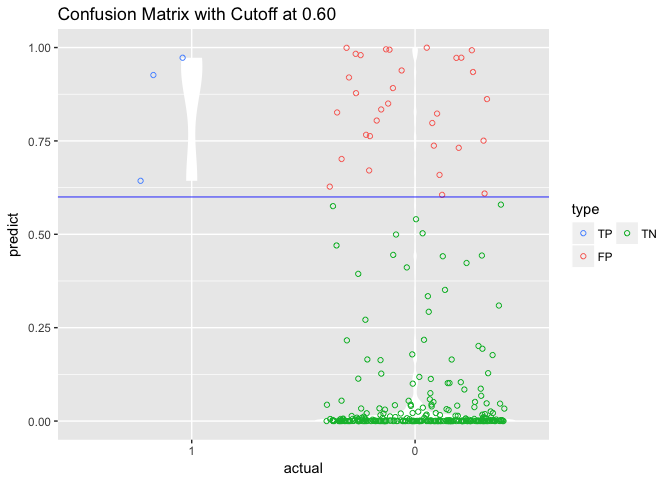

``` r
# we have two common choices for lambda here, lambda min and lambda lse
# lambda min is the value that minimizes the prediction error
cv.lasso$lambda.min
```

    ## [1] 0.01483883

``` r
# showing coefficients using lambda min
coef(cv.lasso, cv.lasso$lambda.min)
```

    ## 13 x 1 sparse Matrix of class "dgCMatrix"
    ##                                   1
    ## (Intercept)            0.8402788337
    ## (Intercept)            .           
    ## fixed_acidity          .           
    ## volatile_acidity       .           
    ## citric_acid            1.6087309313
    ## residual_sugar         .           
    ## chlorides            -44.3801292910
    ## free_sulfur_dioxide   -0.0047310675
    ## total_sulfur_dioxide  -0.0008720952
    ## density                .           
    ## p_h                   -6.7912284687
    ## sulphates              7.9021629412
    ## alcohol                1.6152212919

``` r
# lambda lse gives the simplest model but also lies within one SE of the optimal value of lambda
cv.lasso$lambda.1se
```

    ## [1] 0.04128993

``` r
# showing coefficients using lambda min
coef(cv.lasso, cv.lasso$lambda.1se)
```

    ## 13 x 1 sparse Matrix of class "dgCMatrix"
    ##                                1
    ## (Intercept)           -3.0877571
    ## (Intercept)            .        
    ## fixed_acidity          .        
    ## volatile_acidity       .        
    ## citric_acid            0.8741794
    ## residual_sugar         .        
    ## chlorides            -15.9767685
    ## free_sulfur_dioxide    .        
    ## total_sulfur_dioxide   .        
    ## density                .        
    ## p_h                   -3.7926291
    ## sulphates              5.5814540
    ## alcohol                1.0894311

``` r
library(broom)
```

    ## 
    ## Attaching package: 'broom'

    ## The following object is masked from 'package:DMwR':
    ## 
    ##     bootstrap

``` r
# compute model using lambda min
# Final model with lambda.min
lasso.model <- glmnet(x, y, alpha = 1, family = "binomial",
                      lambda = cv.lasso$lambda.min)

broom::tidy(lasso.model)
```

    ##                   term step       estimate     lambda dev.ratio
    ## 1          (Intercept)    1   0.8426539919 0.01483883 0.6810093
    ## 2          citric_acid    1   1.6081249994 0.01483883 0.6810093
    ## 3            chlorides    1 -44.3754188879 0.01483883 0.6810093
    ## 4  free_sulfur_dioxide    1  -0.0047555214 0.01483883 0.6810093
    ## 5 total_sulfur_dioxide    1  -0.0008643697 0.01483883 0.6810093
    ## 6                  p_h    1  -6.7922205609 0.01483883 0.6810093
    ## 7            sulphates    1   7.9016906426 0.01483883 0.6810093
    ## 8              alcohol    1   1.6153204770 0.01483883 0.6810093

``` r
# Make prediction on test data
x.test <- model.matrix(high_qual_flag ~.-quality, testing)
probabilities <- model %>% predict(newx = x.test)
predicted.classes <- factor(ifelse(probabilities > 0.5, 1, 0))
# Model accuracy
observed.classes <- testing$high_qual_flag
mean(predicted.classes == observed.classes)
```

    ## [1] 0.8683386

``` r
caret::confusionMatrix(predicted.classes, observed.classes, positive='1')
```

    ## Confusion Matrix and Statistics
    ## 
    ##           Reference
    ## Prediction   0   1
    ##          0 275   1
    ##          1  41   2
    ##                                           
    ##                Accuracy : 0.8683          
    ##                  95% CI : (0.8262, 0.9034)
    ##     No Information Rate : 0.9906          
    ##     P-Value [Acc > NIR] : 1               
    ##                                           
    ##                   Kappa : 0.0706          
    ##  Mcnemar's Test P-Value : 0.000000001768  
    ##                                           
    ##             Sensitivity : 0.666667        
    ##             Specificity : 0.870253        
    ##          Pos Pred Value : 0.046512        
    ##          Neg Pred Value : 0.996377        
    ##              Prevalence : 0.009404        
    ##          Detection Rate : 0.006270        
    ##    Detection Prevalence : 0.134796        
    ##       Balanced Accuracy : 0.768460        
    ##                                           
    ##        'Positive' Class : 1               
    ##
