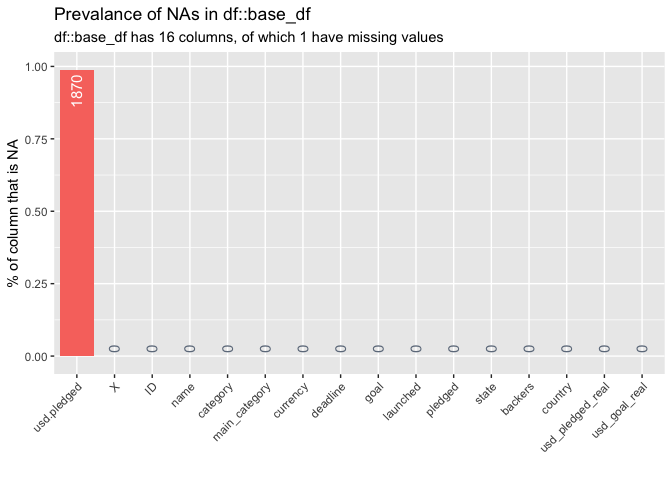
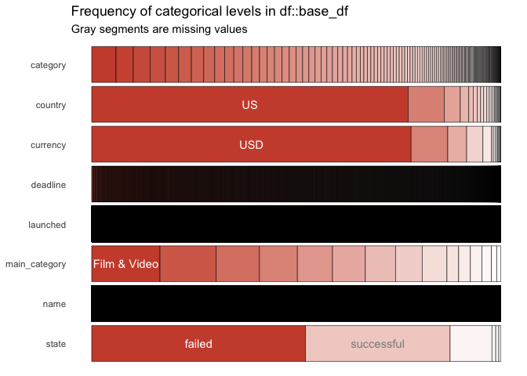
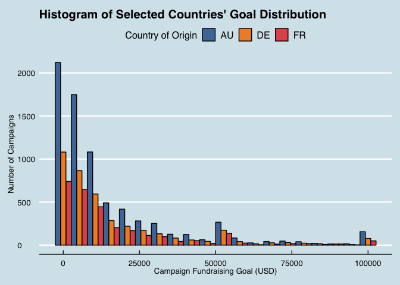
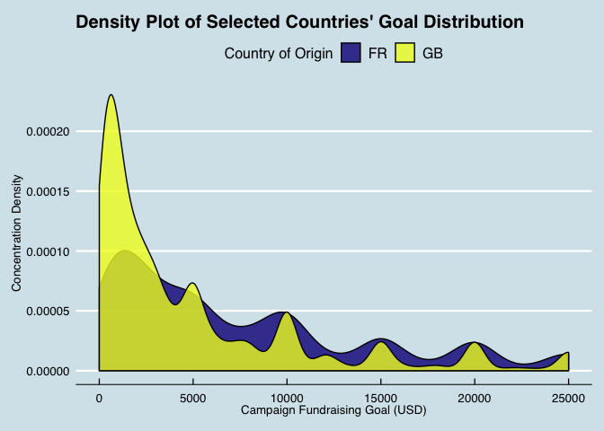
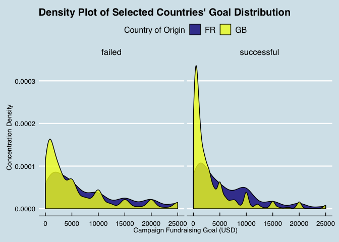

Exploratory Data Analysis (EDA) and Visualization
================
Paul Jeffries
05 September, 2018

-   [Introduction](#introduction)
    -   [Setup](#setup)
-   [Importing, Exploring, and Cleaning the Data](#importing-exploring-and-cleaning-the-data)
    -   [Importing the Data](#importing-the-data)
    -   [Exploring and Cleaning the Data](#exploring-and-cleaning-the-data)
-   [Summary Statistics](#summary-statistics)
    -   [High-Level Summary Stats](#high-level-summary-stats)
-   [Histograms](#histograms)
    -   [Simple Multi-Category Histogram](#simple-multi-category-histogram)
    -   [Multi-Category Histogram with Custom-Delimited-Buckets](#multi-category-histogram-with-custom-delimited-buckets)
-   [Density Plots](#density-plots)
    -   [2 Probability Density Functions (PDFs) Compared](#probability-density-functions-pdfs-compared)
    -   [3 PDFs Compared w/ Facets](#pdfs-compared-w-facets)

**NOTE: this is an early work in progress. Check back shortly for new additions**

Introduction
============

The purpose of this document is to serve as a smorgasbord of EDA techniques and visualization tools.

Setup
-----

``` r
# first a few general setup / housekeeping items
# setting scipen options to kill all use of scientific notation
options(scipen = 999)

# basic packages needed throughout:
library(plyr) # always load prior to dplyr / tidyverse if needed
library(tidyverse) # for all things tidy 
library(janitor) # for data cleaning and some utility functions
library(DataExplorer) # allows for creation of missing values map
library(RCurl) # Provides functions to allow one to compose general HTTP requests, etc. in R
library(broom) # for tidy modeling and displaying of model / test results 
library(ggthemes) # for more custom ggplot themes
# if I reference functions that are more niche, I will call them explicitly in-line as well
```

Importing, Exploring, and Cleaning the Data
===========================================

Importing the Data
------------------

The data used in this document come from a [Kaggle post](https://www.kaggle.com/kemical/kickstarter-projects/home) focused on Kickstarter campaigns. If unfamiliar with the notion of a Kickstarter campaign (henceforth just campaign), I would recommend reading [this FAQ here](https://help.kickstarter.com/hc/en-us/categories/115000499013-Kickstarter-basics). I will not spend a great deal of time explaining the data, so for more information on the data specifically, I recommend reading the detailed exploration on the [data page for this Kaggle](https://www.kaggle.com/kemical/kickstarter-projects).

``` r
# importing the dataset from the CSV
base_df <- read.csv("./hypothesis_tests/data/ks-projects-201801.csv")
```

``` r
# taking a preliminary look at the structure of the dataset
glimpse(base_df)
```

    ## Observations: 378,661
    ## Variables: 15
    ## $ ID               <int> 1000002330, 1000003930, 1000004038, 100000754...
    ## $ name             <fct> The Songs of Adelaide & Abullah, Greeting Fro...
    ## $ category         <fct> Poetry, Narrative Film, Narrative Film, Music...
    ## $ main_category    <fct> Publishing, Film & Video, Film & Video, Music...
    ## $ currency         <fct> GBP, USD, USD, USD, USD, USD, USD, USD, USD, ...
    ## $ deadline         <fct> 2015-10-09, 2017-11-01, 2013-02-26, 2012-04-1...
    ## $ goal             <dbl> 1000, 30000, 45000, 5000, 19500, 50000, 1000,...
    ## $ launched         <fct> 2015-08-11 12:12:28, 2017-09-02 04:43:57, 201...
    ## $ pledged          <dbl> 0.00, 2421.00, 220.00, 1.00, 1283.00, 52375.0...
    ## $ state            <fct> failed, failed, failed, failed, canceled, suc...
    ## $ backers          <int> 0, 15, 3, 1, 14, 224, 16, 40, 58, 43, 0, 100,...
    ## $ country          <fct> GB, US, US, US, US, US, US, US, US, US, CA, U...
    ## $ usd.pledged      <dbl> 0.00, 100.00, 220.00, 1.00, 1283.00, 52375.00...
    ## $ usd_pledged_real <dbl> 0.00, 2421.00, 220.00, 1.00, 1283.00, 52375.0...
    ## $ usd_goal_real    <dbl> 1533.95, 30000.00, 45000.00, 5000.00, 19500.0...

Exploring and Cleaning the Data
-------------------------------

### Dealing with NULLs

First, we'll conduct some broad cleaning. Using the [janitor package](https://github.com/sfirke/janitor) I will clean up the variable names (in this case not necssarily because the CSV is pristinely formatted), and drop any rows or columns where all observations all null.

``` r
# tidying variable names and dropping any useless rows / columns
base_df <- base_df %>%
  # converts to underscore case and cleans up column names
  janitor::clean_names() %>% 
  # drops all rows and columns that are entirely empty
  janitor::remove_empty(which = c("rows","cols")) 
```

Next, we'll move on to dealing with the trickier instances of NULLs: cases where there are singular NULL observations scattered in our data. In order to deal with these, we'll first plot out their occurence, and thereafter decide what to do with them.

``` r
DataExplorer::plot_missing(base_df) # shows % of NAs within each variable
```



From the chart above, we can see that there is only one variable--"usd\_pledged"--that has missing data. It has a missing rate of 1%, which isn't terrible, but given that we have a large amount of data (as shown via the row count returned by the previous glimpse() call), **we'll drop any instances of nulls entirely** to ensure we have the cleanest of data. This is by no means necessary in all cases, and the treatment of nulls should be decided on a case-by-case basis pursuant to the requirements of the project and quality / size of the data at hand.

``` r
# dropping any and all NULLs entirely, and rechecking our missing map to double check
base_df <- base_df[complete.cases(base_df),]
DataExplorer::plot_missing(base_df) # shows % of NAs within each variable
```



Summary Statistics
==================

High-Level Summary Stats
------------------------

It is sometimes helpful to start with a broad brush and take a look at a host of summary stats all at once. In R there are many functions that can take care of this, but my preferred function is *the describe() function from the psych package*, which offers a concise collection of the stats that I most often care about for numeric variables. There is another function with the same name *from the Hmisc package*, but its output is much more expansive, and in most cases I don't find that it adds enough extra marginal utility over the psych package's version to be worth the extra bulk. Nonethless, I have included it below (commented out) should any reader wish to give it a try and make their own determination of its usefulness.

``` r
# packages useful for high-level summary stats (and more as well as we'll see later)
library(psych)
library(Hmisc)

# omit = TRUE (used below) keeps only the numeric variables; default is = FALSE and coerces non-numerics 
# Hmisc::describe(base_df)
psych::describe(x = base_df, IQR = TRUE, omit = TRUE)
```

    ##                  vars      n          mean           sd        median
    ## id                  1 374864 1074651369.45 619135733.97 1075277164.00
    ## goal                7 374864      49523.10   1189355.29       5500.00
    ## pledged             9 374864       9750.44     96010.43        620.00
    ## backers            11 374864        106.69       911.71         12.00
    ## usd_pledged        13 374864       7036.73     78639.75        394.72
    ## usd_pledged_real   14 374864       9120.80     91319.21        624.41
    ## usd_goal_real      15 374864      45863.18   1158761.22       5500.00
    ##                        trimmed          mad     min        max      range
    ## id               1074796426.08 794703948.08 5971.00 2147476221 2147470250
    ## goal                   9772.49      6671.70    0.01  100000000  100000000
    ## pledged                2118.77       919.21    0.00   20338986   20338986
    ## backers                  29.34        17.79    0.00     219382     219382
    ## usd_pledged            1564.03       585.21    0.00   20338986   20338986
    ## usd_pledged_real       2092.57       925.75    0.00   20338986   20338986
    ## usd_goal_real          9500.39      6671.70    0.01  166361391  166361391
    ##                    skew kurtosis         se           IQR
    ## id                 0.00    -1.20 1011227.81 1072066572.25
    ## goal              70.44  5519.08    1942.56      14500.00
    ## pledged           74.96  9952.63     156.81       4049.00
    ## backers           86.34 13818.11       1.49         55.00
    ## usd_pledged      105.90 18960.57     128.44       3017.11
    ## usd_pledged_real  82.00 11733.81     149.15       4019.82
    ## usd_goal_real     77.83  7011.92    1892.59      14000.00

Histograms
==========

Having gone through the basic EDA steps above, by this point one might have a variety of variables, relationships, or trends worthy of further exploration. The sections below walk through some visualizations that may prove useful in drilling down deeper into the data once the highest-level EDA is already taken care of.

For the histogram exemplars below, imagine that our basic EDA lead us to want to dive deeper into the question of **"what sort or relationships, trends, and/or distributional intricacies, if any, can we observe by examining campaign fundraising goals by country of origin?"**

Simple Multi-Category Histogram
-------------------------------

``` r
base_df %>%
  # select only our variables of interest 
  dplyr::select(goal, country) %>%
  # filter to just 3 countries and set a goal cap
  # this is mostly just arbitrary for the purpose of an easy-to-read exemplar 
  dplyr::filter(
    country %in% c("IT","DE","FR"),
    goal <= 100000
    ) %>%
  # base ggplot call
  ggplot(., aes(x=goal, fill=country)) +
    # specifying the histogram and the bin count
    geom_histogram(color = "black", position="dodge", bins=20) +
    # picking a colorblind-friendly color scheme and theme
    ggthemes::scale_fill_tableau() +
    ggthemes::theme_economist() +
    # setting legend aesthetic details 
    theme(
      legend.position = "top",
      legend.title = element_text(size=12),
      legend.text = element_text(size=12)
      ) +
    # takes care of all labeling
    labs(
      title = paste0("Histogram of Selected Countries' Goal Distribution"),
      y = "Number of Campaigns",
      x = "Campaign Fundraising Goal (USD)",
      fill = "Country of Origin"
    )
```



Multi-Category Histogram with Custom-Delimited-Buckets
------------------------------------------------------

Perhaps we are now beginning to develop an intuition as to which buckets are most key. We might then wish to build a histogram with custom-delimited-buckets, as done below.

``` r
base_df %>%
  # select only our variables of interest 
  dplyr::select(goal, country) %>%
  # filter to just 3 countries and set a goal cap
  # this is mostly just arbitrary for the purpose of an easy-to-read exemplar 
  dplyr::filter(
    country %in% c("IT","DE","FR")
    ) %>%
  dplyr::mutate(
    custom_buckets = cut(
      x = goal,
      # sets the break points for cuts; see options for inclusion/exclusion details
      breaks = c(0, 1000, 5000, 10000, 25000, 50000, 100000, Inf),
      # ensures no use of scientific notation in labeling
      dig.lab = 10
      )
  ) %>%
  dplyr::group_by(country, custom_buckets) %>%
  # gets the grouped by within-categor counts
  dplyr::tally() %>%
    # base ggplot call
    ggplot(., aes(custom_buckets, n)) +
      geom_bar(aes(fill = country), color = "black", position = "dodge", stat="identity") +
      # takes care of the precise labeling; hjust/vjust and angle need to be set visually
      geom_text(aes(label=n, group=country), hjust=-0.20, angle=90, position = position_dodge(width=1)) +
      # picking a colorblind-friendly color scheme and theme
      ggthemes::scale_fill_tableau() +
      ggthemes::theme_economist() +
      # custom axis limits; for this kind of chart I prefer to set these manually
      scale_y_continuous(limits = c(0, 1250)) +
      # setting legend and axis aesthetic details
      theme(
        legend.position = "top",
        legend.title = element_text(size=12),
        legend.text = element_text(size=12),
        axis.text.x = element_text(size=8)
        ) +
      # takes care of all labeling
      labs(
        title = paste0("Count of Campagins by Goal Amount Bucket"),
        y = "Number of Campaigns",
        x = "Campaign Fundraising Goal Bucket (USD)",
        fill = "Country of Origin"
      )
```


Density Plots
=============

There are times when visually one might prefer a density plot to a histogram, but in almost all cases they serve as substitutionary visualizatins. I find the one use case where density charts are particularly marginally useful as compared to histograms is when you want to compare distributional overlapping or deviation.

2 Probability Density Functions (PDFs) Compared
-----------------------------------------------

``` r
base_df %>%
  # select only our variables of interest 
  dplyr::select(goal, country) %>%
  # filter to just 2 countries and set a goal cap
  # this is mostly just arbitrary for the purpose of an easy-to-read exemplar 
  dplyr::filter(
    country %in% c("GB","FR"),
    goal <= 25000
    ) %>%
  # base ggplot call
  ggplot(., aes(x=goal, fill=country)) +
    # specifying the density plot, alpha modulates translucency 
    geom_density(color = "black", alpha = 0.8) +
    # picking a colorblind-friendly color scheme and theme
    ggthemes::scale_fill_tableau() +
    ggthemes::theme_economist() +
    # setting legend aesthetic details
    theme(
      legend.position = "top",
      legend.title = element_text(size=12),
      legend.text = element_text(size=12)
      ) +
    # takes care of all labeling
    labs(
      title = paste0("Density Plot of Selected Countries' Goal Distribution"),
      y = "Concentration Density",
      x = "Campaign Fundraising Goal (USD)",
      fill = "Country of Origin"
    )
```



3 PDFs Compared w/ Facets
-------------------------

``` r
base_df %>%
  # select only our variables of interest
  dplyr::select(goal, country, state) %>%
  # filter to just 2 countries, 2 states (aka outcomes), and set a goal cap
  # this is mostly just arbitrary for the purpose of an easy-to-read exemplar
  dplyr::filter(
    country %in% c("GB","FR"),
    goal <= 25000,
    state %in% c("failed","successful")
    ) %>%
  # base ggplot call
  ggplot(., aes(x=goal, fill=country)) +
    # specifying the density plot, alpha modulates translucency
    geom_density(color = "black", alpha = 0.8) +
    # facet wraps to show one pane per state
    facet_wrap(~state) +
    # picking a colorblind-friendly color scheme and theme
    ggthemes::scale_fill_tableau() +
    ggthemes::theme_economist() +
    # setting legend aesthetic details
    theme(
      legend.position = "top",
      legend.title = element_text(size=12),
      legend.text = element_text(size=12)
      ) +
    # takes care of all labeling
    labs(
      title = paste0("Density Plot of Selected Countries' Goal Distribution"),
      y = "Concentration Density",
      x = "Campaign Fundraising Goal (USD)",
      fill = "Country of Origin"
    )
```


