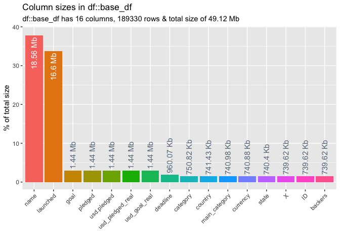
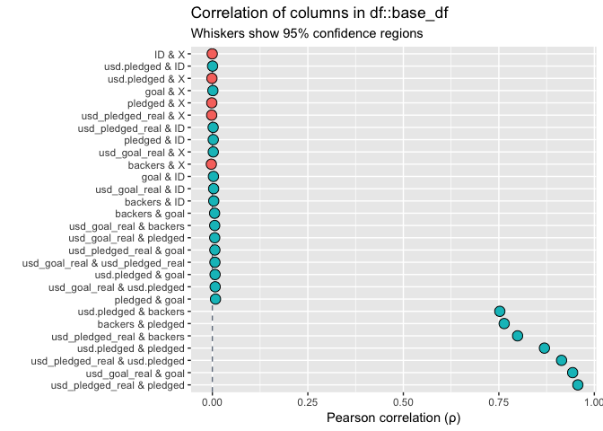
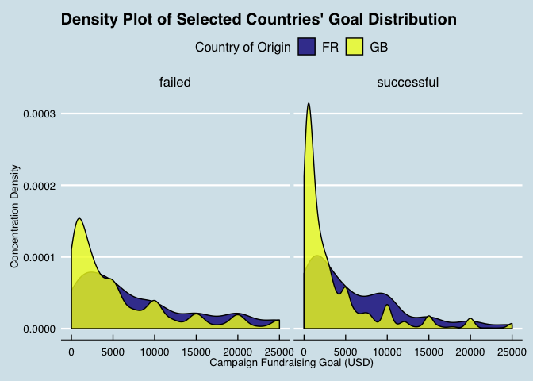

Exploratory Data Analysis (EDA) and Visualization
================
[Paul Jeffries](https://twitter.com/ByPaulJ)
05 May, 2019

-   [Introduction](#introduction)
    -   [Setup](#setup)
-   [Importing, Exploring, and Cleaning the Data](#importing-exploring-and-cleaning-the-data)
    -   [Importing the Data](#importing-the-data)
    -   [Exploring and Cleaning the Data](#exploring-and-cleaning-the-data)
-   [Summary Statistics](#summary-statistics)
    -   [High-Level Summary Stats](#high-level-summary-stats)
-   [Bespoke Visualizations](#bespoke-visualizations)
    -   [General Comments and Best Practices](#general-comments-and-best-practices)
    -   [Histograms](#histograms)
    -   [Density Plots](#density-plots)

Introduction
============

The purpose of this document is to serve as a smorgasbord of EDA techniques and visualization tools. It is a work in progress, so check back occasionally for new additions.

Setup
-----

``` r
# first a few general setup / housekeeping items
# setting scipen options to kill all use of scientific notation
options(scipen = 999)

# basic packages needed throughout:
library(plyr) # always load prior to dplyr / tidyverse if needed
library(tidyverse) # for all things tidy 
library(janitor) # for data cleaning and some utility functions
library(DataExplorer) # allows for creation of missing values map
library(RCurl) # Provides functions to allow one to compose general HTTP requests, etc. in R
library(broom) # for tidy modeling and displaying of model / test results 
library(ggthemes) # for more custom ggplot themes
library(inspectdf) # for df and column EDA convenience functions
library(xaringan) # for imr Rmd preview while editing
# if I reference functions that are more niche, I will call them explicitly in-line as well
```

Importing, Exploring, and Cleaning the Data
===========================================

Importing the Data
------------------

The data used in this document come from a [Kaggle post](https://www.kaggle.com/kemical/kickstarter-projects/home) focused on Kickstarter campaigns. If unfamiliar with the notion of a Kickstarter campaign (henceforth just campaign), I would recommend reading [this FAQ here](https://help.kickstarter.com/hc/en-us/categories/115000499013-Kickstarter-basics). I will not spend a great deal of time explaining the data, so for more information on the data specifically, I recommend reading the detailed exploration on the [data page for this Kaggle](https://www.kaggle.com/kemical/kickstarter-projects).

``` r
# importing the dataset from the CSV
base_df <- read.csv("./hypothesis-tests/data/ks-projects-201801-sampled.csv")
```

``` r
# taking a preliminary look at the structure of the dataset
glimpse(base_df)
```

    ## Observations: 189,330
    ## Variables: 16
    ## $ X                <int> 1, 2, 3, 4, 5, 6, 7, 8, 9, 10, 11, 12, 13, 14, …
    ## $ ID               <int> 136458340, 381995336, 1425707545, 960476049, 96…
    ## $ name             <fct> "Squid Packs: a personalized twist on the class…
    ## $ category         <fct> Product Design, Tabletop Games, Software, Food,…
    ## $ main_category    <fct> Design, Games, Technology, Food, Technology, Pu…
    ## $ currency         <fct> USD, USD, USD, EUR, AUD, USD, USD, USD, USD, US…
    ## $ deadline         <fct> 2012-11-19, 2013-09-30, 2014-09-12, 2015-03-07,…
    ## $ goal             <dbl> 5000, 8000, 525, 5000, 15000, 1000, 10000, 6000…
    ## $ launched         <fct> 2012-10-18 19:27:07, 2013-08-23 15:00:56, 2014-…
    ## $ pledged          <dbl> 7458.00, 52693.00, 100.00, 0.00, 6527.00, 2845.…
    ## $ state            <fct> successful, successful, failed, canceled, cance…
    ## $ backers          <int> 78, 566, 1, 0, 83, 96, 494, 179, 1, 551, 18, 28…
    ## $ country          <fct> US, US, US, IE, AU, US, US, US, US, US, GB, US,…
    ## $ usd.pledged      <dbl> 7458.00, 52693.00, 100.00, 0.00, 181.86, 2845.0…
    ## $ usd_pledged_real <dbl> 7458.00, 52693.00, 100.00, 0.00, 4873.81, 2845.…
    ## $ usd_goal_real    <dbl> 5000.00, 8000.00, 525.00, 5286.03, 11200.72, 10…

Exploring and Cleaning the Data
-------------------------------

### Exploring Your DFs w/ the [Inspectdf Package](https://github.com/alastairrushworth/inspectdf)

``` r
# exploring the memory utilization of a single df
inspectdf::inspect_mem(base_df, show_plot = TRUE)
```



    ## # A tibble: 16 x 3
    ##    col_name         size       pcnt
    ##    <chr>            <chr>     <dbl>
    ##  1 name             18.56 Mb  37.8 
    ##  2 launched         16.6 Mb   33.8 
    ##  3 goal             1.44 Mb    2.94
    ##  4 pledged          1.44 Mb    2.94
    ##  5 usd.pledged      1.44 Mb    2.94
    ##  6 usd_pledged_real 1.44 Mb    2.94
    ##  7 usd_goal_real    1.44 Mb    2.94
    ##  8 deadline         960.07 Kb  1.91
    ##  9 category         750.82 Kb  1.49
    ## 10 country          741.43 Kb  1.47
    ## 11 main_category    740.98 Kb  1.47
    ## 12 currency         740.88 Kb  1.47
    ## 13 state            740.4 Kb   1.47
    ## 14 X                739.62 Kb  1.47
    ## 15 ID               739.62 Kb  1.47
    ## 16 backers          739.62 Kb  1.47

``` r
# looking into where the NULLs are in the df
# note: this works for multiple DFs as well
inspectdf::inspect_na(base_df, show_plot = TRUE)
```


    ## # A tibble: 16 x 3
    ##    col_name           cnt  pcnt
    ##    <chr>            <int> <dbl>
    ##  1 usd.pledged       1870 0.988
    ##  2 X                    0 0    
    ##  3 ID                   0 0    
    ##  4 name                 0 0    
    ##  5 category             0 0    
    ##  6 main_category        0 0    
    ##  7 currency             0 0    
    ##  8 deadline             0 0    
    ##  9 goal                 0 0    
    ## 10 launched             0 0    
    ## 11 pledged              0 0    
    ## 12 state                0 0    
    ## 13 backers              0 0    
    ## 14 country              0 0    
    ## 15 usd_pledged_real     0 0    
    ## 16 usd_goal_real        0 0

``` r
# inspecting the categorical levels in the df
inspectdf::inspect_cat(base_df, show_plot = TRUE)
```


    ## # A tibble: 8 x 5
    ##   col_name         cnt common               common_pcnt levels             
    ##   <chr>          <int> <chr>                      <dbl> <list>             
    ## 1 category         159 Product Design           5.94    <tibble [159 × 2]> 
    ## 2 country           23 US                      77.4     <tibble [23 × 2]>  
    ## 3 currency          14 USD                     78.1     <tibble [14 × 2]>  
    ## 4 deadline        3130 2014-08-08               0.194   <tibble [3,130 × 2…
    ## 5 launched      189190 2009-09-15 05:56:28      0.00106 <tibble [189,190 ×…
    ## 6 main_category     15 Film & Video            16.7     <tibble [15 × 2]>  
    ## 7 name          188471 New EP/Music Develo…     0.0116  <tibble [188,471 ×…
    ## 8 state              6 failed                  52.3     <tibble [6 × 2]>

``` r
# inspecting the correlations in our df
inspectdf::inspect_cor(base_df, show_plot = TRUE)
```



    ## # A tibble: 28 x 6
    ##    col_1            col_2          corr  p_value   lower  upper
    ##    <chr>            <chr>         <dbl>    <dbl>   <dbl>  <dbl>
    ##  1 usd_pledged_real pledged     0.957   0        0.956   0.957 
    ##  2 usd_goal_real    goal        0.943   0        0.943   0.944 
    ##  3 usd_pledged_real usd.pledged 0.914   0        0.913   0.915 
    ##  4 usd.pledged      pledged     0.869   0        0.868   0.871 
    ##  5 usd_pledged_real backers     0.799   0        0.797   0.801 
    ##  6 backers          pledged     0.764   0        0.762   0.766 
    ##  7 usd.pledged      backers     0.753   0        0.750   0.755 
    ##  8 pledged          goal        0.00822 0.000345 0.00307 0.0134
    ##  9 usd_goal_real    usd.pledged 0.00738 0.00139  0.00220 0.0126
    ## 10 usd.pledged      goal        0.00712 0.00206  0.00194 0.0123
    ## # … with 18 more rows

### Dealing with NULLs

First, we'll conduct some broad cleaning. Using the [janitor package](https://github.com/sfirke/janitor) I will clean up the variable names (in this case not necssarily because the CSV is pristinely formatted), and drop any rows or columns where all observations all null.

``` r
# tidying variable names and dropping any useless rows / columns
base_df <- base_df %>%
  # converts to underscore case and cleans up column names
  janitor::clean_names() %>% 
  # drops all rows and columns that are entirely empty
  janitor::remove_empty(which = c("rows","cols")) 
```

Next, we'll move on to dealing with the trickier instances of NULLs: cases where there are singular NULL observations scattered in our data. In order to deal with these, we'll first plot out their occurence, and thereafter decide what to do with them.

``` r
DataExplorer::plot_missing(base_df) # shows % of NAs within each variable
```


From the chart above, we can see that there is only one variable--"usd\_pledged"--that has missing data. It has a missing rate of 1%, which isn't terrible, but given that we have a large amount of data (as shown via the row count returned by the previous glimpse() call), **we'll drop any instances of nulls entirely** to ensure we have the cleanest of data. This is by no means necessary in all cases, and the treatment of nulls should be decided on a case-by-case basis pursuant to the requirements of the project and quality / size of the data at hand.

``` r
# dropping any and all NULLs entirely, and rechecking our missing map to double check
base_df <- base_df[complete.cases(base_df),]
DataExplorer::plot_missing(base_df) # shows % of NAs within each variable
```


Summary Statistics
==================

High-Level Summary Stats
------------------------

It is sometimes helpful to start with a broad brush and take a look at a host of summary stats all at once. In R there are many functions that can take care of this, but my preferred function is *the describe() function from the psych package*, which offers a concise collection of the stats that I most often care about for numeric variables. There is another function with the same name *from the Hmisc package*, but its output is much more expansive, and in most cases I don't find that it adds enough extra marginal utility over the psych package's version to be worth the extra bulk. Nonethless, I have included it below (commented out) should any reader wish to give it a try and make their own determination of its usefulness.

``` r
# packages useful for high-level summary stats (and more as well as we'll see later)
library(psych)
library(Hmisc)

# omit = TRUE (used below) keeps only the numeric variables; default is = FALSE and coerces non-numerics 
# Hmisc::describe(base_df)
psych::describe(x = base_df, IQR = TRUE, omit = TRUE)
```

    ##                  vars      n          mean           sd        median
    ## x                   1 187460      94682.24     54647.10      94699.50
    ## id                  2 187460 1076291115.07 619545515.03 1075335076.50
    ## goal                8 187460      47842.61   1142096.55       5500.00
    ## pledged            10 187460       9555.46     85814.15        616.00
    ## backers            12 187460        106.16       832.66         12.00
    ## usd_pledged        14 187460       6997.59     73034.81        392.00
    ## usd_pledged_real   15 187460       9016.19     82883.26        619.73
    ## usd_goal_real      16 187460      45097.62   1167570.74       5500.00
    ##                        trimmed          mad     min        max      range
    ## x                     94685.82     70160.34    1.00     189330     189329
    ## id               1076642343.93 795532896.43 5971.00 2147455254 2147449283
    ## goal                   9749.60      6671.70    0.15  100000000  100000000
    ## pledged                2110.63       913.28    0.00   12779843   12779843
    ## backers                  29.30        17.79    0.00      91585      91585
    ## usd_pledged            1557.43       581.18    0.00   12779843   12779843
    ## usd_pledged_real       2087.01       918.81    0.00   12779843   12779843
    ## usd_goal_real          9484.33      6671.70    0.15  166361391  166361391
    ##                   skew kurtosis         se           IQR
    ## x                 0.00    -1.20     126.22      94644.50
    ## id                0.00    -1.20 1430931.72 1073182647.50
    ## goal             72.55  5883.53    2637.84      14152.50
    ## pledged          55.76  5318.01     198.20       4048.00
    ## backers          54.10  4380.39       1.92         55.00
    ## usd_pledged      77.71  9564.40     168.68       3007.77
    ## usd_pledged_real 60.32  6075.24     191.43       4015.00
    ## usd_goal_real    83.11  8127.30    2696.68      13982.01

Bespoke Visualizations
======================

General Comments and Best Practices
-----------------------------------

### Dealing with Color-Blindness

It is helpful to remember when crafting any visualization that one's audience might have some form of color blindness. Luckily, there are many handy ways to deal with this when working with the creation of custom graphics. In the various ggplots below, you will notice my use of the [viridis packages](https://cran.r-project.org/web/packages/viridis/vignettes/intro-to-viridis.html), which is a visually appealing set of color palettes that have the added benefit of being easier to read for those who are color blind. While this is my personally preferred method of dealing with color-blindness when creating visuals, one might also consider options like **scale\_color\_tableau()** and **scale\_color\_colorblind()**, both of which are from the [ggthemes package](https://cran.r-project.org/web/packages/ggthemes/ggthemes.pdf).

Histograms
----------

Having gone through the basic EDA steps above, by this point one might have a variety of variables, relationships, or trends worthy of further exploration. The sections below walk through some visualizations that may prove useful in drilling down deeper into the data once the highest-level EDA is already taken care of.

For the histogram exemplars below, imagine that our basic EDA lead us to want to dive deeper into the question of **"what sort or relationships, trends, and/or distributional intricacies, if any, can we observe by examining campaign fundraising goals by country of origin?"**

### Simple Multi-Category Histogram

``` r
base_df %>%
  # select only our variables of interest 
  dplyr::select(goal, country) %>%
  # filter to just 3 countries and set a goal cap
  # this is mostly just arbitrary for the purpose of an easy-to-read exemplar 
  dplyr::filter(
    country %in% c("IT","DE","FR"),
    goal <= 100000
    ) %>%
  # base ggplot call
  ggplot(., aes(x=goal, fill=country)) +
    # specifying the histogram and the bin count
    geom_histogram(color = "black", position="dodge", bins=20) +
    # picking a colorblind-friendly color scheme and theme
    viridis::scale_fill_viridis(discrete=TRUE, option="plasma") +
    ggthemes::theme_economist() +
    # setting legend aesthetic details 
    theme(
      legend.position = "top",
      legend.title = element_text(size=12),
      legend.text = element_text(size=12)
      ) +
    # takes care of all labeling
    labs(
      title = paste0("Histogram of Selected Countries' Goal Distribution"),
      y = "Number of Campaigns",
      x = "Campaign Fundraising Goal (USD)",
      fill = "Country of Origin"
    )
```



### Multi-Category Histogram with Custom-Delimited-Buckets (Count-Based)

Perhaps we are now beginning to develop an intuition as to which buckets are most key. We might then wish to build a histogram with custom-delimited-buckets, as done below.

``` r
base_df %>%
  # select only our variables of interest 
  dplyr::select(goal, country) %>%
  # filter to just 3 countries and set a goal cap
  # this is mostly just arbitrary for the purpose of an easy-to-read exemplar 
  dplyr::filter(
    country %in% c("IT","DE","FR")
    ) %>%
  dplyr::mutate(
    custom_buckets = cut(
      x = goal,
      # sets the break points for cuts; see options for inclusion/exclusion details
      breaks = c(0, 1000, 5000, 10000, 25000, 50000, 100000, Inf),
      # ensures no use of scientific notation in labeling
      dig.lab = 10
      )
  ) %>%
  dplyr::group_by(country, custom_buckets) %>%
  # gets the grouped by within-categor counts
  dplyr::tally() %>%
    # base ggplot call
    ggplot(., aes(custom_buckets, n)) +
      geom_bar(aes(fill = country), color = "black", position = "dodge", stat="identity") +
      # takes care of the precise labeling; hjust/vjust and angle need to be set visually
      geom_text(aes(label=n, group=country), hjust=-0.20, angle=90, position = position_dodge(width=1)) +
      # picking a colorblind-friendly color scheme and theme
      viridis::scale_fill_viridis(discrete=TRUE, option="plasma") +
      ggthemes::theme_economist() +
      # custom axis limits; for this kind of chart I prefer to set these manually
      scale_y_continuous(limits = c(0, 700)) +
      # setting legend and axis aesthetic details
      theme(
        legend.position = "top",
        legend.title = element_text(size=12),
        legend.text = element_text(size=12),
        axis.text.x = element_text(size=8)
        ) +
      # takes care of all labeling
      labs(
        title = paste0("Count of Campaigns by Goal Amount Bucket"),
        y = "Number of Campaigns",
        x = "Campaign Fundraising Goal Bucket (USD)",
        fill = "Country of Origin"
      )
```


### Multi-Category Histogram with Custom-Delimited-Buckets (Percent-Based)

Then we might want to take the previous view and, particularly when the counts get too large to be helpful in label form, transform the view into one that is percentage-based, which we can do as shown below.

``` r
base_df %>%
  # select only our variables of interest 
  dplyr::select(goal, country) %>%
  # filter to just 3 countries and set a goal cap
  # this is mostly just arbitrary for the purpose of an easy-to-read exemplar 
  dplyr::filter(
    country %in% c("IT","DE","FR")
    ) %>%
  dplyr::mutate(
    custom_buckets = cut(
      x = goal,
      # sets the break points for cuts; see options for inclusion/exclusion details
      breaks = c(0, 1000, 5000, 10000, 25000, 50000, 100000, Inf),
      # ensures no use of scientific notation in labeling
      dig.lab = 10
      )
  ) %>%
  dplyr::group_by(country, custom_buckets) %>%
  # gets teh grouped by within-category percent
  dplyr::summarise(n = n()) %>%
  dplyr::mutate(freq = n / sum(n)) %>%
    # base ggplot call
    ggplot(., aes(custom_buckets, freq)) +
      geom_bar(aes(fill = country), color = "black", position = "dodge", stat="identity") +
      # takes care of the precise labeling; hjust/vjust and angle need to be set visually
      geom_text(aes(label=scales::percent(freq), group=country), hjust=-0.20, angle=90, position = position_dodge(width=1)) +
      # picking a colorblind-friendly color scheme and theme
      viridis::scale_fill_viridis(discrete=TRUE, option="plasma") +
      ggthemes::theme_economist() +
      # custom axis limits; for this kind of chart I prefer to set these manually
      scale_y_continuous(labels = scales::percent, limits = c(0, 0.3)) +
      # setting legend and axis aesthetic details
      theme(
        legend.position = "top",
        legend.title = element_text(size=12),
        legend.text = element_text(size=12),
        axis.text.x = element_text(size=8)
        ) +
      # takes care of all labeling
      labs(
        title = paste0("Count of Campaigns by Goal Amount Bucket"),
        y = "Number of Campaigns",
        x = "Campaign Fundraising Goal Bucket (USD)",
        fill = "Country of Origin"
      )
```


Density Plots
-------------

There are times when visually one might prefer a density plot to a histogram, but in almost all cases they serve as substitutionary visualizatins. I find the one use case where density charts are particularly marginally useful as compared to histograms is when you want to compare distributional overlapping or deviation.

### 2 Probability Density Functions (PDFs) Compared

``` r
base_df %>%
  # select only our variables of interest 
  dplyr::select(goal, country) %>%
  # filter to just 2 countries and set a goal cap
  # this is mostly just arbitrary for the purpose of an easy-to-read exemplar 
  dplyr::filter(
    country %in% c("GB","FR"),
    goal <= 25000
    ) %>%
  # base ggplot call
  ggplot(., aes(x=goal, fill=country)) +
    # specifying the density plot, alpha modulates translucency 
    geom_density(color = "black", alpha = 0.8) +
    # picking a colorblind-friendly color scheme and theme
    viridis::scale_fill_viridis(discrete=TRUE, option="plasma") +
    ggthemes::theme_economist() +
    # setting legend aesthetic details
    theme(
      legend.position = "top",
      legend.title = element_text(size=12),
      legend.text = element_text(size=12)
      ) +
    # takes care of all labeling
    labs(
      title = paste0("Density Plot of Selected Countries' Goal Distribution"),
      y = "Concentration Density",
      x = "Campaign Fundraising Goal (USD)",
      fill = "Country of Origin"
    )
```


### 3 PDFs Compared w/ Facets

``` r
base_df %>%
  # select only our variables of interest
  dplyr::select(goal, country, state) %>%
  # filter to just 2 countries, 2 states (aka outcomes), and set a goal cap
  # this is mostly just arbitrary for the purpose of an easy-to-read exemplar
  dplyr::filter(
    country %in% c("GB","FR"),
    goal <= 25000,
    state %in% c("failed","successful")
    ) %>%
  # base ggplot call
  ggplot(., aes(x=goal, fill=country)) +
    # specifying the density plot, alpha modulates translucency
    geom_density(color = "black", alpha = 0.8) +
    # facet wraps to show one pane per state
    facet_wrap(~state) +
    # picking a colorblind-friendly color scheme and theme
    viridis::scale_fill_viridis(discrete=TRUE, option="plasma") +
    ggthemes::theme_economist() +
    # setting legend aesthetic details
    theme(
      legend.position = "top",
      legend.title = element_text(size=12),
      legend.text = element_text(size=12)
      ) +
    # takes care of all labeling
    labs(
      title = paste0("Density Plot of Selected Countries' Goal Distribution"),
      y = "Concentration Density",
      x = "Campaign Fundraising Goal (USD)",
      fill = "Country of Origin"
    )
```


