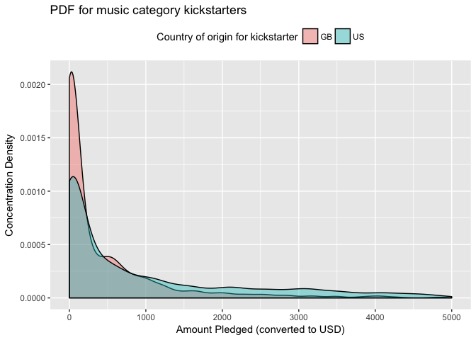
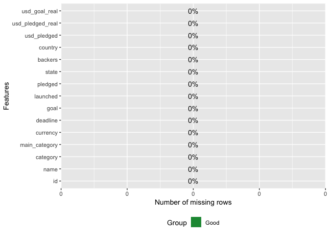
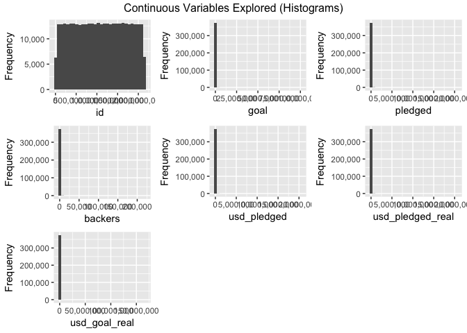
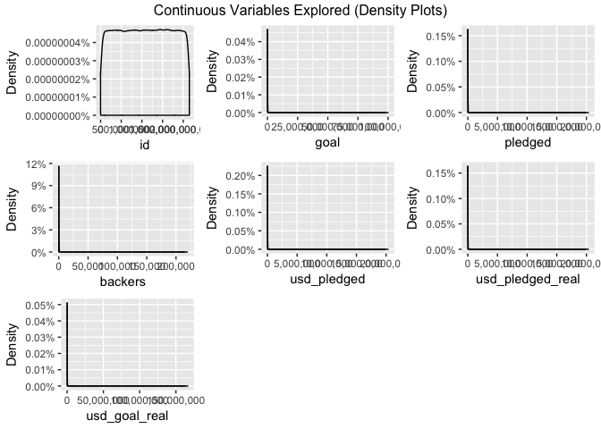
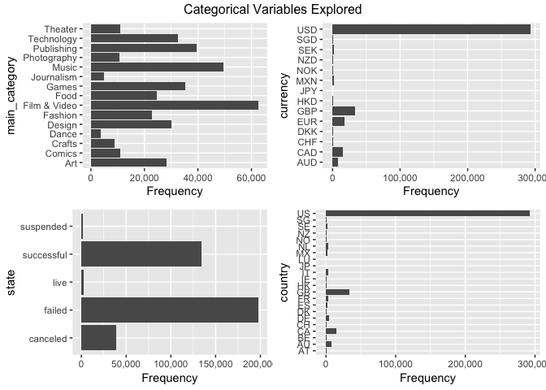
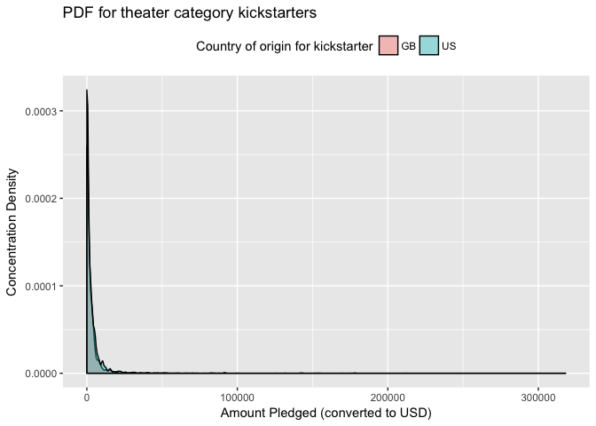
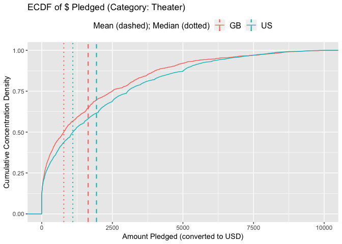

KS Test
================
Paul Jeffries
25 August, 2018

-   [Introduction](#introduction)
    -   [Strengths of the KS Test](#strengths-of-the-ks-test)
    -   [Weaknesses of the KS Test](#weaknesses-of-the-ks-test)
    -   [Setup](#setup)
-   [Importing, Exploring, and Cleaning the Data](#importing-exploring-and-cleaning-the-data)
    -   [Importing the Data](#importing-the-data)
    -   [Exploring and Cleaning the Data](#exploring-and-cleaning-the-data)
-   [Distributions Explored](#distributions-explored)
    -   [Probability Density Functions (PDFs)](#probability-density-functions-pdfs)

**NOTE: this is an early work in progress. Check back shortly for new additions**

Introduction
============

The purpose of this document is to explore the utility and potential application of the [Kolmogorov-Smirnov Test](https://en.wikipedia.org/wiki/Kolmogorov%E2%80%93Smirnov_test), also known as the KS test. Additionally, I have included here a few custom visualizations that I have constructed to better communicate the purpose of and insights to be gained from the KS test.

This vignette will follow the progression below:

1.  High level exploration of strenghts and weaknesses of the test, and brief setup info
2.  Walkthrough of data preparation, and exposition of Kickstarter data to be used as our test case
3.  Exploration of PDF and ECDF distributions (both integral to KS test)
4.  Application of KS test itself.
5.  Functionalized / parameterized application of KS test.
6.  Aggregation of KS test results.
7.  Other extensions of the KS test? (TBD)

Strengths of the KS Test
------------------------

-   Will come back to this one at the end

Weaknesses of the KS Test
-------------------------

-   Will come back to this one at the end

Setup
-----

``` r
# first a few general setup / housekeeping items
# setting scipen options to kill all use of scientific notation
options(scipen = 999)

# basic packages needed throughout:
library(plyr) # always load prior to dplyr if needed
library(dplyr) # for piping
library(ggplot2) # for visualization
library(ggthemes) # for custom visualization
library(janitor) # for data cleaning and some utility functions
library(DataExplorer) # allows for creation of missing values map

# if I reference functions that are more niche, I will call them explicitly in-line as well
```

Importing, Exploring, and Cleaning the Data
===========================================

Importing the Data
------------------

The data used in this document come from a [Kaggle post](https://www.kaggle.com/kemical/kickstarter-projects/home) focused on Kickstarter campaigns. If unfamiliar with the notion of a Kickstarter campaign (henceforth just campaign), I would recommend reading [this FAQ here](https://help.kickstarter.com/hc/en-us/categories/115000499013-Kickstarter-basics). Finally, it is worthwhile noting that while I will conduct some basic EDA prior to delving into the KS test-specfic code, I will not spend a great deal of time explaining the data, so for more information on the data specifically, I recommend reading the detailed exploration on the [data page for this Kaggle](https://www.kaggle.com/kemical/kickstarter-projects).

``` r
# importing the dataset from the CSV
base_2018_df <- read.csv("data/ks-projects-201801.csv")
```

``` r
# taking a preliminary look at the structure of the dataset
glimpse(base_2018_df)
```

    ## Observations: 378,661
    ## Variables: 15
    ## $ ID               <int> 1000002330, 1000003930, 1000004038, 100000754...
    ## $ name             <fct> The Songs of Adelaide & Abullah, Greeting Fro...
    ## $ category         <fct> Poetry, Narrative Film, Narrative Film, Music...
    ## $ main_category    <fct> Publishing, Film & Video, Film & Video, Music...
    ## $ currency         <fct> GBP, USD, USD, USD, USD, USD, USD, USD, USD, ...
    ## $ deadline         <fct> 2015-10-09, 2017-11-01, 2013-02-26, 2012-04-1...
    ## $ goal             <dbl> 1000, 30000, 45000, 5000, 19500, 50000, 1000,...
    ## $ launched         <fct> 2015-08-11 12:12:28, 2017-09-02 04:43:57, 201...
    ## $ pledged          <dbl> 0.00, 2421.00, 220.00, 1.00, 1283.00, 52375.0...
    ## $ state            <fct> failed, failed, failed, failed, canceled, suc...
    ## $ backers          <int> 0, 15, 3, 1, 14, 224, 16, 40, 58, 43, 0, 100,...
    ## $ country          <fct> GB, US, US, US, US, US, US, US, US, US, CA, U...
    ## $ usd.pledged      <dbl> 0.00, 100.00, 220.00, 1.00, 1283.00, 52375.00...
    ## $ usd_pledged_real <dbl> 0.00, 2421.00, 220.00, 1.00, 1283.00, 52375.0...
    ## $ usd_goal_real    <dbl> 1533.95, 30000.00, 45000.00, 5000.00, 19500.0...

Exploring and Cleaning the Data
-------------------------------

### Dealing with NULLs

First, we'll conduct some broad cleaning. Using the [janitor package](https://github.com/sfirke/janitor) I will clean up the variable names (in this case not necssarily because the CSV is pristinely formatted), and drop any rows or columns where all observations all null.

``` r
# tidying variable names and dropping any useless rows / columns
base_2018_df <- base_2018_df %>%
  # converts to underscore case and cleans up column names
  janitor::clean_names() %>% 
  # drops all rows and columns that are entirely empty
  janitor::remove_empty(which = c("rows","cols")) 
```

Next, we'll move on to dealing with the trickier instances of NULLs: cases where there are singular NULL observations scattered in our data. In order to deal with these, we'll first plot out their occurence, and thereafter decide what to do with them.

``` r
DataExplorer::plot_missing(base_2018_df) # shows % of NAs within each variable
```



From the chart above, we can see that there is only one variable--"usd\_pledged"--that has missing data. It has a missing rate of 1%, which isn't terrible, but given that we have a large amount of data (as shown via the row count returned by the previous glimpse() call), **we'll drop any instances of nulls entirely** to ensure we have the cleanest of data. This is by no means necessary in all cases, and the treatment of nulls should be decided on a case-by-case basis pursuant to the requirements of the project and quality / size of the data at hand.

``` r
# dropping any and all NULLs entirely, and rechecking our missing map to double check
base_2018_df <- base_2018_df[complete.cases(base_2018_df),]
DataExplorer::plot_missing(base_2018_df) # shows % of NAs within each variable
```



### Continous Variables Exploration

Below I'll perform some basic high-level univariate variable-exploration using both histograms and density plots at the variable level; they present similar information but both are shown for the sake of demonstration.

``` r
# first a histogram of all continuous variables in the dataset
DataExplorer::plot_histogram(data = base_2018_df, title = "Continuous Variables Explored (Histograms)")
```



``` r
# then a density chart of all continous variables in the dataset
DataExplorer::plot_density(data = base_2018_df, title = "Continuous Variables Explored (Density Plots)")
```



As can be seen above, the continuous distributions here for most variables are very skewed, which is partly to be expected; one would reasonably anticipate, for example, that there would be very few campaigns that are massively successful, wheres most would fall within some average range of success.

When we get to the section on distributional exploration later in the document, we'll look into how we can clean up these distributions to make them more useful for both visualization and statistical testing, but for now, we can prove the aforementioned with a quick example--using the variable "backers" as our test case.

``` r
# pull summary stats for the backers variable
summary(base_2018_df$backers)
```

    ##     Min.  1st Qu.   Median     Mean  3rd Qu.     Max. 
    ##      0.0      2.0     12.0    106.7     57.0 219400.0

As can be seen above, there is massive skew in this variable. Its mean is `{r} mean(base_2018_df$backers)` while its median is substantially lower, at `{r} median(base_2018_df$backers)`, which hints at the large skew. We can see as well there are obviously some massive outliers pulling up the mean, as that max number of backers is `{r} max(base_2018_df$backers)`.

### Categorical Variable Exploration

``` r
# if we displayed many categorical variables per pane, it would make sense to use order_bar = TRUE
# the order would then be in descending order of prevalence, which is helpful at a glance
# NOTE: DataExplorer won't print views for categorical variables with >50 categories (unless otherwise specified)
DataExplorer::plot_bar(data = base_2018_df, order_bar = FALSE, title = "Categorical Variables Explored")
```

    ## 4 columns ignored with more than 50 categories.
    ## name: 372069 categories
    ## category: 159 categories
    ## deadline: 3164 categories
    ## launched: 374302 categories



``` r
# and then we can use janitor to see the exact cross-tab of our quality variable
# this function below is, in my opinion, and better version of the base table function
janitor::tabyl(base_2018_df$main_category)
```

    ##  base_2018_df$main_category     n    percent
    ##                         Art 28153 0.07510190
    ##                      Comics 10819 0.02886113
    ##                      Crafts  8809 0.02349919
    ##                       Dance  3767 0.01004898
    ##                      Design 30067 0.08020776
    ##                     Fashion 22812 0.06085407
    ##                Film & Video 62697 0.16725266
    ##                        Food 24599 0.06562113
    ##                       Games 35226 0.09397008
    ##                  Journalism  4754 0.01268193
    ##                       Music 49530 0.13212792
    ##                 Photography 10778 0.02875176
    ##                  Publishing 39379 0.10504876
    ##                  Technology 32562 0.08686350
    ##                     Theater 10912 0.02910922

### Any Remaining Cleaning Specific to our Research Purpose

From the variables we have seen above, it is clear that there are many potentially interesting questions that can be asked of this data that focus on distributional comparisons. The one I will go with for the purpose of this vignette is as follows: **"How do the distributions of $ pledged differ between US and Great Britain-based projects across campaign categories?"**

I chose this for many reasons that should be obvious after a close examination of the data:

1.  It involves an interesting numeric variable (usd\_pledged) that will make for a nice distribution
2.  The GB / US comparison covers the majority of the volume in our data (see proof below)
3.  GB & the US have unequal volume which makes this more interesting than a 50/50 split
4.  The option to examine this by project category opens the door to some interesting questions:
    1.  For example: Does the distribution of funds raised (usd\_pledged) between US and GB projects looks substantially different between Art campaigns vs. Technology campaigns?
    2.  By "category" I mean main\_category, as this variable has enough categories to be diverse without being so granular that the volume drops too low by category (as is the case with the "category" variable). This is proven briefly below.

``` r
# proving that the US and the UK have the 1st and 2nd most volume 
janitor::tabyl(base_2018_df$country) %>%
  # arranges countries in descending order of % of volume 
  arrange(desc(percent)) %>%
  # displays just the first 5
  head(5)
```

    ##   base_2018_df$country      n    percent
    ## 1                   US 292627 0.78062177
    ## 2                   GB  33672 0.08982458
    ## 3                   CA  14756 0.03936361
    ## 4                   AU   7839 0.02091158
    ## 5                   DE   4171 0.01112670

``` r
# displaying the exact number of unique categories depending on the variable used
paste0(
  "The number of unique categories when we use the main_category variable is ", 
  length(unique(base_2018_df$main_category)), 
  ", whereas the number of unique categories when we use the category variable is ", 
  length(unique(base_2018_df$category)), 
  ", which is too large to be useful in this case. "
  )
```

    ## [1] "The number of unique categories when we use the main_category variable is 15, whereas the number of unique categories when we use the category variable is 159, which is too large to be useful in this case. "

``` r
# showing the volume breakdown by main_category
janitor::tabyl(base_2018_df$main_category) %>%
  # arranges countries in descending order of % of volume 
  arrange(desc(percent))
```

    ##    base_2018_df$main_category     n    percent
    ## 1                Film & Video 62697 0.16725266
    ## 2                       Music 49530 0.13212792
    ## 3                  Publishing 39379 0.10504876
    ## 4                       Games 35226 0.09397008
    ## 5                  Technology 32562 0.08686350
    ## 6                      Design 30067 0.08020776
    ## 7                         Art 28153 0.07510190
    ## 8                        Food 24599 0.06562113
    ## 9                     Fashion 22812 0.06085407
    ## 10                    Theater 10912 0.02910922
    ## 11                     Comics 10819 0.02886113
    ## 12                Photography 10778 0.02875176
    ## 13                     Crafts  8809 0.02349919
    ## 14                 Journalism  4754 0.01268193
    ## 15                      Dance  3767 0.01004898

In light of the above information, we'll perform one last step and trim down to only the variables we absolutely need for this distributional analysis. Below is a quick explanation for each variable dropped

-   id and name not needed because we don't need unique identifiers for a distributional test
-   category dropped because we're going with the higher level main\_category
-   currency dropped because the same info is captured by country
-   pledged dropped because usd\_pledged allows ensures uniform denomination of $ raised
-   backers dropped because I don't plan on using it at the moment (maybe I will later)
-   usd alternative vars dropped because the use other conversion methods than what Kaggles uses

``` r
# creating trimmed final main dataset
final_df <- base_2018_df %>%
  # dropping some ariables as outlined above
  dplyr::select(-c(id,name,category,currency,pledged,backers,usd_pledged_real,usd_goal_real)) %>%
  # trimming to US and GB as described in my research question above
  dplyr::filter(country %in% c('US','GB'))
```

To start out with, it's also helpful to have a dataset filtered to just one category. The end goal would be to have processes and functions that could iterate over all categories, but picking one to use as our initial test case will allow for a smaller sample size and thus faster rendering as we test different functions.

``` r
# creating a dataset filtered to just one category for speed of exploration and view-building
base_2018_df_forviz <- final_df %>% 
  # filters to just kickstarters under a certain category
  dplyr::filter(main_category == 'Theater') 
```

Now that we have adequately explored and cleaned our data, we can proceed to the initial stages of exploring the various distributions of interest.

Distributions Explored
======================

Probability Density Functions (PDFs)
------------------------------------

For the construction of our [probability density functions](https://en.wikipedia.org/wiki/Probability_density_function), we'll make use primarily of the [geom\_density geom in R](http://www.sthda.com/english/wiki/ggplot2-density-plot-quick-start-guide-r-software-and-data-visualization), as demonstrated below. This is a helpful building block in understanding the KS test itself, which is predicated on an understanding of the commulative version of the PDF, which we'll get to shorty. See below for the PDF of the GB and US-based campaigns whose projects were Theater-related.

``` r
# ggplot code for the basid density plot
base_2018_df_forviz %>%
  ggplot(data = ., aes(x=usd_pledged)) +
  geom_density(aes(fill=factor(country)),alpha = 0.4) +
  theme(legend.position = "top") +
  labs(
    title = paste0("PDF for theater category kickstarters"),
    y = "Concentration Density",
    x = "Amount Pledged (converted to USD)",
    fill = "Country of origin for kickstarter"
  )
```



As can be seen from the above, these distributions are very heavily skewed, even when we filter to a category type and look only at GP and US based campaigns. That is to be expected given the nature of the projects, as previously discussed. That said, we want our visuals to be helfpul (which the above honeslty is not). As such, for the purpose of this analysis **let's focus on projects that raised at most $10,000**.

``` r
base_2018_df_forviz %>%
  # build in the volume constraint
  dplyr::filter(usd_pledged <= 10000) %>%
  # now we need to get mean and median by group for the viz 
  dplyr::group_by(country) %>%
  dplyr::mutate(
    mean_pledged = mean(usd_pledged),
    median_pledged = median(usd_pledged)
    ) %>%
  # ungroup prior to the viz code
  ungroup() %>%
    # begin creation of the GGPLOT here
    # put continuous variable on the X, Y will be density by default
    ggplot(data = ., aes(x=usd_pledged)) +
    # color needs to always be a factor, although this is redundant here
    # alpha moderates the opacity of the color
    geom_density(aes(fill=factor(country)),alpha = 0.4) +
    # adding reference lines for the mean and the median
    geom_vline(aes(xintercept=mean_pledged, colour=factor(country)),
             linetype="dashed", size=0.75) +
    geom_vline(aes(xintercept=median_pledged, colour=factor(country)),
             linetype="dotted", size=0.75) +
    # puts the legend on top of the view
    theme(legend.position = "top") +
    # takes care of all labeling
    labs(
      title = paste0("PDF for theater category kickstarters"),
      y = "Concentration Density",
      x = "Amount Pledged (converted to USD)",
      fill = "Country of origin",
      colour = "Mean (dashed) and median (dotted) lines"
    ) +
    guides(
      fill = guide_legend(order=1),
      color = guide_legend(order=2)
      )
```


