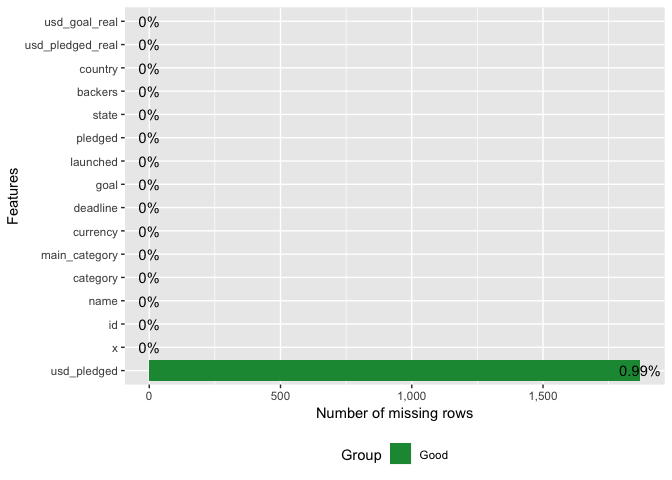
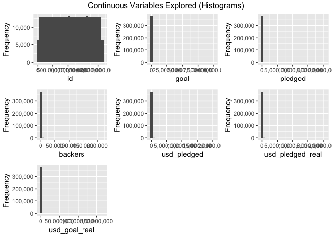
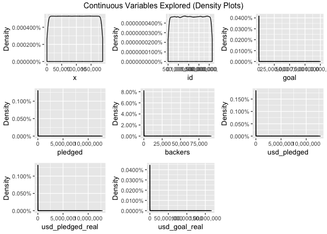
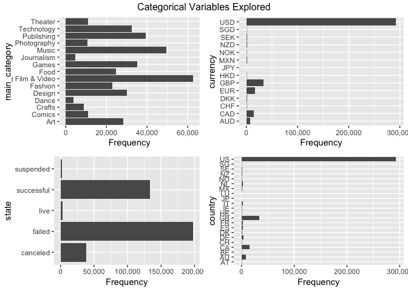
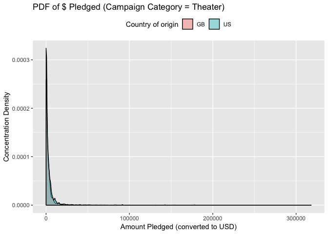
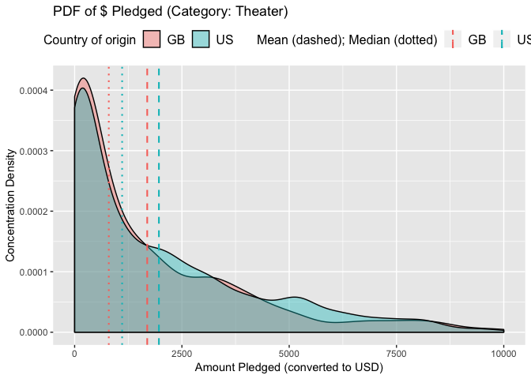
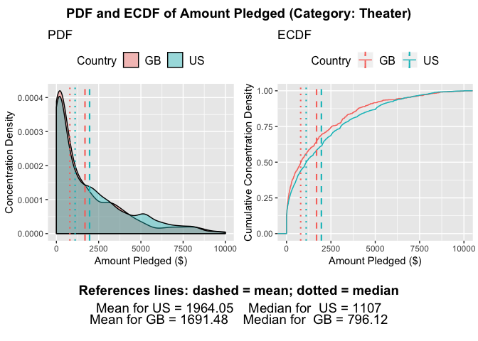

2-Sample KS Test Vignette
================
Paul Jeffries
27 August, 2018

-   [Introduction](#introduction)
    -   [Strengths of the KS Test](#strengths-of-the-ks-test)
    -   [Weaknesses of the KS Test](#weaknesses-of-the-ks-test)
    -   [Setup](#setup)
-   [Importing, Exploring, and Cleaning the Data](#importing-exploring-and-cleaning-the-data)
    -   [Importing the Data](#importing-the-data)
    -   [Exploring and Cleaning the Data](#exploring-and-cleaning-the-data)
-   [Distributions Explored](#distributions-explored)
    -   [Probability Density Functions (PDF)](#probability-density-functions-pdf)
    -   [Empirical Cumulative Distribution (ECDF)](#empirical-cumulative-distribution-ecdf)
    -   [Combined View of PDF and ECDF](#combined-view-of-pdf-and-ecdf)
-   [Performing the KS Test](#performing-the-ks-test)
    -   [Basic KS Test](#basic-ks-test)
    -   [Visualizing the KS Test](#visualizing-the-ks-test)

**NOTE: this is an early work in progress. Check back shortly for new additions**

Introduction
============

The purpose of this document is to explore the utility and potential application of the [Kolmogorov-Smirnov Test](https://en.wikipedia.org/wiki/Kolmogorov%E2%80%93Smirnov_test), also known as the KS test. Specifically, I will be focused on the 2-sample KS test. Additionally, I have included here a few custom visualizations that I have constructed to better illustrate distributions and, in part, to communicate the purpose of and insights to be gained from the KS test.

This vignette will follow the progression below:

1.  High level exploration of strenghts and weaknesses of the test, and brief setup info
2.  Walkthrough of data preparation, and exposition of Kickstarter data to be used as our test case
3.  Exploration of PDF and ECDF distributions (both integral to KS test)
4.  Application of KS test itself.
5.  Functionalized / parameterized application of KS test.
6.  Aggregation of KS test results.
7.  Other extensions of the KS test? (TBD)

Strengths of the KS Test
------------------------

-   Will come back to this one at the end

Weaknesses of the KS Test
-------------------------

-   Will come back to this one at the end

Setup
-----

``` r
# first a few general setup / housekeeping items
# setting scipen options to kill all use of scientific notation
options(scipen = 999)

# basic packages needed throughout:
library(plyr) # always load prior to dplyr / tidyverse if needed
library(tidyverse) # for all things tidy 
library(janitor) # for data cleaning and some utility functions
library(DataExplorer) # allows for creation of missing values map
library(RCurl) # Provides functions to allow one to compose general HTTP requests, etc. in R
library(broom) # for tidy modeling and displaying of model / test results 

# If I reference functions that are more niche, I will call them explicitly in-line as well
```

Importing, Exploring, and Cleaning the Data
===========================================

Importing the Data
------------------

The data used in this document come from a [Kaggle post](https://www.kaggle.com/kemical/kickstarter-projects/home) focused on Kickstarter campaigns. If unfamiliar with the notion of a Kickstarter campaign (henceforth just campaign), I would recommend reading [this FAQ here](https://help.kickstarter.com/hc/en-us/categories/115000499013-Kickstarter-basics). Finally, it is worthwhile noting that while I will conduct some basic EDA prior to delving into the KS test-specfic code, I will not spend a great deal of time explaining the data, so for more information on the data specifically, I recommend reading the detailed exploration on the [data page for this Kaggle](https://www.kaggle.com/kemical/kickstarter-projects).

``` r
# importing the dataset from the CSV
base_2018_df <- read.csv("data/ks-projects-201801.csv")
```

``` r
# taking a preliminary look at the structure of the dataset
glimpse(base_2018_df)
```

    ## Observations: 378,661
    ## Variables: 15
    ## $ ID               <int> 1000002330, 1000003930, 1000004038, 100000754...
    ## $ name             <fct> The Songs of Adelaide & Abullah, Greeting Fro...
    ## $ category         <fct> Poetry, Narrative Film, Narrative Film, Music...
    ## $ main_category    <fct> Publishing, Film & Video, Film & Video, Music...
    ## $ currency         <fct> GBP, USD, USD, USD, USD, USD, USD, USD, USD, ...
    ## $ deadline         <fct> 2015-10-09, 2017-11-01, 2013-02-26, 2012-04-1...
    ## $ goal             <dbl> 1000, 30000, 45000, 5000, 19500, 50000, 1000,...
    ## $ launched         <fct> 2015-08-11 12:12:28, 2017-09-02 04:43:57, 201...
    ## $ pledged          <dbl> 0.00, 2421.00, 220.00, 1.00, 1283.00, 52375.0...
    ## $ state            <fct> failed, failed, failed, failed, canceled, suc...
    ## $ backers          <int> 0, 15, 3, 1, 14, 224, 16, 40, 58, 43, 0, 100,...
    ## $ country          <fct> GB, US, US, US, US, US, US, US, US, US, CA, U...
    ## $ usd.pledged      <dbl> 0.00, 100.00, 220.00, 1.00, 1283.00, 52375.00...
    ## $ usd_pledged_real <dbl> 0.00, 2421.00, 220.00, 1.00, 1283.00, 52375.0...
    ## $ usd_goal_real    <dbl> 1533.95, 30000.00, 45000.00, 5000.00, 19500.0...

Exploring and Cleaning the Data
-------------------------------

### Dealing with NULLs

First, we'll conduct some broad cleaning. Using the [janitor package](https://github.com/sfirke/janitor) I will clean up the variable names (in this case not necssarily because the CSV is pristinely formatted), and drop any rows or columns where all observations all null.

``` r
# tidying variable names and dropping any useless rows / columns
base_2018_df <- base_2018_df %>%
  # converts to underscore case and cleans up column names
  janitor::clean_names() %>% 
  # drops all rows and columns that are entirely empty
  janitor::remove_empty(which = c("rows","cols")) 
```

Next, we'll move on to dealing with the trickier instances of NULLs: cases where there are singular NULL observations scattered in our data. In order to deal with these, we'll first plot out their occurence, and thereafter decide what to do with them.

``` r
DataExplorer::plot_missing(base_2018_df) # shows % of NAs within each variable
```



From the chart above, we can see that there is only one variable--"usd\_pledged"--that has missing data. It has a missing rate of 1%, which isn't terrible, but given that we have a large amount of data (as shown via the row count returned by the previous glimpse() call), **we'll drop any instances of nulls entirely** to ensure we have the cleanest of data. This is by no means necessary in all cases, and the treatment of nulls should be decided on a case-by-case basis pursuant to the requirements of the project and quality / size of the data at hand.

``` r
# dropping any and all NULLs entirely, and rechecking our missing map to double check
base_2018_df <- base_2018_df[complete.cases(base_2018_df),]
DataExplorer::plot_missing(base_2018_df) # shows % of NAs within each variable
```


### Continous Variables Exploration

Below I'll perform some basic high-level univariate variable-exploration using both histograms and density plots at the variable level; they present similar information but both are shown for the sake of demonstration.

``` r
# first a histogram of all continuous variables in the dataset
DataExplorer::plot_histogram(data = base_2018_df, title = "Continuous Variables Explored (Histograms)")
```



``` r
# then a density chart of all continous variables in the dataset
DataExplorer::plot_density(data = base_2018_df, title = "Continuous Variables Explored (Density Plots)")
```



As can be seen above, the continuous distributions here for most variables are very skewed, which is partly to be expected; one would reasonably anticipate, for example, that there would be very few campaigns that are massively successful, wheres most would fall within some average range of success.

When we get to the section on distributional exploration later in the document, we'll look into how we can clean up these distributions to make them more useful for both visualization and statistical testing, but for now, we can prove the aforementioned with a quick example--using the variable "backers" as our test case.

``` r
# pull summary stats for the backers variable
summary(base_2018_df$backers)
```

    ##     Min.  1st Qu.   Median     Mean  3rd Qu.     Max. 
    ##      0.0      2.0     12.0    106.7     57.0 219382.0

As can be seen above, there is massive skew in this variable. Its mean is `{r} mean(base_2018_df$backers)` while its median is substantially lower, at `{r} median(base_2018_df$backers)`, which hints at the large skew. We can see as well there are obviously some massive outliers pulling up the mean, as that max number of backers is `{r} max(base_2018_df$backers)`.

### Categorical Variable Exploration

``` r
# if we displayed many categorical variables per pane, it would make sense to use order_bar = TRUE
# the order would then be in descending order of prevalence, which is helpful at a glance
# NOTE: DataExplorer won't print views for categorical variables with >50 categories (unless otherwise specified)
DataExplorer::plot_bar(data = base_2018_df, order_bar = FALSE, title = "Categorical Variables Explored")
```

    ## 4 columns ignored with more than 50 categories.
    ## name: 372069 categories
    ## category: 159 categories
    ## deadline: 3164 categories
    ## launched: 374302 categories



### Any Remaining Cleaning Specific to our Research Purpose

From the variables we have seen above, it is clear that there are many potentially interesting questions that can be asked of this data that focus on distributional comparisons. The one I will go with for the purpose of this vignette is as follows: **"How do the distributions of $ pledged differ between US and Great Britain-based projects across campaign categories?"**

I chose this for many reasons that should be obvious after a close examination of the data:

1.  It involves an interesting numeric variable (usd\_pledged) that will make for a nice distribution
2.  The GB / US comparison covers the majority of the volume in our data (see proof below)
3.  GB & the US have unequal volume which makes this more interesting than a 50/50 split
4.  The option to examine this by project category opens the door to some interesting questions:
    1.  For example: Does the distribution of funds raised (usd\_pledged) between US and GB projects looks substantially different between Art campaigns vs. Technology campaigns?
    2.  By "category" I mean main\_category, as this variable has enough categories to be diverse without being so granular that the volume drops too low by category (as is the case with the "category" variable). This is proven briefly below.

``` r
# proving that the US and the UK have the 1st and 2nd most volume 
janitor::tabyl(base_2018_df$country) %>%
  # arranges countries in descending order of % of volume 
  arrange(desc(percent)) %>%
  # tidys them up with some helpful functions from janitor
  janitor::adorn_pct_formatting() %>%
  # displays just the first 5
  head(5)
```

    ##   base_2018_df$country      n percent
    ## 1                   US 292627   78.1%
    ## 2                   GB  33672    9.0%
    ## 3                   CA  14756    3.9%
    ## 4                   AU   7839    2.1%
    ## 5                   DE   4171    1.1%

``` r
# displaying the exact number of unique categories depending on the variable used
paste0(
  "The number of unique categories when we use the main_category variable is ", 
  length(unique(base_2018_df$main_category)), 
  ", whereas the number of unique categories when we use the category variable is ", 
  length(unique(base_2018_df$category)), 
  ", which is too large to be useful in this case. "
  )
```

    ## [1] "The number of unique categories when we use the main_category variable is 15, whereas the number of unique categories when we use the category variable is 159, which is too large to be useful in this case. "

``` r
# showing the volume breakdown by main_category
janitor::tabyl(base_2018_df$main_category) %>%
  # arranges countries in descending order of % of volume 
  arrange(desc(percent)) %>%
  # tidys them up with some helpful functions from janitor
  janitor::adorn_pct_formatting() 
```

    ##    base_2018_df$main_category     n percent
    ## 1                Film & Video 62697   16.7%
    ## 2                       Music 49530   13.2%
    ## 3                  Publishing 39379   10.5%
    ## 4                       Games 35226    9.4%
    ## 5                  Technology 32562    8.7%
    ## 6                      Design 30067    8.0%
    ## 7                         Art 28153    7.5%
    ## 8                        Food 24599    6.6%
    ## 9                     Fashion 22812    6.1%
    ## 10                    Theater 10912    2.9%
    ## 11                     Comics 10819    2.9%
    ## 12                Photography 10778    2.9%
    ## 13                     Crafts  8809    2.3%
    ## 14                 Journalism  4754    1.3%
    ## 15                      Dance  3767    1.0%

In light of the above information, we'll perform one last step and trim down to only the variables we absolutely need for this distributional analysis. Below is a quick explanation for each variable dropped

-   id and name not needed because we don't need unique identifiers for a distributional test
-   category dropped because we're going with the higher level main\_category
-   currency dropped because the same info is captured by country
-   pledged dropped because usd\_pledged allows ensures uniform denomination of $ raised
-   backers dropped because I don't plan on using it at the moment (maybe I will later)
-   usd alternative vars dropped because the use other conversion methods than what Kaggles uses

``` r
# creating trimmed final main dataset
final_df <- base_2018_df %>%
  # dropping some ariables as outlined above
  dplyr::select(-c(id,name,category,currency,pledged,backers,usd_pledged_real,usd_goal_real)) %>%
  # trimming to US and GB as described in my research question above
  dplyr::filter(country %in% c('US','GB'))
```

To start out with, it's also helpful to have a dataset filtered to just one category. The end goal would be to have processes and functions that could iterate over all categories, but picking one to use as our initial test case will allow for a smaller sample size and thus faster rendering as we test different functions.

``` r
# creating a dataset filtered to just one category for speed of exploration and view-building
base_2018_df_forviz <- final_df %>% 
  # filters to just kickstarters under a certain category
  dplyr::filter(main_category == 'Theater') 
```

Now that we have adequately explored and cleaned our data, we can proceed to the initial stages of exploring the various distributions of interest.

Distributions Explored
======================

Probability Density Functions (PDF)
-----------------------------------

For the construction of our [probability density functions](https://en.wikipedia.org/wiki/Probability_density_function), we'll make use primarily of the [geom\_density geom in R](http://www.sthda.com/english/wiki/ggplot2-density-plot-quick-start-guide-r-software-and-data-visualization), as demonstrated below. This is a helpful building block in understanding the KS test itself, which is predicated on an understanding of the commulative version of the PDF, which we'll get to shorty. See below for the PDF of the GB and US-based campaigns whose projects were Theater-related.

``` r
# ggplot code for the basid density plot
base_2018_df_forviz %>%
  ggplot(data = ., aes(x=usd_pledged)) +
  geom_density(aes(fill=factor(country)),alpha = 0.4) +
  theme(legend.position = "top") +
  labs(
    title = paste0("PDF of $ Pledged (Campaign Category = Theater)"),
      y = "Concentration Density",
      x = "Amount Pledged (converted to USD)",
      fill = "Country of origin"
  )
```



As can be seen above, these distributions are very heavily skewed, even when we filter to a category type and look only at GP and US based campaigns. That is to be expected given the nature of the project; that said, we want our visuals to be helfpul (which the above honestly is not). As such, for the purpose of this analysis **let's focus on projects that raised at most $10,000** (although this value is easy to parameterize and is largely an arbitrary judgement call).

``` r
full_base_pdf <- base_2018_df_forviz %>%
  # build in the volume constraint
  dplyr::filter(usd_pledged <= 10000) %>%
  # now we need to get mean and median by group for the viz 
  dplyr::group_by(country) %>%
  dplyr::mutate(
    mean_pledged = mean(usd_pledged),
    median_pledged = median(usd_pledged)
    ) %>%
  # ungroup prior to the viz code
  ungroup() %>%
    # begin creation of the GGPLOT here
    # put continuous variable on the X, Y will be density by default
    ggplot(data = ., aes(x=usd_pledged)) +
    # color needs to always be a factor, although this is redundant here
    # alpha moderates the opacity of the color
    geom_density(aes(fill=factor(country)),alpha = 0.4) +
    # adding reference lines for the mean and the median
    geom_vline(aes(xintercept=mean_pledged, colour=factor(country)),
             linetype="dashed", size=0.75) +
    geom_vline(aes(xintercept=median_pledged, colour=factor(country)),
             linetype="dotted", size=0.75) +
    # puts the legend on top of the view
     theme(
      legend.position = "top",
      legend.title = element_text(size=12),
      legend.text = element_text(size=12)
      ) +
    # takes care of all labeling
    labs(
      title = paste0("PDF of $ Pledged (Category: Theater)"),
      y = "Concentration Density",
      x = "Amount Pledged (converted to USD)",
      fill = "Country of origin",
      colour = "Mean (dashed); Median (dotted)"
    ) +
    guides(
      # ensures the country of origin is listed first in legends
      fill = guide_legend(order=1),
      color = guide_legend(order=2)
      )

full_base_pdf
```



Empirical Cumulative Distribution (ECDF)
----------------------------------------

Having been introduced in the previous section to the PDF, we can move on to the [ECDF (aka CDF)](https://en.wikipedia.org/wiki/Empirical_distribution_function), on which the KS test's statistic is actually based. The ECDF is simply a cumulative version of a PDF. For the construction of our ECDF, we'll make use primarily of the [state\_ecdf() function in R](https://ggplot2.tidyverse.org/reference/stat_ecdf.html), as demonstrated below.

``` r
full_base_ecdf <- base_2018_df_forviz %>%
  # build in the volume constraint
  dplyr::filter(usd_pledged <= 10000) %>%
  # now we need to get mean and median by group for the viz 
  dplyr::group_by(country) %>%
  dplyr::mutate(
    mean_pledged = mean(usd_pledged),
    median_pledged = median(usd_pledged)
    ) %>%
  # ungroup prior to the viz code
  ungroup() %>%
    # begin creation of the GGPLOT here
    # put continuous variable on the X, Y will be cumulative density by default
    ggplot(data = ., aes(x=usd_pledged, colour=factor(country))) +
    # color needs to always be a factor, although this is redundant here
    stat_ecdf() +
    # adding reference lines for the mean and the median
    geom_vline(aes(xintercept=mean_pledged, colour=factor(country)),
             linetype="dashed", size=0.75) +
    geom_vline(aes(xintercept=median_pledged, colour=factor(country)),
             linetype="dotted", size=0.75) +
    # puts the legend on top of the view
    theme(
      legend.position = "top",
      legend.title = element_text(size=12),
      legend.text = element_text(size=12)
      ) +
    # takes care of all labeling
    labs(
      title = paste0("ECDF of $ Pledged (Category: Theater)"),
      y = "Cumulative Concentration Density",
      x = "Amount Pledged (converted to USD)",
      fill = "Country of origin",
      colour = "Mean (dashed); Median (dotted)"
    )

full_base_ecdf
```


Above, we can see a similar story as that told by the PDF, here shown in a slightly different manner. As the PDF was skewed very heavily towards the left in its density, here we see a correspondingly steep slope at the beginning of the x-axis range.

This chart is also helpful in understanding the KS test, as the KS test statistic is the [maximum vertical distance between the two curves](https://upload.wikimedia.org/wikipedia/commons/c/cf/KS_Example.png) shown above; the larger the vertical gap between the curves, the larger the test statistic, and presumably, the larger the distributional difference.

Combined View of PDF and ECDF
-----------------------------

Now we can make use of one of the convenience functions I have created as part of my [repository of useful functions for hypothesis testing and distributional comparisons](https://github.com/pmaji/stats-and-modeling/blob/master/hypothesis-tests/useful_hyp_test_distrib_functions.R) in order to plot the above PDF and ECDF side by side, calling out the mean and median explicitly, and packing quite a bit of valuable information into a single view.

Below I first source my repository of useful functions (because the full function need is quite long and would take up a lot of space), and then use a function I created called **gen\_sidebyside\_pdf\_ecdf()** to create the view below.

``` r
# grabbing the raw info from my GitHub to turn into a text object
script <- RCurl::getURL("https://raw.githubusercontent.com/pmaji/stats-and-modeling/master/hypothesis-tests/useful_hyp_test_distrib_functions.R", ssl.verifypeer = FALSE)
# sourcing that code just like you might source an R Script locally
eval(parse(text = script))
```

``` r
# first creating the dataset needed for the viz
# this shows that you can use my function on any dataframe with 1 continous and 1 categorical variable
pre_filtered_df <- base_2018_df_forviz %>%
  # build in the volume constraint 
  dplyr::filter(usd_pledged <= 10000)

# generating the combined PDF / ECDF visualization 
gen_sidebyside_pdf_ecdf(
  dataset = "pre_filtered_df",
  continuous_variable = "usd_pledged",
  categorical_variable = "country",
  alpha_for_density = 0.4,
  ref_line_thickness = 0.75,
  size_of_legend_title = 12,
  size_of_legend_text = 12,
  main_title_text = "PDF and ECDF of Amount Pledged (Category: Theater)",
  pdf_subtitle_text = "PDF",
  ecdf_subtitle_text = "ECDF",
  fill_text = "Country",
  colour_text = "Country",
  x_text = "Amount Pledged ($)",
  y_pdf_text = "Concentration Density",
  y_ecdf_text = "Cumulative Concentration Density",
  decimal_place_for_agg_stats = 2,
  size_bottom_annotation = 14
)
```



Performing the KS Test
======================

Now that we have learned a bit about what the KS test actually measures--the max vertical distance between the ECDFs of the compared populations--as well as having explored some visualizations of the key distributions, we can proceed to code up the test itself.

Luckily, performing a ks test in R is quite simple, thanks to the [ks.test() function](https://www.rdocumentation.org/packages/dgof/versions/1.2/topics/ks.test). All **it requires is two numeric vectors** that will be treated as the two distributions to be compared.

Basic KS Test
-------------

As our basic KS test examplar, we'll use the same populations visualized in the previous section, asking the question: **does the distribution of amount pledged ($) for GB-based Theater campaigns differ from that of US-based Theater campaigns to a statistically significant degree?**

As one can tell, the phrasing of this quesiton lends itself to a two-sided hypothesis test. This is important because the type of hypothesis test--two-sided, less than, or greater than--is one of the parameters of the ks.test() function.

### Preparing the KS Test Inputs

We'll start by building the two numeric vectors needed for the KS test: one for GB campaigns, and one for US campaigns.

``` r
# reminder: the base dataset used below is filtered to Theater only

# building the GB-specific vector
gb_theater_amount_raised <- base_2018_df_forviz %>%
  dplyr::filter(
    # build in the standard volume constraint we've been using
    usd_pledged <= 10000,
    # filters to just GB campaigns
    country == "GB"
    ) %>%
  dplyr::select(usd_pledged)

# building the US-specific vector
us_theater_amount_raised <- base_2018_df_forviz %>%
  dplyr::filter(
    # build in the standard volume constraint we've been using
    usd_pledged <= 10000,
    # filters to just GB campaigns
    country == "US"
    ) %>%
  dplyr::select(usd_pledged)
```

### Running the KS Test

Now that we have the two numeric vectors that represent the distributions to be compared, we can run the KS test on them as shown below. There are a variety of nuances of which to be aware when it comes to the parameters of the ks.test() function; some of them are described below, but one should read the docs thoroughly for a complete understanding of all default settings as well as the actual meaning of the various parameters (some of which may be unintuitive).

``` r
# running the ks test itself
ks.test(
  # x and y are the two vectors that compose the distributions to be compared
  # order does matter here but only when the alternative hypothesis chosen is not two-sided
  x = gb_theater_amount_raised[[1]],
  y = us_theater_amount_raised[[1]],
  # specifies the null hypothesis that the true distribution function of x is equal to
  # this can be a bit tricky and should be catered to the problem at hand; read the docs for more info
  alternative = "two.sided",
  # parameter to decide whether or not to compute exact p-values
  # NULL here doesn't mean no; it is instead conditional upon sample size as described in the docs 
  exact = NULL
) %>%
  # uses the broom package to tidy up the output of the test 
  broom::tidy()
```

    ## # A tibble: 1 x 4
    ##   statistic      p.value method                             alternative
    ##       <dbl>        <dbl> <chr>                              <chr>      
    ## 1    0.0840 0.0000000164 Two-sample Kolmogorov-Smirnov test two-sided

### Interpreting the KS Test Results

As shown above, **our p-value is quite low**, which would lead us in this particular case to reject the null hypothesis that the two distributions are identical. That said, we cannot simply stop there. Given that this test is [a non-parametric](http://sphweb.bumc.bu.edu/otlt/MPH-Modules/BS/BS704_Nonparametric/BS704_Nonparametric_print.html) [omnibus test](https://en.wikipedia.org/wiki/Omnibus_test), it can cover a wide variety of test cases, but also has its downfalls when it comes to the extent of the conclusions that it allows us to make, as described in the strenghts and weakness section of this document. Beyond the simple p-value, it is important to look at the test statistic as well, which is the measure of the magnitude of the distributional difference. Put simply, the **larger the test statistic, the larger the difference between the two distributions** as measured by the maximum vertical distance betweent the ECDFs.

Visualizing the KS Test
-----------------------

Now we can wrap all of the information we have gleaned from the KS test into one easy-to-digest visualization thanks to another custom function I built, sourced from the [aforementioned package](https://github.com/pmaji/stats-and-modeling/blob/master/hypothesis-tests/useful_hyp_test_distrib_functions.R). We won't re-load the script from GitHub as it has already been done previously in this Markdown.

``` r
gen_ks_test_viz_and_results(
    # parameters for function:
    # inputs for KS Test
    numeric_vector_1 = gb_theater_amount_raised[[1]],
    label_for_numeric_vector_1 = "GB",
    numeric_vector_2 = us_theater_amount_raised[[1]],
    label_for_numeric_vector_2 = "US",
    # options within ks.test()
    alternative_for_test = "two.sided",
    pval_calctype_for_test = NULL,
    # options for visuals
    alpha_for_density = 0.4,
    ref_line_thickness = 0.75,
    size_of_legend_title = 12,
    size_of_legend_text = 12,
    main_title_text = "KS Test Results",
    ecdf_subtitle_text = NULL,
    colour_text = "Country",
    x_text = "Pledged Amount",
    y_text = "Cumulative Concentration Density",
    decimal_place_for_agg_stats = 2,
    decimal_place_for_p_value = 5,
    decimal_place_for_test_stat = 3,
    size_bottom_annotation = 14
  )
```


