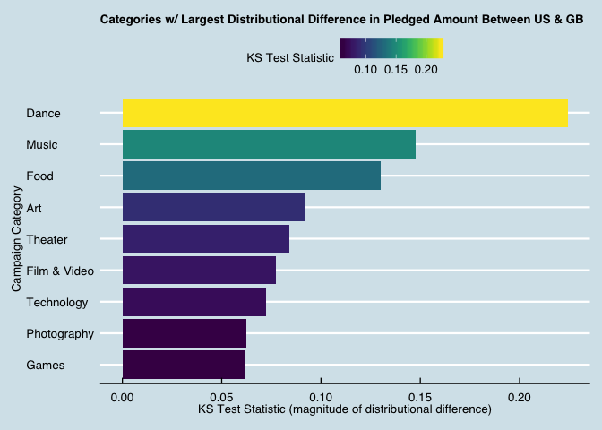
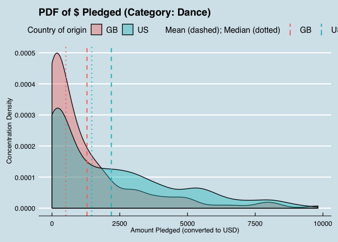

2-Sample KS Test Vignette in R
================
[Paul Jeffries](https://twitter.com/ByPaulJ)
04 April, 2019

-   [Introduction](#introduction)
    -   [Setup](#setup)
-   [Importing, Exploring, and Cleaning the Data](#importing-exploring-and-cleaning-the-data)
    -   [Importing the Data](#importing-the-data)
    -   [Exploring and Cleaning the Data](#exploring-and-cleaning-the-data)
-   [Distributions Explored](#distributions-explored)
    -   [Probability Density Functions (PDF)](#probability-density-functions-pdf)
    -   [Empirical Cumulative Distribution (ECDF)](#empirical-cumulative-distribution-ecdf)
    -   [Combined View of PDF and ECDF](#combined-view-of-pdf-and-ecdf)
-   [Performing the KS Test](#performing-the-ks-test)
    -   [Basic KS Test](#basic-ks-test)
    -   [Visualizing the KS Test Results](#visualizing-the-ks-test-results)
    -   [Scaling KS Test to Many Samples](#scaling-ks-test-to-many-samples)
    -   [Conclusions and Other Extensions of KS Test](#conclusions-and-other-extensions-of-ks-test)

Introduction
============

The purpose of this document is to explore the utility and potential application of the [Kolmogorov-Smirnov Test](https://en.wikipedia.org/wiki/Kolmogorov%E2%80%93Smirnov_test), also known as the KS test. Specifically, I will be focused on the 2-sample KS test. Additionally, I have included here a few custom visualizations that I have constructed to better illustrate distributions and, in part, to communicate the purpose of and insights to be gained from the KS test.

This vignette will follow the progression below:

1.  High level exploration of strengths and weaknesses of the test, and brief setup info
2.  Walkthrough of data preparation, and exposition of Kickstarter data to be used as our test case
3.  Exploration of PDF and ECDF distributions (both integral to KS test)
4.  Application of KS test itself
5.  Functionalized / parameterized application of KS test
6.  Aggregation of KS test results and scalable functions
7.  Other extensions of the KS test and conclusions

Setup
-----

``` r
# first a few general setup / housekeeping items
# setting scipen options to kill all use of scientific notation
options(scipen = 999)

# basic packages needed throughout:
library(plyr) # always load prior to dplyr / tidyverse if needed
library(tidyverse) # for all things tidy 
library(janitor) # for data cleaning and some utility functions
library(DataExplorer) # allows for creation of missing values map
library(RCurl) # Provides functions to allow one to compose general HTTP requests, etc. in R
library(broom) # for tidy modeling and displaying of model / test results 
```

Importing, Exploring, and Cleaning the Data
===========================================

Importing the Data
------------------

The data used in this document come from a [Kaggle post](https://www.kaggle.com/kemical/kickstarter-projects/home) focused on Kickstarter campaigns. If unfamiliar with the notion of a Kickstarter campaign (henceforth just campaign), I would recommend reading [this FAQ here](https://help.kickstarter.com/hc/en-us/categories/115000499013-Kickstarter-basics). Finally, it is worthwhile noting that while I will conduct [some basic EDA](https://github.com/pmaji/data-science-toolkit/blob/master/eda-and-visualization/eda_and_visualization.md) prior to delving into the KS test-specfic code, I will not spend a great deal of time explaining the data, so for more information on the data specifically, I recommend reading the detailed exploration on the [data page for this Kaggle](https://www.kaggle.com/kemical/kickstarter-projects).

More specifically, because this dataset is pretty massive is pretty big (&gt; 50 mb when I first pulled it), I took a 50% random sample of the df using sample\_frac(), not shown here, so that it would be under GitHub's recommended size of 50mb. if you want to replicate the full dataset, just follow the steps to repull all the data on your own using the info in the paragraph above.

``` r
# importing the dataset from the CSV
base_2018_df <- read.csv("hypothesis-tests/data/ks-projects-201801-sampled.csv")
```

``` r
# taking a preliminary look at the structure of the dataset
glimpse(base_2018_df)
```

    ## Observations: 189,330
    ## Variables: 16
    ## $ X                <int> 1, 2, 3, 4, 5, 6, 7, 8, 9, 10, 11, 12, 13, 14, …
    ## $ ID               <int> 136458340, 381995336, 1425707545, 960476049, 96…
    ## $ name             <fct> "Squid Packs: a personalized twist on the class…
    ## $ category         <fct> Product Design, Tabletop Games, Software, Food,…
    ## $ main_category    <fct> Design, Games, Technology, Food, Technology, Pu…
    ## $ currency         <fct> USD, USD, USD, EUR, AUD, USD, USD, USD, USD, US…
    ## $ deadline         <fct> 2012-11-19, 2013-09-30, 2014-09-12, 2015-03-07,…
    ## $ goal             <dbl> 5000, 8000, 525, 5000, 15000, 1000, 10000, 6000…
    ## $ launched         <fct> 2012-10-18 19:27:07, 2013-08-23 15:00:56, 2014-…
    ## $ pledged          <dbl> 7458.00, 52693.00, 100.00, 0.00, 6527.00, 2845.…
    ## $ state            <fct> successful, successful, failed, canceled, cance…
    ## $ backers          <int> 78, 566, 1, 0, 83, 96, 494, 179, 1, 551, 18, 28…
    ## $ country          <fct> US, US, US, IE, AU, US, US, US, US, US, GB, US,…
    ## $ usd.pledged      <dbl> 7458.00, 52693.00, 100.00, 0.00, 181.86, 2845.0…
    ## $ usd_pledged_real <dbl> 7458.00, 52693.00, 100.00, 0.00, 4873.81, 2845.…
    ## $ usd_goal_real    <dbl> 5000.00, 8000.00, 525.00, 5286.03, 11200.72, 10…

Exploring and Cleaning the Data
-------------------------------

### Dealing with NULLs

First, we'll conduct some broad cleaning. Using the [janitor package](https://github.com/sfirke/janitor) I will clean up the variable names (in this case not necssary because the CSV is pristinely formatted), and drop any rows or columns where all observations all null.

``` r
# tidying variable names and dropping any useless rows / columns
base_2018_df <- base_2018_df %>%
  # converts to underscore case and cleans up column names
  janitor::clean_names() %>% 
  # drops all rows and columns that are entirely empty
  janitor::remove_empty(which = c("rows","cols")) 
```

Next, we'll move on to dealing with the trickier instances of NULLs: cases where there are singular NULL observations scattered in our data. In order to deal with these, we'll first plot out their occurence, and thereafter decide what to do with them.

``` r
DataExplorer::plot_missing(base_2018_df) # shows % of NAs within each variable
```


From the chart above, we can see that there is only one variable--"usd\_pledged"--that has missing data. It has a missing rate of 1%, which isn't terrible, but given that we have a large amount of data (as shown via the row count returned by the previous glimpse() call), **we'll drop any instances of nulls entirely** to ensure we have the cleanest of data. This is by no means necessary in all cases, and the treatment of nulls should be decided on a case-by-case basis pursuant to the requirements of the project and quality / size of the data at hand.

``` r
# dropping any and all NULLs entirely, and rechecking our missing map to double check
base_2018_df <- base_2018_df[complete.cases(base_2018_df),]
DataExplorer::plot_missing(base_2018_df) # shows % of NAs within each variable
```


### Continous Variables Exploration

Below I'll perform some basic high-level univariate variable-exploration using both histograms and density plots at the variable level; they present similar information but both are shown for the sake of demonstration.

``` r
# first a histogram of all continuous variables in the dataset
DataExplorer::plot_histogram(data = base_2018_df, title = "Continuous Variables Explored (Histograms)")
```


``` r
# then a density chart of all continous variables in the dataset
DataExplorer::plot_density(data = base_2018_df, title = "Continuous Variables Explored (Density Plots)")
```


As can be seen above, **the continuous distributions here for most variables are very skewed,** which is partly to be expected; one would reasonably anticipate, for example, that there would be very few campaigns that are massively successful, wheres most would fall within some average range of success.

When we get to the section on distributional exploration later in the document, we'll look into how we can clean up these distributions to make them more useful for both visualization and statistical testing, but for now, we can prove the aforementioned skewness with a quick example--using the variable "backers" as our test case.

``` r
# pull summary stats for the backers variable
summary(base_2018_df$backers)
```

    ##    Min. 1st Qu.  Median    Mean 3rd Qu.    Max. 
    ##     0.0     2.0    12.0   106.2    57.0 91585.0

As can be seen above, there is massive skew in this variable. Its mean is `{r} mean(base_2018_df$backers)` while its median is substantially lower, at `{r} median(base_2018_df$backers)`, which hints at the large skew. We can see as well there are obviously some massive outliers pulling up the mean, as that max number of backers is `{r} max(base_2018_df$backers)`.

### Categorical Variable Exploration

``` r
# if we displayed many categorical variables per pane, it would make sense to use order_bar = TRUE
# the order would then be in descending order of prevalence, which is helpful at a glance
# NOTE: DataExplorer won't print views for categorical variables with >50 categories (unless otherwise specified)
DataExplorer::plot_bar(data = base_2018_df, order_bar = FALSE, title = "Categorical Variables Explored")
```

    ## 4 columns ignored with more than 50 categories.
    ## name: 186643 categories
    ## category: 159 categories
    ## deadline: 3130 categories
    ## launched: 187322 categories


### Any Remaining Cleaning Specific to our Research Purpose

From the variables we have seen above, it is clear that there are many potentially interesting questions that can be asked of this data that focus on distributional comparisons. The one I will go with for the purpose of this vignette is as follows: **"How do the distributions of $ pledged differ between US and Great Britain-based projects across campaign categories?"**

I chose this for many reasons that should be obvious after a close examination of the data:

1.  It involves an interesting numeric variable (usd\_pledged) that will make for a nice distribution
2.  The GB / US comparison covers the majority of the volume in our data (see proof below)
3.  GB & the US have unequal volume which makes this more interesting than a 50/50 split
4.  The option to examine this by project category opens the door to some interesting questions:
    1.  For example: Does the distribution of funds raised (usd\_pledged) between US and GB projects looks substantially different between Art campaigns vs. Technology campaigns?
    2.  By "category" I mean main\_category, as this variable has enough categories to be diverse without being so granular that the volume drops too low by category (as is the case with the "category" variable). This is proven briefly below.

``` r
# proving that the US and the UK have the 1st and 2nd most volume 
janitor::tabyl(base_2018_df$country) %>%
  # arranges countries in descending order of % of volume 
  arrange(desc(percent)) %>%
  # tidys them up with some helpful functions from janitor
  janitor::adorn_pct_formatting() %>%
  # displays just the first 5
  head(5)
```

    ##   base_2018_df$country      n percent
    ## 1                   US 146484   78.1%
    ## 2                   GB  16707    8.9%
    ## 3                   CA   7387    3.9%
    ## 4                   AU   3919    2.1%
    ## 5                   DE   2073    1.1%

``` r
# displaying the exact number of unique categories depending on the variable used
paste0(
  "The number of unique categories when we use the main_category variable is ", 
  length(unique(base_2018_df$main_category)), 
  ", whereas the number of unique categories when we use the category variable is ", 
  length(unique(base_2018_df$category)), 
  ", which is too large to be useful in this case."
  )
```

    ## [1] "The number of unique categories when we use the main_category variable is 15, whereas the number of unique categories when we use the category variable is 159, which is too large to be useful in this case."

``` r
# showing the volume breakdown by main_category
janitor::tabyl(base_2018_df$main_category) %>%
  # arranges countries in descending order of % of volume 
  arrange(desc(percent)) %>%
  # tidys them up with some helpful functions from janitor
  janitor::adorn_pct_formatting() 
```

    ##    base_2018_df$main_category     n percent
    ## 1                Film & Video 31164   16.6%
    ## 2                       Music 24794   13.2%
    ## 3                  Publishing 19786   10.6%
    ## 4                       Games 17598    9.4%
    ## 5                  Technology 16254    8.7%
    ## 6                      Design 15167    8.1%
    ## 7                         Art 13989    7.5%
    ## 8                        Food 12342    6.6%
    ## 9                     Fashion 11429    6.1%
    ## 10                    Theater  5417    2.9%
    ## 11                Photography  5406    2.9%
    ## 12                     Comics  5353    2.9%
    ## 13                     Crafts  4408    2.4%
    ## 14                 Journalism  2446    1.3%
    ## 15                      Dance  1907    1.0%

In light of the above information, we'll perform one last step and trim down to only the variables we absolutely need for this distributional analysis. Below is a quick explanation for each variable dropped

-   id and name not needed because we don't need unique identifiers for a distributional test
-   category dropped because we're going with the higher level main\_category
-   currency dropped because the same info is captured by country
-   pledged dropped because usd\_pledged allows ensures uniform denomination of $ raised
-   backers dropped because I don't plan on using it at the moment (maybe I will later)
-   usd alternative vars dropped because the use other conversion methods than what Kaggles uses

``` r
# creating trimmed final main dataset
final_df <- base_2018_df %>%
  # dropping some variables as outlined above
  dplyr::select(-c(id,name,category,currency,pledged,backers,usd_pledged_real,usd_goal_real)) %>%
  # trimming to US and GB as described in my research question above
  dplyr::filter(country %in% c('US','GB'))
```

To start out with, it's also helpful to have a dataset filtered to just one category. The end goal would be to have processes and functions that could iterate over all categories (you'll see this in a later section), but picking one to use as our initial test case will allow for a smaller sample size and thus faster rendering as we test different functions.

``` r
# creating a dataset filtered to just one category for speed of exploration and view-building
base_2018_df_forviz <- final_df %>% 
  # filters to just kickstarters under a certain category
  dplyr::filter(main_category == 'Theater') 
```

Now that we have adequately explored and cleaned our data, we can proceed to the initial stages of exploring the various distributions of interest.

Distributions Explored
======================

Probability Density Functions (PDF)
-----------------------------------

For the construction of our [probability density functions](https://en.wikipedia.org/wiki/Probability_density_function), we'll make use primarily of the [geom\_density geom in R](http://www.sthda.com/english/wiki/ggplot2-density-plot-quick-start-guide-r-software-and-data-visualization), as demonstrated below. This is a helpful building block in understanding the KS test itself, which is predicated on an understanding of the cumulative version of the PDF, which we'll get to shorty. See below for the PDF of the GB and US-based campaigns whose projects were Theater-related.

``` r
# ggplot code for the basid density plot
base_2018_df_forviz %>%
  ggplot(data = ., aes(x=usd_pledged)) +
  geom_density(aes(fill=factor(country)),alpha = 0.4) +
  theme(legend.position = "top") +
  labs(
      title = paste0("PDF of $ Pledged (Campaign Category = Theater)"),
      y = "Concentration Density",
      x = "Amount Pledged (converted to USD)",
      fill = "Country of origin"
  )
```


As can be seen above, these distributions are very heavily skewed, even when we filter to a category type and look only at GP and US-based campaigns. That is to be expected given the nature of the project; that said, we want our visuals to be helfpul (which the above honestly is not). As such, for the purpose of this analysis **let's focus on projects that raised at most $10,000** (although this value is easy to parameterize and is largely an arbitrary judgement call).

### Custom Function for Making PDF Charts

``` r
# define our function
compMeansPlot <- function(data, group, var) {
  quo_group <- enquo(group)
  quo_var <- enquo(var)
  data %>%
    dplyr::select(!!quo_group, !!quo_var) %>%
    dplyr::group_by(!!quo_group) %>%
    dplyr::mutate(
      mean_pledged = mean(!!quo_var),
      median_pledged = median(!!quo_var)
    ) %>%
    # ungroup prior to the viz code
    ungroup() %>%
    # begin creation of the GGPLOT here
    # put continuous variable on the X, Y will be density by default
    ggplot(data = ., aes_string(x = quo_name(quo_var), fill = quo_name(quo_group))) + 
    # color needs to always be a factor, although this is redundant here
    # alpha moderates the opacity of the color
    geom_density(alpha = 0.4) +
    # adding reference lines for the mean and the median
    geom_vline(
      aes_string(xintercept = 'mean_pledged', colour = quo_name(quo_group)),
      linetype="dashed", size = 0.75
    ) +
    geom_vline(
      aes_string(xintercept = 'median_pledged', colour = quo_name(quo_group)),
      linetype="dashed", size = 0.75
    ) +
    # puts the legend on top of the view
    theme(
      legend.position = "top",
      legend.title = element_text(size=12),
      legend.text = element_text(size=12)
    ) +
    # takes care of all labeling
    labs(
      title = paste0("PDF of $ Pledged (Category: Theater)"),
      y = "Concentration Density",
      x = "Amount Pledged (converted to USD)",
      fill = "Country of origin",
      colour = "Mean (dashed); Median (dotted)"
    ) +
    guides(
      # ensures the country of origin is listed first in legends
      fill = guide_legend(order=1),
      color = guide_legend(order=2)
    )
}

base_2018_df_forviz %>%
  # build in the volume constraint
  dplyr::filter(usd_pledged <= 10000) %>%
  compMeansPlot(., country, usd_pledged)
```


Empirical Cumulative Distribution (ECDF)
----------------------------------------

Having been introduced in the previous section to the PDF, we can move on to the [ECDF (aka CDF)](https://en.wikipedia.org/wiki/Empirical_distribution_function), on which the KS test's statistic is actually based. The ECDF is simply a cumulative version of a PDF. For the construction of our ECDF, we'll make use primarily of the [state\_ecdf() function in R](https://ggplot2.tidyverse.org/reference/stat_ecdf.html), as demonstrated below.

``` r
full_base_ecdf <- base_2018_df_forviz %>%
  # build in the volume constraint
  dplyr::filter(usd_pledged <= 10000) %>%
  # now we need to get mean and median by group for the viz 
  dplyr::group_by(country) %>%
  dplyr::mutate(
    mean_pledged = mean(usd_pledged),
    median_pledged = median(usd_pledged)
    ) %>%
  # ungroup prior to the viz code
  ungroup() %>%
    # begin creation of the GGPLOT here
    # put continuous variable on the X, Y will be cumulative density by default
    ggplot(data = ., aes(x=usd_pledged, colour=factor(country))) +
    # color needs to always be a factor, although this is redundant here
    stat_ecdf() +
    # adding reference lines for the mean and the median
    geom_vline(aes(xintercept=mean_pledged, colour=factor(country)),
             linetype="dashed", size=0.75) +
    geom_vline(aes(xintercept=median_pledged, colour=factor(country)),
             linetype="dotted", size=0.75) +
    # puts the legend on top of the view
    theme(
      legend.position = "top",
      legend.title = element_text(size=12),
      legend.text = element_text(size=12)
      ) +
    # takes care of all labeling
    labs(
      title = paste0("ECDF of $ Pledged (Category: Theater)"),
      y = "Cumulative Concentration Density",
      x = "Amount Pledged (converted to USD)",
      fill = "Country of origin",
      colour = "Mean (dashed); Median (dotted)"
    )

full_base_ecdf
```


Above, we can see a similar story as that told by the PDF, here shown in a slightly different manner. As the PDF was skewed very heavily towards the left in its density, here we see a correspondingly steep slope at the beginning of the x-axis range.

This chart is also helpful in understanding the KS test, as the KS test statistic is the [maximum vertical distance between the two curves](https://upload.wikimedia.org/wikipedia/commons/c/cf/KS_Example.png) shown above; the larger the vertical gap between the curves, the larger the test statistic, and presumably, the larger the distributional difference.

Combined View of PDF and ECDF
-----------------------------

Now we can make use of one of the convenience functions I have created as part of my [repository of useful functions for hypothesis testing and distributional comparisons](https://github.com/pmaji/stats-and-modeling/blob/master/hypothesis-tests/useful_hyp_test_distrib_functions.R) in order to plot the above PDF and ECDF side by side, calling out the mean and median explicitly, and packing quite a bit of valuable information into a single view.

Below I first source my repository of useful functions (because the full function need is quite long and would take up a lot of space), and then use a function I created called **gen\_sidebyside\_pdf\_ecdf()** to create the view below.

``` r
# grabbing the raw info from my GitHub to turn into a text object
script <- RCurl::getURL("https://raw.githubusercontent.com/pmaji/data-science-toolkit/master/hypothesis-tests/useful_hyp_test_functions.R", ssl.verifypeer = FALSE)
# sourcing that code just like you might source an R Script locally
eval(parse(text = script))
```

``` r
# first creating the dataset needed for the viz
# this shows that you can use my function on any dataframe with 1 continous and 1 categorical variable
pre_filtered_df <- base_2018_df_forviz %>%
  # build in the volume constraint 
  dplyr::filter(usd_pledged <= 10000)

# generating the combined PDF / ECDF visualization 
gen_sidebyside_pdf_ecdf(
  dataset = "pre_filtered_df",
  continuous_variable = "usd_pledged",
  categorical_variable = "country",
  alpha_for_density = 0.4,
  ref_line_thickness = 0.75,
  size_of_legend_title = 12,
  size_of_legend_text = 12,
  main_title_text = "PDF and ECDF of Amount Pledged (Category: Theater)",
  pdf_subtitle_text = "PDF",
  ecdf_subtitle_text = "ECDF",
  fill_text = "Country",
  colour_text = "Country",
  x_text = "Amount Pledged ($)",
  y_pdf_text = "Concentration Density",
  y_ecdf_text = "Cumulative Concentration Density",
  decimal_place_for_agg_stats = 2,
  size_bottom_annotation = 14
)
```


Performing the KS Test
======================

Now that we have learned a bit about what the KS test actually measures--the max vertical distance between the ECDFs of the compared populations--as well as having explored some visualizations of the key distributions, we can proceed to code up the test itself.

Luckily, performing a KS test in R is quite simple, thanks to the [ks.test() function](https://www.rdocumentation.org/packages/dgof/versions/1.2/topics/ks.test). All **it requires is two numeric vectors** that will be treated as the two distributions to be compared.

Basic KS Test
-------------

As our basic KS test exemplar, we'll use the same populations visualized in the previous section, asking the question: **does the distribution of amount pledged ($) for GB-based Theater campaigns differ from that of US-based Theater campaigns to a statistically significant degree?**

As one can tell, the phrasing of this quesiton lends itself to a two-sided hypothesis test. This is important because the type of hypothesis test--two-sided, less than, or greater than--is one of the parameters of the ks.test() function.

### Preparing the KS Test Inputs

We'll start by building the two numeric vectors needed for the KS test: one for GB campaigns, and one for US campaigns.

``` r
# reminder: the base dataset used below is pre-filtered to Theater only

# building the GB-specific vector
gb_theater_amount_raised <- base_2018_df_forviz %>%
  dplyr::filter(
    # build in the standard volume constraint we've been using
    usd_pledged <= 10000,
    # filters to just GB campaigns
    country == "GB"
    ) %>%
  dplyr::select(usd_pledged)

# building the US-specific vector
us_theater_amount_raised <- base_2018_df_forviz %>%
  dplyr::filter(
    # build in the standard volume constraint we've been using
    usd_pledged <= 10000,
    # filters to just US campaigns
    country == "US"
    ) %>%
  dplyr::select(usd_pledged)
```

### Running the KS Test

Now that we have the two numeric vectors that represent the distributions to be compared, we can run the KS test on them as shown below. There are a variety of nuances of which to be aware when it comes to the parameters of the ks.test() function; some of them are described below, but one should read the docs thoroughly for a complete understanding of all default settings as well as the actual meaning of the various parameters (some of which may be unintuitive).

``` r
# running the ks test itself
ks.test(
  # x and y are the two vectors that compose the distributions to be compared
  # order does matter here but only when the alternative hypothesis chosen is not two-sided
  x = gb_theater_amount_raised[[1]],
  y = us_theater_amount_raised[[1]],
  # specifies the null hypothesis that the true distribution function of x is equal to
  # this can be a bit tricky and should be catered to the problem at hand; read the docs for more info
  alternative = "two.sided",
  # parameter to decide whether or not to compute exact p-values
  # NULL here doesn't mean no; it is instead conditional upon sample size as described in the docs 
  exact = NULL
) %>%
  # uses the broom package to tidy up the output of the test 
  broom::tidy()
```

    ## # A tibble: 1 x 4
    ##   statistic  p.value method                             alternative
    ##       <dbl>    <dbl> <chr>                              <chr>      
    ## 1    0.0798 0.000512 Two-sample Kolmogorov-Smirnov test two-sided

### Interpreting the KS Test Results

As shown above, **our p-value is quite low**, which would lead us in this particular case to reject the null hypothesis that the two distributions are identical. That said, we cannot simply stop there. Given that this test is [a non-parametric](http://sphweb.bumc.bu.edu/otlt/MPH-Modules/BS/BS704_Nonparametric/BS704_Nonparametric_print.html) [omnibus test](https://en.wikipedia.org/wiki/Omnibus_test), it can cover a wide variety of test cases, but also has its downfalls when it comes to the extent of the conclusions that it allows us to make, as described in the strenghts and weakness section of this document. Beyond the simple p-value, it is important to look at the test statistic as well, which is the measure of the magnitude of the distributional difference. Put simply, the **larger the test statistic, the larger the difference between the two distributions** as measured by the maximum vertical distance betweent the ECDFs.

Visualizing the KS Test Results
-------------------------------

Now we can wrap all of the information we have gleaned from the KS test into one easy-to-digest visualization thanks to another custom function I built, sourced from the [aforementioned package](https://github.com/pmaji/stats-and-modeling/blob/master/hypothesis-tests/useful_hyp_test_distrib_functions.R). We won't re-load the script from GitHub as it has already been done previously in this Markdown.

``` r
gen_ks_test_viz_and_results(
    # parameters for function:
    # inputs for KS Test
    numeric_vector_1 = gb_theater_amount_raised[[1]],
    label_for_numeric_vector_1 = "GB",
    numeric_vector_2 = us_theater_amount_raised[[1]],
    label_for_numeric_vector_2 = "US",
    # options within ks.test()
    alternative_for_test = "two.sided",
    pval_calctype_for_test = NULL,
    # options for visuals
    alpha_for_density = 0.4,
    ref_line_thickness = 0.75,
    size_of_legend_title = 12,
    size_of_legend_text = 12,
    main_title_text = "KS Test Results (Theater)",
    ecdf_subtitle_text = NULL,
    colour_text = "Country",
    x_text = "Pledged Amount",
    y_text = "Cumulative Concentration Density",
    decimal_place_for_agg_stats = 2,
    decimal_place_for_p_value = 5,
    decimal_place_for_test_stat = 3,
    size_bottom_annotation = 14
  )
```


Scaling KS Test to Many Samples
-------------------------------

Imagine now that after having conducted a few one-off KS tests, we wanted to dig deeper into the impact that campaign types has on distributional differences between GB and US-based campaigns. To operationalize this question in a manner better suited for the KS test, we could thus ask the question: **out of all campaign categories, which types exhibited the largest distributional differences in pledged amount between US and GB-based campaigns?**

In terms of how we can go about answering this question, we already have the framework--the KS test--so it's just a matter of scaling the test up over all categories, and then comparing the results. This will be done by iteratively performing the KS test on each pertinent sub-population.

### Examining the Variable on Which Samples Will Be Stratified

When performing the KS test, it's important that both of the two samples being compared during an individual test have enough volume to be consequential and not produce distortionary effects. Questions about [how exactly to arrive at a minimum sample size](https://www.researchgate.net/post/What_is_the_minimal_number_of_observations_needed_for_normal_distribution) for each test can get a bit tricky, so our examination below is rather arbitrary. We just want to see that there aren't any categories (after filtering by US vs. GB) that have an obviously low count. We'll use the [still-arbitrary but often-used threshold of 30](https://stats.stackexchange.com/questions/2541/what-references-should-be-cited-to-support-using-30-as-a-large-enough-sample-siz) as the minimum count by category that we want to see in order to proceed.

``` r
# first we'll create subsets filtered to just US and GB campaigns 
final_us_df <- final_df %>%
  dplyr::filter(country == 'US')

final_gb_df <- final_df %>%
  dplyr::filter(country == 'GB')

# setting maxprint options so the lists we show next will print in full
options(max.print=50)

# then we print out the crosstab for each country's campaigns by category
janitor::tabyl(final_us_df$main_category) %>%
  # arranges categories in descending order of % of volume 
  arrange(desc(percent)) %>%
  # tidys them up with some helpful functions from janitor
  janitor::adorn_pct_formatting()
```

    ##    final_us_df$main_category     n percent
    ## 1               Film & Video 25841   17.6%
    ## 2                      Music 21627   14.8%
    ## 3                 Publishing 15987   10.9%
    ## 4                      Games 12393    8.5%
    ## 5                        Art 11042    7.5%
    ## 6                     Design 10948    7.5%
    ## 7                 Technology 10815    7.4%
    ## 8                       Food  9969    6.8%
    ## 9                    Fashion  8329    5.7%
    ## 10                    Comics  4396    3.0%
    ## 11                   Theater  4308    2.9%
    ## 12               Photography  4022    2.7%
    ## 13                    Crafts  3320    2.3%
    ## 14                Journalism  1841    1.3%
    ## 15                     Dance  1646    1.1%

``` r
janitor::tabyl(final_gb_df$main_category) %>%
  # arranges categories in descending order of % of volume 
  arrange(desc(percent)) %>%
  # tidys them up with some helpful functions from janitor
  janitor::adorn_pct_formatting()
```

    ##    final_gb_df$main_category    n percent
    ## 1               Film & Video 2830   16.9%
    ## 2                      Games 1990   11.9%
    ## 3                 Publishing 1621    9.7%
    ## 4                 Technology 1545    9.2%
    ## 5                      Music 1372    8.2%
    ## 6                     Design 1359    8.1%
    ## 7                        Art 1347    8.1%
    ## 8                    Fashion 1162    7.0%
    ## 9                       Food  819    4.9%
    ## 10                   Theater  810    4.8%
    ## 11               Photography  584    3.5%
    ## 12                    Crafts  448    2.7%
    ## 13                    Comics  447    2.7%
    ## 14                Journalism  231    1.4%
    ## 15                     Dance  142    0.8%

As can be seen from above, **we appear to be perfectly fine on sample size**, given that the smallest bucket--GB's Dance category--stil has 280 observations (well over our minimum of 30). As such, we can proceed to constructing the scalable KS test.

### Creating Function to Run KS Test and Return Tidy Result

Given the specific use case we're targetting here, we'll build in a few parameters that we might wish to change from test-to-test:

-   Max pledged amount considered
    -   Previously we limited ourselves to amounts &lt;$10,000 because of the long tail, but that might change
-   2 input datasets we'll feed the KS test
    -   For now we're going with US and GB's data, but this method can be used with any two numeric vectors
-   Name of category to compare:
    -   We'll start with Theater as the default but we'll scale to iterate over all categories
-   Name of numeric column within the input datasets
-   Type of hypothesis test
    -   Two-sided, greater than, or less than (see ks.test() docs for details)
    -   Default is broadest test: two-sided

``` r
get_tidy_ks_test_results <- function(
  name_of_category_to_compare = 'Theater',
  max_pledge_considered = 10000, 
  input_df_1 = final_us_df, 
  input_df_2 = final_gb_df,
  numeric_column_name = 'usd_pledged',
  type_of_hypothesis_test = 'two.sided'
) {
  # dropping quotes from key column for use in dplyr chains
  noquote_var <- noquote(numeric_column_name)
  as_symbol_var <- as.symbol(numeric_column_name)
  
  # creating first numeric vector for ks test input
  vector_1 <- input_df_1 %>%
    dplyr::filter(
      # build in parameterized volume constraint
      eval(as_symbol_var) <= max_pledge_considered,
      # filtering to campaign type of interest
      main_category == name_of_category_to_compare
    ) %>%
    dplyr::select(noquote_var)
  
  # creating second numeric vector for ks test input
  vector_2 <- input_df_2 %>%
    dplyr::filter(
      # build in parameterized volume constraint
      eval(as_symbol_var) <= max_pledge_considered,
      # filtering to campaign type of interest
      main_category == name_of_category_to_compare
    ) %>%
    dplyr::select(noquote_var)
  
  op <- options(warn = (-1)) # suppress warnings that always come when running ks test at scale
  # in this case the warnings mean there is a tie somewhere in the distro, which is expected
  # running the KS test and assigning the tidy output to variable
  ks_test_results <- broom::tidy(
    ks.test(
      x = vector_1[[1]],
      y = vector_2[[1]],
      # parameterized alternative tested
      altenative = type_of_hypothesis_test
      )
    )
  options(op) # reset to default value for warnings-handling post ks test eval
  
  # creating final output of the function
  final_results <- list(name_of_category_to_compare, ks_test_results$statistic, ks_test_results$p.value)
  return(final_results)
  
  }
  
# run an example test: by default, 2-sided for Theater campaign types
get_tidy_ks_test_results()
```

    ## [[1]]
    ## [1] "Theater"
    ## 
    ## [[2]]
    ## [1] 0.07975486
    ## 
    ## [[3]]
    ## [1] 0.0005115424

### Looping Over All Categories and Performing the KS Test

Now that we have a function with all the necessary parameters, we need to create another function that loops over all categories of interest, performing the test for each category, storing the result, and then trimming based on some chosen p-value threshold for statistical significance.

A quick note here seems pertinent on the use of the p-value for multiple hypothesis tests. When scaling the utilization of a hypothesis test--as we are doing here--it makes sense to sometimes adjust the p-value to better avoid [Type 1 errors](https://en.wikipedia.org/wiki/Type_I_and_type_II_errors). There is a lot of literature out there on this question, but for the purpose of this excercise, the correction we'll be using is the [Bonferroni Correction](http://www.statisticssolutions.com/bonferroni-correction/). It is a pretty simple correction, and involves **dividing the chosen p-value threshold by the number of tests to be run**. This is visible in the code below.

``` r
build_ks_table_for_all <- function(
  # p-values above this threshold will result in the difference being deemed insignificant 
  p_value_cutoff = 0.05 
){
  # run ks test over all categories
  ks_test_all_categories <- lapply(
    # gets all categories to loop over
    unique(as.character(final_df$main_category)),
    # applies previously-constructed function to run KS test
    # defaults to only one parameter, although more could be passed through
    FUN = get_tidy_ks_test_results
    )
  
  # get number of tests run for use in Bonferroni correction mentioned above
  n_tests <- length(unique(as.character(final_df$main_category)))
  # uses the number of tests to derive our corrected p-value
  p_value_for_use <- (p_value_cutoff/n_tests)
  
  cleaned_ks_results_for_all <- ks_test_all_categories %>%
    # queue data.table magic to deal with nested list of lists
    data.table::rbindlist() %>%
    # rename the artificially renamed columns that result from the data.table call (order preserved)
    dplyr::rename(
      category = `V1`,
      ks_test_stat = `V2`,
      ks_test_pval = `V3`
    ) %>%
    # using bonferonni-adjusted parameterized p-value for cutoff
    dplyr::filter(
      ks_test_pval <= p_value_for_use
    ) %>%
    # order results by highest ks statistic (i.e. largest distributional difference)
    arrange(desc(ks_test_stat))
  
  # returns ordered table of largest statistically significant distributional differences
  return(cleaned_ks_results_for_all)
  
}

# runs the function and prints its output
ks_test_results_for_all_cats <- build_ks_table_for_all(p_value_cutoff = 0.05)
ks_test_results_for_all_cats
```

    ##       category ks_test_stat       ks_test_pval
    ## 1        Dance   0.23450096 0.0000019699705439
    ## 2        Music   0.15096475 0.0000000000000000
    ## 3         Food   0.12537142 0.0000000006025473
    ## 4          Art   0.09755186 0.0000000006644207
    ## 5   Technology   0.09752995 0.0000000004859307
    ## 6      Theater   0.07975486 0.0005115423874362
    ## 7 Film & Video   0.06432801 0.0000000085735847
    ## 8        Games   0.05171016 0.0008345524474186

### Visualizing the Result of the Many KS Tests

Now that we have a rank-ordered list of statistically significant categories by magnitude of the distributional difference between GB and US campaign pledged amounts, we can visualize the list to easily spot the categories with the most marked differences. The color and the size of the bars below are redundant, and are both included simply to demonstrate two ways of communicating / reinforcing magnitude in these kinds of visualizations.

``` r
ggplot(data = ks_test_results_for_all_cats, 
       aes(x=reorder(category, ks_test_stat), y=ks_test_stat, fill = ks_test_stat)) +
  geom_bar(stat="identity") +
  # flip axes for ease of viewing (purely aesthetic choice)
  coord_flip() +
  # picking a colorblind-friendly color scheme and theme
  viridis::scale_fill_viridis() +
  ggthemes::theme_economist() +
  # setting legend and axis aesthetic details
  theme(
    legend.position = "top",
    legend.title = element_text(size=10),
    legend.text = element_text(size=10),
    axis.text.x = element_text(size=10),
    axis.text.y = element_text(size=10),
    plot.title = element_text(size=10)
    ) +
  # takes care of all labeling
  labs(
    title = "Categories w/ Largest Distributional Difference in Pledged Amount Between US & GB",
    y = "KS Test Statistic (magnitude of distributional difference)",
    x = "Campaign Category",
    fill = "KS Test Statistic"
  )
```



This then leads us to believe that the largest distributional difference between GB and US campaigns in terms of amount pledged comes among kickstarters in the dance category. We can re-use one of our graphics from before to test this assumption visually.

``` r
dance_pdf <- final_df %>% 
  # filters to just kickstarters under the Dance category
  dplyr::filter(main_category == 'Dance') %>%
  # build in the volume constraint
  dplyr::filter(usd_pledged <= 10000) %>%
  # now we need to get mean and median by group for the viz 
  dplyr::group_by(country) %>%
  dplyr::mutate(
    mean_pledged = mean(usd_pledged),
    median_pledged = median(usd_pledged)
    ) %>%
  # ungroup prior to the viz code
  ungroup() %>%
    # begin creation of the GGPLOT here
    # put continuous variable on the X, Y will be density by default
    ggplot(data = ., aes(x=usd_pledged)) +
    # color needs to always be a factor, although this is redundant here
    # alpha moderates the opacity of the color
    geom_density(aes(fill=factor(country)),alpha = 0.4) +
    # adding reference lines for the mean and the median
    geom_vline(aes(xintercept=mean_pledged, colour=factor(country)),
             linetype="dashed", size=0.75) +
    geom_vline(aes(xintercept=median_pledged, colour=factor(country)),
             linetype="dotted", size=0.75) +
    # picking a colorblind-friendly theme
    ggthemes::theme_economist() +
    # puts the legend on top of the view
     theme(
      legend.position = "top",
      legend.title = element_text(size=12),
      legend.text = element_text(size=12)
      ) +
    # takes care of all labeling
    labs(
      title = paste0("PDF of $ Pledged (Category: Dance)"),
      y = "Concentration Density",
      x = "Amount Pledged (converted to USD)",
      fill = "Country of origin",
      colour = "Mean (dashed); Median (dotted)"
    ) +
    guides(
      # ensures the country of origin is listed first in legends
      fill = guide_legend(order=1),
      color = guide_legend(order=2)
      )

# display the PDF
dance_pdf
```



Conclusions and Other Extensions of KS Test
-------------------------------------------

One next step to potentially consider--which I may build out in the future if I have the time--is to include an element of temporality in our testing. What we have done here is a purely cross-sectional analysis of the distributional differences between two countries' kick starter campaigns, including sub-cuts by category. One could presumable incorporate the date fiels as well, stratify based on month or quarter, and then ask questions such as: **"how has the distributional difference between US and GB dance campaign pledged amounts varied over time?"** This would allow us to see whether or not the large distributional difference seen in the chart above--with GB Dance campaigns having a lot more low-amount-pledged campaigns than US Dance campaigns--is a consistent trend, or driven more by an outlier month(s), for example.

All in all, the non-parametric nature of the KS test makes it a very broad but effective brush to use when hunting for distributional differences. It is likely best to follow this test up--if it pops as significant--with more tailored statistical tests that would help to better elucidate precisely why the two distributions differ with a greater degree of specificity than that offered by the KS test alone.
