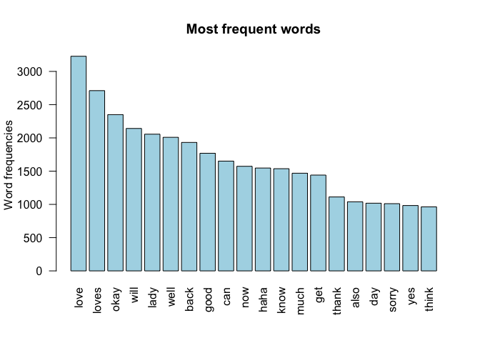
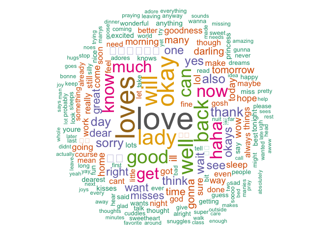
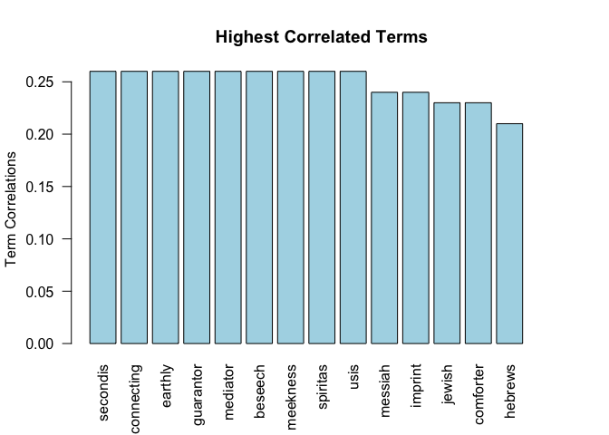

NLP & Text-Mining in R
================
Paul Jeffries
16 September, 2018

-   [Introduction](#introduction)
    -   [How to Access the Raw Data](#how-to-access-the-raw-data)
    -   [Setup](#setup)
-   [Reading in and Preparing the Necessary Data](#reading-in-and-preparing-the-necessary-data)
    -   [Establising Database Connection](#establising-database-connection)
    -   [Building Tables from Database Connection](#building-tables-from-database-connection)
    -   [Hunting for Key Columns](#hunting-for-key-columns)
    -   [Filtering the Data to Only Conversations of Interest](#filtering-the-data-to-only-conversations-of-interest)
-   [Text Analysis Methods](#text-analysis-methods)
    -   [Term Prevalence Analysis](#term-prevalence-analysis)
    -   [Term Association Analysis](#term-association-analysis)
-   [Conclusion and Further Improvements](#conclusion-and-further-improvements)

Introduction
============

Welcome! This document is the result of some work that I did as a surprise gift for my girlfriend. I wanted to find a way to perform some simple text analyses on our text message history, hopefully producing some insightful visualizations along the way. There's a lot more I'd like to do with this data, but for now, I have included in the vignette below a couple **basic but interesting analytic techniques applied to text message data from iPhones**.

How to Access the Raw Data
--------------------------

This is a project I had been hoping to do for quite some time, but one of the major hurdles is data accessiblity--it's simply not the easiest thing in the world to access one's text-message history with another person in a format useful for analyses. That said, I stumbled upon this [helpful walkthrough of how to access one's archived text message history](http://osxdaily.com/2010/07/08/read-iphone-sms-backup/). Once you follow the instructions in the walkthrough, you will have identified the file that represents your archived text message history. From there, you'll need to make use of the [RSQLite package](https://cran.r-project.org/web/packages/RSQLite/index.html) in order to be able to [import and work with the sqlite file](https://stackoverflow.com/questions/9802680/importing-files-with-extension-sqlite-into-r) so that you can perform your analyses.

Setup
-----

``` r
# key libraries
library(tidyverse) # needed for piping, etc. 
library(RSQLite) # needed to read .sql files
```

Reading in and Preparing the Necessary Data
===========================================

Establising Database Connection
-------------------------------

``` r
# connect to textfile database (textfile located following instructions above)
con <- dbConnect(drv=RSQLite::SQLite(), dbname="data/text_message_db2_july")

# list all tables in the sqlite database
tables <- dbListTables(con)

# checking out the names of the various tables in the database
head(tables,length(tables))
```

    ##  [1] "_SqliteDatabaseProperties" "attachment"               
    ##  [3] "chat"                      "chat_handle_join"         
    ##  [5] "chat_message_join"         "deleted_messages"         
    ##  [7] "handle"                    "kvtable"                  
    ##  [9] "message"                   "message_attachment_join"  
    ## [11] "message_processing_task"   "sqlite_sequence"          
    ## [13] "sqlite_stat1"              "sync_deleted_attachments" 
    ## [15] "sync_deleted_chats"        "sync_deleted_messages"

Building Tables from Database Connection
----------------------------------------

``` r
# exclude table "sqlite_sequence" (contains useless table information)
tables <- tables[tables != "sqlite_sequence"]

# creates an empty list with the same number of items as there are tables in the database
lDataFrames <- vector("list", length=length(tables))

# create a dataframe for each table by iterating over each table in the db 
# each table in the db becomes a dataframe nested in lDataFrames
for (i in seq(along=tables)) {
  lDataFrames[[i]] <- dbGetQuery(conn=con, statement=paste("SELECT * FROM '", tables[[i]], "'", sep=""))
}
```

Hunting for Key Columns
-----------------------

The lDataFrames list contains all of the dataframes taken from the database connection. There is a lot of useless junk in these dataframes, and very little of interest to us. I was coming in blind, so I didn't have the advantage of knowing what columns to look for. I tried iteratively searching for key words, but ultimately resorted to manual exploration, and eventually got lucky. Now with the benefit of hindsight, I can recommend that **one easy way of hunting for your text message history is to iterate over all DataFrames and hunt for the column named "is\_from\_me"** as done below. Hopefully this saves others a lot of time!

``` r
# creating an empty dataframe that I'll later iterate over to search for the column I care about
# it has 2 columns, the 1st will be the dataframe number searched, and the 2nd a flag
# the 2nd column's text will say "Yes" if the column "is_from_me" is found in the dataframe 
column_search_table <- data.frame(
  dataframe_number=rep(0, length(lDataFrames)),
  column_name_present=rep("placeholder",length(lDataFrames)), 
  stringsAsFactors=FALSE) 

# now I iterate over the list of dataframes from the sql db file hunting for the column "is_from_me"
for(i in 1:length(lDataFrames)){
  column_search_table$dataframe_number[i] = i
  column_search_table$column_name_present[i] = ifelse(("is_from_me" %in% names(lDataFrames[[i]])), "Yes","No")
}

# print out our results 
print(column_search_table)
```

    ##    dataframe_number column_name_present
    ## 1                 1                  No
    ## 2                 2                  No
    ## 3                 3                  No
    ## 4                 4                  No
    ## 5                 5                  No
    ## 6                 6                  No
    ## 7                 7                  No
    ## 8                 8                  No
    ## 9                 9                 Yes
    ## 10               10                  No
    ## 11               11                  No
    ## 12               12                  No
    ## 13               13                  No
    ## 14               14                  No
    ## 15               15                  No

Here we can see that the dataframe that we care about is dataframe number 9, as it is the only one that contains the column name "is\_from\_me".

Filtering the Data to Only Conversations of Interest
----------------------------------------------------

Remember, my ultimate goal here was to only look at my conversations with one specific person. If you are looking to just explore all text correspondance regardless of the persons involved, then this next step is of no consequence to you. If, however, you want to filter to a particular conversation, things now get a little trickier.

The next step requires either a smart custom algorithm, or a lot of guess-and-check kind of exploration. **The column "handle\_id" is a label of sorts for conversations between 2 phone numbers.** Before you go looking--no, there is sadly no column for the number of the other member of a conversation--so even if you know your number and the number of another person you are texting, there is not (to my knowledge at present) an easy way to use that information to find conversations of interest.

The way that I found my conversation of interest was by manual exploration--searching for contents that could only be found in a conversation with my girlfriend--in particular, a heart emoji that I don't use with anyone else. However you search for your conversation of interest, **the end goal should be to identify a handle\_id that represents your target conversation.** In my case, the handle\_id for the conversations I cared about was "1083". I have not shown the explorational work that led me to this discovery here for privacy reasons, but all it requires is looking carefully over the "text" column and then matching the text to its corresponding handle\_id.

``` r
# now to get only the texts from the conversation of interest
filtered_tbl <- lDataFrames[[9]] %>%
  # unique handle id mentioned above
  dplyr::filter(handle_id == 1083) %>%
  # creating flag to differentiate between myself and my conversation partner
  mutate(sender_name = ifelse(is_from_me==1,'Paul','Girlfriend')) %>%
  # arrange in descending order of date, even though the date fields are confusing this works 
  arrange(desc(date)) %>%
  # keep only the name of sender, the date, and the text message itself 
  select(sender_name, date, text)

# print out a few texts to show what they look like in the data.
filtered_tbl[c(1,3,5),]
```

    ##   sender_name               date
    ## 1  Girlfriend 550273599814135552
    ## 3  Girlfriend 550273256500240320
    ## 5        Paul 550270127919941888
    ##                                                                      text
    ## 1                                                            I love you!!
    ## 3 Oh my golly we’re gonna have to sit on the runway for an hour dratttttt
    ## 5           Ya! Is praying for you dear :) fb messenger from here on out!

Text Analysis Methods
=====================

At this point, we have all of the raw data that we need to get into some actual analysis. Now we'll move from data exploration and preparation to the actual basic text-mining and NLP methods themselves. Most of the techniques below are very common, but I have attempted to include clear explanatory commentary for all of them so that they don't appear as simple black box algorithms.

*Note:* most of the chunks of code below are set to not show warnings and messages. There are many of these produced when doing iterative text mining of this sort at scale, most of which aren't consequential for what I'm trying to do. When doing this on your own, be sure to check the warnings yourself first to be sure you're comfortable with any exclusions being made or other such call-outs made by the warnings.

``` r
library(tm) # very useful package for all things text minining and NLP

# VectorSource() interprets each element of the vector passed as a "document"
# Corpus() turns the documents passed containing natural language into a "corpora"
# various NLP packages interact with NL by interacting with corpora; tl;dr --> fancy NLP list
# here we are turning all of the text messages from filtered_tbl into a corpora called docs
docs <- tm::Corpus(tm::VectorSource(filtered_tbl$text))

# content_transformer creates functions that can be mapped over corpora to transform them
# toSpace() is a function that 2 parameters: some corpora "x", and some text pattern "pattern"
# toSpace() then transforms whatever pattern is passed into a blank space in the corpora text
toSpace <- tm::content_transformer(function (x , pattern) gsub(pattern, " ", x))

# next we map over the corpora "docs" containing all of our text NL using toSpace
# the end results is that all instances "/","@", and "\\|" become spaces
# if you don't want to cut out this punctuation, or you want to drop more, you can here
docs <- tm::tm_map(docs, toSpace, "/")
docs <- tm::tm_map(docs, toSpace, "@")
docs <- tm::tm_map(docs, toSpace, "\\|")

# converts all text in our corpora to lower case
# this makes pattern-spotting, tallying, and so much more way easier
docs <- tm::tm_map(docs, tm::content_transformer(tolower))

# you can even make your own functions to map over the corpora
# I needed to do this because em dashes and apostrophes from these texts are tough to get rid of

# function and call to remove single apostrophes 
remove_apostrophe <- function(x){
        gsub("’", "", x)
}
docs <- tm::tm_map(docs, tm::content_transformer(remove_apostrophe))

# function and call to remove em dashes
remove_em_dash <- function(x){
        gsub("—", "", x)
}
docs <- tm::tm_map(docs, tm::content_transformer(remove_em_dash))

# function and call to remove quotation marks
remove_quotation_marks <- function(x){
        gsub("“", "", x) %>%
        gsub("”", "", .)
}
docs <- tm::tm_map(docs, tm::content_transformer(remove_quotation_marks))

# removes all instances of numbers from the text in the corpora
docs <- tm::tm_map(docs, tm::removeNumbers)

# removes common english "stopwords"
docs <- tm::tm_map(docs, tm::removeWords, tm::stopwords(kind = "english"))

# stopwords are commonly removed for a lot of NLP
# see a selection of english stopword exemplars below
head(stopwords("english"))
```

    ## [1] "i"      "me"     "my"     "myself" "we"     "our"

For some reason presently the removePunctuation sub-options and removeWords main functionality don't remove the specific apostrophes and em dashes I removed above. Be wary for this kind of thing as you perform your own analyses; the base functions might not drop all the characters / words you're hoping for if there is an odd formatting intricacy involved. We'll still use these base functions below, as they do work most of time time; it's just a matter of spotting the blind spots of the base functions filling them in with your own custom functions as shown in the chunk above.

``` r
# of course we can also remove any words that we want from our text
# specify your stopwords as a character vector in-line as below
docs <- tm::tm_map(docs, tm::removeWords, c("thing", "like"))

# or you can more methodically define the vector and then pass it
custom_stopwords <- c("don't", "dont", "thats", "that's", "just")
docs <- tm::tm_map(docs, tm::removeWords, custom_stopwords)

# removes all punctuation
# you can specify if you want to keep contractions, dashes, etc. as well
docs <- tm::tm_map(docs, tm::removePunctuation)

# Eliminate extra white spaces
docs <- tm::tm_map(docs, tm::stripWhitespace)

# shows an example of what the metadata looks like for each row in the corpora
# every row of docs corresponds, in this case, to a single text message 
# not all of the meta data has been set, but time and language can be determined
head(docs[[3]])
```

    ## $content
    ## [1] "oh golly gonna sit runway hour dratttttt"
    ## 
    ## $meta
    ##   author       : character(0)
    ##   datetimestamp: 2018-09-16 23:11:42
    ##   description  : character(0)
    ##   heading      : character(0)
    ##   id           : 3
    ##   language     : en
    ##   origin       : character(0)

As can be seen from above, the stopwards and other exclusions have had their effect: the words "on", "the", "for", and "an" for example, have all been dropped.

``` r
# next we turn our corpora of text messages into a dtm
# TermDocumentMatrix() is normally used over DocumentTermMatrix() if weighting is not needed
# TermDocumentMatrix() returns a sparse document-term matrix 
# dtms are useful for all sorts of nlp functions as we'll soon see
dtm <- tm::TermDocumentMatrix(docs)
```

Term Prevalence Analysis
------------------------

Now that we have dropped all unimportant words from our corpora, we can get to the actual analytic functions themselves. First, we'll look into prevalence--i.e. what are the most popular words used in this conversation.

``` r
# then we transform dtm into a matrix for manipulatabilty 
dtm_matrix <- as.matrix(dtm) 

# then we sort the matrix such that the most popular terms appear first
dtm_matrix_sorted <- sort(rowSums(dtm_matrix),decreasing=TRUE)

# finally we create a dataframe of terms and their corresponding frequencies 
d <- data.frame(word = names(dtm_matrix_sorted),freq=dtm_matrix_sorted)
# we suppress the redundant rownames and by default replace them with ranks
rownames(d) <- NULL

# print out the top 10 most common words
head(d, 10)
```

    ##     word freq
    ## 1   love 3228
    ## 2  loves 2711
    ## 3   okay 2350
    ## 4   will 2142
    ## 5   lady 2056
    ## 6   well 2009
    ## 7   back 1932
    ## 8   good 1769
    ## 9    can 1651
    ## 10   now 1573

### Visualizing Term Prevalence

First we can plot the most popular terms in a simple bar chart view, as done below. For this example we'll look at the 20 most prevalent terms across the entire conversation.

``` r
barplot(d[1:20,]$freq, las = 2, names.arg = d[1:20,]$word,
        col ="lightblue", main ="Most frequent words",
        ylab = "Word frequencies")
```



Then we can move on to a more aesthetically pleasing way of displaying term prevalence--[a word cloud](https://en.wikipedia.org/wiki/Tag_cloud)--sometimes referred to as a "tag cloud". Sadly, the markdown scaling paired with the inputs that RColorBrewer can handle make it so that emojis show up as white boxes. I sadly don't presently have a fix for this (but let me know if you do!).

``` r
library(wordcloud) # word-cloud generator 
library(RColorBrewer) # color palettes
set.seed(1234) # seed only necessary if you allow any of the randomized parameters

# the wordcloud takes in 2 vectors--a vector of words and vector of frequency
# there are many useful parameters beyond those shown, which are intuitive
# the default for "colors" is to color based on frequency
wordcloud::wordcloud(
  words = d$word, freq = d$freq, 
  # minimum frequency and max number of words to plot
  min.freq = 1, max.words=200,
  # ensures order is based on frequency
  random.order=FALSE, rot.per=0.35, 
  # customized color palette
  colors=RColorBrewer::brewer.pal(8, "Dark2")
  )
```



Term Association Analysis
-------------------------

Now that we have covered term prevalence, we can move on to another popular type of simple text analysis--term association--which is simply the liklihood that one term is used in conjuction with another. We could use any term for this, but we'll use a term that I know is popular in this conversation--"Jesus"--given how often my girlfriend and I discuss the Bible.

``` r
# findAssocs() looks for term associations in document term matrixes
# it takes as its input a dtm, a vector of terms, and the inclusive lower correlation limit 
# the terms parameter tells us the base word of interest for which we're looking for associated terms
# the corlimit parameter sets the lower limited for term correlation for the list of associated words
term_associations <- tm::findAssocs(dtm, terms = "jesus", corlimit = 0.20)
print(term_associations[["jesus"]])
```

    ##   secondis connecting    earthly  guarantor   mediator    beseech 
    ##       0.26       0.26       0.26       0.26       0.26       0.26 
    ##   meekness   spiritas       usis    messiah    imprint     jewish 
    ##       0.26       0.26       0.26       0.24       0.24       0.23 
    ##  comforter    hebrews 
    ##       0.23       0.21

``` r
# the output of findAssocs() is a simple named list
# so we can do some simple transformations to make the results easier to communicate

# we'll create a dataframe of terms and correlations  
clean_term_associations <- data.frame(term = names(term_associations[["jesus"]]),
                                      correlation=term_associations[["jesus"]])

# we suppress the redundant rownames and by default replace them with ranks
rownames(clean_term_associations) <- NULL

# print out the top 10 terms with highest correlations
head(clean_term_associations, 10)
```

    ##          term correlation
    ## 1    secondis        0.26
    ## 2  connecting        0.26
    ## 3     earthly        0.26
    ## 4   guarantor        0.26
    ## 5    mediator        0.26
    ## 6     beseech        0.26
    ## 7    meekness        0.26
    ## 8    spiritas        0.26
    ## 9        usis        0.26
    ## 10    messiah        0.24

As can be seen above, there are two terms that appear to be typos--"secondis" and "usis". This is to be expected when looking at term association algorithms that are based on usage correlation, because typos will have a much lower overall incidence rate in the data, meaning a higher liklihood of popping out on a correlation test. Differently put, if I only ever make a particular typo one time, it will have a 100% correlation rate with the words around it at the time of its usage, even though it is a simple error and not a consequential term. These are things to be considered when doing this type of word association analysis, and, if this type of analysis were to be pursued further, we'd want to account for this by cleaning the data in some way, perhaps using a dictionary.

### Visualizing Term Association

Now we can use the same simple bar chart as before to visualize the terms most highly associated with our chosen term.

``` r
# now we plot our term correlation results using the same method demonstrated for prevalences
barplot(clean_term_associations[1:15,]$correlation, las = 2, names.arg = clean_term_associations[1:15,]$term,
        col ="lightblue", main ="Highest Correlated Terms",
        ylab = "Term Correlations")
```



### Simple Custom Function to Check for Word Association

Finally, I built a convenience function that allows the user to input any word of interest, along with a few other useful parameters, and what will be returned is a list of words most often associated with the chosen word. In this case, the default word I'll use is "love". The only result that appears odd-looking at first is row number 2, but that is simply what emojis look like. If you were to inspect the resulting data frame using View() in RStudio, you would actually see the emojis themselves, but in this format they simply look like gibberish.

``` r
# function takes the same args as findAssocs(), along with the max number of terms to return
word_association_hunter <- function(doc_term_matrix = dtm, 
                                    term = "love", 
                                    minimum_correlation = 0.10, 
                                    maxprint = 20){
  
  # finding the term associations 
  term_associations <- tm::findAssocs(x = doc_term_matrix, terms = term, corlimit = minimum_correlation)
  
  # making those assocaitions readable
  clean_term_associations <- data.frame(
    term = names(term_associations[[term]]),
    correlation=term_associations[[term]]
    )
  
  # we suppress the redundant rownames and by default replace them with ranks
  rownames(clean_term_associations) <- NULL

  # print out the top terms with highest correlations bounded by maxprint
  return(head(clean_term_associations, maxprint))
}

# runs the function
word_association_hunter()
```

    ##                              term correlation
    ## 1                            much        0.39
    ## 2  \U0001f49c\U0001f49c\U0001f49c        0.24
    ## 3                          dreams        0.24
    ## 4                           sweet        0.23
    ## 5                             day        0.21
    ## 6                            hope        0.21
    ## 7                         darling        0.19
    ## 8                        tomorrow        0.17
    ## 9                           night        0.17
    ## 10                      wonderful        0.16
    ## 11                        morning        0.16
    ## 12                       anything        0.15
    ## 13                           miss        0.15
    ## 14                           good        0.15
    ## 15                          world        0.15
    ## 16                       grateful        0.15
    ## 17                            god        0.14
    ## 18                          every        0.14
    ## 19                            see        0.13
    ## 20                       favorite        0.13

Finally, an example of the function put to work for a different word.

``` r
word_association_hunter(term="god", maxprint = 10)
```

    ##           term correlation
    ## 1  interesting        0.28
    ## 2       psalms        0.26
    ## 3         read        0.24
    ## 4         lord        0.24
    ## 5         line        0.24
    ## 6        psalm        0.24
    ## 7         gods        0.23
    ## 8        today        0.21
    ## 9       people        0.20
    ## 10        life        0.20

Conclusion and Further Improvements
===================================

There is clearly a massive amount of further analysis that could be performed on this data, and I look forward to exploring this more! I have essentially no experience working with text data, so this is some of the simplest stuff that can be done. That said, this is just meant to be a start, and hopefully others will be able to use these techniques and functions themselves, build/improve on them, etc. Please feel free to suggest further improvements to this work, as always, [by opening an "Issue".](https://github.com/pmaji/data-science-toolkit/issues)
